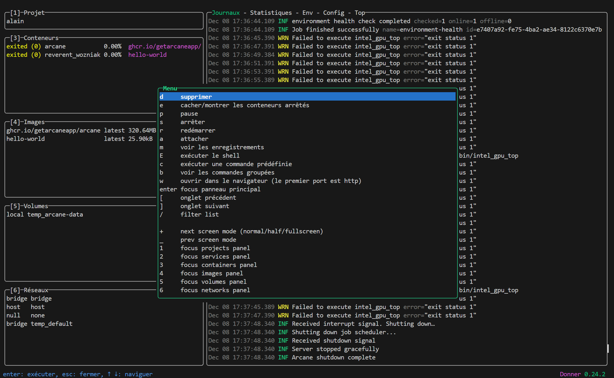
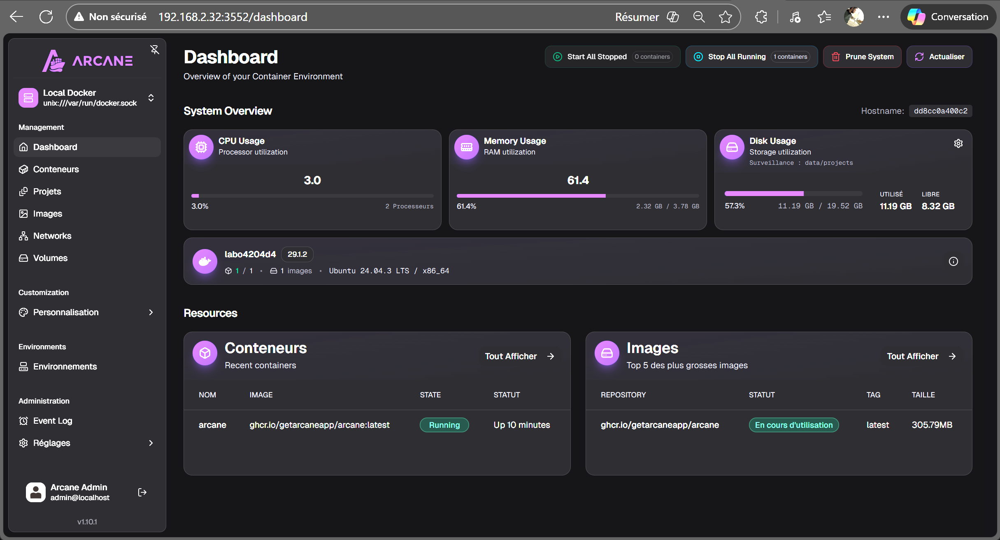
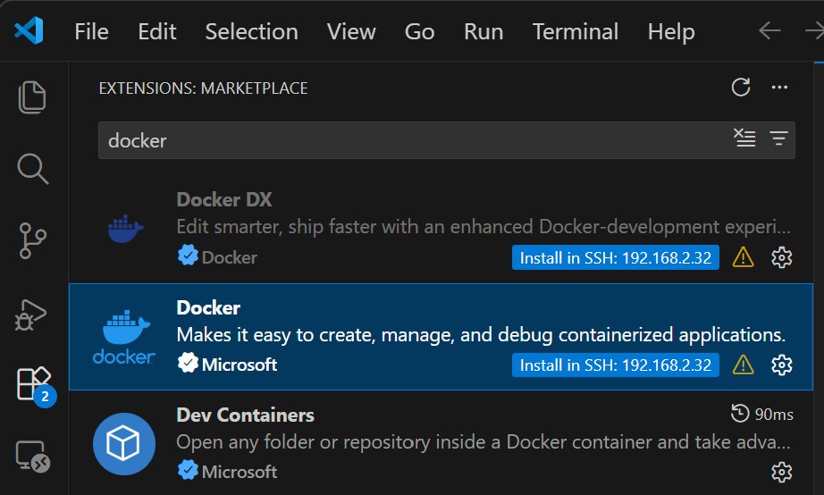
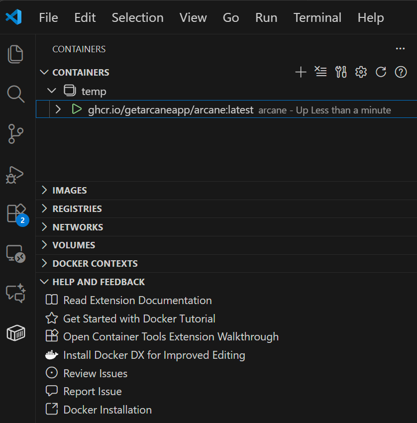

# Semaine 01 - Au menu

### 1 - Présentation du cours

- Survole de Docker et Kubernetes

---

### 2 - Installation d'Ubuntu Desktop (version minimale) sur VMware PRO
- VM nommée Ubuntu-Master
- Network connection: Bridged

🤚 **NOTE**: Vérifier que la bonne carte réseau est renseignée dans les paramètres de VMware
- Menu: edit -> Virtual Network Editor --> Change settings --> VMNet0 ...

### 3 - Installation de openssh-server et de firefox
💡- Terminal = Ctl+Alt+T

```bash
$ sudo apt update && sudo apt upgrade -y
$ sudo install openssh-server firefox -y
```
### 4 - Du poste de travail, générer une paire de clés ssh
```bash
$ ssh-keygen -C UserName
```
#### 4.1 - Copier la clé publique vers la VM
```bash
$ ssh-copy-id -i nom-du-fichier.pub userName@adresse-ip
```
#### 4.2 Renseigner une référence dans le fichier ~/.ssh/config
#### Avec l'adresse IP de la machine clonée (labo)
```bash
Au besoin: 
chmod 600 ~/.ssh/config
Host labo
# Host srv*
    HostName 'adresse-IP'
    User UserName
    Port 22
    IdentityFile ~/.ssh/uneCle
```

### 5 - Fermer et cloner la machine
- Create a linked clone: nommé 'labo'

### 6 - Démarrer et login sur 'labo'
```bash
ssh compte@1.2.3.4
```

👉 Obtenir l'adresse IP et compléter l'étape 4.2 

### 7 - Éditer les fichiers /etc/hostname et /etc/hosts et corriger la référence au nom machine.
```bash
$ sudo nano /etc/hostname
$ sudo nano /etc/hosts
```

### 8 - Redémarrer la VM
```bash
$ sudo reboot
```

### 9 - ssh sur la VM 'labo'
```bash
ssh compte@1.2.3.4
```

### 10 - Installer Docker

Voir le document : [Installation de Docker](/Installation/Docker/Installation%20de%20Docker.md)

### 11 - Tester Docker
```bash
$ docker version
$ docker help
```
---
### 💡Facultatif : Installer liquidPrompt:
https://liquidprompt.readthedocs.io/en/stable/overview.html

```bash
$ git clone --branch stable https://github.com/liquidprompt/liquidprompt.git ~/liquidprompt
$ source ~/liquidprompt/liquidprompt
$ source ~/liquidprompt/themes/unfold/unfold.theme
$ lp_theme unfold # lp_theme default
$ source ~/liquidprompt/themes/powerline/powerline.theme
$ lp_theme --list
```
--> Ajouter dans le fichier .bashrc :
```bash
$ nano .bashrc
[[ $- = *i* ]] && source ~/liquidprompt/liquidprompt

source ~/liquidprompt/themes/unfold/unfold.theme
source ~/liquidprompt/themes/powerline/powerline.theme
lp_theme unfold # lp_theme default
lp_theme --list
echo -e "\nPour changer de thème: lp_theme nom-du-theme\n\n"
```
---

### Ajouter des alias dans le fichier ~/.bash_aliases

👉 Voir les [copier/coller](/420-4d4/Documentation/CopierColler.md)

---
### 12 - Installer LazyDocker
https://github.com/jesseduffield/lazydocker

```bash
# Obtenir le numéro de la dernière version
LAZYDOCKER_VERSION=$(curl -s "https://api.github.com/repos/jesseduffield/lazydocker/releases/latest" | grep -Po '"tag_name": "v\K[0-9.]+')
echo $LAZYDOCKER_VERSION

# Obtenir la dernière version
curl -Lo lazydocker.tar.gz "https://github.com/jesseduffield/lazydocker/releases/latest/download/lazydocker_${LAZYDOCKER_VERSION}_Linux_x86_64.tar.gz"

# Désarchiver et installer
mkdir lazydocker-temp
tar xf lazydocker.tar.gz -C lazydocker-temp
sudo mv lazydocker-temp/lazydocker /usr/local/bin
rm -rf lazydocker.tar.gz lazydocker-temp

lazydocker --version
alias lzd='lazydocker'
```

### Tester LazyDocker



---
### 13 - Installer Arcane

https://getarcane.app/

- Créer le fichier compose.yaml avec le contenu suivant:

```bash
# Fichier compose.yaml
services:
  arcane:
    image: ghcr.io/getarcaneapp/arcane:latest
    container_name: arcane
    ports:
      - '3552:3552'
    volumes:
      - /var/run/docker.sock:/var/run/docker.sock
      - arcane-data:/app/data
      - /host/path/to/projects:/app/data/projects
    environment:
      - APP_URL=http://localhost:3552
      - PUID=1000
      - PGID=1000
      - ENCRYPTION_KEY=xxxxxxxxxxxxxxxxxxxxxxxxxx
      - JWT_SECRET=xxxxxxxxxxxxxxxxxxxxxxxxxx
    restart: unless-stopped

volumes:
  arcane-data:
```

- Générer la clé et le secret:
```bash
$ openssl rand -base64 32
# Exemple de sortie: qxBW5EkvjIeYgRS4e7Lii3WJ6SqJEF7L5PLjlJ6NzX4=
$ openssl rand -hex 64
2bbee9ee013f1e2ed0f6b0f03876159637e1e702d345a776ea92d0f3ee1a35a52d1b73c58b01481aca4f3873c78e532570a8eaaed34800eba0bb76440fc3ccc0
```
- Modifier le fichier compose.yaml avec le résultat:
 - - ENCRYPTION_KEY=qxBW5EkvjIeYgRS4e7Lii3WJ6SqJEF7L5PLjlJ6NzX4
 - - JWT_SECRET=2bbee9ee013f1e2ed0f6b0f03876159637e1e702d345a776ea92d0f3ee1a35a52d1b73c58b01481aca4f3873c78e532570a8eaaed34800eba0bb76440fc3ccc0

```
# Démarrer Arcane:
$ docker compose up -d
```

- Ouvrir dans Firefox sur la station Ubuntu à http://localhost:3552/
- - Ou à partir de votre poste de travail en utilisant l'adresse IP de la station Ubuntu (ip a)

 - 🔑 Username: arcane
 - 🔑 Password: arcane-admin

- Changer le mot de passe au premier login (l9l9)



 ---

 ### 14 - Installer l'extension Docker pour VSCode en mode ssh:

- Installation - **🤚 Attention**, il faut s'assurer que l'option '**install in ssh**' est proposée

 

- Utilisation

 

 ---

 ## Crédits

*Document rédigé par Alain Boudreault © 2021-2026*  
*Version 2025.12.08.1*  
*Site par ve2cuy*