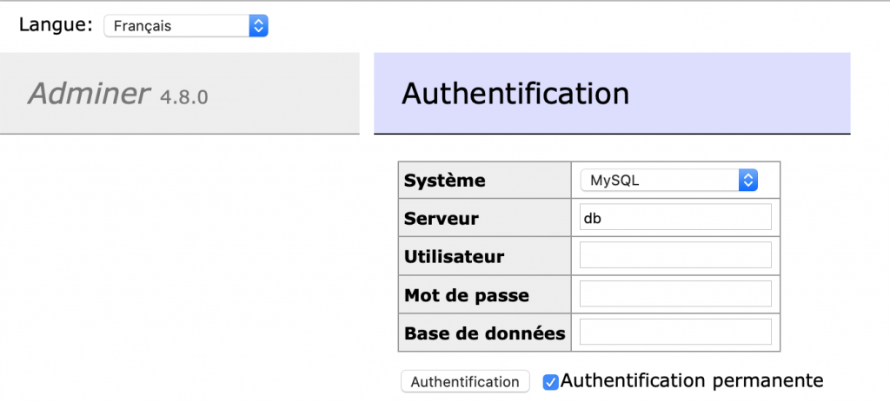
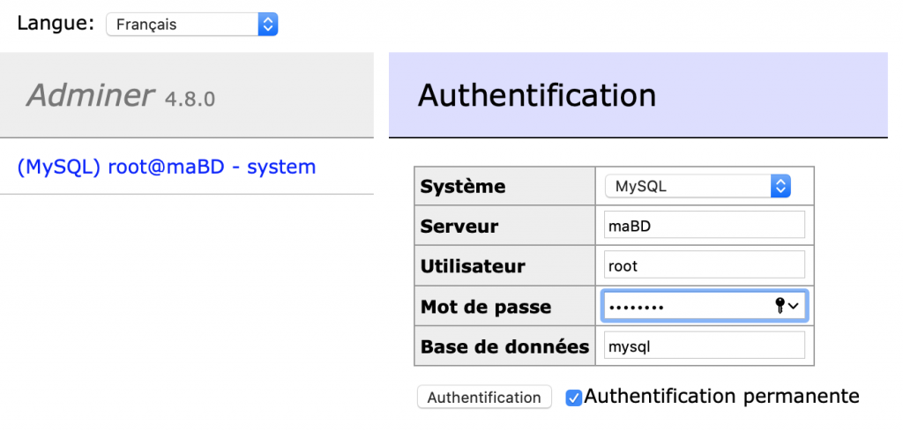
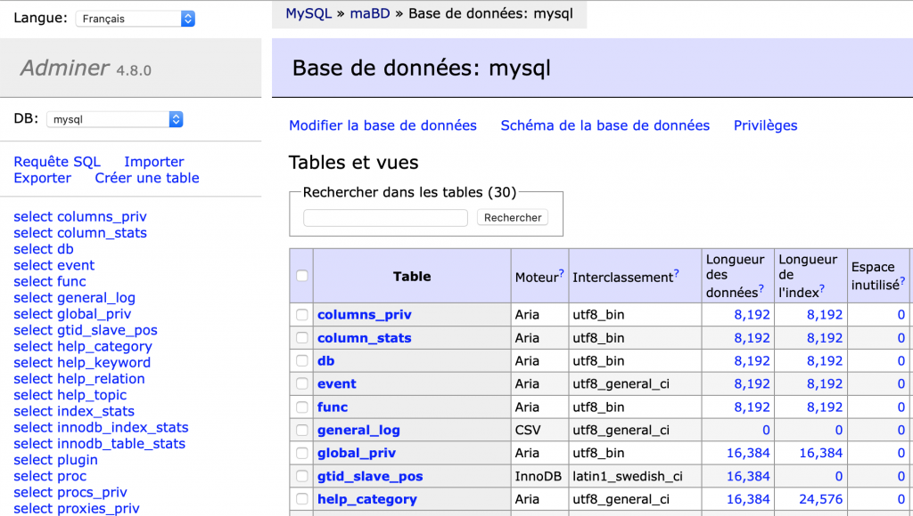
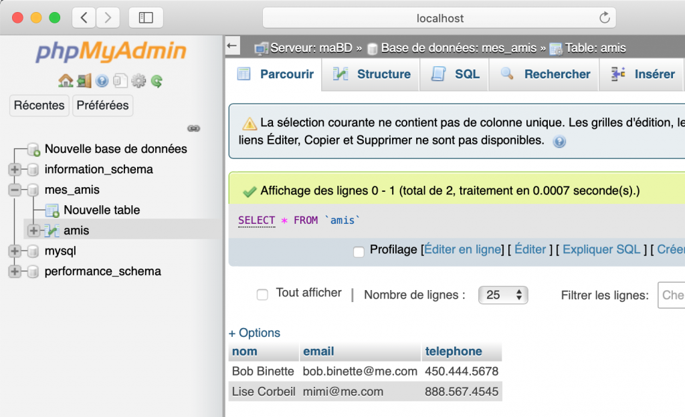

# 🐳 Applications – Multi-services

*Source : [https://4204d4.ve2cuy.com/docker-application-multi-service/](https://4204d4.ve2cuy.com/docker-application-multi-service/)*
*Date : 11 février 2021 - Actualisé 2025.12.04*

## Et pourquoi pas un défi de taille
<p align="center">
    
</p>

### Docker - Application Multi-services

* Les variables d'environnement: `docker run -e`
* Application multi-conteneurs: **mariaDB** + **adminer**
* Laboratoire: **mysql** + **phpmyadmin**

**Pré-requis**

* [Introduction à Dockerfile](Dockerfile%20Introduction.md)
* [Introduction aux réseaux Docker](Introduction%20aux%20réseaux.md)

----

## 1 – Les variables d'environnement

### Mise en situation

Lors de l'assemblage d'une application multi-conteneurs (appelé aussi **MICRO-SERVICES**), il sera peut-être nécessaire de fournir, à un conteneur, des paramètres fonctionnels d'un autre conteneur : 🙃.

**🤖 Quel est cet autre conteneur? 🤖**

Prenons une application constituée d'un conteneur, pour une base de données de type '**MySQL**' et, un autre conteneur pour l'application Web de gestion du SGBD MySQL, '**phpmyadmin**'.

Lors de l'instanciation de l'image de type '**phpmyadmin**', il sera nécessaire de renseigner des informations tel que le port IP de la BD, du nom du compte, du mot de passe à la BD, …

Ce transfert d'information sera effectué, généralement, par l'utilisation de **variables d'environnement**.

Par exemple, pour fixer le mot de passe de l'utilisateur '**root**', lors du démarrage d'un conteneur de type **mariaDB**, il faudra utiliser la syntaxe suivante:

```bash
docker run --net reseau01 -it -d --name maBD -e MYSQL_ROOT_PASSWORD=password mariadb
````

> **NOTE** : —\> Tester l'accès à la BD en utilisant la commande 'mysql' dans le conteneur 'maBD'.

L'option **`-e`** permet de renseigner la variable d'environnement `MYSQL_ROOT_PASSWORD`.

> **NOTE** : Le nom des variables n'est pas fixé de façon arbitraire. Il faut se référer à la documentation de l'image désirée. Par exemple, pour `mariadb` voir ici.

### Action 1.0 – Expérimentation avec l'option `-e`

```bash
docker run -it --rm -e PS1='yo: ' -e LOGIN_NAME='Fred Lacrosse' alpine /bin/sh
```

Résultat dans le conteneur:

```
yo: env
HOSTNAME=94cc229f2e3e
PS1=yo: 
LOGIN-NAME=Fred Lacrosse
```

### Action 1.1 – Renseigner le 'hostname' au démarrage d'un conteneur

```bash
docker run -it --rm --hostname=maAlpine -e LOGIN_NAME='Coco Lafortune' alpine
```

Résultat dans le conteneur:

```
----- 
/ # env
HOSTNAME=maAlpine
LOGIN-NAME=Coco Lafortune
```

> **NOTE** : À défaut de l'option `--hostname`, sa valeur sera le ID du conteneur.

### Étape 2 – Construire une image qui utilise une variable d'environnement:

#### Action 2.1 – Dockerfile

Dans un dossier vide, renseigner le fichier `Dockerfile` suivant:

```dockerfile
# À partir d'une image
FROM alpine

# Optionnel
LABEL Alain Boudreault <aboudrea@cstj.qc.ca>

ENV EXEMPLE=2.1
# Exécuter des commandes dans l'image
# RUN apt-get update

COPY momo-dit.sh /
RUN chmod a+x /momo-dit.sh

# Commande à exécuter au démarrage d'un conteneur
CMD ["/momo-dit.sh"]
```

#### Action 2.2 – Le script `momo-dit.sh`

Renseigner le fichier `momo-dit.sh` suivant:

```bash
#!/bin/sh
# Afficher à l'écran le contenu de la variable $MESSAGE
# Cette variable doit-être passée au conteneur avec '-e MESSAGE="Une message à afficher"'

echo "-----------------------------------------------------"
echo "Momo dit: " $MESSAGE
echo "-----------------------------------------------------"
echo "EXEMPLE: " $EXEMPLE
echo
```

#### Action 2.3 – Générer l'image

```bash
docker build --tag docker-hub-login/momo-dit:1.1 .
```

#### Action 2.4 – Tester sans utiliser l'option `-e`

```bash
docker run --rm docker-hub-login/momo-dit:1.1
```

Résultat:

```
-----------------------------------------------------
Momo dit: 
-----------------------------------------------------
EXEMPLE: 2.1
```

#### Action 2.5 – Tester avec l'option `-e`

```bash
docker run -e MESSAGE='Il fît de la sorte un assez long chemin' --rm docker-hub-login/momo-dit:1.1
```

Résultat:

```
-----------------------------------------------------
Momo dit: Il fît de la sorte un assez long chemin
-----------------------------------------------------
EXEMPLE: 2.1
```

### Laboratoire 2.6 (Durée 30 minutes) – Construire une image:

  * À partir d'une `alpine`, qui reçoit comme variables d'environnement; **USERNAME** et **PASSWORD**
  * Au démarrage, roule un script `validation.sh` qui vérifie si;
      * `USERNAME == etudiant`
      * `PASSEWORD == 420`
  * Au besoin, affiche un des messages suivants:
      * « ERR.01 – USERNAME invalide »
      * « ERR.02 – PASSWORD invalide »
      * « SUCCES – Bienvenue chez Docker420.info »
  * Publier l'image sur docker hub sous `votre-dockerhub-login/alpine-login:latest`
  * Copier le lien dans la discussion Teams.

> **Petit rappel bash:**
>
> ```bash
> #!/bin/bash
> # Vérifier le contenu du premier paramètre
> if [ $1 != "Bob" ] ; then 
>   echo "Erreur: Nom de login invalide"
>   exit 1
> fi
> echo "Bienvenue $1 chez nous!"
> ```
>
> [Référence bash](URL non fournie dans la source)

-----

## Étape 3 – Application multi-services : MariaDB + Adminer

Mise en place d'une application, à partir d'un conteneur **MariaDB** et d'un conteneur **adminer**, qui roulent (les deux conteneurs) dans un **réseau privé**.

### Action 3.1 – Création du réseau privé

```bash
docker network create reseau-3.1
docker network ls

NETWORK ID     NAME         DRIVER    SCOPE
6eca92520b8e   bridge       bridge    local
5b64d4b7c1d2   host         host      local
786951a15a98   none         null      local
173ec396a986   reseau-3.1   bridge    local
```

### Action 3.2 – Mise en place de l'application de la base de données

```bash
docker run --net reseau-3.1 \
--name maBD \
-e MYSQL_ROOT_PASSWORD=password \
-d mariadb
```

### Action 3.3 – Mise en place de l'application 'adminer'

```bash
docker run --net reseau-3.1 -p 8080:8080 -d adminer
```

> **NOTE** : La documentation de 'adminer' utilise une syntaxe dépréciée ( `–link maBD` ) pour le lien vers la BD. Il est préférable d'utiliser un réseau privé.

### Action 3.4 – Tester l'application multi-services.

#### Action 3.4.1 – Tester l'URL

Dans un fureteur, inscrire l'adresse `localhost:8080`, ce qui devrait afficher l'interface Adminer.

<p align="center">
    
</p>

#### Action 3.4.2 – Renseigner les informations de connexion

<p align="center">
    
</p>

> **NOTE** : Il n'est pas nécessaire de connaître l'adresse IP du conteneur `mariadb`, étant donné qu'il utilise le même réseau privé que `adminer` alors nous pouvons utiliser le **nom du conteneur** pour la connexion.

**Résultat:**

<p align="center">
    
</p>

### Laboratoire 3.5 (durée 30 minutes) – Construire l'application multi-services suivante:

  * Un réseau privé nommé `net-labo3.5`
  * Un conteneur roulant **mysql**
  * Un conteneur roulant **phpmyadmin**
  * En utilisant un fureteur, connectez-vous à `phpmyadmin`, créer une bd '**mes\_amis**'
  * ajouter la table '**amis**' avec les champs:
      * `nom` (var char 30)
      * `email` (var char 30)
      * `telephone` (var char 14)
  * Ajouter deux amis à la table
  * Lister la table amis
  * Ajouter une capture de la page web dans la discussion Teams.

<p align="center">
    
</p>

> **NOTE** : Il faut consulter la documentation de `phpmyadmin` pour identifier les variables d'environnement nécessaires au fonctionnement du conteneur. Il n'est pas nécessaire d'utiliser toutes les variables mentionnées dans la documentation. Seulement celles concernant l'utilisateur PMA, son mot de passe et le nom du conteneur du serveur mySQL.

---

## Crédits

*Document rédigé par Alain Boudreault © 2021-2026*  
*Version 2025.12.03.1*  
*Site par ve2cuy*