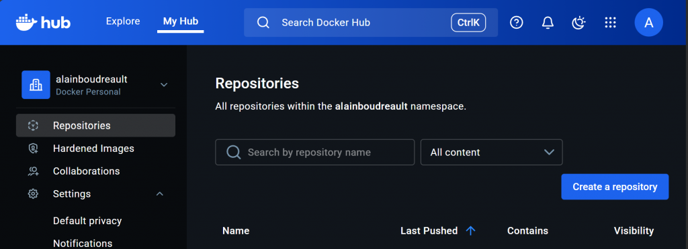
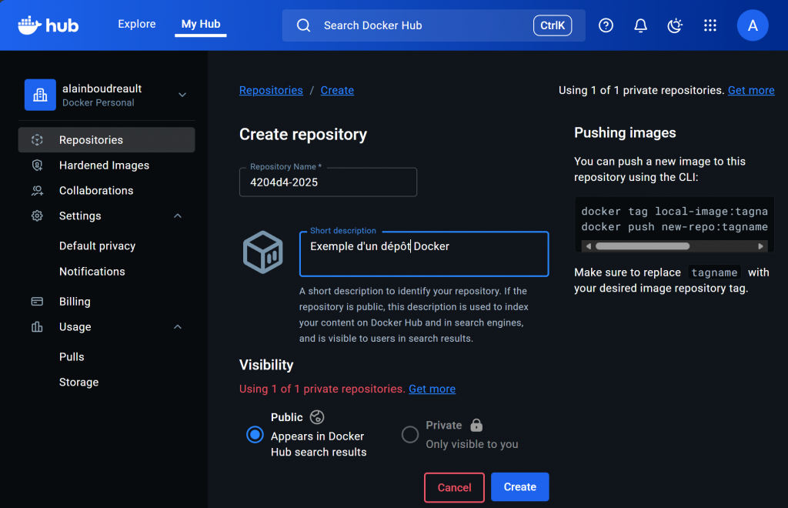
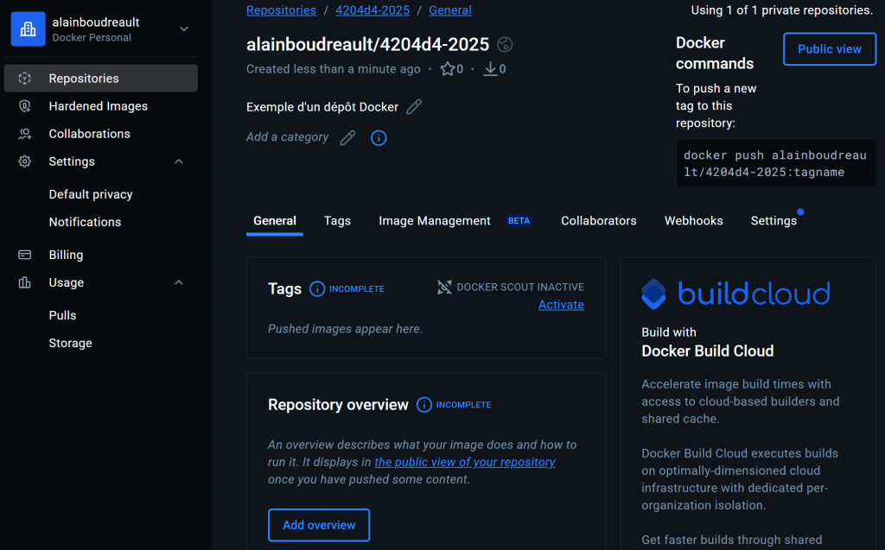
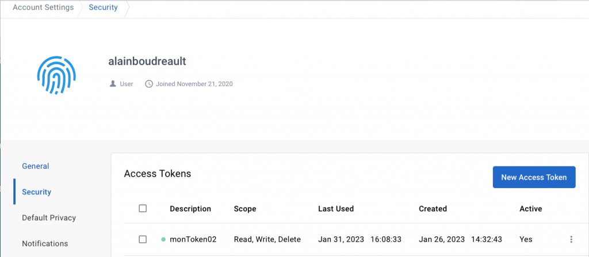
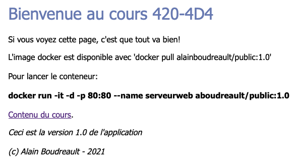
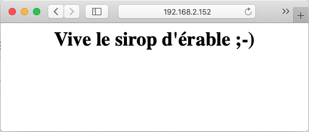
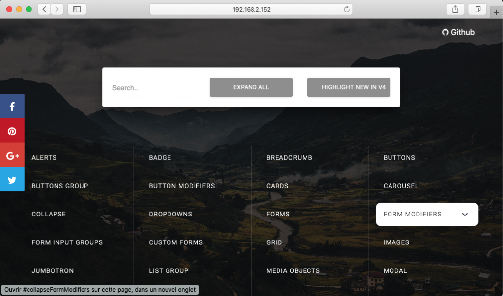

# ☁️ Docker Hub – Introduction

*Date : 27 janvier 2021*

## Publier une IMAGE à partir d'un conteneur PERSONNALISÉ et Stockage PERSISTANT

<p align="center">
    
</p>

Dans ce module, nous verrons comment :

  * Personnaliser un conteneur (`nginx`)
  * Produire une image à partir d'un conteneur personnalisé
  * Créer un dépôt **Docker Hub**
  * Publier une image personnalisée dans un dépôt **Docker Hub**.
  * Mettre en place un stockage persistant

**PRÉ-REQUIS :** Un compte d'accès à [hub.docker.com](https://hub.docker.com/).

-----

## Mise en situation

Lors du dernier module, nous avons apprivoisé quelques commandes de base sur des conteneurs d'images préexistantes. Pourquoi ne pas créer notre propre image à partir du conteneur d'une de ces images?

Mais avant, un petit retour en arrière sur les commandes de base :

```bash
# Afficher l'aide de docker
docker

# Afficher l'aide d'un sous-système docker
docker container --help
docker container ls

# Recherche d'une image sur hub.docker.com
docker search arch

# Obtenir une image de hub.docker.com
docker pull archlinux

# Démarrer un conteneur en arrière-plan
docker run -d archlinux
# Le conteneur archlinux n'a pas de tâche en boucle, il va donc s'arrêter.

# Démarrer un conteneur en mode interactif
docker run -it archlinux

# Installer nano dans le conteneur archlinux
pacman -Sy nano
nano hello.txt
exit
# La commande 'exit' provoque l'arrêt du conteneur
# Il est possible de sortir sans provoquer l'arrêt avec CTRL P + Q

docker ps
docker ps -a

# Démarrer un conteneur arrêté - sans créer une nouvelle instance
docker start ID-archlinux
# Note: restart = stop/start

docker attach ID-archlinux
exit
# NOTE: le conteneur s'est arrêté.

# Exécuter, en mode interactif, une commande d'un conteneur
docker start ID-archlinux
docker exec -it ID-archlinux /usr/bin/bash
exit
docker ps
# Note: le conteneur roule toujours car 'exec' s'exécute dans une file différente.

# Renommer un conteneur
docker rename [name-archlinux|ID] nouveauNom

# Effacer un conteneur
docker rm ID-conteneur

# Effacer une image
docker rmi ID-Image

# Exécuter un conteneur avec une fusion de ports IP
docker run -d --name web1 -p 80:80 nginx
docker run -d --name web2 -p 81:80 nginx

# Tester le serveur web1
curl localhost:80

# Afficher les logs d'un conteneur
docker logs web1

# Afficher les statistiques des conteneurs - CRTL C pour quitter.
docker stats

# Lister le ID de tous les conteneurs d'une image
docker ps -a --filter="ancestor=nginx"

# Lister le ID de tous les conteneurs dont le nom est comme:
docker ps -a -q --filter="name=web"

# Arrêter tous les conteneurs d'une image
docker stop $(docker ps -a -q --filter="name=web")

# Effacer tous les conteneurs d'une image
docker rm $(docker ps -a -q --filter="ancestor=nginx")
```

-----

## Étape 1 – Créer un nouveau dépôt sur hub.docker.com

Ici, nous nous apprêtons à créer un dépôt de conteneurs pour un projet à venir. Nous pourrons, par la suite, y archiver toutes les versions du projet.

1.0 – En utilisant votre compte personnel, connectez-vous à **hub.docker.com**.

1.1 – Sélectionner l'item menu **'Repositories'**, suivi de l'option **'Create …'**.

<p align="center">
    
</p>

1.2 – Renseigner les informations de départ du nouveau dépôt `420-4d4`.

<p align="center">
    
</p>


> **Note :** Que des caractères minuscules dans le nom.
> 1.3 – Consulter le sommaire du nouveau dépôt.

<p align="center">
    
</p>


-----

## Étape 2 – Personnaliser un conteneur à partir de l'image de `nginx`

Évidemment, ne voulant pas avoir à programmer, à partir de rien, un serveur web 😉, nous allons bâtir notre fondation sur l'image de `nginx`.

### 2.1 – Créer un conteneur `web01` à partir de l'image `nginx:latest`

```bash
docker run -d --name web01 -p 80:80 nginx
```

### 2.2 – Se connecter au 'shell' du conteneur `web01`

```bash
docker exec -it web01 /bin/bash
```

### 2.3 – Installer l'éditeur de texte `nano` dans le conteneur

```bash
apt update
apt install nano
```

### 2.4 – Remplacer le contenu du fichier `/usr/share/nginx/html/index.html`

```bash
rm /usr/share/nginx/html/index.html
nano /usr/share/nginx/html/index.html
```

### 2.5 – Par le code HTML suivant

```html
<!DOCTYPE html>
<html>
<head>
<title>Bienvenue au cours 420-4D4</title>
<style>
body {
  width: 35em;
  margin: 0 auto;
  font-family: Tahoma, Verdana, Arial, sans-serif;
}
h1 { <span style="color: #6f82bf;">color: #6f82bf;</span>
  font-weight: normal;
}
</style>
</head>
<body>
<h1>Bienvenue au cours 420-4D4</h1>
<p>Si vous voyez cette page, c'est que tout va bien!</p>
<p>L'image docker est disponible avec 'docker pull VOTRECOMPTE/420-4d4:1.0'
<br/><br/>
Pour lancer le conteneur:<br/><br/>
<strong> docker run -it -d -p 80:80 --name serveurweb VOTRECOMPTE/420-4d4:1.0</strong><br>
<br/><a href="http://ve2cuy.com/420-4d4b/">Contenu du cours</a>.</p>
<p><em>Ceci est la version 1.0 de l'application<br/><br/>(c) Votre prénom nom - 2023</em></p>
</body>
</html>
```

### 2.6 – Quitter le 'shell' du conteneur et tester le serveur web

```bash
exit
```

> **Note :** L'exécution du conteneur ne sera pas arrêtée par cette opération, car nous nous sommes connectés avec la commande **`exec`**.

-----

## Étape 3 – Créer une image à partir du conteneur

À ce point, nous avons adapté un conteneur à nos besoins. Il est temps d'en faire une image qui pourra être, par la suite, distribuée à l'infini.

### 3.1 – Créer une image (nom : `votreNomDomaineDocker/nomDépôt:version(tag)`)

```bash
docker ps
docker commit web01 VOTRECOMPTE/420-4d4:1.0
```

### 3.2 – Vérifier la présence de la nouvelle image

```bash
docker images
```

### 3.3 – Connexion au compte `hub.docker.com`

Pour être en mesure de pouvoir publier notre nouvelle image sur hub.docker, il faut obligatoirement s'authentifier, à partir de votre fenêtre terminal ou, alternativement, via l'application 'docker desktop'.

```bash
docker login --username=VOTRECOMPTE
password: FOURNIRLEMOTDEPASSE (ou TOKEN)
```

> Au besoin, il faut créer un « Access Token ».

<p align="center">
    
</p>

### 3.4 – Publier (`push`) l'image vers le dépôt `420-4d4` sur `hub.docker.com`

Maintenant que nous sommes authentifiés au dépôt docker il ne nous reste plus qu'à publier la nouvelle image :

```bash
docker push VOTRECOMPTE/420-4d4:1.0
```

### 3.5 – Vérifier la présence de l'image sur votre dépôt `hub.docker`.

-----

## Étape 4 – Tester l'image qui se trouve sur `hub.docker.com`

### 4.1 – Obtenir et exécuter l'application en utilisant le port `88`

```bash
docker run -d -p 88:80 --name web-test VOTRECOMPTE/420-4d4:1.0
```

### 4.2 – Tester dans un fureteur

Tester l'accès à la page web via le port exposé (par exemple : `http://localhost:88`).

<p align="center">
    
</p>


### 4.3 – Conclusion

Nous avons maintenant accès, à partir d'un dépôt **hub.docker**, à l'image personnalisée d'un serveur `nginx`, qui propose une page d'accueil sur mesure ainsi que l'éditeur de texte `nano`.

-----

## Étape 5 – Stockage persistant

**\<span style="color: \#ff0000;"\>TRISTESSE\</span\>** – À chaque fois que nous recréons un conteneur à partir d'une image, nous retrouvons le système de fichiers dans son état de départ. Cela pose un problème non négligeable lors des mises à jour de l'image.

Pour contrer cet état de fait, docker propose les **stockages persistants**. Grâce à une série d'exemples, voyons comment cela fonctionne.

### 5.1 – Créer un répertoire local pour les fichiers du site web

```bash
mkdir /home/alain/docker-folder/siteweb
```

### 5.2 – Créer le fichier `info.html` dans le répertoire de l'étape 5.1

```html
<center><h1>Vive le sirop d'&eacute;rable ;-)</h1></center>
```

### 5.3 – Démarrer un conteneur à partir de la syntaxe suivante:

L'option `-v` (volume) est utilisée pour lier le répertoire local au répertoire des fichiers web de `nginx` dans le conteneur (`/usr/share/nginx/html`).

```bash
# Sous Linux :
docker run --name mon-nginx -v /home/alain/docker-folder/siteweb:/usr/share/nginx/html:rw -d -p 8080:80 nginx

# Sous Windows :
docker run --name mon-nginx -v C:\Users\4204D4\semaine02:/usr/share/nginx/html:rw -d -p 8080:80 nginx
```

### 5.4 – Tester la page `info.html` dans un fureteur

```bash
http://localhost:8080/info.html
```

> Wow, quelle merveilleuse page web ☺️ :

<p align="center">
    
</p>


### 5.5 – Ajoutons un peu plus de substance à notre site web:

Dans un dossier de téléchargement, par exemple, : `/home/$USER/download`,

```bash
git clone https://github.com/creativetimofficial/bootstrap4-cheatsheet.git
```

### 5.6 – Déplacer l'app vers le dossier lié au conteneur:

```bash
mv bootstrap4/ /dossier/web/conteneur/bs
```

### 5.7 – Tester l'app

Tester l'accès à l'application via le volume monté : `http://localhost:8080/bs/`

> Wow, vraiment làlà, une merveilleuse page web 👍 :

<p align="center">
    
</p>

> **Note :** Nous n'avons pas à publier une nouvelle version de l'image de l'application. Les nouveaux contenus sont stockés localement.

-----


## Laboratoire

  * En utilisant votre compte **hub.docker.com**, créer un dépôt `labo-01`.
  * Bâtir un conteneur personnalisé à partir de l'image `apache` officielle.
  * Installer au besoin, dans le conteneur, les outils requis pour réaliser la tâche; `apt update`, `apt install`, …
  * Remplacer la page d'accueil par l'application web du **bootstrap-cheat-sheet**. L'application doit être installée **dans le conteneur** et non pas dans un dossier lié.
  * Tester le conteneur sur le port `8080` – le bootstrap-cheat-sheet doit s'afficher **sans fournir de nom de dossier dans l'URL**.
  * Corriger au besoin
  * Créer une image, à partir du conteneur personnalisé, sous le nom **`VotrenomDomaineDocker/labo-01:latest`**.
  * Publier l'image dans votre dépôt docker.
  * Effacer l'image locale – `rmi`.
  * Exécuter l'image à partir de votre dépôt docker.
  * Afficher la page d'accueil du serveur web.

---

## Crédits

*Document rédigé par Alain Boudreault © 2021-2026*  
*Version 2025.12.03.1*  
*Site par ve2cuy*