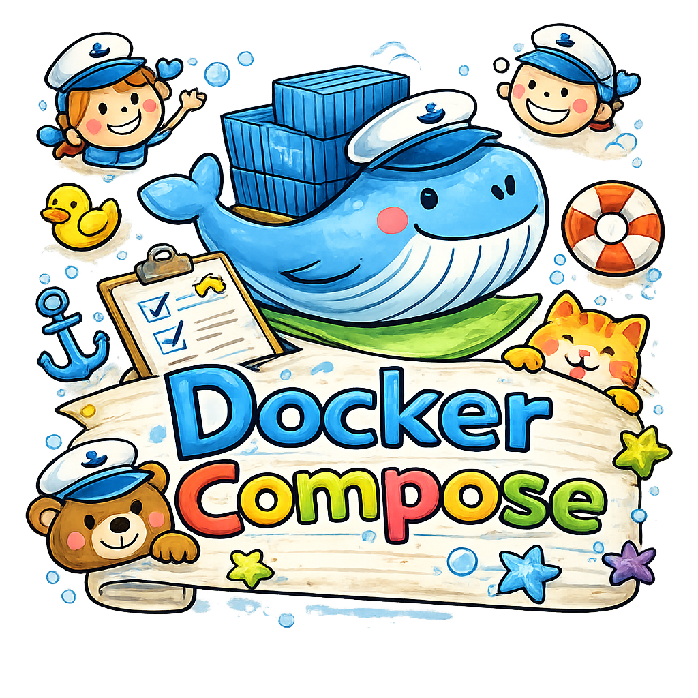

# 🐳 Docker-compose – Introduction - Partie 3

<p align="center">
    
</p>

---

## 👉 Voici quelques exemples de `docker-compose.yml` avec des services d'initialisation, du plus simple au plus élaboré.


## 1. Init container basique avec `depends_on`

```yaml
services:
  init:
    image: busybox
    command: sh -c "echo 'Initialisation terminée' && touch /data/ready"

    # Partage du volume pour que le service "app" puisse accéder au fichier créé par "init"
    # Ceci est un volume docker, pas un volume de type "bind" qui serait lié à un répertoire de l
    volumes:
      - shared-data:/data 
  
  app:
    image: nginx
    depends_on:
      init:
        condition: service_completed_successfully
    volumes:
      - shared-data:/data
        name: un-volume

volumes:
  shared-data:
```

Le service `app` ne démarre qu'une fois `init` terminé avec succès.

---

## 2. Base de données avec init SQL

```yaml
services:
  db:
    image: postgres:16
    environment:
      POSTGRES_USER: admin
      POSTGRES_PASSWORD: secret
      POSTGRES_DB: myapp
    volumes:
      - ./init.sql:/docker-entrypoint-initdb.d/init.sql
    healthcheck:
      test: ["CMD-SHELL", "pg_isready -U admin"]
      interval: 5s
      timeout: 5s
      retries: 5

  app:
    image: my-app
    depends_on:
      db:
        condition: service_healthy
    environment:
      DATABASE_URL: postgres://admin:secret@db:5432/myapp
```

Postgres exécute automatiquement les fichiers `.sql` placés dans `/docker-entrypoint-initdb.d/`.

---

## 3. Migration de base de données avant le démarrage de l'app

```yaml
services:
  db:
    image: postgres:16
    environment:
      POSTGRES_USER: admin
      POSTGRES_PASSWORD: secret
      POSTGRES_DB: myapp
    healthcheck:
      test: ["CMD-SHELL", "pg_isready -U admin"]
      interval: 5s
      retries: 5

  migrate:
    image: my-app
    command: ["python", "manage.py", "migrate"]   # ou: alembic upgrade head
    depends_on:
      db:
        condition: service_healthy
    environment:
      DATABASE_URL: postgres://admin:secret@db:5432/myapp

  app:
    image: my-app
    command: ["python", "manage.py", "runserver", "0.0.0.0:8000"]
    depends_on:
      migrate:
        condition: service_completed_successfully
    environment:
      DATABASE_URL: postgres://admin:secret@db:5432/myapp
    ports:
      - "8000:8000"
```

La chaîne de démarrage est : `db` → `migrate` → `app`.

---

## 4. Plusieurs services d'init en parallèle

```yaml
services:
  init-db:
    image: postgres:16
    entrypoint: ["sh", "-c", "until pg_isready -h db; do sleep 1; done"]
    depends_on:
      - db

  init-cache:
    image: redis:7
    entrypoint: ["sh", "-c", "until redis-cli -h cache ping; do sleep 1; done"]
    depends_on:
      - cache

  db:
    image: postgres:16
    environment:
      POSTGRES_PASSWORD: secret

  cache:
    image: redis:7

  app:
    image: my-app
    depends_on:
      init-db:
        condition: service_completed_successfully
      init-cache:
        condition: service_completed_successfully
```

Les deux inits s'exécutent en parallèle, et `app` attend qu'ils soient **tous les deux** terminés.

---

## Résumé des conditions `depends_on`

| Condition | Signification |
|---|---|
| `service_started` | Le conteneur a démarré (défaut) |
| `service_healthy` | Le healthcheck passe |
| `service_completed_successfully` | Le conteneur s'est terminé avec exit code 0 |

L'approche la plus robuste est en général de combiner un **healthcheck** sur les dépendances et un **service de migration** dédié.

---

# Exemples avec httpd

Voici des exemples avec **Apache HTTPD** et des services d'initialisation.

---

## 1. Init qui génère du contenu HTML avant le démarrage d'HTTPD

```yaml
services:
  init-content:
    image: busybox
    command:  |  # Utilisation de "| = \n" ou ">- = ramène le tout sur une seule ligne" pour écrire une commande multi-ligne plus lisible
      sh -c "
      echo '<h1>Hello depuis Docker 420!</h1>' > /var/www/html/index.html &&
      echo 'Build: '$(date) >> /var/www/html/index.html
      "
    volumes:
      - web-content:/var/www/html

  httpd:
    image: httpd:2.4
    ports:
      - "8080:80"
    volumes:
      - web-content:/usr/local/apache2/htdocs
    depends_on:
      init-content:
        condition: service_completed_successfully

volumes:
  web-content:
```

---

## 2. Init qui copie et personnalise la config Apache

```yaml
services:
  init-config:
    image: busybox
    environment:
      SERVER_NAME: monsite.local
      MAX_CLIENTS: 150
    command:
      - sh
      - -c
      - |
        cat > /config/httpd.conf << 'EOF'
        ServerName {{SERVER_NAME}}
        MaxRequestWorkers {{MAX_CLIENTS}}
        Listen 80

        DocumentRoot "/usr/local/apache2/htdocs"
        <Directory "/usr/local/apache2/htdocs">
            Options Indexes FollowSymLinks
            AllowOverride None
            Require all granted
        </Directory>
        EOF
        sed -i "s/{{SERVER_NAME}}/$SERVER_NAME/g" /config/httpd.conf &&
        sed -i "s/{{MAX_CLIENTS}}/$MAX_CLIENTS/g" /config/httpd.conf
    volumes:
      - apache-config:/config

  httpd:
    image: httpd:2.4
    ports:
      - "8080:80"
    volumes:
      - apache-config:/usr/local/apache2/conf
    depends_on:
      init-config:
        condition: service_completed_successfully

volumes:
  apache-config:
```

---

## 3. Stack complète : Init + HTTPD + PHP-FPM + MySQL

```yaml
services:
  db:
    image: mysql:8
    environment:
      MYSQL_ROOT_PASSWORD: root
      MYSQL_DATABASE: myapp
      MYSQL_USER: user
      MYSQL_PASSWORD: secret
    volumes:
      - db-data:/var/lib/mysql
    healthcheck:
      test: ["CMD", "mysqladmin", "ping", "-h", "localhost"]
      interval: 5s
      retries: 10

  init-db:
    image: mysql:8
    command: sh -c "mysql -h db -u user -psecret myapp < /docker-entrypoint-initdb.d/seed.sql"
    volumes:
      - ./seed.sql:/docker-entrypoint-initdb.d/seed.sql
    depends_on:
      db:
        condition: service_healthy

  php:
    image: php:8.2-fpm
    volumes:
      - web-content:/var/www/html
    depends_on:
      init-db:
        condition: service_completed_successfully

  httpd:
    image: httpd:2.4
    ports:
      - "8080:80"
    volumes:
      - web-content:/var/www/html
      - ./httpd.conf:/usr/local/apache2/conf/httpd.conf
    depends_on:
      php:
        condition: service_started

volumes:
  db-data:
  web-content:
```

La chaîne est : `db` → `init-db` → `php` → `httpd`.

---

## 4. Init qui télécharge un site statique (ex: documentation)

```yaml
services:
  init-site:
    image: alpine
    command: | 
      sh -c "
      apk add git &&
      git clone https://github.com/ve2cuy/superminou-depart &&
      cp -r superminou-depart/* /temp &&
      sleep 10
      "

    volumes:
      - web-content:/temp

  httpd:
    image: httpd:2.4
    ports:
      - "8080:80"
    volumes:
      - web-content:/usr/local/apache2/htdocs
    depends_on:
      init-site:
        condition: service_completed_successfully

volumes:
  web-content:
```

---

## 5. Init avec certificats SSL auto-signés pour HTTPS

```yaml
services:
  init-ssl:
    image: alpine/openssl
    command: sh -c "
      openssl req -x509 -nodes -days 365 -newkey rsa:2048
        -keyout /certs/server.key
        -out /certs/server.crt
        -subj '/CN=localhost/O=Dev/C=FR'"
    volumes:
      - ssl-certs:/certs

  httpd:
    image: httpd:2.4
    ports:
      - "80:80"
      - "443:443"
    volumes:
      - ssl-certs:/usr/local/apache2/conf/ssl
      - ./httpd-ssl.conf:/usr/local/apache2/conf/extra/httpd-ssl.conf
    depends_on:
      init-ssl:
        condition: service_completed_successfully

volumes:
  ssl-certs:
```

Avec le fichier `httpd-ssl.conf` minimal :

```apache
Listen 443
SSLEngine on
SSLCertificateFile /usr/local/apache2/conf/ssl/server.crt
SSLCertificateKeyFile /usr/local/apache2/conf/ssl/server.key
```

---

## Récapitulatif des patterns utilisés

| Pattern | Cas d'usage |
|---|---|
| `busybox` + volume partagé | Générer du contenu statique |
| `sed` sur un template de config | Personnaliser `httpd.conf` dynamiquement |
| `alpine/curl` | Télécharger des assets au démarrage |
| `alpine/openssl` | Générer des certificats SSL |
| `mysql` init + healthcheck | Seeder une BDD avant de lancer l'app |