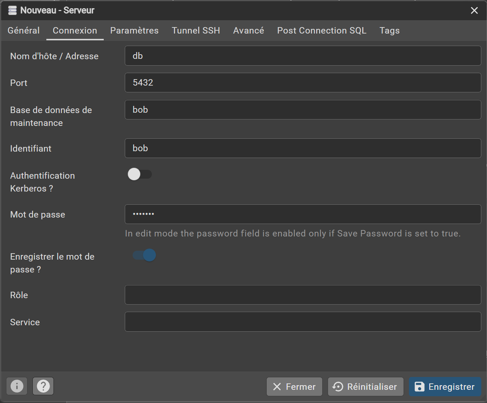

# 🐳 Docker-compose – Introduction - Partie 3

<p align="center">
    
</p>

---

## Exemples de `docker-compose.yml` avec des services d'initialisation.
**NOTE**: Les exemples marqués de 💡 sont à tester en laboratoire.

---

## Table des matières


- [1. Init container basique avec `depends_on`](#-1-init-container-basique-avec-depends_on)
- [2. Plusieurs services d'init en parallèle](#2-plusieurs-services-dinit-en-parallèle)
  - [Résumé des conditions `depends_on`](#résumé-des-conditions-depends_on)
- [3. Init qui génère du contenu HTML avant le démarrage d'`httpd`](#-3-init-qui-génère-du-contenu-html-avant-le-démarrage-dhttpd)
- [4. Init qui copie un contenu web, pour httpd, à partir de github](#-4-init-qui-copie-un-contenu-web-pour-httpd-à-patir-de-github)
- [5. Init qui copie et personnalise la config Apache](#5-init-qui-copie-et-personnalise-la-config-apache)
- [6. Stack complète : Init + HTTPD + PHP-FPM + MySQL](#6-stack-complète--init--httpd--php-fpm--mysql)
- [7. Init avec certificats SSL auto-signés pour HTTPS](#7-init-avec-certificats-ssl-auto-signés-pour-https)
- [8. Exemple Postgres avec healthcheck](#-8-exemple-postgres-avec-healthcheck)
- [9. `healthcheck`](#9-healthcheck--explication-détaillée)
  - [`test`](#test)
  - [`interval`](#interval)
  - [`timeout`](#timeout)
  - [`retries`](#retries)
  - [Cycle de vie d'un conteneur avec healthcheck](#cycle-de-vie-dun-conteneur-avec-healthcheck)
  - [Paramètre optionnel : `start_period`](#paramètre-optionnel--start_period)


---

## 💡 1. Init container basique avec `depends_on`

```yaml
services:
  init:
    image: busybox
    command: sh -c "echo 'Initialisation terminée' && touch /data/ready"

    # Partage du volume pour que le service "app" puisse accéder au fichier créé par "init"
    # Ceci est un volume docker, pas un volume de type "bind" qui serait lié à un répertoire de la station host.
    volumes:
      - shared-data:/data 
  
  app:
    image: nginx
    ports:
      - "80:80"
    depends_on:
      init:
        condition: service_completed_successfully
    volumes:
      - shared-data:/data
        name: un-volume

# Ceci est un volume interne à Docker
volumes:
  shared-data:
```

Le service `app` ne démarre qu'une fois `init` terminé avec succès.

---

## 2. Plusieurs services d'init en parallèle

```yaml
services:
  init-db:
    image: postgres:16
    entrypoint: ["sh", "-c", "until pg_isready -h db; do sleep 1; done"]
    depends_on:
      - db

  init-cache:
    image: redis:7
    entrypoint: ["sh", "-c", "until redis-cli -h cache ping; do sleep 1; done"]
    depends_on:
      - cache

  db:
    image: postgres:16
    environment:
      POSTGRES_PASSWORD: secret

  cache:
    image: redis:7

  app:
    image: nginx
    ports:
      - "80:80"    
    depends_on:
      init-db:
        condition: service_completed_successfully
      init-cache:
        condition: service_completed_successfully
```

Les deux inits s'exécutent en parallèle, et `app` attend qu'ils soient **tous les deux** terminés.

---

## Résumé des conditions `depends_on`

| Condition | Signification |
|---|---|
| `service_started` | Le conteneur a démarré (défaut) |
| `service_healthy` | Le healthcheck passe |
| `service_completed_successfully` | Le conteneur s'est terminé avec exit code 0 |

L'approche la plus robuste est en général de combiner un **healthcheck** sur les dépendances et un **service de migration** dédié.

---

## 💡 3. Init qui génère du contenu HTML avant le démarrage d'`httpd`

```yaml
services:
  init-content:
    image: busybox
    command:  |  # Utilisation de "|" ou ">- = ramène le tout sur une seule ligne" pour écrire une commande multi-ligne plus lisible
      sh -c "
      echo '<h1>Hello depuis Docker 420!</h1>' > /dossier-commun/index.html &&
      echo 'Build: '$(date) >> /dossier-commun/index.html &&
      echo 'ServerName exemple.420' >> /config/httpd.conf
      "
    volumes:
      - web-content:/dossier-commun
      - web-config:/config

  httpd:
    image: httpd:2.4
    ports:
      - "80:80"
    volumes:
      - web-content:/usr/local/apache2/htdocs
      - web-config:/usr/local/apache2/conf
    depends_on:
      init-content:
        condition: service_completed_successfully

volumes:
  web-content:
    name: contenu-web   # Optionnel
  web-config:
    name: config-httpd  # Optionnel

```

---

## 💡 4. Init qui copie un contenu web, pour httpd, à partir de github

```yaml
services:
  init-site:
    image: alpine
    command: | 
      sh -c "
      apk add git &&
      git clone https://github.com/ve2cuy/superminou-depart &&
      cp -r superminou-depart/* /temp &&
      sleep 10
      "

    volumes:
      - web-content:/temp

  httpd:
    image: httpd:2.4
    ports:
      - "8080:80"
    volumes:
      - web-content:/usr/local/apache2/htdocs
    depends_on:
      init-site:
        condition: service_completed_successfully

volumes:
  web-content:
```

---

## 5. Init qui copie et personnalise la config Apache

```yaml
services:
  init-config:
    image: busybox
    environment:
      SERVER_NAME: monsite.local
      MAX_CLIENTS: 150
    command:
      - sh
      - -c
      - |
        cat > /config/httpd.conf << 'EOF'
        ServerName {{SERVER_NAME}}
        MaxRequestWorkers {{MAX_CLIENTS}}
        Listen 80

        DocumentRoot "/usr/local/apache2/htdocs"
        <Directory "/usr/local/apache2/htdocs">
            Options Indexes FollowSymLinks
            AllowOverride None
            Require all granted
        </Directory>
        EOF
        sed -i "s/{{SERVER_NAME}}/$SERVER_NAME/g" /config/httpd.conf &&
        sed -i "s/{{MAX_CLIENTS}}/$MAX_CLIENTS/g" /config/httpd.conf
    volumes:
      - apache-config:/config

  httpd:
    image: httpd:2.4
    ports:
      - "8080:80"
    volumes:
      - apache-config:/usr/local/apache2/conf
    depends_on:
      init-config:
        condition: service_completed_successfully

volumes:
  apache-config:
```

---

## 6. Stack complète : Init + HTTPD + PHP-FPM + MySQL

```yaml
services:
  db:
    image: mysql:8
    environment:
      MYSQL_ROOT_PASSWORD: root
      MYSQL_DATABASE: myapp
      MYSQL_USER: user
      MYSQL_PASSWORD: secret
    volumes:
      - db-data:/var/lib/mysql
    healthcheck:
      test: ["CMD", "mysqladmin", "ping", "-h", "localhost"]
      interval: 5s
      retries: 10

  init-db:
    image: mysql:8
    command: sh -c "mysql -h db -u user -psecret myapp < /docker-entrypoint-initdb.d/seed.sql"
    volumes:
      - ./seed.sql:/docker-entrypoint-initdb.d/seed.sql
    depends_on:
      db:
        condition: service_healthy

  php:
    image: php:8.2-fpm
    volumes:
      - web-content:/var/www/html
    depends_on:
      init-db:
        condition: service_completed_successfully

  httpd:
    image: httpd:2.4
    ports:
      - "8080:80"
    volumes:
      - web-content:/var/www/html
      - ./httpd.conf:/usr/local/apache2/conf/httpd.conf
    depends_on:
      php:
        condition: service_started

volumes:
  db-data:
  web-content:
```

La chaîne est : `db` → `init-db` → `php` → `httpd`.

---

## 7. Init avec certificats SSL auto-signés pour HTTPS

```yaml
services:
  init-ssl:
    image: alpine
    command:
      - sh
      - -c
      - |
        apk add --no-cache openssl &&
        openssl req -x509 -nodes -days 365 -newkey rsa:2048 \
          -keyout /certs/server.key \
          -out /certs/server.crt \
          -subj '/CN=localhost/O=Dev/C=FR'
    volumes:
      - ssl-certs:/certs

  init-config:
    image: httpd:2.4
    command:
      - sh
      - -c
      - |
        cp /usr/local/apache2/conf/httpd.conf /config/httpd.conf &&
        sed -i 's/#LoadModule ssl_module/LoadModule ssl_module/' /config/httpd.conf &&
        sed -i 's/#LoadModule socache_shmcb_module/LoadModule socache_shmcb_module/' /config/httpd.conf &&
        sed -i 's/#Include conf\/extra\/httpd-ssl.conf/Include conf\/extra\/httpd-ssl.conf/' /config/httpd.conf &&
        echo 'ServerName localhost' >> /config/httpd.conf
    volumes:
      - httpd-config:/config

  httpd:
    image: httpd:2.4
    ports:
      - "80:80"
      - "443:443"
    volumes:
      - ssl-certs:/usr/local/apache2/conf/ssl
      - httpd-config:/usr/local/apache2/conf
      - ./httpd-ssl.conf:/usr/local/apache2/conf/extra/httpd-ssl.conf
    depends_on:
      init-ssl:
        condition: service_completed_successfully
      init-config:
        condition: service_completed_successfully

volumes:
  ssl-certs:
  httpd-config:
```

Avec le fichier `httpd-ssl.conf` minimal :

```apache
Listen 443
SSLEngine on
SSLCertificateFile /usr/local/apache2/conf/ssl/server.crt
SSLCertificateKeyFile /usr/local/apache2/conf/ssl/server.key
```


---

## 💡 8. Exemple Postgres avec healthcheck

```yaml
# Note: db-1 -  FATAL:  role "postgres" does not exist
# Solution, effacer le volume précédent et recréer le conteneur
# docker-compose down -v

services:
  db:
    image: postgres:16
    environment:
      POSTGRES_USER: ${POSTGRES_USER}
      POSTGRES_PASSWORD: ${POSTGRES_PASSWORD}
      POSTGRES_DB: ${POSTGRES_DB}
    volumes:
      - db-data:/var/lib/postgresql/data
    healthcheck:
      test: ["CMD-SHELL", "pg_isready -U ${POSTGRES_USER}"]
      interval: 5s
      timeout: 5s
      retries: 5

  pgadmin:
    image: dpage/pgadmin4
    environment:
      PGADMIN_DEFAULT_EMAIL: ${PGADMIN_EMAIL}       # admin@admin.com
      PGADMIN_DEFAULT_PASSWORD: ${PGADMIN_PASSWORD} # password
    ports:
      - "8080:80"
    depends_on:
      db:
        condition: service_healthy

#  adminer:
#    image: adminer
#    restart: always
#    ports:
#      - 88:8080
#    depends_on:
#      db:
#        condition: service_healthy


# Création d'un volume interne à Docker pour stocker les données de la base de données
volumes:
  db-data:
```

```
# Fichier .env
POSTGRES_USER=bob
POSTGRES_PASSWORD=binette
POSTGRES_DB=bob

PGADMIN_EMAIL=admin@admin.com
PGADMIN_PASSWORD=password
```

* Login et ajout (register) de la bd sous pgadmin:

a) - Login


b) - Ajouter un nouveau serveur 


c) - Renseigner les paramètres de connexion



---

## 9. `healthcheck` — Explication détaillée

Le healthcheck permet à Docker de **surveiller l'état de santé** d'un conteneur, au-delà du simple fait qu'il tourne. Un conteneur peut être démarré mais pas encore prêt à accepter des connexions.

---

### `test`

```yaml
test: ["CMD-SHELL", "pg_isready -U ${POSTGRES_USER}"]
```

Définit la commande à exécuter pour tester la santé du conteneur. Il existe deux formes :

| Forme | Description |
|---|---|
| `CMD` | Exécute la commande directement, sans shell |
| `CMD-SHELL` | Exécute la commande via `/bin/sh -c`, permet les variables et opérateurs shell |

[pg_isready](https://www.postgresql.org/docs/current/app-pg-isready.html) est un utilitaire fourni avec PostgreSQL qui vérifie si le serveur accepte des connexions. Il retourne :
- **exit code 0** → le serveur est prêt ✅
- **exit code 1** → le serveur refuse les connexions ❌
- **exit code 2** → aucune réponse ❌

Docker considère le conteneur **healthy** uniquement si le code de retour est `0`.

---

### `interval`

```yaml
interval: 5s
```

Fréquence à laquelle Docker exécute le test. Ici toutes les **5 secondes**.

---

### `timeout`

```yaml
timeout: 5s
```

Durée maximale accordée à la commande de test pour s'exécuter. Si elle dépasse **5 secondes**, Docker considère le test comme échoué.

---

### `retries`

```yaml
retries: 5
```

Nombre d'échecs consécutifs avant de marquer le conteneur comme **unhealthy**. Ici Docker tolère **5 échecs** avant de déclarer le conteneur défaillant.

---

### Cycle de vie d'un conteneur avec healthcheck

```
démarrage → starting
              ↓
         test échoue (jusqu'à 5 fois)
              ↓
         test réussit → healthy   ← depends_on condition: service_healthy attend cet état
              ↓
         test échoue 5 fois de suite → unhealthy
```

---

### Paramètre optionnel : `start_period`

```yaml
healthcheck:
  test: ["CMD-SHELL", "pg_isready -U ${POSTGRES_USER}"]
  interval: 5s
  timeout: 5s
  retries: 5
  start_period: 10s   # ← délai de grâce au démarrage
```

Pendant le `start_period`, les échecs ne sont pas comptabilisés dans les `retries`. Utile pour les services qui mettent du temps à initialiser (ex: PostgreSQL qui restaure une grosse base).

---

## Crédits

*Document rédigé par Alain Boudreault © 2021-2026*  
*Version 2026.02.26.1*  
*Site par ve2cuy*