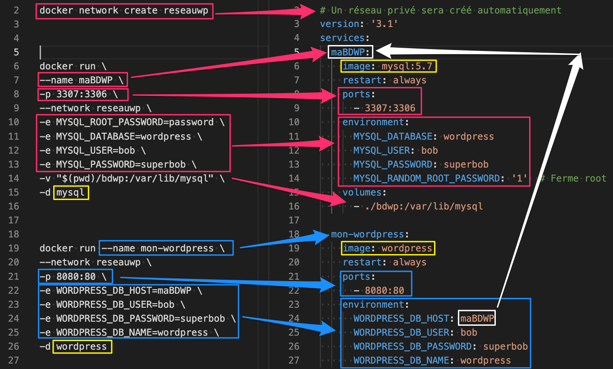

Je peux convertir la page demandée en Markdown, en incluant des notes d'insertion pour les images et en utilisant le formatage YAML et les exemples de code.

-----

# 🐳 Docker-compose – Introduction

*Date : 12 février 2021*

## 🚀 Démarrage des services

### Mise en situation

Lors des laboratoires précédents, nous avons démarré des conteneurs en utilisant la **ligne de commande** (`docker run`). Nous avons procédé ainsi car les paramètres de configuration étaient simples ou que le nombre de conteneurs pour une application donnée était réduit.

Dans le cas d'une application **multi-services** nécessitant un nombre élevé de micro-services, des réseaux personnalisés ou des volumes persistants, l'approche de démarrage manuel de chacun des services peut devenir une tâche **ardue et complexe**.

Pour adresser ce type de problème, Docker propose le module **`docker-compose`**.

En utilisant le langage de représentation des données **YAML**, il est possible de représenter tous les services et paramètres d'un système donné et de démarrer le tout en une **seule ligne de commande**.

Voici un tableau présentant les analogies entre l'utilisation du CLI de Docker et de `docker-compose` :





| `docker-compose.yml` | Équivalent `docker run` | Description |
| :--- | :--- | :--- |
| `services:` | `docker run` | Chaque entrée est un conteneur (service). |
| `image:` | `IMAGE` | Nom de l'image (ex: `alpine:latest`). |
| `container_name:` | `--name` | Nom du conteneur. |
| `ports:` | `-p` | Liaison de ports (ex: `"8080:80"`). |
| `volumes:` | `-v` | Liaison de volumes. |
| `networks:` | `--network` | Spécification des réseaux. |
| `environment:` | `-e` | Variables d'environnement. |
| `stdin_open: true` | `-i` | Garde le `stdin` ouvert. |
| `tty: true` | `-t` | Alloue un pseudo-TTY. |
| `depends_on:` | (Aucun) | Définit l'ordre de démarrage des services. |
| `build:` | `docker build` | Spécifie un `Dockerfile` à construire. |

*\[Image : `img-docker-compose-analogie.png` - Schéma illustrant la structure globale d'un fichier docker-compose.yml et sa relation avec plusieurs commandes docker run.]*

Par les exemples suivants, nous verrons comment ça fonctionne.

-----

## 1 – Système simple de trois conteneurs Alpine

### Action 1.0 – Créer un système à partir de trois Alpine

Créons le fichier **`docker-compose.yml`** :

```yaml
# Fichier: docker-compose.yml
# Auteur: Alain Boudreault
# Date: 2021.02.13
# Description: Mise en place d'un système de 3 alpine
version: "3.9"

services:
  srv01:
    image: alpine
    container_name: serveur01 # Optionnel
  srv02:
    image: alpine
    container_name: serveur02 # Optionnel
  srv03:
    image: alpine
    container_name: serveur03 # Optionnel
```

> **Note :** Voici le tableau de compatibilité des versions : [https://docs.docker.com/compose/compose-file/compose-file-v3/](https://docs.docker.com/compose/compose-file/compose-file-v3/)

### Action 1.1 – Démarrer les services

```bash
docker-compose up
```

**Résultat :**

```
Creating network "lab01-docker-compose_default" with the default driver
Pulling srv01 (alpine:)...
...
Status: Downloaded newer image for alpine:latest
Creating serveur02 ... done
Creating serveur01 ... done
Creating serveur03 ... done
Attaching to serveur02, serveur01, serveur03
serveur02 exited with code 0
serveur01 exited with code 0
serveur03 exited with code 0
```

**Observation :**

  * Un **réseau privé** créé pour le service.
  * Trois Alpine créées.
  * Trois Alpine arrêtées (car `alpine` n'a pas de service d'arrière-plan par défaut et la commande par défaut est complétée immédiatement).

**Équivalent `docker run` :**

```bash
docker create network lab01-docker-compose_default
docker run --name serveur01 --network lab01-docker-compose_default alpine
docker run --name serveur02 --network lab01-docker-compose_default alpine
docker run --name serveur03 --network lab01-docker-compose_default alpine
```

### Action 1.2 – Vérification des conteneurs

```bash
docker container ls (-a)
```

### Action 1.3 – Réinitialiser Docker

```bash
docker container stop $(docker container ls -aq)
docker system prune -af --volumes
```

### Action 1.4 – Relancer les services en arrière-plan (`-d`)

```bash
docker-compose up -d
```

> **NOTE** : Les conteneurs seront arrêtés quand même s'ils n'ont pas de commande persistante (comme un shell interactif ou un processus serveur).

### Action 1.5 – `attach` et `ping` entre les services

Pour un conteneur qui tourne (par exemple, si vous y avez ajouté une commande persistante comme `sleep 3600`) :

```bash
docker attach serveur01
ping serveur02
CTRL+PQ
```

-----

## 2 – Ajout d'options et configuration

### Action 2.0 – Ajout d'options supplémentaires – partie 01

| Directive `compose` | Équivalent `docker run` |
| :--- | :--- |
| `stdin_open` | `-i` |
| `tty` | `-t` |
| `networks` | `--net` |
| `environment` | `-e` |

### Action 2.1 – Réinitialiser Docker

### Action 2.2 – Modifier le fichier `docker-compose.yml`

Nous ajoutons des options interactives (`stdin_open`, `tty`), un réseau personnalisé (`reseauAlpine`) et des variables d'environnement.

```yaml
version: "3.9"
services:
  srv01:
    image: alpine
    container_name: serveur01
    stdin_open: true # docker run -i
    tty: true # docker run -t
    networks:
      - reseauAlpine
    environment:
      - JESUIS=Le spécialiste de la paresse
    # command: sh  # Décommenter pour laisser le conteneur actif

  srv02:
    image: alpine
    container_name: serveur02
    stdin_open: true # docker run -i
    tty: true # docker run -t
    networks:
      - reseauAlpine
    environment:
      - JESUIS=Celui qui fait du sur place
    # command: top # Décommenter pour laisser le conteneur actif

networks:
  reseauAlpine:
    name: jeSuisLeReseauAlpine
    driver: bridge
```

> **Note :** Pour les variables d'environnement, il est possible d'utiliser les trois syntaxes suivantes :
>
> 1.  \<span style="color:red"\>**Paires Clé:Valeur :**\</span\>
>
>     ```yaml
>     environment:
>       MYSQL_ROOT_PASSWORD: donttell
>       MYSQL_USER: Bob
>     ```
>
> 2.  \<span style="color:blue"\>**Tableau de chaînes sans guillemets :**\</span\>
>
>     ```yaml
>     environment:
>       - MYSQL_ROOT_PASSWORD=donttell
>     ```
>
> 3.  \<span style="color:green"\>**Tableau de chaînes avec guillemets :**\</span\>
>
>     ```yaml
>     environment:
>       - "MYSQL_ROOT_PASSWORD=donttell"
>     ```

### Action 2.3 – Relancer les services en arrière-plan (`-d`)

### Action 2.4 – Explorer le résultat

(Vérifier le réseau créé, l'état des conteneurs, et les variables d'environnement.)

### Action 2.5 – Ajout d'options supplémentaires – partie 02

| Directive `compose` | Équivalent `docker run` |
| :--- | :--- |
| `volumes` | `-v` |
| `ports` | `-p` |

#### Action 2.5.1 – Alpine avec un volume, fichier **`docker-comp01.yml`**

```yaml
# Fichier: docker-comp01.yml
version: "3.9"
services:
  srv99:
    image: alpine
    container_name: serveur99
    stdin_open: true # docker run -i
    tty: true # docker run -t
    volumes:
      - ./:/420
    # command: sh # Ajouter cette ligne pour garder le conteneur actif
```

### Action 2.5.2 – Démarrer le système

```bash
docker-compose -f docker-comp01.yml up -d
```

### Action 2.5.3 – Connexion au service Alpine

```bash
docker exec -it serveur99 /bin/sh
/ # ls
/ # ls /420
/ # touch /420/note.txt
```

*(Le fichier `note.txt` est créé dans le répertoire hôte courant grâce à la liaison de volume.)*

### Action 2.6 – Configuration d'un service Nginx

Exemple de configuration utilisant les volumes (pour le fichier de configuration et le contenu Web) et les ports.

```yaml
version: "3.9"
services:
  serveurweb:
    image: nginx
    container_name: serveurWEB
    volumes:
      - ./templates/site.template:/etc/nginx/templates
      - ./contenuweb:/usr/share/nginx/html:rw
    ports:
      - "8080:80"
    environment:
      - NGINX_HOST=monServeurWeb.com
      - NGINX_PORT=80 # N'est pas utilisée dans cet exemple
```

*\[Image : `img-nginx-volumes-ports.png` - Schéma illustrant la structure des dossiers locaux (templates, contenuweb) liés aux volumes du conteneur Nginx et la liaison du port 8080:80.]*

-----

## 3 – Mise en place d'une application multi-services (MariaDB + Adminer)

### Action 3.1 – Renseigner le fichier `docker-compose.yml`

Cet exemple utilise `depends_on` pour s'assurer que la base de données (`maBD`) démarre avant l'interface de gestion (`gestionBDviaAppWeb`).

```yaml
version: "3.9"
services:
  maBD:
    image: mariadb
    environment:
      - "MYSQL_ROOT_PASSWORD=root"
  gestionBDviaAppWeb:
    image: adminer
    ports:
      - "8080:8080"
    depends_on:
      - maBD
```

*\[Image : `img-adminer-mariadb-depends.png` - Diagramme montrant deux conteneurs (MariaDB et Adminer) connectés via le réseau par défaut créé par docker-compose, avec une dépendance de démarrage Adminer -\> MariaDB.]*

### Consolidation des exercices précédents (Exemple complet)

```yaml
version: "3.9"
services:
  srv01:
    image: alpine
    hostname: serveur01
    container_name: serveur01
    stdin_open: true
    tty: true
    networks:
      - reseauAlpine
    environment:
      - JESUIS=Le spécialiste de la paresse
    # command: sh

  srv02:
    image: alpine
    container_name: serveur02
    stdin_open: true
    tty: true
    networks:
      - reseauAlpine
    environment:
      - JESUIS=Celui qui fait du sur place
    command: top

  srv99:
    image: alpine
    container_name: serveur99
    stdin_open: true
    tty: true
    volumes:
      - ./:/420

  serveurweb:
    image: nginx
    container_name: serveurWEB
    volumes:
      - ./templates/site.template:/etc/nginx/templates
      - ./contenuweb:/usr/share/nginx/html:rw
    ports:
      - "8080:80"
    environment:
      - NGINX_HOST=monServeurWeb.com
      - NGINX_PORT=80

  maBD:
    image: mariadb
    networks:
      - reseauAdminer
    environment:
      - "MYSQL_ROOT_PASSWORD=root"

  gestionBDviaAppWeb:
    image: adminer
    networks:
      - reseauAdminer
    ports:
      - "8081:8080"
    depends_on:
      - maBD

networks:
  reseauAlpine:
    name: jeSuisLeReseauAlpine
    driver: bridge
  reseauAdminer:
    name: jeSuisLeReseauAdminer
    driver: bridge
```

-----

## 4 – Laboratoire 1 (MySQL + phpMyAdmin)

Démarrer, à partir d'un fichier `docker-compose`, le système de micro-services suivants :

1.  **`mysql`**, avec le stockage local, dossier **`mesBD`**, des bases de données.
2.  **`phpmyadmin`**, sur le port **`88`**.
3.  Créer, à partir de `phpmyadmin`, la base de données **`wordpress`**.
4.  Vérifier que la BD a été créée sur votre disque local.

> **Note :** Si le fichier n'est pas nommé `docker-compose.yml`, alors il faut le nommer dans les commandes, par exemple :
>
>   * `docker-compose -f docker-labo02.yml up -d`
>   * `docker-compose -f docker-labo02.yml ps`
>   * `docker-compose -f docker-labo02.yml exec cie_db bash`

-----

## 5 – Laboratoire 2 (WordPress, MariaDB et phpMyAdmin)

Mettre en place un site WordPress, en utilisant `docker-compose`, pour la **CIE\_ABC**, en respectant le devis suivant :

  * Un service **`mariadb` version 10.5**, nommé **`cie_db`** pour la base de données :
      * Port externe: `3333`
      * base de données: `cie_abc`
      * utilisateur: `cieuser`
      * Mot de passe: `ciepassword`
      * Mot de passe root: `donttell`
      * La base de données est stockée localement dans le dossier `cie_data2`
  * Un service **`WordPress version 5.6.2`** :
      * Renseigner les paramètres assurant le bon fonctionnement du site WordPress de la CIE ABC
      * port IP local: `80`
  * Un service **`phpMyadmin`** :
      * port IP Local: `8080`

Tester l'application WordPress de la CIE ABC et le service phpMyadmin.

-----

## 6 – Quelques commandes utiles

| Commande | Description |
| :--- | :--- |
| `docker-compose config` | Valider le fichier `docker-compose.yml`. |
| `docker-compose up` | Démarre les services et affiche les logs. |
| `docker-compose up -d` | Démarre les services en arrière-plan (mode détaché). |
| `docker-compose logs` | Affiche les logs de tous les services. |
| `docker-compose ps` | Affiche l'état des services. |
| `docker-compose stop` | Arrête les conteneurs (sans les supprimer). |
| `docker-compose down` | Arrête et supprime les conteneurs, réseaux et volumes par défaut. |

-----

## 7 – Exemple de `docker-compose` avec un `build`

`Docker-compose` permet la mise en place d'images personnalisées pendant le processus de démarrage d'une application multi-services.

### Action 7.1 – Enregistrer le fichier `Dockerfile`

Dans un dossier vide, enregistrer le fichier **`Dockerfile`** :

```dockerfile
# ###########################################################################
# Fichier: Dockerfile
# Auteur: Alain Boudreault
# Date: 2021.03.05
# Description: Exemple d'un Dockerfile avec,
#
# 1 - Des variables d'environnement,
# 2 - Un invite de commande personnalisé pour tous les 'users',
# 3 - Le démarrage automatique d'une application du conteneur.
# ###########################################################################
FROM debian
LABEL authors="Alain Boudreault <aboudrea@cstj.qc.ca>"
LABEL Atelier="7.1 de http://ve2cuy.com/420-4d4b/index.php/docker-compose-introduction-2/"
ENV UN_MOT_DE_PASSE=tepasserieux
ENV UNE_BASE_DE_DONNEES=db_de_la_ciex
# Definir des variables avec des séquences ANSI pour afficher de la couleur sous BASH
ENV RESET="\[\033[0m]" \
    ROUGE="\[\033[0;31m]" \
    VERT="\[\033[01;32m]" \
    BLEU="\[\033[01;34m]" \
    JAUNE="\[\033[0;33m]"
# Sympathique petit (prompt) invite en couleur pour tous les utilisateurs
RUN echo 'export PS1="${VERT}\D{%H:%M:%S} - ${JAUNE}\u@docker${ROUGE}\nDossier: [\W]\n${RESET}\$ "' \
    >> /etc/bash.bashrc
RUN apt-get update
RUN apt-get install git lynx -y
# Lancer le fureteur au démarrage. Tester avec http://lite.cnn.com/en
# CMD ["lynx", "http://lite.cnn.com/en"]
```

### Action 7.1b – Bâtir l'image (Test intermédiaire)

```bash
docker build -t perso .
```

> **Note :** Avec `docker-compose`, il n'est pas nécessaire de bâtir l'image au préalable.

### Action 7.2 – Afficher les informations de l'image

```bash
docker inspect perso
```

> **Note :** Remarquer les propriétés `Author`, `Env` et `Labels`.

### Action 7.3 – Renseigner le fichier `docker-compose`

Ce fichier utilise l'instruction `build: .` pour indiquer à `docker-compose` de construire l'image à partir du `Dockerfile` se trouvant dans le répertoire courant.

```yaml
version: '3.3'
# docker-compose build
# docker-compose up --build -d
# OU
# docker-compose up -d
services:
  # Note: pas de caractères majuscules dans le nom du service
  mondebian:
    image: alainboudreault/serveur01
    container_name: serveur01
    build: .
    restart: always
    stdin_open: true # docker run -i
    tty: true # docker run -t
    environment:
      - VERSION=action7.1
    networks:
      - reseau7.1
  web:
    image: nginx:latest
    ports:
      - "8000:80"
    restart: always
    volumes:
      - ./web:/usr/share/nginx/html/perso
    networks:
      - reseau7.1

networks:
  reseau7.1:
    name: jeSuisLeReseau7.1
    driver: bridge
```

-----

## 9 – Utilisation de variables dans `docker-compose.yml`

Il est possible d'externaliser les variables de configuration dans un fichier **`.env`**.

### Action 9.1 – Le fichier **`.env`**

```properties
DB_PORT=3306
DB_ROOT_PASS=password
DB_USER=bob
DB_PASS=password
```

### Action 9.2 – Utilisation dans `docker-compose.yml`

```yaml
services:
  db:
    image: mariadb:10.4.13
    ports:
      - ${DB_PORT}:3306
    volumes:
      - ./db_data:/var/lib/mysql
    tmpfs:
      - /tmp/mysql-tmp
    restart: always
    environment:
      MYSQL_ROOT_PASSWORD: "${DB_ROOT_PASS}"
      MYSQL_USER: "${DB_USER}"
      MYSQL_PASSWORD: "${DB_PASS}"
```

> **Note :** voir la directive `depends_on` pour gérer les dépendances entre services.

-----

## 10 – Configuration avancée d'un Nginx (substitution d'environnement)

Pour configurer dynamiquement Nginx à partir de variables d'environnement (`PORT=8080`), on utilise la substitution (`envsubst`).

### Fichier **`config.site`** (template)

```nginx
server {
    listen ${PORT};
    server_name localhost;
    location / {
        root /usr/share/nginx/html;
        index index.html index.htm;
    }
}
```

### Fichier **`docker-compose.yml`** (avec `envsubst`)

```yaml
web:
  image: nginx
  volumes:
    - ./site.template:/etc/nginx/conf.d/site.template
  ports:
    - "3000:8080"
  environment:
    - PORT=8080
  command: /bin/sh -c "envsubst < /etc/nginx/conf.d/site.template > /etc/nginx/conf.d/default.conf && exec nginx -g 'daemon off;'"
```

-----

###### Document rédigé par Alain Boudreault (c) 2021-25 – version 2025.12.04.01