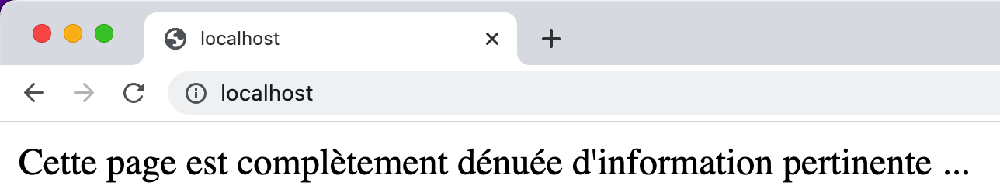
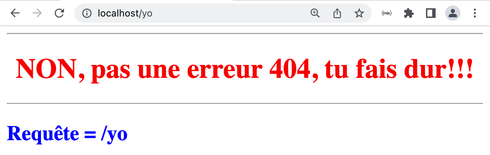

# Docker – Création d'une image avec une app Node.js

*Date: 1 février 2023 - Révision 2025.12.05*

---

## Section A – Tester l'application Node.js

### 1 – Tester l'application node.js dans un conteneur Ubuntu

```bash
sudo apt update && sudo apt install npm

# Installer les dépendances
# Attention, il ne faut pas être dans le dossier /
npm install socket.io socket.io-client express --save

# Express --> Framework Node.js minimal et flexible pour applications web et mobile
# Socket.IO --> Communication bidirectionnelle en temps réel entre client et serveur
# --save --> Ajout des dépendances dans le fichier '~/package.json' 
#            Note: Plus requis depuis npm 5
```

---

### 2 – Fichier 'package.json'

```json
{
  "dependencies": {
    "express": "^4.18.2",
    "socket.io": "^4.6.0",
    "socket.io-client": "^4.6.0"
  },
  "scripts": {
    "start": "node serveur.js"
  }
}
```

---

### 3 – Application serveur.js

```javascript
// Fichier: serveur.js
// Auteur: Alain Boudreault
// Date:   2023.02.07
// ----------------------------------------------------------------------------
// Description: Petit serveur web en node.js qui sera utilisé pour construire
//              une image Docker perso.
// ----------------------------------------------------------------------------

var http = require('http'); // Importation d'un module des plus important! ;-)
let PORT = 8080;
let AUTEUR = "Alain Boudreault";

var server = http.createServer(function (req, res) {   //Création d'un serveur Web
    if (req.url == '/') { //Vérification de l'URL    
        // Renseigner le 'header'
        res.writeHead(200, { 'Content-Type': 'text/html' }); 
        // Renseigner le contenu de la réponse    
        res.write('<html><head><meta charset=\"UTF-8\"></head><body><p>Cette page est complètement dénuée d\'information pertinente ...</p>');
    }
    else if (req.url == "/etudiant") {
        res.writeHead(200, { 'Content-Type': 'text/html' });
        res.write('<html><head><meta charset=\'UTF-8\'></head><body><p>Voici les réponses à l\'examen: ...</p></body></html>');    
    }
    else if (req.url == "/api") {
        res.writeHead(200, { 'Content-Type': 'application/json' });
        res.write(JSON.stringify({ version_api: "1.01", citation: "Ici la voix des mistérons"})); 
        // res.write('{"version_api":"1.0"}');
    }
    else {
        res.writeHead(200, { 'Content-Type': 'text/html' });
        res.write('<html><head><meta charset=\"UTF-8\"></head><body><hr/><center><h1 style="color:red">NON, pas une erreur 404, tu fais dur!!!</h1></center><hr/>');
        res.write('<h2 style="color:blue">Requête = ' + req.url + '</h2>');
    }
    res.end();  // Fermer la requête
});

server.listen(PORT); //Écoutons ce que les clients ont à demander ...

console.log('Exemple par ' + AUTEUR);
console.log('----------------------------------');
console.log('Mon petit serveur web Node.js vous écoute sur le port ' + PORT + ' ... cé pas ti fin ca!');
```

### 4 – Démarrage de l'application node.js

```bash
npm start &

# Tester l'application:
curl localhost:8080
curl localhost:8080/api
```

---

## Section B – Bâtir l'image de l'application

### 5 – Le Dockerfile

```dockerfile
# À partir de l'image de base:
FROM node:alpine

# Installer les dépendances npm
# NOTE: Il ne faut pas être la racine sinon l'opération va échouer!
WORKDIR /usr/app
COPY ./ /usr/app
RUN npm install

# Exposer le port IP du serveur Web.js
EXPOSE 8080

# Renseigner la commande de départ
CMD [ "npm","start" ]
```

---

### 6 – Produire l'image de notre application web serveur

```bash
docker build -t notre_serveur_web .
```

---

### 7 – Lancer l'application

```bash
docker run -d --rm -it --name yo -p 80:8080 notre_serveur_web
```

---

### 8 – Tester l'application

**8.1 Test 1 avec URL /**




**8.2 - Test 2 avec URL /yo**



---

## Section C – Version du serveur avec Express.js

### 9 – serveur02.js avec le module Express.js

```javascript
// Fichier: serveur02.js
// Auteur: Alain Boudreault
// Date:   2023.02.09
// ----------------------------------------------------------------------------
// Description: Petit serveur web en node.js qui sera utilisé pour construire
//              une image Docker perso.
//              Note: Utilisation du module Express.js
// ----------------------------------------------------------------------------

var express = require('express');
var app = express();

let PORT = 8080;
let AUTEUR = "Alain Boudreault";

app.get('/', function (req, res) {
    res.send(`
    <html><body>Ceci est un requête de type: GET<hr/>
    <h1>Bonjour 420-4D4</h1></body></html>
    `);
});

app.get('/api', function (req, res) {
    res.send("<html><body>Requête sur l'API maison<hr/>" +
    JSON.stringify({ version_api: "1.01", citation: "Ici la voix des mistérons"}) +
    "</body></html>"
    );
});

app.post('/submit-data', function (req, res) {
    res.send('Ceci est un requête de type: POST');
});

app.put('/update-data', function (req, res) {
    res.send('Ceci est un requête de type: PUT');
});

app.delete('/delete-data', function (req, res) {
    res.send('Ceci est un requête de type: DELETE');
});

// Traiter une route non définie:
app.use((req, res, next) => {
    res.status(404).send(`<html>
        <head><meta charset=\"UTF-8\"></head>
        <body><hr/><center>
        <h1 style="color:red">NON, pas une erreur 404, tu fais dur!!!</h1>
        </center><hr/>` +
        '<h2 style="color:blue">Requête = ' + req.url + '</h2></body></html>'
        );
});

// Afficher un message sur la console
// Note: Via Docker, il est possible d'afficher les messages de la console avec l'option logs:
// $ docker logs id_CONTENEUR  
var server = app.listen(PORT, function () {
    console.log('Exemple par ' + AUTEUR);
    console.log('----------------------------------');
    console.log('Mon petit serveur web Node.js vous écoute sur le port ' + PORT + ' ... cé pas ti fin ca!');
});
```

---

## Section D – Arguments personnalisés

### 10 – Dockerfile avec arguments (Dockerfile.srv03)

```dockerfile
# Specify a base image
FROM node:alpine

# Définir un argument à utiliser avec docker build --build-arg numero_port=
# Par exemple:
# docker build -f Dockerfile.srv03 -t web_express --build-arg numero_port=99 .
ARG numero_port

# Définir une variable d'environnement qui sera disponible dans le conteneur
# Pour la lire en node.js: const PORT = parseInt(process.env.PORT) || 8080;
ENV PORT=$numero_port
# Ou: ENV PORT=${numero_port}

WORKDIR /usr/app
COPY ./ /usr/app
RUN npm install

EXPOSE $numero_port

CMD [ "npm","start" ]
```

---

### 11 – serveur03.js - Utilisation d'une variable d'environnement

```javascript
// Fichier: serveur03.js
// Auteur: Alain Boudreault
// Date:   2023.02.09
// ----------------------------------------------------------------------------
// Description: Utilisation d'une variable d'environnement pour le port TCP
// ----------------------------------------------------------------------------

var express = require('express');
var app = express();

const PORT = parseInt(process.env.PORT) || 8080;
const AUTEUR = "Alain Boudreault";

app.get('/', function (req, res) {
    res.send("</body></html><h1>Le serveur écoute sur le port: " + PORT + "</h1></body></html>");
});

// Afficher un message sur la console
// Note: Via Docker, il est possible d'afficher les messages de la console avec l'option logs:
// $ docker logs id_CONTENEUR  
var server = app.listen(PORT, function () {
    console.log('Exemple par ' + AUTEUR);
    console.log('----------------------------------');
    console.log('Mon petit serveur web Node.js vous écoute sur le port ' + PORT + ' ... cé pas ti fin ca!');
    console.log("parseInt(process.env.PORT) = " + parseInt(process.env.PORT));
});
```

---

### 12 – package.json pour serveur03.js

```json
{
    "dependencies": {
      "express": "^4.18.2",
      "socket.io": "^4.6.0",
      "socket.io-client": "^4.6.0"
    },
    "scripts": {
         "start": "node serveur03.js"
     }
}
```

---

## Section E – Image multi-plateforme

### 13 – Création d'une image multi-plateforme

[Application en Python - Tutorial DataCamp](https://www.datacamp.com/tutorial/docker-buildx?utm_cid=19589720830&utm_aid=192320612288&utm_campaign=230119_1-ps-other~dsa~tofu-tutorial_2-b2c_3-nam_4-prc_5-na_6-na_7-le_8-pdsh-go_9-nb-e_10-na_11-na&utm_loc=9000502-&utm_mtd=-c&utm_kw=&utm_source=google&utm_medium=paid_search&utm_content=ps-other~nam-en~dsa~tofu~tutorial~docker&gad_source=1&gad_campaignid=19589720830&gbraid=0AAAAADQ9WsHZyFJw8-QtIDRPwnLUtBoZv&gclid=Cj0KCQiAubrJBhCbARIsAHIdxD-HmBU0-05BptvzzImggyA2HmEgGDDYKwZU8XKvuJbtvmJSngRrUwUaAkqOEALw_wcB)

**TODO**: à compléter

---

## Références

Référence pour la syntaxe [Dockerfile](https://docs.docker.com/engine/reference/builder/)

---

## Crédits

*Document préparé par Alain Boudreault*  
*Site par ve2cuy*