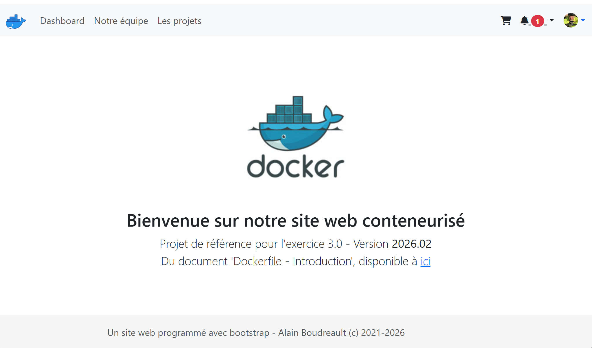
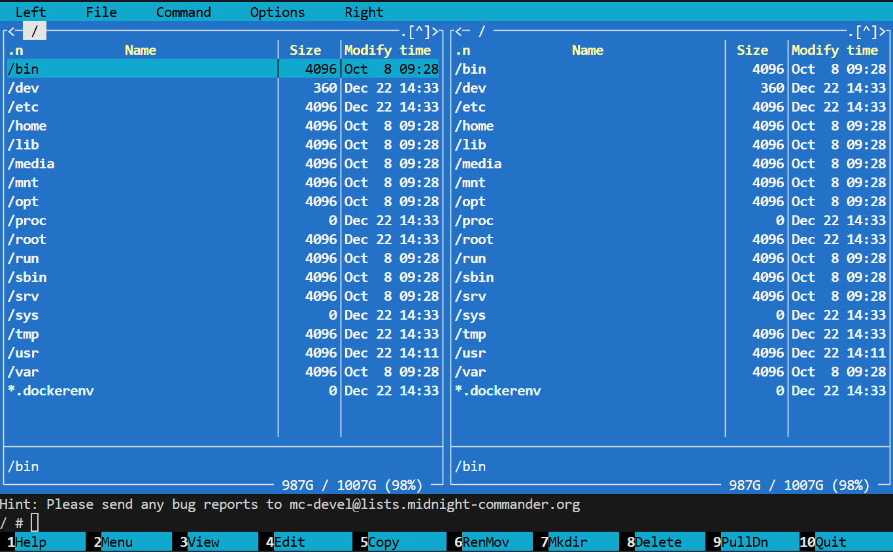

# 🐳 Dockerfile – Introduction

*Source : [https://4204d4.ve2cuy.com/docker-compose-introduction/](https://4204d4.ve2cuy.com/docker-compose-introduction/)*
*Date : 29 janvier 2021*


---

## La Dockerfile – tout ce que vous avez toujours voulu savoir

Motivé par nos apprentissages précédents, nous voilà enfin près – du moins, nous tenterons l’exercice – à bâtir une image **docker** personnalisée.

<p align="center">
    
</p>

---

**Pré-requis:**

* **Docker – Commandes de base**
* **Docker – Conteneurs personnalisés**
* **Publication sur hub.docker.com**

---

**Comment démarrer ce module?**

Nous savons comment **personnaliser** un conteneur, puis le publier sur [hub.docker.com](https://hub.docker.com).

Oui je sais, ce faisant, nous *modifions* le travail d’une autre personne.

Pas vraiment de **mérite** à celà.

Alors voici comment nous élever au **dessus de la foule** 👨‍👩‍👦‍👦:

---

## Dockerfile

Il est possible de **créer** un image **personnalisée** à partir d’un **fichier de directives**.

Quoique cela ne soit pas une ***obligation***, ce fichier est habituellement nommé '**Dockerfile**'.

Il propose la structure de **directives** suivante:

* **FROM**
* **RUN**
* **CMD**

**FROM** – À partir d’une image existante, comme par exemple, 'alpine'

**RUN** – Dans l’image, exécuter les commandes suivantes, comme par exemple, 'apt update && apt install nano'
> **Note:** RUN utilise la syntaxe '*/bin/sh -c*' pour exécuter la commande.

**CMD** – Lors du démarrage du conteneur, exécuter la commande suivante: '/bin/bash'

Référence: [Best practices](https://docs.docker.com/develop/develop-images/dockerfile_best-practices/)

### Testons,

#### 1.1 – Dockerfile initial

Dans un dossier vide, créer un fichier Dockerfile.

```dockerfile
# À partir d'une image
FROM ubuntu

# Optionnel
MAINTAINER Alain Boudreault <aboudrea@cstj.qc.ca>
LABEL Maintainer="Moi"
LABEL Auteur="Moi Moi"

# Exécuter des commandes dans l'image
RUN apt-get update
RUN mkdir /toto

# Commande à exécuter au démarrage d'un conteneur
CMD ["echo"," --------------------------\n","Ici la voix des Mistérons!\n","--------------------------\n"]
````

> **NOTE** : Il est aussi possible d’utiliser `LABEL` au lieu de `MAINTAINER`, ce qui est présentement la méthode recommandée.
>
> **NOTE2** : Les directives peuvent-être inscrites en caractères minuscules mais NON RECOMMANDÉ.

#### 1.2 – Construire l’image: `docker build`

```bash
$ docker build -t exercice01:latest .
```

> **NOTE** : ATTENTION au **.** à la fin de la commande\!\!

Sortie de la construction (exemple) :

```
[+] Building 0.5s (6/6) FINISHED
 => [internal] load build definition from Dockerfile 0.0s
 => => transferring dockerfile: 364B 0.0s
 => [internal] load .dockerignore 0.0s
 => => transferring context: 2B 0.0s
 => [internal] load metadata for docker.io/library/ubuntu:latest 0.4s
 => [1/2] FROM docker.io/library/ubuntu@sha256:703218c0465075f4425e58fac086e09e1de5c340b12976ab9eb8ad26615c3715 0.0s
 => CACHED [2/2] RUN apt-get update 0.0s
 => exporting to image 0.0s
 => => exporting layers 0.0s
 => => writing image sha256:6a083629e78cc15116597087eabb9cce0dea4180748039cd18a1d90487ec4a10 0.0s
 => => naming to docker.io/library/exercice01:latest
```

#### 1.3 – Tester l’image via un conteneur: `docker run`

```bash
 $ docker run exercice01              
 --------------------------
 Ici la voix des Mistérons!
 --------------------------
```

> **Note** : Si le fichier source n’est pas nommé ‘Dockerfile’, il faut alors utiliser l’option -f:
>
> ```bash
> docker build -f Dockerfile02 -t docker_build_02 .
> ```

#### 1.4 – Copier un fichier vers l’image – **créer** le fichier `hello.sh`

```bash
#!/bin/bash

echo "------------------------------"
echo "  Ici la voix des Mistérons!"
echo "------------------------------"
```

#### 1.4b – **Modifier** le fichier Dockerfile (avec ADD)

```dockerfile
# À partir d'une image
FROM ubuntu

# Optionel
MAINTAINER Alain Boudreault <aboudrea@cstj.qc.ca>

# Exécuter des commandes dans l'image
RUN apt-get update

# Ajouter un fichier à l'image
ADD hello.sh /
RUN chmod a+x /hello.sh

# Commande à éxécuter au démarrage d'un conteneur
CMD ["/hello.sh"]
```

#### 1.5 – **Reconstruire** l’image

```bash
docker build -t exercice01:latest .
```

#### 1.6 – **Tester** dans un conteneur

```bash
$ docker run exercice01
```

#### 1.7 - Labo – Modifier pour la version 1.1

Modifier le projet pour obtenir le résultat suivant au démarrage du conteneur version `1.1`:

```bash
docker run exercice01:1.1
```

**Résultat** :

```
--------------------------------------
     Ici la voix des Mistérons!
--------------------------------------
 Il est : 16:30:50 dans le conteneur
--------------------------------------
```

> **Note** : Sous Linux, pour afficher l’heure dans un echo : `$(date +%X)`

-----

## 2.0 – Exemple d’une image Ubuntu avec un binaire écrit en 'C'

**NOTE** : Démonstration de l’enseignant à partir d’un session Ubuntu – Explication des dépendances OS.

### 2.1 – Programme 'C' (bonjour.cpp)

```c
// Fichier: bonjour.cpp
// Exemple d'une application 'bin' pour Linux
// Par Alain Boudreault
// Fichier source compilé avec 'gcc' sous Ubuntu
// Il est possible d'avoir à installer g++ et gcc: apt install g++ gcc
#include <stdio.h>;
#define MAXITERATION 10

/**
   Incroyable mais oui, il n'y a qu'une seule fonction dans ce programme ;-)
*/
int main(){
  for (int i=1; i <= MAXITERATION; i++) {
    printf("%d\t - Bonjour 420-4D4 !!!\n", i);
  } // for i
  return 0;
} // main()
```

### 2.2 – Compiler le code source

```bash
$ g++ bonjour.cpp -o bonjour
```

### 2.3 – Dockerfile

```dockerfile
FROM ubuntu
COPY bonjour /bin
CMD ["/bin/bonjour"]
```

### 2.4 – Produire l’image

```bash
docker build -t alainboudreault/bonjour420:latest .
```

### 2.5 – Tester l’image

```bash
docker run alainboudreault/bonjour420
```
---


### Laboratoire 2.6 – Durée 30 minutes

**1 – Programmer un *Dockerfile* qui:**

  * À partir de `ubuntu:latest`
  * Renseigne votre nom comme auteur
  * Installe le compilateur `g++` (`apt install -y` -\> installe sans confirmation)
  * Modifier le ficher *bonjour.cpp* pour que le programme affiche votre nom après la boucle
  * Copie le fichier de l’étape 2.1, *bonjour.cpp*, vers l’image
  * Compile le programme *bonjour.cpp*
  * Déplace l’exécutable de *bonjour* vers le dossier `/bin`
  * Fixe comme point d’entrée le programme *bonjour*

**2 – Produire et tester l’image**

**3 – Publier l’image sous `docker-hub-login/bonjour-420:latest`**

**4 – Copier le lien dans la conversation Teams**

> **Suggestion**, tester vos étapes dans un conteneur *Ubuntu* avant de rédiger le *Dockerfile*.

-----

## 3 – Construire l’image d’un site web

### Pré-requis

**git**, **doit-être installé sur votre poste de travail**:

  * Sous **windows**: [https://gitforwindows.org](https://gitforwindows.org)
  * Sous **MacOS** – git est probablement déjà installé. Sinon voir [git-pour-MacOS](https://www.atlassian.com/fr/git/tutorials/install-git)
  * Sous **Linux** – Référez-vous à la documentation de votre distribution. Par exemple pour [Debian](https://git-scm.com/book/en/v2/Getting-Started-Installing-Git)

### 3.1 – Obtenir les fichiers de départ

À partir de **https://github.com/ve2cuy/4204d4.git**

> **Note**: Placez-vous dans un dossier de travail vide\!
>
> ```bash
> git clone https://github.com/ve2cuy/superminou-depart
> ```

### 3.2 – Se déplacer vers le dossier de l'exercice

```bash
cd superminou-depart/
```

### 3.3 – Construire une image nommée 'test'

À partir du fichier 'Dockerfile' ainsi que le contenu du dossier.

```bash
docker build -t test .
```

### 3.4 – Tester l’image

```bash
docker run -d -p 99:80 test
```

### 3.9 – Une version fonctionnelle (Exemple)

```bash
docker run -d -p 99:80 alainboudreault/420-4d4:exemple03
```



-----


## 4.0 – Laboratoire – Durée 30 minutes

  * **Reproduire l’exercice précédent** à partir de l’image ***httpd***
  * Y ajouter les applications `git`, `nano`, `mc` et `tmux`
  * Remplacer ‘Alain Boudreault’ par votre nom sur la page d’accueil du site Web
      * Indice: la commande '***sed***'.
      * **NOTE**: Ne pas éditer le fichier manuellement \!\!
  * **Publier l’image** sous `votreCompteHub.docker.com/semaine02-lab4:latest`
  * **Afficher le lien de l’image** dans la discussion de la séance pour que nous puissions la tester.
    ```bash
    docker pull [votreCompteHub.docker.com/semaine02-lab4](https://votreCompteHub.docker.com/semaine02-lab4)
    ```

-----

## 5.0 – Exemples supplémentaires

### 5.1 – Conteneur qui requiert la définition de variables d'environnement

```dockerfile
# EXEMPLE AVEC UN TIME-ZONE et autres choses ...
# Valeurs passées au conteneur par des variables d'environnement
# docker build -t test:v1 .
FROM busybox:unstable-uclibc
LABEL maintainer="alain.boudreault@me.com"
RUN apt-get update && apt-get install -yq tzdata

# Ces variables d'environnement seront crées dans le conteneur. 
ENV TZ="PoleNord/NoelVille"
ENV MOT_DE_PASSE_ULTRA_SECRET="j3sU1um0TDEp2SSE"
ENV ADRESSE_DNS=1.1.1.1

RUN apt install -y mc
```

-----


## 5.1.1 – Laboratoire – Durée 20 minutes

À partir de l'exemple précédent, contruire une image qui affiche le contenu des trois variables d'environnement au démarrage d'un conteneur.

- 1 - Il faut utiliser l'image '**alpine:latest**' comme source
- 2 - Sous alpine, la commande utilisée pour installer des applications (packages) est '**apk**'. 
- - À vous de vérifier la syntaxe d'utilisation.

Résultat obtenu:

```bash
$ docker run labo5.1.1.1

Bienvenue dans le conteneur Docker!

Le mot de passe ultra secret est: j3sU1um0TDEp2SSE
Le fuseau horaire est: PoleNord/NoelVille
Et le DNS est: 1.1.1.1
```

**NOTE: Vérifier que la commande 'mc' fonctionne.



---

### 5.2 – Exemple d’utilisation d’une variable d’environnement lors du build

Voici comment passer des informations, pour le build, à partir de la ligne de commande:


```dockerfile
# NOTE: BUILD_DATE et BUILD_VERSION seront passés via la ligne de commande. 
FROM alpine

# Labels
ARG BUILD_DATE
ARG BUILD_VERSION
LABEL org.label-schema.schema-version="1.0"
LABEL org.label-schema.build-date=${BUILD_DATE}
LABEL org.label-schema.version=${BUILD_VERSION:-1.0}
LABEL org.label-schema.docker.cmd="docker run --build-arg BUILD_DATE="" --build-arg BUILD_VERSION=1.0  mes-outils"

LABEL maintainer="dev@unprojet.org"

ENV DATE_DU_BUILD=${BUILD_DATE}

# COPY outils.tar.gz /mnt
# WORKDIR /mnt
# RUN tar zxvf /mnt/outils.tar.gz
# CMD ["/mnt/outils/outils.sh"]
CMD ["sh", "-c", "echo -e BUILD_DATE=$DATE_DU_BUILD"]
```

Commande de construction :

```bash
# NOTE: --no-cache indique de reconstruire toutes les couches de l'image
docker build --no-cache=true \
--build-arg BUILD_DATE=$(date -u +'%Y-%m-%dT%H:%M:%SZ') \
--build-arg BUILD_VERSION=1.0 \
-f Dockerfile-labo-5.2 \
-t mes-outils:latest .
```

Résultat:

```
$ docker run mes-outils:latest
BUILD_DATE=2025-12-22T15:11:36Z
```

Inspecter la structure json du conteneur:

```
$ docker inspect ID_CONTENEUR | grep -A5 Labels
    "Labels": {
         "maintainer": "dev@unprojet.org",
         "org.label-schema.build-date": "2025-12-22T15:21:48Z",
         "org.label-schema.schema-version": "1.0",
         "org.label-schema.version": "3.2"
            },

# Autre méthode,
$ docker inspect --format='{{index .Config.Labels "org.label-schema.build-date"}}' ID_CONTENEUR
# 'index' pointe sur la clé "Config": {"Labels": {"org.label-schema.build-date": ... }
# Voir la structure json retounée par la directive 'inspect'.

$ docker inspect --format='{{index .Config.Labels "org.label-schema.docker.cmd"}}' mes-outils

  --> docker run --build-arg BUILD_DATE= --build-arg BUILD_VERSION=1.0  mes-outils

```

**⚠️ Note importante** : Cet exemple utilise la syntaxe `org.label-schema` qui est maintenant **dépréciée** (mais toujours largement utilisée). Voir le document [Dockerfile convention de nommage](Dockerfile-convention-de-nommage.md) pour des exemples avec le standard 'OCI Image Spec Annotations'.

--- 

### 5.3 – Le fichier `.dockerignore`

Si présent dans le répertoire du Dockerfile, le fichier `.dockerignore` permet d'exclure des fichiers lorsque les directives 'COPY' et 'ADD' sont utilisées.

```bash
# Voici un exemple de contenu:
.git
.gitignore
node_modules
npm-debug.log
Dockerfile*
docker-compose*
README.md
LICENSE
.vscode
```

---

### 5.4 – La directive WORKDIR, exemple d’utilisation:

```dockerfile
FROM nginx
# Se déplacer dans le dossier racine du serveur Web:
WORKDIR /usr/share/nginx/html
# Copier les fichiers du dossier courant vers le dossier WORKDIR 
COPY . ./
```

---

### 5.5 – Différences entre les directives ADD et COPY

  * `COPY src dest`: copie des fichiers/dossiers d’une source locale vers une destination dans l’image.
  * `ADD src dest`: Propose les fonctions de `COPY` et :
      * la possibilité de renseigner une URL comme source,
      * décompresse automatiquement les fichiers archives de la source (`ADD rootfs.tar.gz .`)

Si les fonctions supplémentaires de `ADD` ne sont pas requises, il est recommandé d’utiliser la directive `COPY`.

---

### 5.6 – Dockerfile de l’image Alpine

```dockerfile
FROM scratch
ADD alpine-minirootfs-3.15.0-x86_64.tar.gz /
CMD ["/bin/sh"]
```

---

### 5.7 – Exécuter un bloc d'instruction pour créer un fichier
```dockerfile
FROM alpine
	{ \
		echo 'opcache.memory_consumption=128'; \
		echo 'opcache.interned_strings_buffer=8'; \
		echo 'opcache.max_accelerated_files=4000'; \
		echo 'opcache.revalidate_freq=2'; \
		echo 'opcache.fast_shutdown=1'; \
	} > /config.ini

# Construire l'image et executer un shell interactif sur le conteneur
# pour vérifier le contenu du ficher config.ini

```
---

## 5.7.1 –Laboratoire – Durée 20 minutes


<br>

Contruire une image, à partir de 'alpine' qui crée le fichier d'alias suivant à partir d'un bloc 'echo vers ...'  Au besoin, revoir 5.7.

```bash
alias ll='ls -la'
alias t='top'
alias os='uname -a'
alias c='clear'
```
- le fichier est localisé dans `/etc/profile.d/alias.sh`

NOTE: Pour fonctionner, il faut que la variable d'environnement  `ENV` pointe sur  `/etc/profile`

---

Résultat:
```bash
$ docker run -it --hostname labo5-7-1 labo-5-7-1
labo5-7-1:/# alias
c='clear'
os='uname -a'
t='top'
ll='ls -la'
labo5-7-1:/#
```

---

## 5.8 - La directice 'EXPOSE'

```Dockerfile
# docker build -f Dockerfile-labo-5-8-1 -t mon-httpd:8080 .
# docker run -d -p 8080:8080 --name web-server mon-httpd:8080

FROM httpd:2.4

# Exposer le port 8080 au lieu de 80
EXPOSE 8080

# Modifier la configuration pour écouter sur 8080
RUN sed -i 's/Listen 80/Listen 8080/' /usr/local/apache2/conf/httpd.conf

# Au besoin, copier votre contenu web
# COPY ./html/ /usr/local/apache2/htdocs/
```

---

## 👉 5.8.1 –Laboratoire – Durée 30 minutes


<br>

À partir de l'exemple 5.7, contruire une image qui:

- Renseigne le port HTTP via la ligne de commande lors du build.
- Renseigne le label `org.label-schema.docker.cmd` avec la commande à exécuter pour lancer le contenueur.
- Remplace la page par défaut par la votre.
- - Créer le fichier `index.html` dans le Dockerfile
- Ajoute une configuration personnalisée pour un 404
- - Créer le fichier `404.html` dans le Dockerfile.
- Utilise l'image suivante dans la page 404:


- Il faut publier l'image sur docker hub sous `votre-compte/labo-5-7-1:latest`
- Copier la commande, pour lancer votre conteneur, dans la conversation TEAMS.


---

### 6 – Exemple d'un Dockerfile complexe (WordPress)

```dockerfile
FROM php:7.4-apache

# persistent dependencies
RUN set -eux; \
	apt-get update; \
	apt-get install -y --no-install-recommends \
# Ghostscript is required for rendering PDF previews
		ghostscript \
	; \
	rm -rf /var/lib/apt/lists/*

# install the PHP extensions we need ([https://make.wordpress.org/hosting/handbook/handbook/server-environment/#php-extensions](https://make.wordpress.org/hosting/handbook/handbook/server-environment/#php-extensions))
RUN set -ex; \
	\
	savedAptMark="$(apt-mark showmanual)"; \
	\
	apt-get update; \
	apt-get install -y --no-install-recommends \
		libfreetype6-dev \
		libicu-dev \
		libjpeg-dev \
		libmagickwand-dev \
		libpng-dev \
		libwebp-dev \
		libzip-dev \
	; \
	\
	docker-php-ext-configure gd \
		--with-freetype \
		--with-jpeg \
		--with-webp \
	; \
	docker-php-ext-install -j "$(nproc)" \
		bcmath \
		exif \
		gd \
		intl \
		mysqli \
		zip \
	; \
# [https://pecl.php.net/package/imagick](https://pecl.php.net/package/imagick)
	pecl install imagick-3.6.0; \
	docker-php-ext-enable imagick; \
	rm -r /tmp/pear; \
	\
# some misbehaving extensions end up outputting to stdout 
	out="$(php -r 'exit(0);')"; \
	[ -z "$out" ]; \
	err="$(php -r 'exit(0);' 3>&1 1>&2 2>&3)"; \
	[ -z "$err" ]; \
	\
	extDir="$(php -r 'echo ini_get("extension_dir");')"; \
	[ -d "$extDir" ]; \
# reset apt-mark's "manual" list so that "purge --auto-remove" will remove all build dependencies
	apt-mark auto '.*' > /dev/null; \
	apt-mark manual $savedAptMark; \
	ldd "$extDir"/*.so \
		| awk '/=>/ { print $3 }' \
		| sort -u \
		| xargs -r dpkg-query -S \
		| cut -d: -f1 \
		| sort -u \
		| xargs -rt apt-mark manual; \
	\
	apt-get purge -y --auto-remove -o APT::AutoRemove::RecommendsImportant=false; \
	rm -rf /var/lib/apt/lists/*; \
	\
	! { ldd "$extDir"/*.so | grep 'not found'; }; \
# check for output like "PHP Warning: PHP Startup: Unable to load dynamic library 'foo' (tried: ...)
	err="$(php --version 3>&1 1>&2 2>&3)"; \
	[ -z "$err" ]

# set recommended PHP.ini settings
# see [https://secure.php.net/manual/en/opcache.installation.php](https://secure.php.net/manual/en/opcache.installation.php)
RUN set -eux; \
	docker-php-ext-enable opcache; \
	{ \
		echo 'opcache.memory_consumption=128'; \
		echo 'opcache.interned_strings_buffer=8'; \
		echo 'opcache.max_accelerated_files=4000'; \
		echo 'opcache.revalidate_freq=2'; \
		echo 'opcache.fast_shutdown=1'; \
	} > /usr/local/etc/php/conf.d/opcache-recommended.ini
# [https://wordpress.org/support/article/editing-wp-config-php/#configure-error-logging](https://wordpress.org/support/article/editing-wp-config-php/#configure-error-logging)
RUN { \
# [https://www.php.net/manual/en/errorfunc.constants.php](https://www.php.net/manual/en/errorfunc.constants.php)
# [https://github.com/docker-library/wordpress/issues/420#issuecomment-517839670](https://github.com/docker-library/wordpress/issues/420#issuecomment-517839670)
		echo 'error_reporting = E_ERROR | E_WARNING | E_PARSE | E_CORE_ERROR | E_CORE_WARNING | E_COMPILE_ERROR | E_COMPILE_WARNING | E_RECOVERABLE_ERROR'; \
		echo 'display_errors = Off'; \
		echo 'display_startup_errors = Off'; \
		echo 'log_errors = On'; \
		echo 'error_log = /dev/stderr'; \
		echo 'log_errors_max_len = 1024'; \
		echo 'ignore_repeated_errors = On'; \
		echo 'ignore_repeated_source = Off'; \
		echo 'html_errors = Off'; \
	} > /usr/local/etc/php/conf.d/error-logging.ini

RUN set -eux; \
	a2enmod rewrite expires; \
	\
# [https://httpd.apache.org/docs/2.4/mod/mod_remoteip.html](https://httpd.apache.org/docs/2.4/mod/mod_remoteip.html)
	a2enmod remoteip; \
	{ \
		echo 'RemoteIPHeader X-Forwarded-For'; \
# these IP ranges are reserved for "private" use and should thus *usually* be safe inside Docker
		echo 'RemoteIPTrustedProxy 10.0.0.0/8'; \
		echo 'RemoteIPTrustedProxy 172.16.0.0/12'; \
		echo 'RemoteIPTrustedProxy 192.168.0.0/16'; \
		echo 'RemoteIPTrustedProxy 169.254.0.0/16'; \
		echo 'RemoteIPTrustedProxy 127.0.0.0/8'; \
	} > /etc/apache2/conf-available/remoteip.conf; \
	a2enconf remoteip; \
# [https://github.com/docker-library/wordpress/issues/383#issuecomment-507886512](https://github.com/docker-library/wordpress/issues/383#issuecomment-507886512)
# (replace all instances of "%h" with "%a" in LogFormat)
	find /etc/apache2 -type f -name '*.conf' -exec sed -ri 's/([[:space:]]*LogFormat[[:space:]]+"[^"]*)%h([^"]*")/\1%a\2/g' '{}' +

RUN set -eux; \
	version='5.9.1'; \
	sha1='15746f848cd388e270bae612dccd0c83fa613259'; \
	\
	curl -o wordpress.tar.gz -fL "[https://wordpress.org/wordpress-$version.tar.gz](https://wordpress.org/wordpress-$version.tar.gz)"; \
	echo "$sha1 *wordpress.tar.gz" | sha1sum -c -; \
	\
# upstream tarballs include ./wordpress/ so this gives us /usr/src/wordpress
	tar -xzf wordpress.tar.gz -C /usr/src/; \
	rm wordpress.tar.gz; \
	\
# [https://wordpress.org/support/article/htaccess/](https://wordpress.org/support/article/htaccess/)
	[ ! -e /usr/src/wordpress/.htaccess ]; \
	{ \
		echo '# BEGIN WordPress'; \
		echo ''; \
		echo 'RewriteEngine On'; \
		echo 'RewriteRule .* - [E=HTTP_AUTHORIZATION:%{HTTP:Authorization}]'; \
		echo 'RewriteBase /'; \
		echo 'RewriteRule ^index\.php$ - [L]'; \
		echo 'RewriteCond %{REQUEST_FILENAME} !-f'; \
		echo 'RewriteCond %{REQUEST_FILENAME} !-d'; \
		echo 'RewriteRule . /index.php [L]'; \
		echo ''; \
		echo '# END WordPress'; \
	} > /usr/src/wordpress/.htaccess; \
	\
	chown -R www-data:www-data /usr/src/wordpress; \
# pre-create wp-content (and single-level children) for folks who want to bind-mount themes, etc so permissions are pre-created properly instead of root:root
# wp-content/cache: [https://github.com/docker-library/wordpress/issues/534#issuecomment-705733507](https://github.com/docker-library/wordpress/issues/534#issuecomment-705733507)
	mkdir wp-content; \
	for dir in /usr/src/wordpress/wp-content/*/ cache; do \
		dir="$(basename "${dir%/}")"; \
		mkdir "wp-content/$dir"; \
	done; \
	chown -R www-data:www-data wp-content; \
	chmod -R 777 wp-content

VOLUME /var/www/html

COPY --chown=www-data:www-data wp-config-docker.php /usr/src/wordpress/
COPY docker-entrypoint.sh /usr/local/bin/

ENTRYPOINT ["docker-entrypoint.sh"]
CMD ["apache2-foreground"]
```


---

## Crédits

*Document rédigé par Alain Boudreault © 2021-2026*  
*Version 2025.12.22.1*  
*Site par ve2cuy*