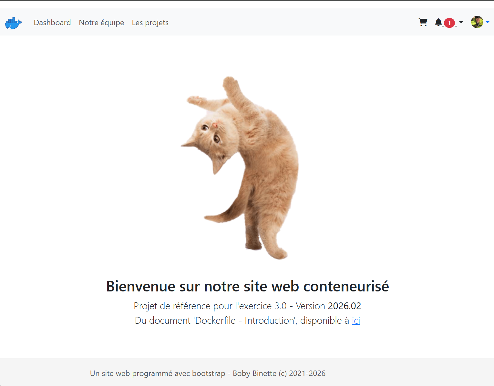
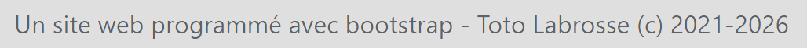
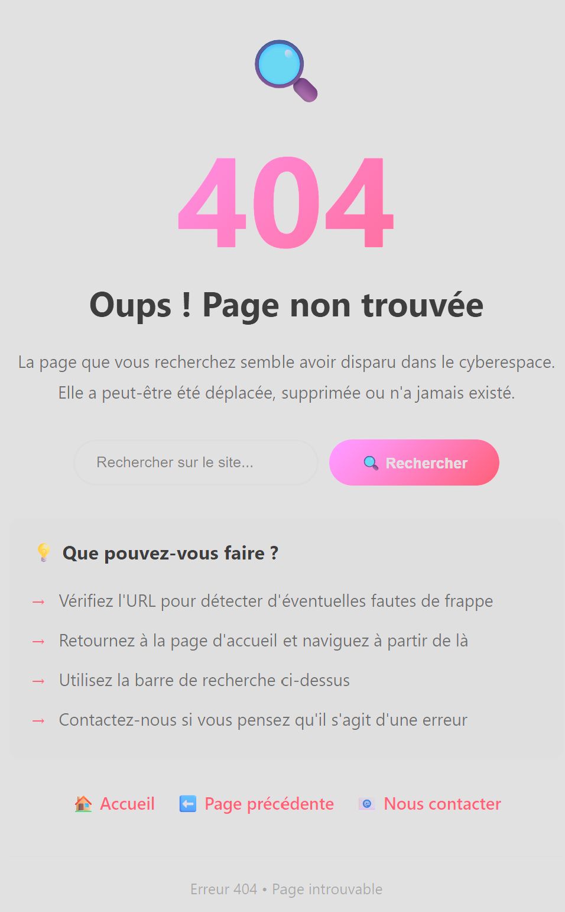
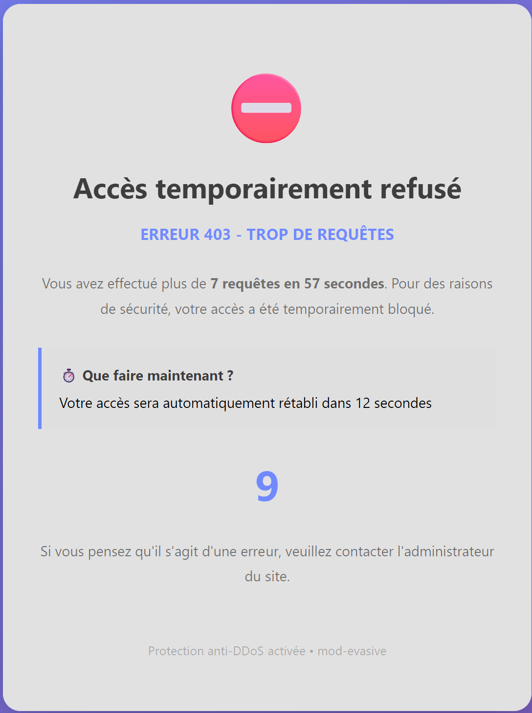

# Dockerfile – Atelier de renforcement, version H26

## NOTE: Cet atelier est un exercice formatif à l'épreuve synthèse volet B.
## Il ne faut pas utiliser l'IA pour réaliser ce laboratoire. 

### À remettre sur LEA à la fin du cours.
---

<p align="center">
    
</p>

---

### Il faut bâtir une image Docker,  à partir d'un fichier Dockerfile nommé `powercat` qui:

1. Utilise comme source de départ, 👉`ubuntu:22.04` <<-- **IMPORTANT**
2. 👉 Installe `apache2` <<-- **IMPORTANT**
3. Propose les applications suivantes: `mc`, `curl`, `git`, `htop` et `mcedit`
4. Installe un site web à partir du contenu du dépôt GitHub **https://github.com/ve2cuy/superminou-depart**.
 
👉 Il ne faut pas cloner le dépôt sur votre poste de travail mais plutôt sur l'image, dans le répertoire `/420` <<-- **IMPORTANT**.

5. Renseigne la configuration d'apache pour gérer un erreur 404. 
   1. Copie le fichier `404.html` dans le dossier `error/`
6. Renseigne la configuration d'apache pour gérer un erreur 403, de type `Too many requests`, via le module `mod_evasive`. Voir plus bas pour les détails. 
   1. Copie le fichier `blocked.html` dans le dossier `error/`
   2. Utilise un argument du build pour renseigner le `DOSPageCount`, `DOSPageInterval` et `DOSBlockingPeriod`
   3. Le module `mod-evasive` est requis et doit-être activé, `ref.: a2enmod`.
   4. `mod-evasive` gère les erreurs via 403.  Voici un exemple:

```bash 
# Trouver comment installer 'mod_evasive'
# Puis, configurer le module
<IfModule mod_evasive20.c>
    DOSHashTableSize    3097
    DOSPageCount        5  # Renseigné à partir d'un ARG
    DOSPageInterval     10 # Renseigné à partir d'un ARG
    DOSBlockingPeriod   60 # Renseigné à partir d'un ARG
</IfModule>
```

👉 IMPORTANT: Les paramètres fonctionnels du module `evasice` doit-être renseignés lors du `build`. Sinon, il faut fournir les valeurs par défaut mentionnées dans l'exemple précédant. 

👉 👉 De plus, faut éditer (sed) le fichier `blocker.html` pour qu'il affiche les valeurs renseignées lors du build.  Par exemple, si `DOSBlockingPeriod = 60` alors la page `blocker.html` affichera le message "Votre accès sera automatiquement rétabli dans 60 secondes" et le `timer` sera ajusté en fonction de cette valeur.

---

7. Remplace l'image **docker-logo.jpg** par celle-ci: 

<p align="center">
    
</p>

---

8. Remplace le nom de l'auteur du pied de page dans **index.html** par votre nom.
9. Remplace la photo, en haut à droite du menu, par la votre.
10. Renseigne quatre (4) labels:
    1.  auteur (votre nom et matricule) # org.opencontainers.image.authors
    2.  Titre de l'application          # org.opencontainers.image.title
    3.  Description # Par exemple, "Image Docker avec Apache et mod-evasive ..."
    4.  Date de création, à partir de l'argument `BUILD_DATE`

Un `inspect` de l'image devrait afficher:

```json
"Labels": {
    "org.opencontainers.image.authors": "Votre nom ...",
    "org.opencontainers.image.created": "Date de création de votre image, passée en ARG",
    "org.opencontainers.image.description": "Image Docker avec Apache et mod-evasive  pour la protection contre les attaques DoS",
    "org.opencontainers.image.ref.name": "ubuntu",
    "org.opencontainers.image.title": "Formatif 01 de l'épreuve synthèse",
    "org.opencontainers.image.version": "22.04"
}
```

👉 NOTE: Utiliser le standard OCI pour le nom des `LABEL`. Voir ce [Document](https://ve2cuy.github.io/4204d4/Documentation/Docker/Dockerfile-convention-de-nommage.html)

---

11.  Utilise des arguments pour renseigner le **port** du serveur `HTTP_PORT` et le **ServerName** de la config d'apache2 `SERVER_NAME` lors du build. **Note**: Le port `HTTP`, sous apache2, n'est pas dans le fichier `httpd.conf`.

12.  Les logs d'erreurs d'apache2 doivent-être enregistrés dans `/meslogs/apache2.log`

13.  Publier votre solution sur docker hub sous `identifiant/formatif:1.0`.

---

**🤚 NOTE**: Il faut utiliser la commande **'sed -i'** pour éditer les fichiers. Ne pas modifier les fichiers avec un éditeur de texte. Les modifications doivent-être faites dans le Dockerfile. Référence: Rechercher et remplacer une chaine de caractères sous Linux.

---

14. Le contenu de votre fichier `Dockerfile` doit être accessible à l'adresse: **http://localhost/info.txt**
15. Inscrire en commentaire, dans le fichier, la commande à utiliser pour produire l'image.; `# docker build …`
16. Il faut publier l'image finale sur docker hub sous: **votrecompte/docker-lab version latest et 1.0**

---

**💡Astuce** Utiliser, dans la Dockerfile, `ENV DEBIAN_FRONTEND=noninteractive` pour vous assurer qu'il n'y aura pas d'interactivité lors de l'installation des packages.

**💡Autre Astuce** Penser à démarrer le service `apache2` en arrière plan `CMD ["apache2ctl", "-D", "FOREGROUND"]` ou `ENTRYPOINT ["/usr/sbin/apache2ctl", "-D", "FOREGROUND"]`.

 ---

## Résultat

### Page principale



### Bas de page


---

### Page 404


### Page 403


 ----

## Défi supplémentaire pour les plus téméraires
 
 * Créer l'utilisateur **gestionweb**
 * Renseigner **'donttell'** comme mot de passe
 * L'inscrire aux groupes **www-data et sudo**
 * Publier la version **2.0** de l'application


---

Une version fonctionnelle est disponible via

```bash 
$ docker run -d -p 80:80 alainboudreault/labo:super-minou
```
---

## Formatif 01 de l'épreuve synthèse volet B

À réaliser en classe et à remettre à la fin du cours.

👉 Ce formatif représent environ 1/3 de l'épreuve synthèse du volet B.

---

## Crédits

*Document rédigé par Alain Boudreault © 2021-2026*  
*Version 2026.02.10.1*  
*Site par ve2cuy*