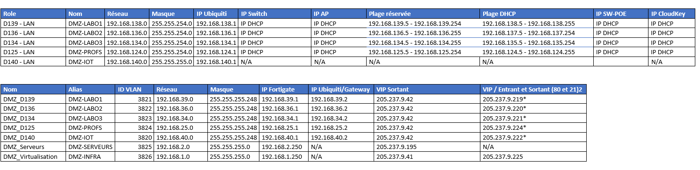

# 🐳 Docker Network

# Un peu de plaisir avec les réseaux Docker

<p align="center">
    
</p>

-----

### 1 – Mise en situation

Lorsque nous lançons un conteneur à partir d’une image, le moteur d’exécution ‘docker’ attribue à cette instance d’image, un réseau privé, par défaut, le réseau nommé ‘***bridge***’.

Par réseau privé, nous entendons une adresse IP et un masque de sous-réseau qui n’ont aucun lien avec les paramètres réseau de l’ordinateur hôte.

**Par exemple**, voici les spécifications de ma station de travail:

```bash
alain@srv02:~$ ip a
1: lo: <LOOPBACK,UP,LOWER_UP> mtu 65536 qdisc noqueue state UNKNOWN group default qlen 1000
    link/loopback 00:00:00:00:00:00 brd 00:00:00:00:00:00
    inet 127.0.0.1/8 scope host lo
       valid_lft forever preferred_lft forever
    inet6 ::1/128 scope host 
       valid_lft forever preferred_lft forever
2: ens32: <BROADCAST,MULTICAST,UP,LOWER_UP> mtu 1500 qdisc fq_codel state UP group default qlen 1000
    link/ether 00:0c:29:d1:62:6c brd ff:ff:ff:ff:ff:ff
    inet 192.168.2.152/24 brd 192.168.2.255 scope global dynamic ens32
       valid_lft 559772sec preferred_lft 559772sec
```

> **NOTE** : L’adresse de ma station est **192.168.2.152** dans un réseau de classe ‘**C**’ -\> **/24**.

Voyons maintenant les paramètres d’une instance d’[Alpine](https://hub.docker.com/_/alpine):

#### Action 1.0 – Lancer un conteneur `alpine` de façon éphémère (`--rm`)

```bash
$ docker run -it --rm alpine

$ ip a
1: lo: <LOOPBACK,UP,LOWER_UP> mtu 65536 qdisc noqueue state UNKNOWN qlen 1000
    link/loopback 00:00:00:00:00:00 brd 00:00:00:00:00:00
    inet 127.0.0.1/8 scope host lo
       valid_lft forever preferred_lft forever
56: eth0@if57: <BROADCAST,MULTICAST,UP,LOWER_UP,M-DOWN> mtu 1500 qdisc noqueue state UP 
    link/ether 02:42:ac:11:00:02 brd ff:ff:ff:ff:ff:ff
    inet 172.17.0.2/16 brd 172.17.255.255 scope global eth0
       valid_lft forever preferred_lft forever
```

> **NOTE** : L’adresse **IP** de l’instance est **172.17.0.2** dans un réseau de classe ‘**B**’ -\> **/16**.

Comment expliquer ces paramètres ?

#### Action 1.1 – Afficher la liste des réseaux docker: `docker network ls`

```bash
$ docker network ls
NETWORK ID     NAME      DRIVER    SCOPE
00a924a413f9   bridge    bridge    local
69c859ba51de   host      host      local
25167b5edb8a   none      null      local
```

#### Action 1.2 – Afficher la configuration du réseau ‘***bridge***’: `docker network inspect bridge`

```json
$ docker network inspect bridge
[
    {
        "Name": "bridge",
        "Id": "00a924a413f9411d6c7a93ff5effb10663a86a82f1c2e2836dc2d4e7f5a33a75",
        "Created": "2021-01-27T14:51:05.825275186Z",
        "Scope": "local",
        "Driver": "bridge",
        "EnableIPv6": false,
        "IPAM": {
            "Driver": "default",
            "Options": null,
            "Config": [
                {
                    "Subnet": "172.17.0.0/16"
                }
            ]
        },
        "Internal": false,
        "Attachable": false,
        "Ingress": false,
        "ConfigFrom": {
            "Network": ""
        },
        "ConfigOnly": false,
        "Containers": {},
        "Options": {
            "com.docker.network.bridge.default_bridge": "true",
            "com.docker.network.bridge.enable_icc": "true",
            "com.docker.network.bridge.enable_ip_masquerade": "true",
            "com.docker.network.bridge.host_binding_ipv4": "0.0.0.0",
            "com.docker.network.bridge.name": "docker0",
            "com.docker.network.driver.mtu": "1500"
        },
        "Labels": {}
    }
]
```

#### Action 1.3 – Créer deux (2) `alpine` et explorer les paramètres réseaux

```bash
docker run -it -d --name serveur01 alpine
docker run -it -d --name serveur02 alpine
```

#### Action 1.4 – Afficher la configuration du réseau ‘***bridge***’: `docker network inspect bridge`

```json
"Containers": {
   "65bfb76d6d23817abfd09a9cbd7ef6131fd3c9386bed66f9570ee9f9b4f5c0c9": {
       "Name": "serveur01",
       "EndpointID": "2e2fb06cb65954ce00de9eea6773f6f882a3786224c80c5846f67ae35236905c",
       "MacAddress": "02:42:ac:11:00:02",
       "IPv4Address": "172.17.0.2/16",
       "IPv6Address": ""
    },
    "de8a9686b9cba97e3f9b4880a7e3619c4d4257049d2851c03a39b078a15b0f7b": {
       "Name": "serveur02",
       "EndpointID": "2e769ffc9bff7275a57f76889df5724dda8ee223da8f5f5ed8f930ef48f36d39",
       "MacAddress": "02:42:ac:11:00:03",
       "IPv4Address": "172.17.0.3/16",
       "IPv6Address": ""
    }
}
```

> **Note:** Voici un [article](https://macaddress.io/faq/how-to-recognise-a-docker-container-by-its-mac-address) sur la structure des ‘Mac Address’ des conteneurs docker.

#### Action 1.5 – Tester la connectivité IP entre les conteneurs d’un même réseau

```bash
$ docker exec -it serveur01 /bin/sh
/ # ip a

188: eth0@if189: <BROADCAST,MULTICAST,UP,LOWER_UP,M-DOWN> mtu 1500 qdisc noqueue state UP 
    link/ether 02:42:ac:11:00:02 brd ff:ff:ff:ff:ff:ff
    inet 172.17.0.2/16 brd 172.17.255.255 scope global eth0
```

#### Action 1.5.2 – ping du serveur02 en utilisant l’adresse IP

```bash
/ # ping 172.17.0.3

PING 172.17.0.3 (172.17.0.3): 56 data bytes
64 bytes from 172.17.0.3: seq=0 ttl=64 time=0.219 ms
64 bytes from 172.17.0.3: seq=1 ttl=64 time=0.234 ms
64 bytes from 172.17.0.3: seq=2 ttl=64 time=0.133 ms
--- 172.17.0.3 ping statistics ---
3 packets transmitted, 3 packets received, 0% packet loss
round-trip min/avg/max = 0.133/0.195/0.234 ms
```

> **Note:** Nous avons utilisé l’adresse dans la commande précédente. Il est aussi possible d’utiliser le nom du conteneur. Docker maintient un service de nom ‘DNS’ à l’intérieur de ses réseaux.
>
> Testons cette fonctionnalité.

#### Action 1.5.3 – ping du serveur02 en utilisant son nom de conteneur

```bash
/ # ping serveur02
ping: bad address 'serveur02'
```

> **SURPRISE:** Cela ne semble pas fonctionner, pourquoi? Pour que docker active un service de noms de domaines, il faut **créer des réseaux privés**.

#### Action 1.6 – Créer un réseau docker

```bash
docker network create reseau01

docker network ls

NETWORK ID     NAME       DRIVER    SCOPE
6eca92520b8e   bridge     bridge    local
5b64d4b7c1d2   host       host      local
786951a15a98   none       null      local
31bdc39ceb12   reseau01   bridge    local
```

> **NOTE** : Docker propose [différents types de réseaux](https://docs.docker.com/network/), sous forme de pilotes (drivers). Il est possible de préciser le pilote désiré à la création du réseau avec l’option ***--driver***. En cas d’omission, le pilote ‘***bridge***’ sera utilisé.
>
> Exemple,
>
> ```bash
> docker network create --driver bridge alpine-net
> ```

#### Action 1.7 – Afficher la configuration du nouveau réseau docker

```json
docker network inspect reseau01

[
    {
        "Name": "reseau01",
        "Id": "31bdc39ceb129..."
        "Driver": "bridge",
        "IPAM": {
            "Driver": "default",
            "Config": [
                {
                    "Subnet": "172.21.0.0/16",
                    "Gateway": "172.21.0.1"
```

#### Action 1.8 – Créer deux (2) `alpine` associés au nouveau réseau: `docker run --network`

```bash
docker run -it -d --name serveur03 --network reseau01 alpine
docker run -it -d --name serveur04 --network reseau01 alpine

docker network inspect reseau01
```

```json
    {
        "Name": "reseau01",
        "Id": "31bdc39ceb129eb1",
        "Created": "2021-02-11T15:54:40.0712897Z",
         "IPAM": {
            "Config": [
                {
                    "Subnet": "172.21.0.0/16",
                    "Gateway": "172.21.0.1"
...  
      "Containers": {
            "b9f491e958b52a152c4a4ed5b5b"
                "Name": "serveur03",
                "EndpointID": "b683ff477492183274",
                "MacAddress": "02:42:ac:15:00:02",
                "IPv4Address": "172.21.0.2/16",
                "IPv6Address": ""
            },
            "c5c6c10782466065a4b400732f0": {
                "Name": "serveur04",
                "EndpointID": "bc6e1f000f656ca8a0a5",
                "MacAddress": "02:42:ac:15:00:03",
                "IPv4Address": "172.21.0.3/16",
                "IPv6Address": ""
            }
        },
```

#### Action 1.9 – ping du ***serveur03*** en utilisant son nom de conteneur – **Prise 2**

```bash
docker exec -it serveur03 /bin/sh
/ # ping serveur04

PING serveur04 (172.21.0.3): 56 data bytes
64 bytes from 172.21.0.3: seq=0 ttl=64 time=0.379 ms
--- serveur04 ping statistics ---
2 packets transmitted, 2 packets received, 0% packet loss
round-trip min/avg/max = 0.169/0.274/0.379 ms
```

> **VOILÀ\!:** Grâce au nouveau réseau, il est possible d’envoyer des requêtes IP en utilisant le nom du conteneur.
>
> Référence: [Docker Network Create](https://docs.docker.com/engine/reference/commandline/network_create/)

-----

## 2 – Réseau de type ‘host’

Ce type d’interface réseau va utiliser directement la carte et les paramètres réseau de l’hôte.

Par exemple,

```bash
docker run -d --name srv_websurlhote --rm --network host nginx
```

Remarquez qu’ici, nous n’avons pas utilisé le paramètre `-p xx:xx`. Le conteneur va utiliser l’interface réseau de l’hôte et le port exposé du conteneur sera accessible directement via l’hôte.

Par exemple:

```
http://localhost

# Au besoin. pour installer la commande ip sur Ubuntu:
# apt install iproute2 -y 

$ ip a
 ens33: <BROADCAST,MULTICAST,UP,LOWER_UP> mtu 1500 qdisc fq_codel state UP group default qlen 1000
    link/ether 00:0c:29:7a:af:bc brd ff:ff:ff:ff:ff:ff
    altname enp2s1
    inet 192.168.2.32/24 brd 192.168.2.255 scope global dynamic noprefixroute ens33
       valid_lft 7059896sec preferred_lft 7059896sec
    inet6 fe80::20c:29ff:fe7a:afbc/64 scope link proto kernel_ll 
       valid_lft forever preferred_lft forever

NOTE: L'adresse IP du conteneur devrait être identique à l'adresse de l'hôte.
```

> **NOTE**: Cette fonctionnalité n’est pas disponible sous **Windows** ou **MacOS**, seulement sur **Linux**.

-----

Voir les réseaux disponibles sous Windows: [Windows 10 – place container directly on local network? – Docker Desktop for Windows – Docker Community Forums](https://forums.docker.com/t/windows-10-place-container-directly-on-local-network/30247)

<p align="center">
    
</p>
-----

## 3 – Réseau de type MACVLan

# Créer un réseau Macvlan sous Docker

Le réseau **macvlan** permet à vos conteneurs Docker d'obtenir des adresses IP directement sur votre réseau physique, comme s'ils étaient des machines physiques distinctes.

## Prérequis

Avant de commencer, vous devez connaître :
- L'interface réseau de votre hôte (ex: `eth0`, `enp0s3`)
- La plage d'adresses IP de votre réseau local
- La passerelle de votre réseau

Pour trouver ces informations :

```bash
# Afficher les interfaces réseau
ip addr show

# Afficher la configuration réseau
ip route
```

## Création d'un réseau Macvlan

### Exemple de base

```bash
docker network create -d macvlan \
  --subnet=192.168.1.0/24 \
  --gateway=192.168.1.1 \
  -o parent=eth0 \
  macvlan_net
```

**Explication des paramètres :**
- `-d macvlan` : spécifie le driver macvlan
- `--subnet` : la plage d'adresses IP de votre réseau
- `--gateway` : l'adresse IP de votre routeur/passerelle
- `-o parent=eth0` : l'interface physique parent
- `macvlan_net` : le nom du réseau

### Avec plage IP réservée

Il est recommandé de réserver une plage d'IP pour Docker afin d'éviter les conflits :

```bash
docker network create -d macvlan \
  --subnet=192.168.1.0/24 \
  --gateway=192.168.1.1 \
  --ip-range=192.168.1.192/27 \
  -o parent=eth0 \
  macvlan_net
```

Ici, `--ip-range=192.168.1.192/27` réserve les adresses de 192.168.1.192 à 192.168.1.223 pour Docker.

**NOTE** Cette étape est importante car les adresses attribuées vont entrer en conflit avec les appareils connectés au réseau local.

## Utilisation avec des conteneurs

### Lancer un conteneur avec une IP automatique

```bash
docker run -d --name nginx_macvlan \
  --network macvlan_net \
  nginx
```

### Lancer un conteneur avec une IP spécifique

```bash
docker run -d --name nginx_macvlan \
  --network macvlan_net \
  --ip=192.168.1.200 \
  nginx
```

### Exemple avec plusieurs conteneurs

```bash
# Serveur web
docker run -d --name web \
  --network macvlan_net \
  --ip=192.168.1.200 \
  nginx

# Base de données
docker run -d --name db \
  --network macvlan_net \
  --ip=192.168.1.201 \
  -e MYSQL_ROOT_PASSWORD=motdepasse \
  mysql:8.0

# Application
docker run -d --name app \
  --network macvlan_net \
  --ip=192.168.1.202 \
  monapp:latest
```

## Accéder aux conteneurs depuis l'hôte

Par défaut, l'hôte Docker **ne peut pas** communiquer directement avec les conteneurs en macvlan. Pour résoudre ce problème, créez une interface macvlan sur l'hôte :

```bash
# Créer une interface macvlan sur l'hôte
sudo ip link add macvlan_host link eth0 type macvlan mode bridge

# Assigner une IP à cette interface
sudo ip addr add 192.168.1.254/32 dev macvlan_host

# Activer l'interface
sudo ip link set macvlan_host up

# Ajouter une route vers les conteneurs
sudo ip route add 192.168.1.192/27 dev macvlan_host
```

## Vérification et diagnostic

```bash
# Lister les réseaux Docker
docker network ls

# Inspecter le réseau macvlan
docker network inspect macvlan_net

# Vérifier l'IP d'un conteneur
docker inspect -f '{{range .NetworkSettings.Networks}}{{.IPAddress}}{{end}}' nginx_macvlan

# Tester la connectivité depuis un autre appareil du réseau
ping 192.168.1.200
```

## Exemple pratique complet

Voici un exemple de configuration complète pour un environnement web :

```bash
# 1. Créer le réseau macvlan
docker network create -d macvlan \
  --subnet=192.168.1.0/24 \
  --gateway=192.168.1.1 \
  --ip-range=192.168.1.192/27 \
  -o parent=eth0 \
  prod_network

# 2. Lancer les services
docker run -d --name reverse_proxy \
  --network prod_network \
  --ip=192.168.1.200 \
  -v /etc/nginx:/etc/nginx:ro \
  nginx

docker run -d --name webapp \
  --network prod_network \
  --ip=192.168.1.201 \
  node:18-alpine

docker run -d --name database \
  --network prod_network \
  --ip=192.168.1.202 \
  -e POSTGRES_PASSWORD=secret \
  postgres:15

# 3. Vérifier que tout fonctionne
docker ps
docker network inspect prod_network
```

## Avantages et limitations

**Avantages :**
- Les conteneurs sont accessibles directement depuis le réseau local sans port mapping
- Performance optimale (pas de NAT)
- Idéal pour intégrer Docker dans une infrastructure existante

**Limitations :**
- L'hôte ne peut pas communiquer directement avec les conteneurs (nécessite une interface supplémentaire)
- Nécessite le mode promiscuous sur certaines interfaces réseau
- Ne fonctionne pas sur tous les environnements (notamment certains clouds publics)

Le réseau macvlan est particulièrement utile lorsque vous voulez que vos conteneurs se comportent comme des machines physiques sur votre réseau local.

---

```text
# 1 - Exemple sous Windows

docker network create -d macvlan --subnet 192.168.124.0/23 --gateway=192.168.124.1 -o parent="Ethernet 4"

# Liste des interfaces réseau sous Windows:

netsh interface show interface

État admin    État          Type            Nom de l'interface
-------------------------------------------------------------------------
Activé         Connecté       Dédié            VirtualBox Host-Only Network
Activé         Connecté       Dédié            VirtualBox Host-Only Network #2
Activé         Connecté       Dédié            Ethernet 2
Activé         Connecté       Dédié            Ethernet 3
Activé         Connecté       Dédié            Ethernet 4  (192.168.124.0)
Activé         Déconnecté     Dédié            Wi-Fi 2
Activé         Connecté       Dédié            vEthernet (Default Switch)
Activé         Connecté       Dédié            vEthernet (WSL)

docker run -d --name srv_macvlan --rm --network macvlan --ip=192.168.125.100 nginx
```

-----

**Exemple sous Linux**

```text
# 1
$ ip a

2: ens37: <BROADCAST,MULTICAST,UP,LOWER_UP> mtu 1500 qdisc fq_codel state UP group default qlen 1000
    link/ether 00:0c:29:6d:e1:4d brd ff:ff:ff:ff:ff:ff
    altname enp2s5
    inet 192.168.2.111/24 brd 192.168.2.255 scope global noprefixroute 

# 2
$ docker network create -d macvlan --subnet 192.168.2.0/24 --gateway=192.168.2.1 -o parent="ens37" vlan01

# 3
$ docker run -d --name nginx_macvlan --rm --network vlan01 --ip=192.168.2.88 nginx

# 4
# Le serveur WEB Nginx devrait être accessible à partir du réseau local.
http://192.168.2.88
```


## Crédits

*Document rédigé par Alain Boudreault © 2021-2026*  
*Version 2025.12.03.1*  
*Site par ve2cuy*