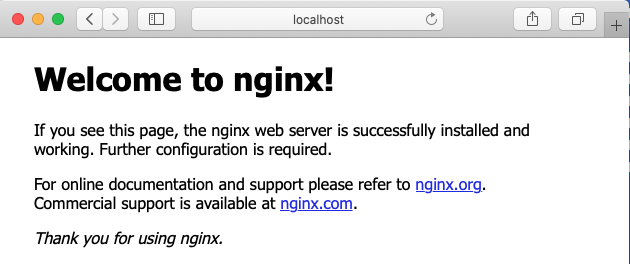
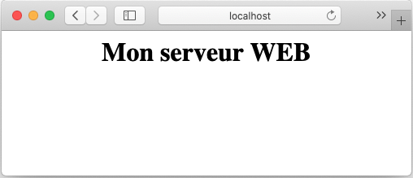

# 🐳 Docker – Commandes de base


<p align="center">
    
</p>

## Introduction

Après avoir installé Docker, nous aurons accès à la commande 'docker' à partir du 'shell' du système d'exploitation du poste de l'installation.

Cette commande nous permettra de gérer l'ensemble des ressources disponibles sous Docker.

Si Docker est installé sur une machine distante, par exemple un serveur Linux, il sera possible d'y avoir accès suite à une connexion 'ssh' à partir d'un terminal ou en utilisant l'extension 'ssh' de VS Code.


#### Ouvrir un terminal vers la station possédant une installation de Docker.

```bash
$ ssh username@adresse_ip <mot de passe ou clé tls>

# Sous Code, utiliser l'option: Open a remote window.
```

-----

## 1.0 – Accès à l'aide intégrée : `docker --help`

```bash
$ docker --help
Usage:  docker [OPTIONS] COMMAND

Options:
      --config string      Location of client config files (default "/Users/alain/.docker")
  -c, --context string     Name of the context to use to connect to the daemon (...)
  -D, --debug              Enable debug mode
...

Management Commands:
  container   Manage containers
  image       Manage images
...

Commands:
  attach      Attach local standard input, output, and error streams to a running container
  build       Build an image from a Dockerfile
  commit      Create a new image from a container's changes
  cp          Copy files/folders between a container and the local filesystem
  create      Create a new container
  diff        Inspect changes to files or directories on a container's filesystem
  events      Get real time events from the server
  exec        Run a command in a running container
...
```


> **💡Note :** Sous Linux, si vous obtenez un message de permission refusée :

```bash
# Exemple d'erreur:
$ docker run hello-world
docker: Got permission denied while trying to connect to the Docker daemon socket at unix:///var/run/docker.sock: Post http://%2Fvar%2Frun%2Fdocker.sock/v1.40/containers/create: dial unix /var/run/docker.sock: connect: permission denied.
See 'docker run --help'.

---
Solution:
sudo groupadd docker
sudo usermod -aG docker $USER
sudo chmod 666 /var/run/docker.sock
```

-----

## 1.1 – Aide sur une commande spécifique : `docker <cmd> --help`

**Exemple : `docker ps --help`**

```bash
docker ps --help
Usage:  docker ps [OPTIONS]
List containers

Options:
  -a, --all             Show all containers (default shows just running)
  -f, --filter filter   Filter output based on conditions provided
      --format string   Pretty-print containers using a Go template
  -n, --last int        Show n last created containers (includes all states) (default -1)
  -l, --latest          Show the latest created container (includes all states)
      --no-trunc        Don't truncate output
  -q, --quiet           Only display container IDs
  -s, --size            Display total file sizes
```
---

**👉 Action – Afficher l'aide de la commande 'run'**

**❓Question – À quoi servent les options `-i -t` et `-d` ?**

---

#### 💡Problème possible avec la console interactive (`-it`) sous `git-bash`

[https://willi.am/blog/2016/08/08/docker-for-windows-interactive-sessions-in-mintty-git-bash/](https://willi.am/blog/2016/08/08/docker-for-windows-interactive-sessions-in-mintty-git-bash/)

**Solution :**

```bash
$ winpty docker exec -it alpine sh
```

-----

## 2.0 – Types de commandes Docker Engine

Docker Engine propose deux types de commandes :

1.  **Commandes de gestion** (ex: `docker container ls`)
2.  **Commandes directes** (ex: `docker ps`)

### 2.1 – Obtenir l'aide d'une commande de gestion : `docker cmdGestion --help`

**Exemple : `docker container --help`**

```bash
$ docker container --help
Usage:  docker container COMMAND
Manage containers

Commands:
  attach      Attach local standard input, output, and error streams to a running container
  commit      Create a new image from a container's changes
  cp          Copy files/folders between a container and the local filesystem
  create      Create a new container
  exec        Run a command in a running container
  ls          List containers
  rm          Remove one or more containers
  run         Run a command in a new container
  start       Start one or more stopped containers
...
Run 'docker container COMMAND --help' for more information on a command.
```

----

** 2.1.1 - Action – Exécuter les commandes suivantes :**

```bash
$ docker run hello-world
$ docker run alpine
$ docker run -it -d alpine
# Attention, -it et -d sont des paramètres de 'run', ils ne peuvent pas être placés ailleurs dans l'expression.
````

> **Note :** 'alpine' est une image populaire servant de base à une image personnalisée en raison de sa très petite taille.


----

### 2.2 – Obtenir la liste des images locales : `docker images`

```bash
$ docker images
REPOSITORY      TAG                 IMAGE ID            CREATED             SIZE
alpine          latest              7731472c3f2a        10 days ago         5.61MB
hello-world     latest              bf756fb1ae65        12 months ago       13.3kB
```

### 2.3 – Obtenir la liste des conteneurs en exécution : `docker ps`

```bash
$ docker ps
CONTAINER ID        IMAGE               COMMAND             CREATED             STATUS              PORTS               NAMES
c8026675b9b7        alpine              "/bin/sh"           48 minutes ago      Up 48 minutes                           intelligent_noether
```

### 2.4 – Obtenir la liste de tous les conteneurs – incluant ceux qui sont terminés : `docker ps -a`

```bash
$ docker ps -a
CONTAINER ID        IMAGE               COMMAND             CREATED             STATUS                      PORTS               NAMES
c8026675b9b7        alpine              "/bin/sh"           49 minutes ago      Up 49 minutes                               intelligent_noether
b321afb1ea0f        alpine              "-it -d"            49 minutes ago      Created                                     practical_lamarr
1114bbe1af61        alpine              "/bin/sh"           49 minutes ago      Exited (0) 49 minutes ago                   dazzling_zhukovsky
d09c5b00adca        hello-world         "/hello"            50 minutes ago      Exited (0) 50 minutes ago                   charming_mcnulty
```

#### 2.4.1 – Rechercher des images disponibles sur 'docker hub' : `docker search <expression>`

**Exemple : `docker search cowsay`**

```bash
$ docker search cowsay
NAME                     DESCRIPTION                                     STARS               OFFICIAL            AUTOMATED
lherrera/cowsay                                                          4
grycap/cowsay            Alpine-less Cowsay (with Fortune)               2                                       [OK]
...
```

```bash
 $ docker search alainboudreault
NAME                                DESCRIPTION                                     STARS     OFFICIAL
alainboudreault/phpweb              Roule un petit script php qui identifie le h…   0         
alainboudreault/superminou                                                          0         
alainboudreault/docker-hub-github   Lorem ipsum ...                                 0         
alainboudreault/420-4d4-mercredi    Premier pas avec hub.docker.com                 0         
alainboudreault/labo-01             semaine 02                                      0         
alainboudreault/bonjour420                                                          0         
alainboudreault/momo-dit            Exemple d'utilisation de variables d'environ…   0         
alainboudreault/unserveurweb        Mon premier test push avec docker-hub           0         
...

```
---

#### 2.4.2 – Obtenir une image à partir d'un dépôt : `docker pull éditeur/image`

**Exemple : `docker pull lherrera/cowsay`**

```bash
$ docker pull lherrera/cowsay
Using default tag: latest
latest: Pulling from lherrera/cowsay
...
Status: Downloaded newer image for lherrera/cowsay:latest

# Afficher les images locales
$ docker images
REPOSITORY          TAG                 IMAGE ID            CREATED             SIZE
alpine              latest              7731472c3f2a        10 days ago         5.61MB
hello-world         latest              bf756fb1ae65        12 months ago       13.3kB
lherrera/cowsay     latest              47e12946765b        4 years ago         186MB
```

> **Note :** Lorsque nous téléchargeons une image, nous obtenons toujours la dernière version (ex. : `alpine:latest`).

#### 2.4.3 – Démarrer un conteneur (instance d'image) : `docker run ID`

```bash
docker run 47e12946765b
________________________________________
/ No group of professionals meets except \
| to conspire against the public at |
| large. |
\ -- Mark Twain /
----------------------------------------
       \ ^__^
        \ (oo)\_______
          (__)\       )\/\
              ||----w |
              ||     ||
```

Un autre exemple:

```bash
$ docker run -e MESSAGE="Bonjour le monde!"  alainboudreault/momo-dit

-----------------------------------------------------
Momo dit:  Bonjour le monde!
-----------------------------------------------------
```


#### 2.4.4 – Effacer un conteneur : `docker rm ID`

```bash
# 1 - Identifier le conteneur
$ docker ps -a
CONTAINER ID        IMAGE               COMMAND             CREATED             STATUS                      PORTS               NAMES
a27294467a25        47e12946765b        "/entrypoint.sh"    About a minute ago  Exited (0) About a minute ago elegant_gauss

# 2 - Effacer le conteneur
$ docker rm a27294467a25
```

#### 2.4.5 – Effacer une image : `docker rmi ID`

```bash
# 1 - Obtenir l'image ID
$ docker images
REPOSITORY          TAG                 IMAGE ID            CREATED             SIZE
...
lherrera/cowsay     latest              47e12946765b        4 years ago         186MB

# 2 - Effacer l'image
$ docker rmi 47e12946765b
Untagged: lherrera/cowsay:latest
...
Deleted: sha256:47e12946765b355fb29cdd14f54e78a05d24cb5d68afc1e0e92cd4a0243a1b1a
...
```

> **💡Note :** S'il existe des instances 'conteneurs' de cette image, il faudra effacer les conteneurs avant ou bien utiliser l'option `-f` pour forcer la suppression de l'image.

### 2.5 – Redémarrer un conteneur : `docker restart ID`

```bash
# Voici un conteneur terminé:
CONTAINER ID        IMAGE               COMMAND             CREATED             STATUS                      PORTS               NAMES
d09c5b00adca        hello-world         "/hello"            50 minutes ago      Exited (0) 50 minutes ago                   charming_mcnulty

# Il peut-être redémarré à partir de son ID
$docker restart d09c5b00adca$ 

# Ou, en utilisant le nom du conteneur: 
$ docker restart charming_mcnulty
```

### 2.6 – Démarrer un conteneur en mode terminal (`-t`) interactif (`-i`) : `docker run -it image`

```bash
$ docker run -it alpine
/ # ls
bin  dev  etc  home  lib  media  mnt  opt  proc  root  run  sbin  srv  sys  tmp  usr  var
/ #
```

> **💡Note :** la commande `exit` va quitter et **terminer** le conteneur.

### 2.7 – S'attacher à un conteneur en cours d'exécution : `docker attach ID`

Pour se connecter à un conteneur démarré en arrière-plan (`-it -d`), utilisez `docker attach ID/OU_NOM`.

```bash
$ docker ps
CONTAINER ID        IMAGE               COMMAND             CREATED             STATUS              PORTS               NAMES
c8026675b9b7        alpine              "/bin/sh"           About an hour ago   Up About an hour                        intelligent_noether

$ docker attach intelligent_noether
/ # pwd
/
/ # mkdir 420-4C4
/ # cd 420-4C4/
/420-4C4 # touch je-suis-passé-par-ici.txt
/420-4C4 # exit
$
```

> **💡Note :** La commande `exit` a provoqué l'arrêt du conteneur.

### 2.8 – Redémarrer le conteneur précédent : `docker restart ID`

```bash
$ docker ps -a
CONTAINER ID        IMAGE               COMMAND             CREATED             STATUS                      PORTS               NAMES
...
c8026675b9b7        alpine              "/bin/sh"           2 hours ago         Exited (0) 3 minutes ago                    intelligent_noether

$ docker restart c8
$ docker attach c8
/ # ls -l
total 60
drwxr-xr-x    2 root     root          4096 Jan 25 18:44 420-4C4
...
```

> **💡Note :** Il n'est pas nécessaire de fournir tout le numéro d'ID dans une commande. Seulement un nombre suffisant de caractères pour rendre l'ID unique.

### 2.9 – Quitter un conteneur sans provoquer son arrêt : Séquence **CTRL P + Q**

```bash
# CTRL P + Q - permet de quitter sans arrêter le conteneur
/ # read escape sequence
$ docker ps
CONTAINER ID        IMAGE               COMMAND             CREATED             STATUS              PORTS               NAMES
c8026675b9b7        alpine              "/bin/sh"           2 hours ago         Up 3 minutes                            intelligent_noether
$
```

### 2.10 – Arrêter un conteneur : `docker stop ID`

```bash
$ docker stop c8
c8
$ docker ps
CONTAINER ID        IMAGE               COMMAND             CREATED             STATUS              PORTS               NAMES
$
```

### 2.11 – Nommer un conteneur : `docker run --name`

```bash
$ docker run -it -d --name monAlpine alpine
ce5bde565bfa21f9b3d4f0cf8dc386cfe193c6dabbcc25a676371b51a32ec7c3
$ docker ps
CONTAINER ID        IMAGE               COMMAND             CREATED             STATUS              PORTS               NAMES
ce5bde565bfa        alpine              "/bin/sh"           7 seconds ago       Up 6 seconds                            monAlpine
$ docker attach monAlpine
/ # CTRL P+Q
```

### 2.12 – Renommer un conteneur : `docker rename nom/ID nouveauNom`

```bash
$ docker ps
CONTAINER ID        IMAGE               COMMAND             CREATED             STATUS              PORTS               NAMES
ce5bde565bfa        alpine              "/bin/sh"           7 seconds ago       Up 6 seconds                            monAlpine
$ docker rename monAlpine test
$ docker ps
CONTAINER ID        IMAGE               COMMAND             CREATED             STATUS              PORTS               NAMES
ce5bde565bfa        alpine              "/bin/sh"           4 minutes ago       Up 4 minutes                            test
```

### 2.13 – Effacer tous les conteneurs et toutes les images

Voici comment réinitialiser à zéro votre installation de docker :

> 🛑 DANGER : CETTE COMMANDE EFFACE AUSSI LES IMAGES DE MINIKUBE***

**Commande pour Linux/macOS :**

```bash
docker container stop $(docker container ls -aq) && docker system prune -af --volumes
```

**Commande pour PowerShell :**

```powershell
docker container stop $(docker container ls -aq) ; docker system prune -af --volumes
```

-----

## 3 – Notions de port IP

Plusieurs images offrent des services via le protocol **TCP/IP**. Par défaut, le réseau du conteneur est isolé, mais il est possible d'établir un lien (**BIND**) entre le réseau du conteneur et l'ordinateur hôte.

### 3.1 – Obtenir l'image du serveur web **nginx**  

**Téléchargement de l'image :**

```bash
$ docker pull nginx
...
Status: Downloaded newer image for nginx:latest
docker.io/library/nginx:latest
```

### 3.2 – Créer un conteneur avec un lien sur le port IP 80 : `docker run -p P-host:P-conteneur`

**Lancer le serveur Web sur le port `8080` de l'ordinateur hôte :**

```bash
$ docker run -it -d -p 8080:80 --name monServeurWeb nginx
eb66bdef2f73caf6ed04e17f132d613a84f9fa15163b074d27fc3a93cbc4c4b3

# Afficher les conteneurs actifs
$ docker ps
CONTAINER ID        IMAGE               COMMAND                  CREATED             STATUS              PORTS                   NAMES
eb66bdef2f73        nginx               "/docker-entrypoint.…"   39 seconds ago      Up 38 seconds       0.0.0.0:8080->80/tcp    monServeurWeb
```

### 3.3 – Vérifier le fonctionnement du serveur web : `localhost:8080`
<p align="center">
    
</p>

### 3.4 – Consultation de la documentation de l'image 'nginx'

[https://hub.docker.com/\_/nginx](https://hub.docker.com/_/nginx)

Le répertoire racine du site web est localisé dans :
`/usr/share/nginx/html`

### 3.5 – Modifier le contenu : `docker exec`


```bash
# 1 - Connexion au shell du conteneur nginx
$ docker exec -it monServeurWeb /bin/bash
root@eb66bdef2f73:/# cd /usr/share/nginx/html
root@eb66bdef2f73:/usr/share/nginx/html# ls
50x.html  index.html

# 2 - Créer un nouveau document html
$ echo "<center><h1>Mon serveur WEB</h1></center>" > index2.html
# Ou installer nano dans le conteneur:
$ apt update $$ apt install nano -y

# 3 - Tester dans le fureteur
```

<p align="center">
    
</p>

❓Question : Est-ce que quitter le 'shell' avec `exit` va terminer le conteneur?

>💡NOTE : la commande `attach` va exécuter le point d'entrée. Dans le cas de nginx, cela ne correspond pas à un 'shell'.

-----


# 3.6 – Laboratoire

1.  Créer un conteneur à partir de l'image d'apache disponible sur docker hub.
2.  Utiliser l'image officielle de 'The Apache HTTP Server Project'.
3.  Nommer votre conteneur **`WEBSRV`**.
4.  Utiliser le port local **`80`** pour la connexion au service web.
5.  Remplacer la page d'accueil d'apache par votre propre page personnalisée.
6.  Tester le nouveau service web.
  
-----

### 3.7 – Afficher les statistiques d'utilisation matériel des conteneurs: `docker container stats`

```bash
$ docker container stats
---------------------------------------------------------------------------
CONTAINER ID        NAME                CPU %               MEM USAGE / LIMIT   MEM %               NET I/O             BLOCK I/O           PIDS
eb66bdef2f73        monServeurWeb       0.00%               2.098MiB / 1.942GiB 0.11%               41.3kB / 24.1kB     65.5kB / 0B         2
CTRL+C pour quitter
```

### 3.8 – Afficher le journal (log) d'un conteneur : `docker logs ID|NAME`

```bash
$ docker logs monServeurWeb
/docker-entrypoint.sh: /docker-entrypoint.d/ is not empty, will attempt to perform configuration
...
/docker-entrypoint.sh: Configuration complete; ready for start up
172.17.0.1 - - [25/Jan/2021:20:41:47 +0000] "GET / HTTP/1.1" 200 612 "-" "Mozilla/5.0 (Macintosh; Intel Mac OS X 10_15_4) AppleWebKit/605.1.15 (...)" "-"
...
```

💡 NOTE: Ajouter l'option '-f' pour un affichage en continu

---

### 3.9 – Afficher le détail complet (json) d'un conteneur : `docker inspect ID|NAME`

```bash
$ docker inspect serveur-web 

$ docker inspect serveur-web | grep  "IPAddress"
    "IPAddress": "172.17.0.3",

 $ inspect serveur-web | grep  "Image"
    "Image": "sha256:325b00a35073d9aa1d3df16da8afbbae1ac7d824c505f7490cd5cdbb79d60f6d",
    "Image": "nginx:latest",
```

### 3.10 – Appliquer un filtre à une commande: `docker --filter`

```bash
$ docker container ls --filter "status=exited"

$ docker run -d --name "toto" --label "app=web-service" --label "environment=production" nginx:latest
$ docker container ls --filter "name=toto"
$ docker container ls --filter "label=environment=production"

# Afficher les conteneurs d'image de type x
$ docker ps -a --filter ancestor=nginx

#  Afficher avec un format personnalisé :
$ docker ps --filter ancestor=nginx --format 'table {{.ID}}\t{{.Names}}\t{{.Status}}\t{{.Ports}}'
```

-----

## Outils pour Docker

- [Portainer](https://www.portainer.io/resources/get-started)
- [Arcane](https://getarcane.app/)
- [LazyDocker](https://github.com/jesseduffield/lazydocker)

---

## Crédits

*Document rédigé par Alain Boudreault © 2021-2026*  
*Version 2025.12.10.1*  
*Site par ve2cuy*
