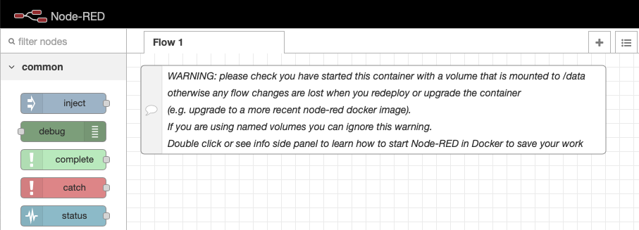
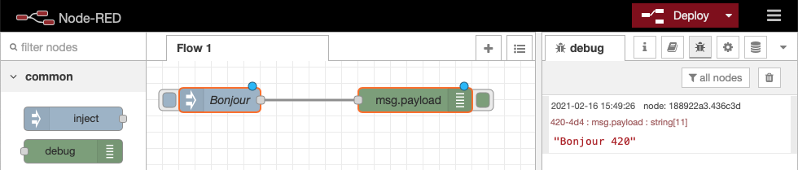
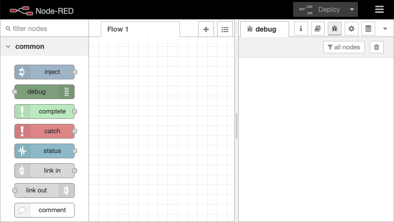
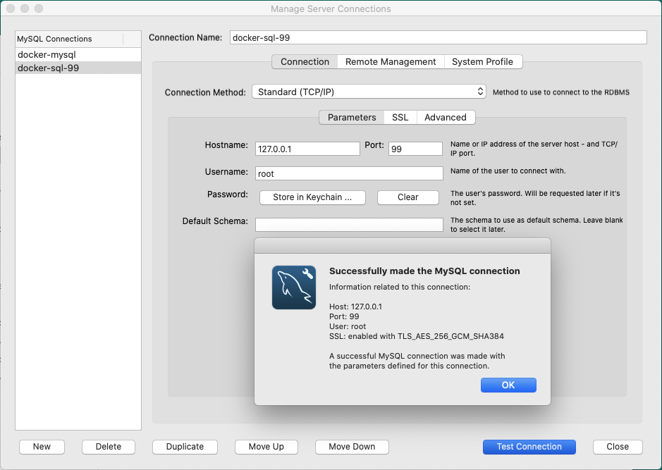
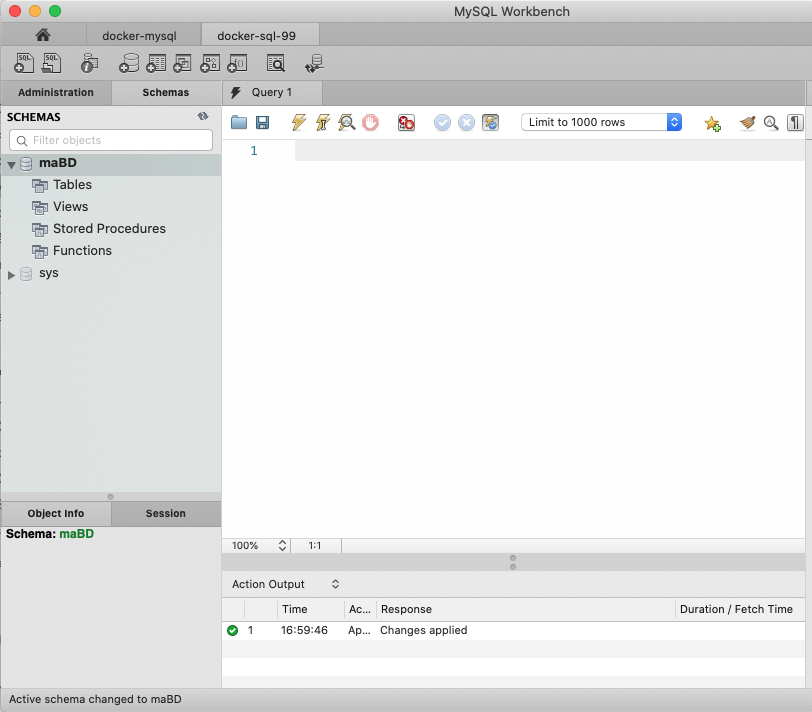
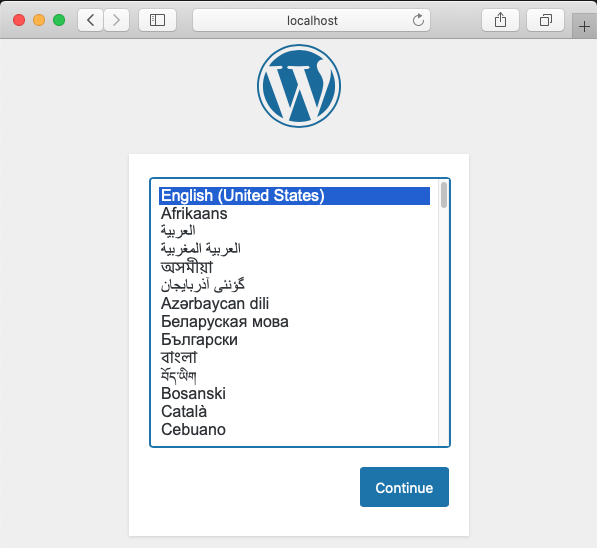
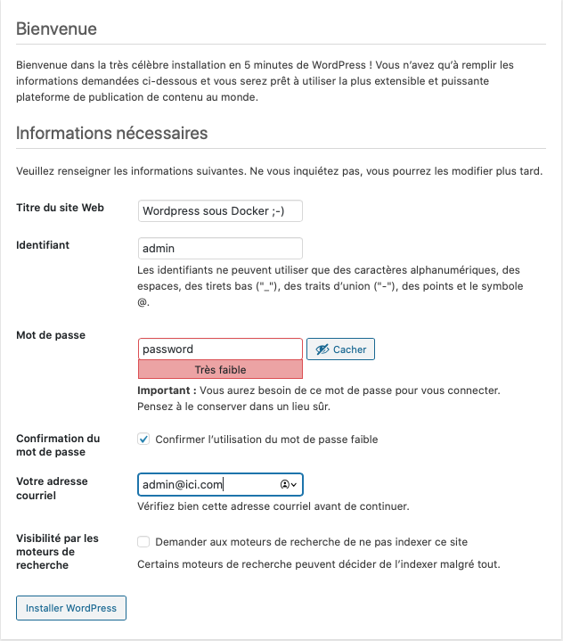
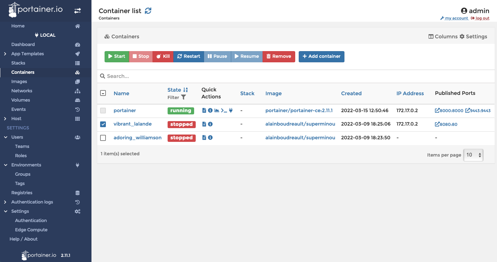

# 💾 Docker – Retour sur les fusions (bind) Expérimentation avec MySQL

Histoire de bien intégrer les notions acquises lors des ateliers précédents, nous allons revisiter :

## 👉 NOTE: Si ce laboratoire est réalisé sous Windows, ne pas utiliser `git-bash` pour les exemples des volumes -v.  Utiliser plutôt `PowerShell`.

<p align="center">
    
</p>

  * La notion de **liaison (bind) de volumes** : `docker run -v`
  * La notion de **liaison (bind) de port** : `docker run -p`
  * L'utilisation de la liaison de volumes et d'un port avec un conteneur **MySQL**.

-----

## Étape 1 – Liaison d'un dossier sur une `alpine`

### Action 1.1 – Créer le répertoire local

Dans un répertoire vide, créer :

```bash
mkdir mes-scripts-sh
```

> **Attention** : ne pas descendre dans le nouveau dossier.

### Action 1.2 – Ajouter le fichier `Momo-dit-v1.sh`

Ajouter au dossier `mes-scripts-sh` le fichier `momo-dit-v1.sh` :

```bash
#!/bin/sh
# Afficher à l'écran le contenu de la variable $1

if [ -z "$1" ]
then
  echo "Usage: momo-dit-v1 'un message'"
  exit 1
fi
echo "-----------------------------------------------------"
echo "Momo dit: " $1
echo "-----------------------------------------------------"
echo
```

---

### Mise en situation (Liaison absolue avec `$(pwd)`)

La prochaine étape consiste à démarrer une `alpine` et à **lier le dossier `mes-scripts-sh`** au nouveau conteneur.

Avec le cli-docker, il faut **TOUJOURS** utiliser l'**adressage absolu** lors de la liaison. Cela n'est pas très pratique, surtout si nous avons à travailler avec une structure profonde de dossiers. Heureusement, il est possible d'injecter le chemin du répertoire courant lors de la liaison (`-v`) de volumes.

### Action 1.3 – Afficher le chemin absolu

```bash
$ echo $(pwd)
/Users/alain/420-4D4
# Sous PowerShell, il faut utiliser la synthaxe suivante:
echo $PWD

$ echo "$(pwd)/mes-scripts-sh"
/Users/alain/420-4D4/mes-scripts-sh
```

### Action 1.4 – Démarrer un conteneur `alpine`, lié au dossier

```bash
docker run --rm -it --name momo-dit -v "$(pwd)/mes-scripts-sh/:/mes-scripts-sh" alpine
# Sous PowerShell, il faut utiliser la synthaxe suivante:
docker run --rm -it --name momo-dit -v "$PWD/mes-scripts-sh/:/mes-scripts-sh" alpine
```

Vérification dans le conteneur :

```
/ # ls mes-scripts-sh/
momo-dit-v1.sh
```

### Action 1.5 – Tester le script

```bash
/ # chmod a+x mes-scripts-sh/momo-dit-v1.sh
/ # mes-scripts-sh/momo-dit-v1.sh "Bonjour le monde!"
-----------------------------------------------------
Momo dit: Bonjour le monde!
-----------------------------------------------------
```

-----

## 2 – Fusion de ports et persistance (Node-RED)

### Étape 2 – Expérimentation avec `node-red`

**Node-RED** est un outil de développement basé sur des flux de programmation visuelle.

### Action 2.1 – Démarrer un conteneur `node-red` sur le port 80 (sans persistance)

```bash
docker run -it -d -p 80:1880 nodered/node-red
```

### Action 2.2 – Tester dans un fureteur

Tester l'accès : `http://localhost`

> **NOTE** : Remarquer le message d'avertissement '**WARNING**' (concernant l'absence de volume persistant).





### Action 2.2 – Ajouter deux nœuds dans node-red

> **Note :** À la sortie de node-red, notre schéma sera perdu.





### Action 2.3 – Arrêter et effacer le conteneur `node-red`

### Action 2.4 – Démarrer un conteneur `node-red` avec une fusion de volumes

```bash
# Créer un répertoire de travail pour node-red
$ mkdir node-red

# Démarrer node-red avec une fusion de volumes
docker run -it -d -p 80:1880 -v "$(pwd)/node-red/:/data" nodered/node-red
```





> **NOTE** : Remarquer il n'y a plus de message d'avertissement.

### Action 2.5 – Ajouter deux nœuds dans node-red (avec persistance)

### Action 2.6 – Arrêter, effacer et relancer le conteneur.

**QUESTION :** Est-ce que le schéma node-red de l'action 2.5 est disponible 🧐 ? (La réponse est **oui** grâce au volume lié.)

-----

## Étape 3 – Fun with MySQL (Persistance et Port)

### Pré-requis

  * Un client MySQL installé sur le poste de travail : [TablePlus](https://tableplus.com/windows), [MySQL Workbench](https://dev.mysql.com/downloads/workbench/)

Nous allons maintenant pousser un peu plus loin notre compréhension des liaisons de type **'volume'** et **'réseau'**.

### Action 3.1 – Créer un répertoire de liaison

Créer un répertoire local pour les bases de données de MySQL :

```bash
mkdir mysql
```

### Action 3.2 – Lancer un conteneur MySQL avec une liaison locale

Nous exposons le port **99** de l'hôte au port **3306** du conteneur et nous lions le dossier local `mysql` au répertoire de données (`/var/lib/mysql`) du conteneur.

```bash
docker run -p 99:3306 -e MYSQL_ROOT_PASSWORD=password --name maBD -v "$(pwd)/mysql:/var/lib/mysql" -d mysql
```

> **NOTE** : Le mot de passe pour root est **'password'** et le port de connexion est **'99'**.

---

### Action 3.3 – Connexion au SGBD MySQL

#### 3.3.1 – Connexion locale au SGBD MySQL avec le client `mysql` du conteneur

```bash
docker exec -it maBD mysql -uroot -ppassword
```

#### 3.3.2 – Connexion locale au SGBD MySQL, à partir d'une application de bureau

Utiliser l'application (ex: MySQL WorkBench) pour créer une nouvelle connexion en utilisant l'adresse `localhost` et le port **`99`**.





### Action 3.4 – Créer un nouveau schéma (BD)




---


### Laboratoire 3.5

1.  Créer une table `tbl_amis` (`nom varchar(30)`, `email varchar(30)`).
2.  Ajouter deux enregistrements.
3.  Afficher le contenu du dossier `mysql` (vous devriez voir les fichiers de la base de données créée).
4.  Arrêter, effacer et relancer le conteneur.

**QUESTION :** Est-ce que nous avons retrouvé la BD `'maBD'`? (La réponse est **oui** grâce au volume lié.)

#### Alternative (Lignes de commande)

```bash
$ docker exec -it maBD /bin/bash
/# mysql -uroot -ppassword

mysql> SHOW DATABASES;
+--------------------+
| Database           |
+--------------------+
| information_schema |
| maBD               |
| mysql              |
| performance_schema |
| sys                |
+--------------------+
mysql> CREATE DATABASE docker_sql_99;
mysql> USE docker_sql_99;
mysql> CREATE TABLE tbl_amis (nom VARCHAR(30), email VARCHAR(30));
mysql> SHOW TABLES;
+-------------------------+
| Tables_in_docker_sql_99 |
+-------------------------+
| tbl_amis                |
+-------------------------+
mysql> INSERT INTO tbl_amis (nom, email) VALUES ('Toto Binette', 'toto@me.com');
mysql> INSERT INTO tbl_amis (nom, email) VALUES ('Titi Binette', 'titi@me.com');
mysql> SELECT * FROM tbl_amis;
+--------------+-------------+
| nom          | email       |
+--------------+-------------+
| Toto Binette | toto@me.com |
| Titi Binette | titi@me.com |
+--------------+-------------+
2 rows in set (0.00 sec)
mysql> exit
```

-----

## 4 – Une image MySQL avec une BD personnalisée (Docker Compose)

### À partir d'un dossier vide

#### Action 4.0 – Créer les dossiers

```bash
mkdir BDInit
mkdir maBD
```

#### Action 4.1 – Créer le fichier d'initialisation SQL

Dans le dossier `BDInit`, créer le fichier `mabd-init.sql` :

```sql
/* Exemple d'un script d'initialisation d'un schéma de BD MySQL
   Fichier: DBInit/mabd-init.sql
   Auteur: Alain Boudreault
   Date: 2021.02.18
*/
CREATE DATABASE IF NOT EXISTS mabd;
CREATE USER bob;
-- select host, user from mysql.user;
GRANT ALL PRIVILEGES ON mabd.* TO 'bob'@'%' IDENTIFIED BY 'password';
GRANT ALL PRIVILEGES ON mabd.* TO 'bob'@'localhost' IDENTIFIED BY 'password';
USE mabd;
CREATE TABLE tbl_amis (nom VARCHAR(30), email VARCHAR(30));
INSERT INTO tbl_amis (nom, email) VALUES ('Toto Binette', 'toto@me.com');
INSERT INTO tbl_amis (nom, email) VALUES ('Titi Binette', 'titi@me.com');
-- FIN DU SCRIPT
```

#### Action 4.2 – Créer le fichier `docker-comp-init-bd.yml`, dans le dossier de l'exercice.

Ce fichier utilise le paramètre `command` avec l'option `--init-file` pour exécuter le script SQL au démarrage.

```yaml
# Fichier: docker-comp-init-bd.yml
# Auteur: Alain Boudreault
# Date: 2021.02.18
# --------------------------------
# Exemple de modification du schéma de la DB lors de l'étape démarrage du service.
# De plus, les BD sont liées à l'extérieur du conteneur.
# Les répertoires: database et dbdata doivent exister dans le dossier courrant.
# Le fichier d'initialisation SQL 'mabd-init.sql' doit-être présent dans le dossier database.

services:
  mysql:
    image: mysql:5.7
    volumes:
      - ./BDInit:/tmp/database # Un zone temporaire de stockage
      - ./maBD:/var/lib/mysql:rw # Le dossier de stockage des BD.
    ports:
      - "3308:3306"
    environment:
      - MYSQL_ROOT_PASSWORD=password
    command: mysqld --init-file="/tmp/database/mabd-init.sql"
```

#### Action 4.3 – Démarrer le service

```bash
docker compose -f docker-comp-init-bd.yml up -d
```

> **NOTE** : Nous utilisons **ICI** la commande `docker compose`, qui permet de démarrer un système à multi-services. `docker compose` est une alternative à la commande `docker run` suivi d'un nombre élevé d'options. **`docker compose` sera couvert à la leçon suivante.**

#### Action 4.4 – Expérimenter avec la base de données

```bash
docker exec -it conteneur-ID mysql -uroot -ppassword
```

Commandes de vérification :

```sql
mysql> SHOW DATABASES;
mysql> USE mabd;
mysql> SHOW tables;
mysql> SELECT * FROM tbl_amis;
mysql> SELECT host, user FROM mysql.user;
```

-----

## 5 – Démarrage d'une application WordPress

### Action 5.1 – Créer un réseau privé docker pour l'application

```bash
docker network create monreseau
docker network ls
```

### Action 5.2 – Démarrage du service de base de données (MySQL)

```bash
docker run -d -v $(pwd)/db_data:/var/lib/mysql \
-e MYSQL_ROOT_PASSWORD=jteledispas \
-e MYSQL_DATABASE=wordpress \
-e MYSQL_USER=wp420 \
-e MYSQL_PASSWORD=wp420 \
--name baseDeDonneesPourWP \
-p 3306:3306 \
--network monreseau \
mysql:5.7

# --> Sous PowerShell:
docker run -d `
  -v $PWD/db_data:/var/lib/mysql `
  -e MYSQL_ROOT_PASSWORD=jteledispas `
  -e MYSQL_DATABASE=wordpress `
  -e MYSQL_USER=wp420 `
  -e MYSQL_PASSWORD=wp420 `
  --name baseDeDonneesPourWP `
  -p 3306:3306 `
  --network monreseau `
  mysql:5.7
```

> **Note :** L'utilisation des variables d'environnement (`MYSQL_DATABASE`, `MYSQL_USER`, `MYSQL_PASSWORD`) permet la création d'une base de données et d'un compte utilisateur lors de la première exécution du conteneur.

### Action 5.3 – Vérification de la création de la BD et de l'utilisateur.

### Action 5.4 – Démarrage du service de WordPress

```bash
docker run --name worpress -d \
-p 8000:80 \
-e WORDPRESS_DB_HOST=baseDeDonneesPourWP \
-e WORDPRESS_DB_USER=wp420 \
-e WORDPRESS_DB_PASSWORD=wp420 \
-e WORDPRESS_DB_NAME=wordpress \
--network monreseau \
wordpress:latest

# --> Sous PowerShell:
docker run --name worpress -d `
-p 8000:80 `
-e WORDPRESS_DB_HOST=baseDeDonneesPourWP `
-e WORDPRESS_DB_USER=wp420 `
-e WORDPRESS_DB_PASSWORD=wp420 `
-e WORDPRESS_DB_NAME=wordpress `
--network monreseau `
wordpress:latest


```

### Action 5.5 – Afficher les conteneurs en exécution

```bash
CONTAINER ID   IMAGE                COMMAND                  CREATED         STATUS         PORTS                              NAMES
5715adf4eca2   wordpress:latest     "docker-entrypoint.s…"   21 seconds ago  Up 20 seconds  0.0.0.0:8000->80/tcp               worpress
ac7ea4103539   mysql:5.7            "docker-entrypoint.s…"   16 minutes ago  Up 16 minutes  0.0.0.0:3306->3306/tcp, 33060/tcp  baseDeDonneesPourWP
```

### Action 5.6 – Lancer WordPress dans un fureteur

Tester l'accès : `http://localhost:8000` et compléter l'installation.

> Voilà, nous avons l'application **WordPress** fonctionnant grâce à deux micro-services; 1) MySQL, 2) WordPress.








### Action 5.6.1 – Effacer le conteneur WordPress puis le recréer

❓Question, faut-il refaire la configuration des informations nécessaires?  
* Expliquer pourquoi?

-----

### Action 5.7 – Comparaison docker run/docker-compose

 pour l’app WordPress. Docker-compose sera couvert à la leçon suivante.


-----


## 6 – Laboratoire (WordPress avec MariaDB)

Mettre en place un site WordPress, à partir de conteneurs, pour la **CIE\_ABC**, en respectant le devis suivant :

  * Réseau docker nommé **`cie_network`**
  * Un conteneur **`mariadb` version 10.5**, nommé **`cie_db`** pour la base de données
      * Port externe: **`3333`**
      * base de données pour wordpress: **`cie_abc`**
      * utilisateur de la bd: **`cieuser`**
      * Mot de passe de l'utilisateur: **`ciepassword`**
      * Mot de passe root: **`donttell`**
      * Réseau: **`cie_network`**
      * La base de données est stockée localement dans le dossier **`cie_data`**
  * Tester, avec le cli `mariadb`, la présence de la BD et du compte utilisateur.
  * Un conteneur **WordPress version 6.9.1 avec php 8.2 et apache2**
      * Renseigner les paramètres assurant le bon fonctionnement du site WordPress de la CIE ABC
      * port IP local: **`80`**
  * Tester le site WordPress de la CIE ABC

Voilà, nous venons de terminer notre expérimentation avec un conteneur de type MySQL.

-----

## 8 – Outil de gestion Web pour Docker – Portainer

### Action 8.1 – Démarrer l'application via docker

```bash
# Note: Syntaxe pour une station MacOs ou Linux:
$ docker volume create portainer_data
$ docker run -d -p 8000:8000 -p 9443:9443 --name portainer \
--restart=always \
-v /var/run/docker.sock:/var/run/docker.sock \
-v portainer_data:/data \
portainer/portainer-ce:2.11.1
```

> Note : [Documentation pour Windows ici](URL non fournie dans la source)

### Action 8.2 – Ouvrir l'application

Tester l'accès : `https://localhost:9443`





## Crédits

*Document rédigé par Alain Boudreault © 2021-2026*  
*Version 2025.12.03.1*  
*Site par ve2cuy*