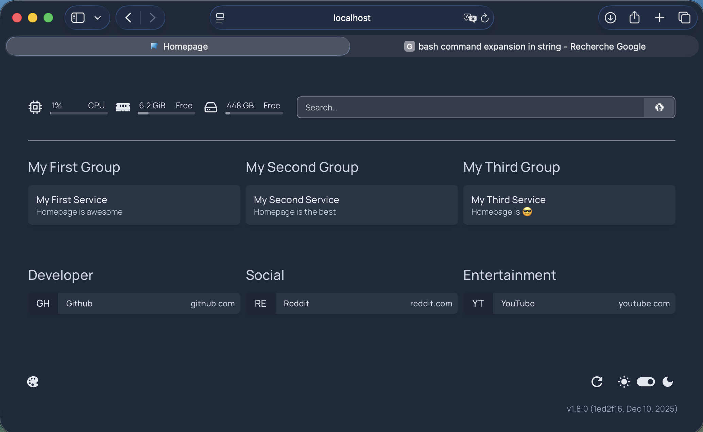
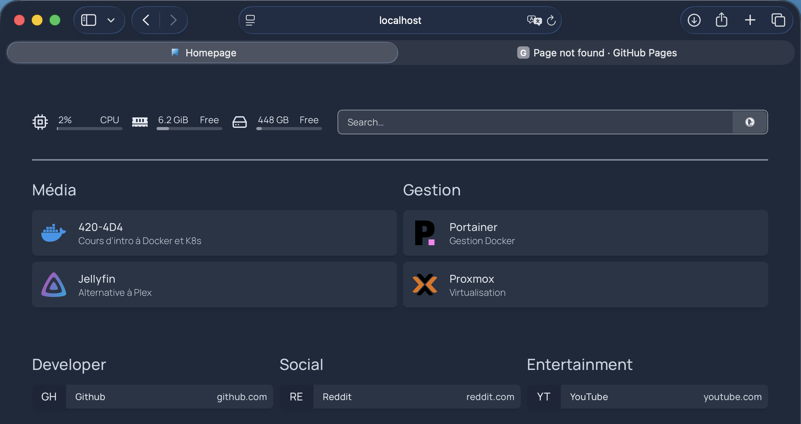
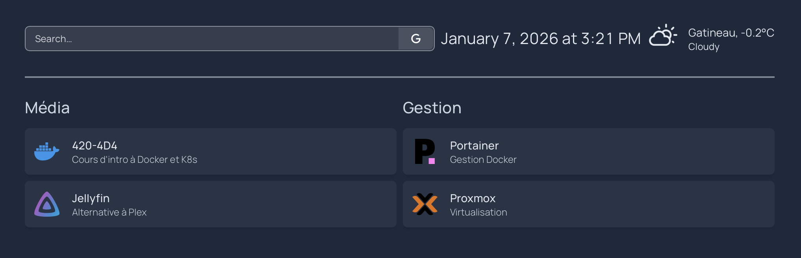
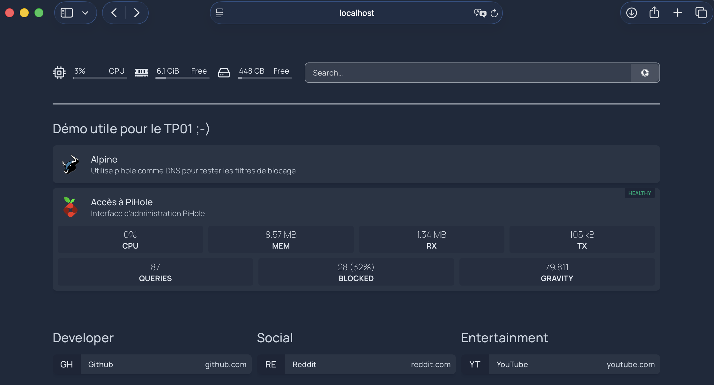
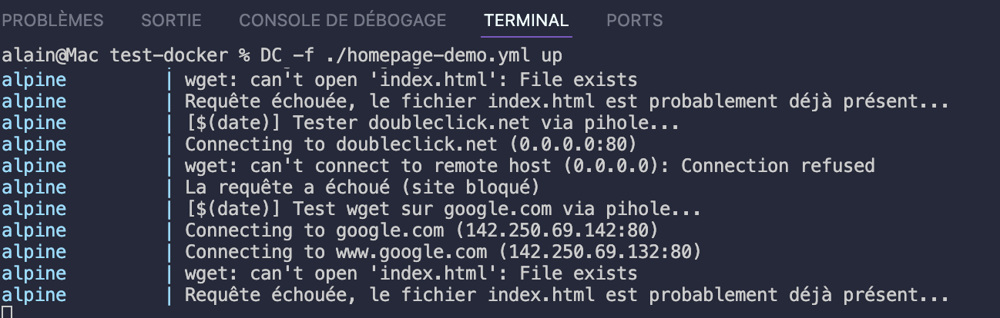

# Introduction à Homepage

<p align="center">
  
</p>

## Qu'est-ce que Homepage ?

**Homepage** est un tableau de bord personnalisable pour centraliser l'accès aux services auto-hébergés, applications web et ressources réseau. 

Conçu pour les utilisateurs de 'homelab' et les administrateurs système, Homepage offre une interface qui regroupe les services avec des informations en temps réel.


---

### Caractéristiques principales

- Interface web responsive et personnalisable
- Intégration avec plus de 100 services populaires
- Affichage de widgets (météo, recherche, statistiques système)
- Configuration simple via des fichiers YAML
- Support Docker natif avec détection automatique
- Thèmes clairs et sombres
- Localisation de la langue

---

## Installation avec Docker, en cli:

```bash
$ mkdir ./homepage-config
$ docker run -d \
  --name homepage \
  -p 3000:3000 \
  -e HOMEPAGE_ALLOWED_HOSTS="*" \
  -v ./homepage-config:/app/config \
  -v /var/run/docker.sock:/var/run/docker.sock:ro \
  ghcr.io/gethomepage/homepage:latest

# Après le lancement du conteneur, il devrait y avoir des fichiers de configuration dans le dossier ./homepage-config
$ ls -l ./homepage-config

-rw-r--r-- 1   354 janv.  7 10:17 bookmarks.yaml
-rw-rw-r-- 1     0 déc.  10 11:47 custom.css
-rw-rw-r-- 1     0 déc.  10 11:47 custom.js
-rw-r--r-- 1   196 janv.  7 10:17 docker.yaml
-rw-rw-r-- 1    31 janv.  7 10:13 kubernetes.yaml
drwxr-xr-x 2  4096 janv.  7 10:13 logs
-rw-r--r-- 1   104 janv.  7 10:17 proxmox.yaml
-rw-r--r-- 1   506 janv.  7 10:27 services.yaml
-rw-r--r-- 1   184 janv.  7 10:13 settings.yaml
-rw-r--r-- 1   218 janv.  7 10:17 widgets.yaml
```

Accéder ensuite à `http://localhost:3000`



---

## Configuration de base

Homepage utilise des fichiers YAML dans le dossier `config/`. Les trois fichiers principaux sont :

- `services.yaml` : liste des services (applications)
- `widgets.yaml` : widgets du tableau de bord
- `settings.yaml` : paramètres généraux

---

### Exemple 1 : Ajouter des services simples

Créer ou modifier `config/services.yaml` :

```bash
$ nano ./homepage-config/services.yaml
```

Et y ajouter le contenu suivant:

```yaml
---
- Média:
    - 420-4D4:
        href: https://ve2cuy.github.io/4204d4/
        description: Cours d'intro à Docker et K8s
        icon: docker.png

    - Jellyfin:
        href: http://192.168.1.101:8096
        description: Alternative à Plex
        icon: jellyfin.png

- Gestion:
    - Portainer:
        href: https://portainer.local
        description: Gestion Docker
        icon: portainer.png

    - Proxmox:
        href: https://proxmox.local:8006
        description: Virtualisation
        icon: proxmox.png
```

💡NOTE: Les changements devraient être actualisés automatiquement sur la page web.





---

### Exemple 2 : Ajouter des widgets informatifs

Éditer `homepage-config/widgets.yaml` :

```yaml
- search:
    provider: google
    target: _blank  # Nouvel onglet

- datetime:
    text_size: xl
    format:
      dateStyle: long
      timeStyle: short

- openmeteo:
    label: Gatineau
    latitude: 45.48
    longitude: -75.65
    units: metric
    cache: 5
```




👉 NOTE: Nous ajusterons l'interface au français à une étape suivante.

---

### Exemple 3 : Intégrations avec API

Pour afficher des statistiques en temps réel, ajoutez des intégrations dans `services.yaml` :

```yaml
- Surveillance:
    - Serveur Principal:
        href: http://192.168.1.50
        description: Stats système
        icon: linux.png
        widget:
          type: glances
          url: http://192.168.1.50:61208
          metric: cpu

    - Pi-hole:
        href: http://192.168.1.10/admin
        description: Blocage pub DNS
        icon: pi-hole.png
        widget:
          type: pihole
          url: http://192.168.1.10 
          key: votrecleapi123456
```

---

### Exemple 3.5 : Intégrations avec API sous Docker

Si les services roulent sous docker, alors voici la syntaxe à utiliser.

3.5.1 - Éditer le fichier ./homepage-config/docker.yaml et ajouter les directives suivantes:

```yaml
# Le label suivant servira de lien entre le service et docker
my-docker:
  socket: /var/run/docker.sock
```

---

3.5.2 - Remplacer le service pihole (dans ./homepage-config/services.yaml) par,

```yaml
    - Accès à PiHole:
        # https://gethomepage.dev/widgets/services/pihole/
        icon: pi-hole.png
        href: https://localhost/admin
        description: Interface d'administration PiHole
        server: my-docker # Le serveur docker, configuré dans docker.yaml
        container: pihole # Le nom du conteneur. Le réseau docker sera utilisé pour la connexion.
        showStats: true 
        target: _self 
```


---

### Exemple 4 : Personnalisation visuelle

Configurer `homepage-config/settings.yaml` :

```yaml
title: Mon Homelab
theme: dark
color: slate
language: fr # Poour afficher en français

layout:
  Média:
    style: row
    columns: 3
  Gestion:
    style: row
    columns: 2

favicon: https://votresite.com/favicon.ico
```

---


## 💡 5 - Voici un exemple complet, avec variables d'environnement et génération des fichiers de configuration par programmation.


```yaml
# Fichier: docker-compose.yml
---
services:

  # ------------------------------------------------------------------
  # Application Homepage qui attend que l'init soit terminé avant de démarrer
  homepage:
    image: ghcr.io/gethomepage/homepage:latest
    container_name: homepage
    ports:
      - "${HOMEGAGE_PORT}:3000"
    volumes:
      - ./homepage-config:/app/config
      # Pour Windows
      #- //var/run/docker.sock:/var/run/docker.sock
      # Pour Linux
      - /var/run/docker.sock:/var/run/docker.sock
    environment:
      - HOMEPAGE_ALLOWED_HOSTS=*
    depends_on:
      homepage-init:
        condition: service_completed_successfully
    restart: unless-stopped
    networks:
      - projet_network

  # ------------------------------------------------------------------
  # Ce service va créer les fichiers services.yaml et docker.yaml, requis par homepage.  Pour ce faire, il utilise le même volume que le service homepage.
  homepage-init:
    image: alpine:latest
    container_name: homepage-init
    environment:
      - HOST_IP=${HOST_IP}

    volumes:
      - ./homepage-config:/data
    command: |
      sh -c "
      echo 'Configuration du menu Homepage...' 
      mkdir -p /data
      # ###########################################################
      # Fichier de configuration des services
      # ###########################################################
      cat > /data/services.yaml << 'EOF'
      ---
      - Démo utile pour le TP01 ;-) :

          - Alpine:
              icon: beef.png
              description: Utilise pihole comme DNS pour tester les filtres de blocage

          - Accès à PiHole:
              icon: pi-hole.png
              href: https://${HOST_IP}/admin
              description: Interface d'administration PiHole
              server: mon-docker
              container: pihole
              showStats: true 
              target: _self 

              widget:
                type: pihole
                # Voir la note dans le service
                url: https://${DNS_IP:-0.0.0.0}
                version: 6 # required if running v6 or higher, defaults to 5
                key: password
      EOF

      # FIN DU FICHIER services.yaml
      # ---------------------------------------------------------------------------

      # ###########################################################
      # Fichier de configuration du serveur Docker
      # ###########################################################
      # Requis pour le widget Docker
      cat > /data/docker.yaml << 'EOF'
      ---
      mon-docker:
        socket: /var/run/docker.sock
      EOF
      # FIN DU FICHIER docker.yaml
      # ---------------------------------------------------------------------------

      echo 'Configuration terminée avec succès!' 
      "

# ------------------------------------------------------------------
  pihole:
    container_name: pihole
    image: pihole/pihole:latest
    ports:
      # Au besoin, pour utilisation à l'extérieur du réseau Docker
      - "${PIHOLE_DNS_PORT}:53/tcp" 
      - "${PIHOLE_DNS_PORT}:53/udp"
      # Pour l'interface de gestion Web
      - "${PIHOLE_HTTP_PORT}:80/tcp"
      - "${PIHOLE_HTTPS_PORT}:443/tcp"
    environment:
      TZ: 'America/Montreal'
      # Fixer un mot de passe, sinon un mdp aléatoire sera généré.
      FTLCONF_webserver_api_password: 'password'
      # Pour utiliser pihole comme DNS dans le réseau Bridge de Docker: 
      FTLCONF_dns_listeningMode: 'ALL'

    #volumes:
    #  - '../volumes/etc-pihole:/etc/pihole'
    restart: unless-stopped
    networks:
      projet_network:
        ipv4_address: ${DNS_IP:-0.0.0.0}
# -------------------------------------- FIN Pi-hole

# Utilisation d'une Alpine pour faire des requêtes Web en utilisant 
# le DNS de pihole.

  alpine:
    image: alpine
    container_name: alpine
    dns:
      -  ${DNS_IP:-0.0.0.0}      
    command: >
      sh -c "
      while true; do
        # Lire un site autorisé via pihole
        # Utilisation de wget car curl n'est pas installé dans l'image alpine.
        echo 'Tester google.com via pihole...\';
        wget -O index.html google.com && echo '😀 La Requête sur google.com a réussi ' || echo 'Requête échouée, étrange ...';
        sleep 5;
        # Lire un site bloqué via pihole
        echo 'Tester doubleclick.net via pihole...';
        wget doubleclick.net && echo 'La Requête a réussi (étrange - site bloqué!)' || echo '😡 La requête a échoué (site bloqué)'; 
        sleep 5;    
      done
      "      
    restart: unless-stopped
    networks:
      - projet_network


# les réseaux du projet
networks:
  # ----------------------------------------------------------------------
  # Ce réseau est utilisé par Pi-hole pour fixé une adresse IP statique
  # C'est requis car la directive dns: dans le service Alpine a besoin de l'adresse IP
  # Il n'est pas possible d'utiliser le nom du service pihole dans dns:
  projet_network:
    driver: bridge
    ipam:
      config:
        - subnet: "172.30.0.0/16"        
  # =======================================================================
```

Le fichier .env

```
HOST_IP=localhost
DNS_IP=172.30.0.53
ARCANE_PORT=3552
PIHOLE_DNS_PORT=553
PIHOLE_HTTP_PORT=81
PIHOLE_HTTPS_PORT=443
HOMEGAGE_PORT=80
```

Lancer et tester le projet dans un fureteur.  ❗️ Note: Au besoin, ajuster la variable HOST_IP.

```bash
docker compose -f ... up
```








---

## Conseils d'utilisation

**Organisation** : Regrouper les services par catégorie logique (Média, Réseau, Administration, etc.)

**Sécurité** : Si Homepage est exposé sur Internet, il faudra le protéger derrière un reverse proxy avec authentification (Authelia, Authentik)

**Performance** : Ajuster le paramètre `cache` des widgets pour réduire les appels API fréquents

**Docker** : Utiliser des labels Docker pour une configuration automatique plutôt que manuelle.  Voir la documentation officielle.

---

## Ressources

- Documentation officielle : https://gethomepage.dev
- Dépôt GitHub : https://github.com/gethomepage/homepage
- Liste des intégrations : https://gethomepage.dev/widgets/

---

## Conclusion

Homepage transforme une collection de services en un portail unifié et professionnel, parfait pour gérer efficacement une infrastructure personnelle ou professionnelle.

---

## 6 - Laboratoire: Durée 30 minutes


À suivre ...

---

## Crédits

*Document préparé par Alain Boudreault © 2026*  
*Version 2026.01.07.2*  
*Site par ve2cuy*
