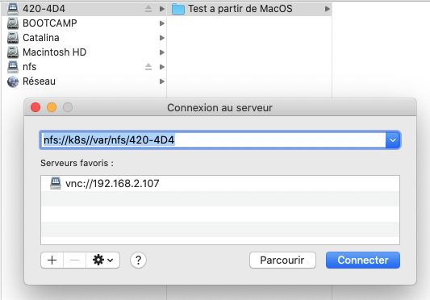
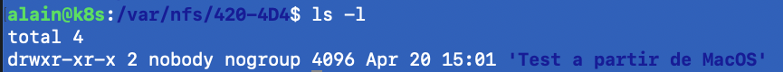
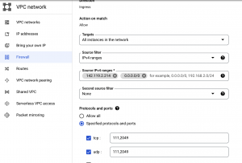
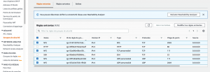

Voici la conversion en Markdown de la page **"Kubernetes – Les volumes"**.

-----

# Kubernetes – Les volumes

*28 avril 2022 - Révision du 2025.12.05*

## Contenu

  * Les types de **volumes K8s**
    1.  **emptyDir** (stockage éphémère dans un *pod*)
    2.  **hostPath** (stockage sur le *host/node*)
    3.  **volume persistant local** (**pv**) / **persistent volume claim** (**pvc**)
    4.  **volume persistant externe**; **NFS**, **SMB**, **AWSElasticBlockStore**, **AzureDisk**, ...

-----

## 1 – Volume hébergé dans un Pod – `emptyDir`

Un volume '**emptyDir**' existe seulement à l'**intérieur d'un Pod** et peut être utilisé par les conteneurs du Pod. Voici un exemple de trois conteneurs utilisant le même volume:

**Action 1.1 –** Renseigner et appliquer le manifeste suivant:

```yaml
# -------------------------------------------------------------
# Fichier: exemple1.1.yml
# Auteur: Alain Boudreault
# Projet: 420-4D4-Semaine 10
# Date: 2021.04.13
# -------------------------------------------------------------
# Exemple d'un manifeste pour un Pod nginx avec un emptyDir
# -------------------------------------------------------------
apiVersion: v1
kind: Pod
metadata:
  name: exemple1-1
spec:
  containers:
  - name: nginx
    image: nginx
    volumeMounts:
    - mountPath: /usr/share/nginx/html  # Ceci est le dossier web de nginx
      name: volume-web

  - name: une-debian
    image: debian
    command: ["sleep", "1000"]
    volumeMounts:
    - mountPath: /petit-coquin
      name: volume-web

  - name: une-alpine
    image: alpine
    command: ['sh', '-c', 'echo "Je suis 420-4D4 ;)-" > /misere/index.html']
    volumeMounts:
    - mountPath: /misere
      name: volume-web
  # restartPolicy: Never  


# Définition des volumes
  volumes:
  - name: volume-web
    emptyDir: {}
```

```bash
kubectl apply -f exemple1.1.yml
kubectl get pods
kubectl get pods -o=jsonpath="{range .items[*]}{\"\n\"}{.metadata.name}{\":\t\"}{range .spec.containers[*]}{.name}{\", \"}{end}{end}"
```

**Note:** Le Pod '**alpine**' va créer le fichier '**index.html**' puis va passer en état '**CrashLoopBackOff**'.

**Action 1.2 –** Tester le contenu du volume du conteneur '**une-debian**'

```bash
kubectl exec -it exemple1-1 --container=une-debian -- bash

root@exemple1-1:/# ls
bin   dev  home  lib64  mnt  petit-coquin  root  sbin  sys  usr
boot  etc  lib   media  opt  proc          run   srv   tmp  var

root@exemple1-1:/# cat petit-coquin/index.html 
Je suis 420-4D4 ;)-
```

**Action 1.3 –** Tester le contenu du serveur web

```bash
kubectl exec -it exemple1-1 --container=nginx -- bash     

root@example1-1:/# curl localhost
Je suis 420-4D4 ;)-
```

Il est possible de monter les volumes '**emptyDir**' en **mémoire vive**:

```yaml
  - name: volume-web
    emptyDir:
      medium: Memory
```

**Note**: Sous Minikube, les Pods sont stockés dans la VM de minikube dans le dossier `'cd /var/lib/kubelet/pods/'`. Pour avoir accès à la VM de minikube il suffit de taper la commande: `'minikube ssh'`.

-----

## 2 – Volume hébergé sur le host

**Action 2.1 –** Renseigner le manifeste suivant:

```yaml
# -------------------------------------------------------------
# Fichier: exemple2.1.yml
# Auteur: Alain Boudreault
# Projet: 420-4D4-Semaine 09
# Date: 2021.04.03
# -------------------------------------------------------------
# Exemple d'un manifeste pour un Pod nginx avec un volume local
# -------------------------------------------------------------
apiVersion: v1
kind: Pod
metadata:
  name: serveur-web
spec:
  containers:
  - name: nginx
    image: nginx
    volumeMounts:
    - mountPath: /usr/share/nginx/html
      name: volume-web
 
# Définition des volumes
  volumes:
  - name: volume-web
    hostPath:
      # chemin du dossier sur l'hôte
      # Il faut renseigner le chemin en utilisant l'adressage absolu.
      # Sur une infrastructure K8S, le dossier doit exister sur le noeud ou roule le Pod. 
      path: /Users/alain/420-4D4/semaine09/web-data/
      # ce champ est optionnel
      type: Directory
```

**Note:** Sous minikube, le dossier sera monté dans la VM de minikube.

-----

## 3 – Les volumes persistants (PV et PVC)

[Référence sur le site de Kubernetes](https://kubernetes.io/fr/docs/concepts/storage/persistent-volumes/)

Les **volumes persistants** sont des ressources, à créer, Kubernetes. Ils proposent une abstraction sur un volume de stockage. Le volume peut être **local** ou bien **distant** (c'est-à-dire, sur un autre serveur).

L'utilisation d'un **PV** est réalisée en deux étapes:

1.  Créer le **PV** – `PersistentVolume`
2.  Consommer le PV via le **PVC** – `PersistentVolumeClaim`

**Action 3.1 –** Renseigner le manifeste `PersistentVolume` – PV – suivant:

```yaml
# Fichier: exemple3.1.yml
apiVersion: v1
kind: PersistentVolume
metadata:
  name: mypv
spec:
  capacity:
    storage: 1Gi
  volumeMode: Filesystem

  accessModes:
    # ReadWriteOnce -- le volume peut être monté en lecture-écriture par un seul nœud
    # ReadOnlyMany  -- le volume peut être monté en lecture seule par plusieurs nœuds
    # ReadWriteMany -- le volume peut être monté en lecture-écriture par de nombreux nœuds
    - ReadWriteOnce

  # persistentVolumeReclaimPolicy: Retain  # Valeur par défaut, les données des PVC seront préservées.
  persistentVolumeReclaimPolicy: Recycle

  storageClassName: local
  hostPath:
    path: "/mnt/pv"
```

**NOTE**: Sous Minikube, le **hostPath** pointe dans la VM de cette dernière. Il est possible d’en consulter le contenu avec la commande: `minikube ssh`.

Voici une liste des types de stockages supportés par K8S:

  * **GCEPersistentDisk**
  * **AWSElasticBlockStore**
  * **AzureFile**
  * **AzureDisk**
  * **CSI**
  * **FC** (Fibre Channel)
  * **FlexVolume**
  * **Flocker**
  * **NFS**
  * **iSCSI**
  * **RBD** (Ceph Block Device)
  * **CephFS**
  * **Cinder** (OpenStack block storage)
  * **Glusterfs**
  * **VsphereVolume**
  * **Quobyte Volumes**
  * **HostPath** (Test de nœud unique uniquement — le stockage local n’est en aucun cas pris en charge et NE FONCTIONNERA PAS dans un cluster à plusieurs nœuds)
  * **Portworx Volumes**
  * **ScaleIO Volumes**
  * **StorageOS**

**Action 3.1.1 –** Créer le volume persistant (PV)

```bash
kubectl apply -f exemple3.1.yml
kubectl get pv
```

**Action 3.2 –** Renseigner le manifeste `PersistentVolumeClaim` – PVC – suivant:

```yaml
# Fichier: exemple3.2.yml 
apiVersion: v1
kind: PersistentVolumeClaim
metadata:
  name: mypvc
spec:
  storageClassName: local
  resources:
    requests:
      storage: 500Mi
  accessModes:
    - ReadWriteOnce
```

**Action 3.2.1 –** Créer le `PersistentVolumeClaim` – PVC

```bash
kubectl apply -f exemple3.2.yml
kubectl get pvc
```

**NOTE IMPORTANTE**: Un seul PVC par PV. Si le PVC ne réclame pas 100% de l’espace disponible du PV alors cet espace sera perdu durant toute la durée de vie du PVC.

**Action 3.3 –** Utiliser un PVC, renseigner le manifeste suivant:

```yaml
# -------------------------------------------------------------
# Fichier: exemple3.3.yml
# Auteur: Alain Boudreault
# Projet: 420-4D4-Semaine 10
# Date: 2021.04.13
# -------------------------------------------------------------
# Exemple d'un manifeste pour un Pod nginx avec un PVC
# -------------------------------------------------------------
apiVersion: v1
kind: Pod
metadata:
  name: example3-3
spec:
  containers:
  - name: nginx
    image: nginx
    volumeMounts:
    - mountPath: /usr/share/nginx/html  # Ceci est le dossier web de nginx
      name: volume-web

    # Définition des volumes
  volumes:
  - name: volume-web
    persistentVolumeClaim:
      claimName: mypvc
```

**Action 3.3.1 –** Se connecter au Pod et créer un nouveau fichier:

```bash
exec -it example3-3 -- bash

cd /usr/share/nginx/html/
echo "Ici la voix des Misterons!" > index.html
exit
```

**Action 3.3.2 –** Effacer puis relancer le Pod. Tester le serveur Web:

```bash
kubectl delete pod example3-3 
kubectl apply -f exemple3.3.yml
curl localhost
```

Résultat:

```
Ici la voix des Misterons!
```

-----

## 4 – Les volumes externes

Volume [NFS](https://fr.wikipedia.org/wiki/Network_File_System)

### 4.1 – Mise en place d’un volume NFS sur un serveur Ubuntu 20.04

```bash
# Installer le service nfs sur le serveur
$ sudo apt update
$ sudo apt install nfs-kernel-server

# Créer un répertoire de partage
$ sudo mkdir /var/nfs/420-4D4 -p
$ sudo chown nobody:nogroup /var/nfs/420-4D4
$ sudo echo "Ici la voix des Mistérons" > /var/nfs/420-4D4/coucou.txt

# Publier le dossier de partage
$ sudo nano /etc/exports
/var/nfs/420-4D4  *(rw,sync,no_subtree_check,all_squash,anonuid=65534,anongid=65534,insecure)
/nfs              *(rw,sync,no_subtree_check,all_squash,anonuid=65534,anongid=65534,insecure)
# Redémarrer le service nfs
$ sudo systemctl restart nfs-kernel-server
# Ou:
$ sudo exportfs -a

# Si le pare feu est activé alors ouvrir le port nfs:
$ sudo ufw allow from client_ip to any port nfs
```

Vérification de l’état du serveur NFS:

```bash
alain@k8s:/var/nfs/420-4D4$ sudo systemctl status nfs-kernel-server
● nfs-server.service - NFS server and services
     Loaded: loaded (/lib/systemd/system/nfs-server.service; enabled; vendor preset: enabled)
     Active: active (exited) since Tue 2021-04-20 13:35:40 UTC; 1h 30min ago
    Process: 37210 ExecStartPre=/usr/sbin/exportfs -r (code=exited, status=0/SUCCESS)
    Process: 37211 ExecStart=/usr/sbin/rpc.nfsd $RPCNFSDARGS (code=exited, status=0/SUCCESS)
   Main PID: 37211 (code=exited, status=0/SUCCESS)
```

### 4.2 – Connexion à un partage NFS (À partir de MacOS):





**Note**: Ne fonctionne plus à partir de MacOS 11. Utiliser plutôt le terminal:

```bash
sudo mkdir /Volumes/test-nfs
sudo mount -o vers=4,resvport -t nfs 192.168.2.131:/var/nfs/420-4D4 /Volumes/test-nfs
```

Ou bien, ajouter la ligne suivante dans le fichier `'/etc/nfs.conf'` du Mac:

```
#
# nfs.conf: the NFS configuration file
#
nfs.client.mount.options = vers=4
```

-----

### 4.3 – Connexion à un partage NFS (À partir de Linux):

```bash
# Au besoin, installer le client NFS:
$ sudo apt update
$ sudo apt install nfs-common

# Monter le volume désiré sur un dossier existant:
alain@srv02:~$ sudo mount -t nfs k8s:/var/nfs/420-4D4 ~/420-4d4

alain@srv02:~$ ls -l 420-4d4/
total 4
drwxr-xr-x 2 nobody nogroup 4096 Apr 20 15:01 'Test a partir de MacOS'
```

-----

### 4.4 – Connexion à un partage NFS à partir de Minikube:

**ATTENTION, LA SECTION 4.4 NE S’APPLIQUE PAS AU PROJET DE SESSION\!\!\!**

```bash
√ semaine10 % minikube ssh
                         _             _            
            _         _ ( )           ( )           
  ___ ___  (_)  ___  (_)| |/')  _   _ | |_      __  
/' _ ` _ `\| |/' _ `\| || , <  ( ) ( )| '_`\  /'__`\
| ( ) ( ) || || ( ) || || |\`\ | (_) || |_) )(  ___/
(_) (_) (_)(_)(_) (_)(_)(_) (_)`\___/'(_,__/'`\____)

$ ping 192.168.2.185
PING 192.168.2.185 (192.168.2.185): 56 data bytes
64 bytes from 192.168.2.185: seq=0 ttl=63 time=7.435 ms
64 bytes from 192.168.2.185: seq=1 ttl=63 time=5.655 ms

$ sudo mount -t nfs 192.168.2.185:/var/nfs/420-4D4 /tmp
$ ls /tmp
'Test a partir de MacOS'
$
```

**Note**: ***Les volumes externes de type NFS ne fonctionne pas bien sous Minikube. Il est préférable d’expérimenter avec un cluster Kubernetes.***

**4.4.2 – IMPORTANT** – Le client **NFS** doit-être installé sur tous les noeuds de l’infrastructure Kubernetes:

```bash
apt install nfs-common
```

**Indice** que *nfs-common* est manquant sur les noeuds:

```bash
kubectl describe pod example4-6

Warning  FailedMount  4m55s (x8 over 5m59s)  kubelet MountVolume.SetUp failed for volume "pv-nfs" : mount failed: exit status 32
```

**ATTENTION, LA SECTION 4.4 NE S’APPLIQUE PAS AU PROJET DE SESSION\!\!\!**

-----

**4.5 –** Renseigner un PV à partir d’un partage **NFS**:

```yaml
# Fichier: exemple4.5.yml
# Exemple d'un PV pointant sur un volume NFS
apiVersion: v1
kind: PersistentVolume
metadata:
  name: pv-nfs
spec:
  capacity:
    storage: 1Gi
  volumeMode: Filesystem
  accessModes:
    - ReadWriteMany
  persistentVolumeReclaimPolicy: Recycle
  storageClassName: nfs
  nfs:
    server: 192.168.2.185
    path: /var/nfs/420-4D4
```

**4.6 –** Renseigner un PVC à partir d’un PV.NFS:

```yaml
# Fichier: exemple4.6.yml 
apiVersion: v1
kind: PersistentVolumeClaim
metadata:
  name: pvc-nfs
spec:
  storageClassName: nfs
  resources:
    requests:
      storage: 500Mi
  accessModes:
    - ReadWriteMany
```

**4.7 –** Consommer le PVC.NFS

```yaml
# -------------------------------------------------------------
# Fichier: exemple4.7.yml
# Auteur: Alain Boudreault
# Projet: 420-4D4-Semaine 10
# Date: 2021.04.20
# -------------------------------------------------------------
# Exemple d'un manifeste pour un Pod nginx avec un PVC.NFS
# -------------------------------------------------------------
apiVersion: v1
kind: Pod
metadata:
  name: exemple4-7
spec:
  containers:
  - name: nginx
    image: nginx
    volumeMounts:
    - mountPath: /usr/share/nginx/html  # Ceci est le dossier web de nginx
      name: volume-web

    # Définition des volumes
  volumes:
  - name: volume-web
    persistentVolumeClaim:
      claimName: pvc-nfs
```

**4.8 –** Créer un fichier sur le volume NFS

```bash
alain@k8s:/var/nfs/420-4D4$ echo "Je suis totalement NFS ;-)" > index.html
```

**4.9 –** Tester le volume NFS via une Nginx

```bash
vagrant@k8s-master:~/k8s-lesVolumes$ kubectl exec -it example4-6 -- bash

root@example4-6:/# curl localhost

Je suis totalement NFS ;-)
```

```bash
# Diagnostique:
kubectl get events
```

-----

### Partage NFS via un ‘Cloud provider’

**4.9.1. – NOTE —\>** Pour un partage **NFS** sur un service en nuage, il faut penser à ouvrir les ports **111** et **2049** en **TCP** et **UDP** du ***pare-feu du projet***.

**Par exemple, sur Google Cloud:**



**Et sur AWS d’Amazon:**



-----

## 5 – Voici un exemple d’un déploiement ***nginx*** avec un ***PV*** à partir d’une VM sur le cloud de Google:

```yaml
#  Exemple d'un service web qui utilise un dossier de partage NFS
#  d'un serveur qui roule sur le cloud de Google.
#
#  Note:  Le partage NFS sur ve2cuy.com ne fonctionne qu'à partir 
#         d'adresses IP autorisées.  Il est possible que ce 
#         manifeste ne fonctionne pas de chez vous. 

apiVersion: v1
kind: PersistentVolume
metadata:
  name: pv-nfs-ve2cuy
spec:
  capacity:
    storage: 1Gi
  volumeMode: Filesystem
  accessModes:
    - ReadWriteMany
  # persistentVolumeReclaimPolicy: Recycle # Le contenu du volune sera effacé sur un delete du PV
  persistentVolumeReclaimPolicy: Retain
  storageClassName: nfs
  nfs:
    server: ve2cuy.com
    path: /var/nfs/420-4D4

---
apiVersion: v1
kind: PersistentVolumeClaim
metadata:
  name: pvc-nfs-ve2cuy
spec:
  storageClassName: nfs
  resources:
    requests:
      storage: 1Gi
  accessModes:
    - ReadWriteMany

---
apiVersion: apps/v1
kind: Deployment
metadata:
  name: nginx-deployment
  labels:
    app: nginx-app
spec:
  replicas: 4
  selector:
    matchLabels:
      app: nginx-app-label
  template:
    metadata:
      labels:
        app: nginx-app-label
    spec:
      containers:
      - name: conteneur-nginx
        image: nginx
        ports:
        - containerPort: 80
        volumeMounts:
        - mountPath: /usr/share/nginx/html  # Ceci est le dossier web de nginx
          name: volume-web

      volumes:
      - name: volume-web
        persistentVolumeClaim:
          claimName: pvc-nfs-ve2cuy        

---
apiVersion: v1
kind: Service
metadata:
  name: nginx-service
spec:
  selector:
    app: nginx-app-label
  type: LoadBalancer
  ports:
    - protocol: TCP
      # Port à exposer au reseau local K8s
      port: 80
      # Port du conteneur
      targetPort: 80
      # ajout 2 - port externe.  Doit être entre 30000 et 32767
      nodePort: 30080
```

-----

## 6 – Laboratoire PV/PVC/NFS (durée 30-40 minutes)

### 1 – Vous devez mettre en place un déploiement K8S qui fait rouler

  * ***phpMAadmin*** avec
  * ***MariaDB***
      + Le dossier de stockage des BD du SGBD doit être sur un ***PV/PVC*** de type **NFS**
          - Il faut créer une **VM Ubuntu** et installer le service ***NFS***
              * le dossier de partage sur le serveur Ubuntu est ***/partage-nfs***

### 2 – Avec phpMyAdmin, créer un utilisateur et une BD ‘wordpress’

### 3 – Effacer le déploiement

  * Le relancer et valider que la BD ‘wordpress’ a été préservée.
  * Vérifier le contenu du dossier `/partage-nfs` sur le serveur Ubuntu. Il devrait contenir une structure semblable à ceci:

<!-- end list -->

```
# ls -l
total 140552
-rw-rw---- 1 mysql mysql  18046976 Apr 28 14:46 aria_log.00000001
-rw-rw---- 1 mysql mysql        52 Apr 28 14:46 aria_log_control
-rw-rw---- 1 mysql mysql         9 Apr 28 14:46 ddl_recovery.log
-rw-rw---- 1 mysql mysql       868 Apr 28 14:46 ib_buffer_pool
-rw-rw---- 1 mysql mysql 100663296 Apr 28 14:46 ib_logfile0
-rw-rw---- 1 mysql mysql  12582912 Apr 28 14:46 ibdata1
-rw-rw---- 1 mysql mysql  12582912 Apr 28 14:46 ibtmp1
-rw-rw---- 1 mysql mysql         0 Apr 28 14:46 multi-master.info
drwx------ 2 mysql mysql      4096 Apr 28 14:46 mysql
-rw-r--r-- 1 mysql mysql        14 Apr 28 14:46 mysql_upgrade_info
drwx------ 2 mysql mysql      4096 Apr 28 14:46 performance_schema
drwx------ 2 mysql mysql     12288 Apr 28 14:46 sys
drwx------ 2 mysql mysql      4096 Apr 28 14:46 wordpress
```

-----

## Astuces

Le Pod qui roule le SGBD va tenter un `'chown'` sur le dossier de partage NFS. Ce qui va provoquer un `'CrashLoopBackOff'` du Pod et un log :

```bash
$ k logs mariadb

2022-04-28 16:44:13+00:00 [Note] [Entrypoint]: Entrypoint script for MariaDB Server 1:10.7.3+maria~focal started.
chown: changing ownership of '/var/lib/mysql/': Operation not permitted
chown: changing ownership of '/var/lib/mysql/misterons.txt': Operation not permitted
```

Pour solutionner ce problème, il faut rouler le conteneur du Pod avec le **UID** du propriétaire du dossier de partage sur le serveur NFS.

Pour obtenir le UID, il faut utiliser la commande suivante sur le serveur distant:

```bash
root@serveur-distant:/# id nobody

uid=65534(nobody) gid=65534(nogroup) groups=65534(nogroup)
```

Ici, le **UID** de `nobody` est **65534**.

**Note**: Dans cet exemple, nous prenons pour acquis que `'nobody'` est propriétaire du dossier de partage NFS.

Pour exécuter le conteneur avec les droits de ce propriétaire, il faut ajouter ceci dans le manifeste:

```yaml
      containers:
      - name: mysql
        image: mysql
        securityContext:
          runAsUser: 65534
          allowPrivilegeEscalation: false
```

> La création des fichiers requis, sur le volume NFS, pour le fonctionnement du SGBD peut prendre de nombreuses minutes selon le lien réseau liant le Pod au volume NFS. Par exemple, le délai sera plus court si le volume est disponible dans le réseau local du Pod mais plus long si le volume NFS est situé dans le réseau Internet.

**Cet atelier comporte un bon niveau de difficulté…**

-----

**Bonus** pour ceux et celles qui se sont rendus jusqu’ici 😉:

```bash
minikube dashboard
```

-----

*\#\#\#\#\#\# Document rédigé par Alain Boudreault – aka ve2cuy – Version du 2022.04.28*\*\*