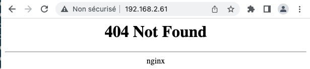

# K8S – LoadBalancer externe + ingress

*Date: 8 avril 2023 - Révision du 2025.12.05*

<p align="center">
    
</p>

## 1 – Mise en situation

Kubernetes ne m'offre pas de service de balance de charge (load balancer externe au réseau K8s) pour plusieurs applications qui partagent le même point d'entrée (une seule adresse IP/même port).

La raison étant que ces services sont habituellement intégrés aux systèmes des fournisseurs Infonuagique: Google Cloud, Azure, AWS, etc.

En labo, nous avons utilisé le tunnel de minikube ou bien celui de Docker Desktop/K8s comme solution externe.

Pour le déploiement natif d'un amas K8S, il faut se rabattre sur des solutions tierces.

Par exemple: [metallb](https://metallb.universe.tf/concepts/), [traefik proxy](https://traefik.io/traefik/), etc.

---

## 2 – Installation de MetalLB

### 2.1 – Installation

```bash
# Sur le cluster K8S suivant:
kubectl get nodes

# Résultat:
# NAME    STATUS   ROLES           AGE    VERSION   INTERNAL-IP    EXTERNAL-IP
# k8s01   Ready    control-plane   155d   v1.25.3   192.168.2.51   <none>
# k8s02   Ready    worker          155d   v1.25.3   192.168.2.52   <none>
# k8s03   Ready    worker          155d   v1.25.3   192.168.2.53   <none>
# k8s04   Ready    worker          155d   v1.25.3   192.168.2.54   <none>
# k8s05   Ready    worker          155d   v1.25.3   192.168.2.55   <none>

# ---------------------------------------------------------
# Installer metallb (LoadBalancer externe)
# NOTE: Ajuster le numéro de version. Référence: https://metallb.io/installation/
kubectl apply -f https://raw.githubusercontent.com/metallb/metallb/v0.13.9/config/manifests/metallb-native.yaml

# Résultat:
# namespace/metallb-system created
# customresourcedefinition.apiextensions.k8s.io/addresspools.metallb.io created
# customresourcedefinition.apiextensions.k8s.io/bfdprofiles.metallb.io created
# customresourcedefinition.apiextensions.k8s.io/bgpadvertisements.metallb.io created
# customresourcedefinition.apiextensions.k8s.io/bgppeers.metallb.io created
# customresourcedefinition.apiextensions.k8s.io/communities.metallb.io created
# customresourcedefinition.apiextensions.k8s.io/ipaddresspools.metallb.io created
# customresourcedefinition.apiextensions.k8s.io/l2advertisements.metallb.io created
# serviceaccount/controller created
# serviceaccount/speaker created
# role.rbac.authorization.k8s.io/controller created
# role.rbac.authorization.k8s.io/pod-lister created
# clusterrole.rbac.authorization.k8s.io/metallb-system:controller created
# clusterrole.rbac.authorization.k8s.io/metallb-system:speaker created
# rolebinding.rbac.authorization.k8s.io/controller created
# rolebinding.rbac.authorization.k8s.io/pod-lister created
# clusterrolebinding.rbac.authorization.k8s.io/metallb-system:controller created
# clusterrolebinding.rbac.authorization.k8s.io/metallb-system:speaker created
# secret/webhook-server-cert created
# service/webhook-service created
# deployment.apps/controller created
# daemonset.apps/speaker created
# validatingwebhookconfiguration.admissionregistration.k8s.io/metallb-webhook-configuration created

# ---------------------------------------------------------
# Afficher les ressources de l'espace de nom du LB
kubectl get all -n metallb-system -o wide

# Résultat:
# NAME                              READY   STATUS    RESTARTS   AGE     IP             NODE 
# pod/controller-844979dcdc-64nms   1/1     Running   0          5m46s   10.244.77.5    k8s04
# pod/speaker-7r8bw                 1/1     Running   0          5m46s   192.168.2.55   k8s05
# pod/speaker-8n5x5                 1/1     Running   0          5m46s   192.168.2.52   k8s02
# pod/speaker-md92s                 1/1     Running   0          5m45s   192.168.2.53   k8s03
# pod/speaker-rb4wh                 1/1     Running   0          5m45s   192.168.2.54   k8s04
# pod/speaker-sth9t                 1/1     Running   0          5m46s   192.168.2.51   k8s01
# 
# NAME                      TYPE        CLUSTER-IP      EXTERNAL-IP   PORT(S)   AGE     SELECTOR
# service/webhook-service   ClusterIP   10.103.93.242   <none>        443/TCP   6m10s   component=controller
# 
# NAME                     DESIRED   CURRENT   READY   UP-TO-DATE   AVAILABLE   NODE SELECTOR            AGE     CONTAINERS   IMAGES                            SELECTOR
# daemonset.apps/speaker   5         5         5       5            5           kubernetes.io/os=linux   6m10s   speaker      quay.io/metallb/speaker:v0.13.9   app=metallb,component=speaker
# 
# NAME                         READY   UP-TO-DATE   AVAILABLE   AGE     CONTAINERS   IMAGES                               SELECTOR
# deployment.apps/controller   1/1     1            1           6m10s   controller   quay.io/metallb/controller:v0.13.9   app=metallb,component=controller
# 
# NAME                                    DESIRED   CURRENT   READY   AGE     CONTAINERS   IMAGES                               SELECTOR
# replicaset.apps/controller-844979dcdc   1         1         1       5m46s   controller   quay.io/metallb/controller:v0.13.9   app=metallb,component=controller,pod-template-hash=844979dcdc
```

### 2.2 – Renseigner la plage IP

```bash
nano metallb-config.yaml
```

### 2.2.1 – Coller le manifeste suivant et sauvegarder

**NOTE**: Pour la plage d'adresses, il faut utiliser les IP disponibles dans le laboratoire.

```yaml
apiVersion: metallb.io/v1beta1
kind: IPAddressPool
metadata:
  name: first-pool
  namespace: metallb-system
spec:
  addresses:
  - 192.168.2.60-192.168.2.69

---
apiVersion: metallb.io/v1beta1
kind: L2Advertisement
metadata:
  name: example
  namespace: metallb-system
```

### 2.2.2 – Appliquer le manifeste

```bash
kubectl apply -f Metallb-config.yaml
```

---

## 3 – Installation d'un Ingress (reverse proxy) Nginx sur K8S

[Documentation officielle](https://kubernetes.github.io/ingress-nginx/deploy/)

### 3.1 – Déploiement d'un service ingress de type Nginx

```bash
kubectl apply -f https://raw.githubusercontent.com/kubernetes/ingress-nginx/controller-v1.7.0/deploy/static/provider/cloud/deploy.yaml

# ---------------------------------------------------------
# Résultat:
# namespace/ingress-nginx created
# serviceaccount/ingress-nginx created
# serviceaccount/ingress-nginx-admission created
# role.rbac.authorization.k8s.io/ingress-nginx created
# role.rbac.authorization.k8s.io/ingress-nginx-admission created
# clusterrole.rbac.authorization.k8s.io/ingress-nginx created
# clusterrole.rbac.authorization.k8s.io/ingress-nginx-admission created
# rolebinding.rbac.authorization.k8s.io/ingress-nginx created
# rolebinding.rbac.authorization.k8s.io/ingress-nginx-admission created
# clusterrolebinding.rbac.authorization.k8s.io/ingress-nginx created
# clusterrolebinding.rbac.authorization.k8s.io/ingress-nginx-admission created
# configmap/ingress-nginx-controller created
# service/ingress-nginx-controller created
# service/ingress-nginx-controller-admission created
# deployment.apps/ingress-nginx-controller created
# job.batch/ingress-nginx-admission-create created
# job.batch/ingress-nginx-admission-patch created
# ingressclass.networking.k8s.io/nginx created
# validatingwebhookconfiguration.admissionregistration.k8s.io/ingress-nginx-admission created

# ---------------------------------------------------------
# Résultat:
kubectl get all -n ingress-nginx

# NAME                                            READY   STATUS      RESTARTS   AGE
# pod/ingress-nginx-admission-create-57dl4        0/1     Completed   0          6m38s
# pod/ingress-nginx-admission-patch-phpss         0/1     Completed   0          6m38s
# pod/ingress-nginx-controller-7d9674b7cf-2dbrg   1/1     Running     0          6m38s
# 
# NAME                                         TYPE           CLUSTER-IP       EXTERNAL-IP    PORT(S)                      AGE
# service/ingress-nginx-controller             LoadBalancer   10.109.153.164   192.168.2.61   80:32524/TCP,443:31844/TCP   6m39s
# service/ingress-nginx-controller-admission   ClusterIP      10.99.155.93     <none>         443/TCP                      6m39s
# 
# NAME                                       READY   UP-TO-DATE   AVAILABLE   AGE
# deployment.apps/ingress-nginx-controller   1/1     1            1           6m39s
# 
# NAME                                                  DESIRED   CURRENT   READY   AGE
# replicaset.apps/ingress-nginx-controller-7d9674b7cf   1         1         1       6m38s
# 
# NAME                                       COMPLETIONS   DURATION   AGE
# job.batch/ingress-nginx-admission-create   1/1           5s         6m38s
# job.batch/ingress-nginx-admission-patch    1/1           5s         6m38s

# ---------------------------------------------------------
# Résultat:
kubectl get all -n kube-system

# NAME                                           READY   STATUS    RESTARTS      AGE
# pod/kube-proxy-486bn                           1/1     Running   2 (26h ago)   156d
# pod/kube-proxy-49sgw                           1/1     Running   2 (26h ago)   156d
# pod/kube-proxy-rvs7t                           1/1     Running   2 (26h ago)   156d
# pod/kube-proxy-x6c6n                           1/1     Running   2 (26h ago)   156d
# 
# NAME               TYPE        CLUSTER-IP   EXTERNAL-IP   PORT(S)                  AGE
# service/kube-dns   ClusterIP   10.96.0.10   <none>        53/UDP,53/TCP,9153/TCP   156d
# 
# NAME                         DESIRED   CURRENT   READY   UP-TO-DATE   AVAILABLE   NODE SELECTOR            AGE
# daemonset.apps/kube-proxy    4         4         4       4            4           kubernetes.io/os=linux   156d
```

Il y a maintenant un service de type LoadBalancer qui roule et qui a obtenu une adresse IP (192.168.2.61) de MetalLB:

```
service/ingress-nginx-controller     LoadBalancer   10.98.108.0     192.168.2.61   80:30517/TCP,443:31700/TCP
```

Il est maintenant possible d'avoir accès au réseau k8s via cette adresse IP:



**Note**: Nous obtenons une erreur 404 car il n'y a pas encore de routes de définies. Par contre, cette réponse nous indique qu'il y a un service HTTP à l'entrée.

---

### 3.2 – Déployer un service Web (superMinou)

[Référence Medium](https://medium.com/ci-cd-devops/internal-error-occurred-failed-calling-webhook-validate-nginx-ingress-kubernetes-io-b5008e628e03)

#### Manifeste SuperMinou

```yaml
# Modifié pour la demo ingress
apiVersion: apps/v1
kind: Deployment
metadata:
  name: superminou
  labels:
    app: un-superminou
spec:
  replicas: 5
  selector:
    matchLabels:
      mon-app: un-superminou
  template:
    metadata:
      labels:
        mon-app: un-superminou
    spec:
      containers:
      - name: nginx
        image: alainboudreault/superminou:latest
        imagePullPolicy: Always
        ports:
        - containerPort: 80
---
apiVersion: v1
kind: Service
metadata:
  name: superminou-service
spec:
  selector:
    mon-app: un-superminou
  # type: par defaut = ClusterIP, ce qui est requis pour le service ingress
  ports:
    - protocol: TCP
      port: 80
      targetPort: 80
```

#### Manifeste SuperPitou

```yaml
apiVersion: apps/v1
kind: Deployment
metadata:
  labels:
    mon-app: un-superpitou
  name: super-pitou
spec:
  replicas: 3
  selector:
    matchLabels:
      mon-app: un-superpitou
  template:
    metadata:
      labels:
        mon-app: un-superpitou
    spec:
      volumes:
      - name: webdata
        emptyDir: {}
      initContainers:
      - name: web-content
        image: busybox
        volumeMounts:
        - name: webdata
          mountPath: "/webdata"
        command: ["/bin/sh", "-c", 'echo "<h1>Je suis un super <font color=blue>PITOU</font></h1><hr/><h2>Servi par: <?php echo gethostname(); ?></h2>" > /webdata/index.php']
      containers:
      - image: php:8.0.3-apache-buster
        name: php-apache
        volumeMounts:
        - name: webdata
          mountPath: "/var/www/html"

---
apiVersion: v1
kind: Service
metadata:
  name: superpitou-service
spec:
  selector:
    mon-app: un-superpitou
  # type: par defaut = ClusterIP, ce qui est requis pour le service ingress
  ports:
    - protocol: TCP
      port: 80
      targetPort: 80
```

### 3.3 – Fichier: ingress-demo.yml

```yaml
apiVersion: networking.k8s.io/v1
kind: Ingress
metadata:
  name: ingress-demo01
spec:
  ingressClassName: nginx
  rules:
  - host: superminou.demo
    http:
      paths:
      - path: /
        pathType: Prefix
        backend:
          service:
            name: superminou-service
            port: 
              number: 80
  - host: superpitou.demo
    http:
      paths:
      - path: /
        pathType: Prefix
        backend:
          service:
            name: superpitou-service
            port: 
              number: 80
```

```bash
kubectl apply -f ingress-demo.yml

# -----------------------------------------------------------
kubectl get ingress

# NAME             CLASS   HOSTS                             ADDRESS        PORTS   AGE
# ingress-demo01   nginx   superminou.demo,superpitou.demo   192.168.2.61   80      106m

# -----------------------------------------------------------
kubectl describe ingress ingress-demo01

# Résultat:
# Name:             ingress-demo01
# Labels:           <none>
# Namespace:        default
# Address:          192.168.2.61
# Ingress Class:    nginx
# Default backend:  <default>
# Rules:
#   Host             Path  Backends
#   ----             ----  --------
#   superminou.demo  
#                    /   superminou-service:80 (10.244.235.154:80,10.244.235.157:80,10.244.236.150:80 + 2 more...)
#   superpitou.demo  
#                    /   superpitou-service:80 (10.244.235.149:80,10.244.236.152:80,10.244.77.42:80)
# Annotations:       <none>
# Events:
#   Type    Reason  Age                 From                      Message
#   ----    ------  ----                ----                      -------
#   Normal  Sync    13m (x7 over 107m)  nginx-ingress-controller  Scheduled for sync
```

### 3.4 – Fichier /etc/hosts

```bash
192.168.2.61  superminou.demo superpitou.demo
```

### 3.5 – Tester l'ingress (reverse proxy)


---

## Alternative à metallb

<https://traefik.io/traefik/>

---

## Crédits

*Site par ve2cuy*