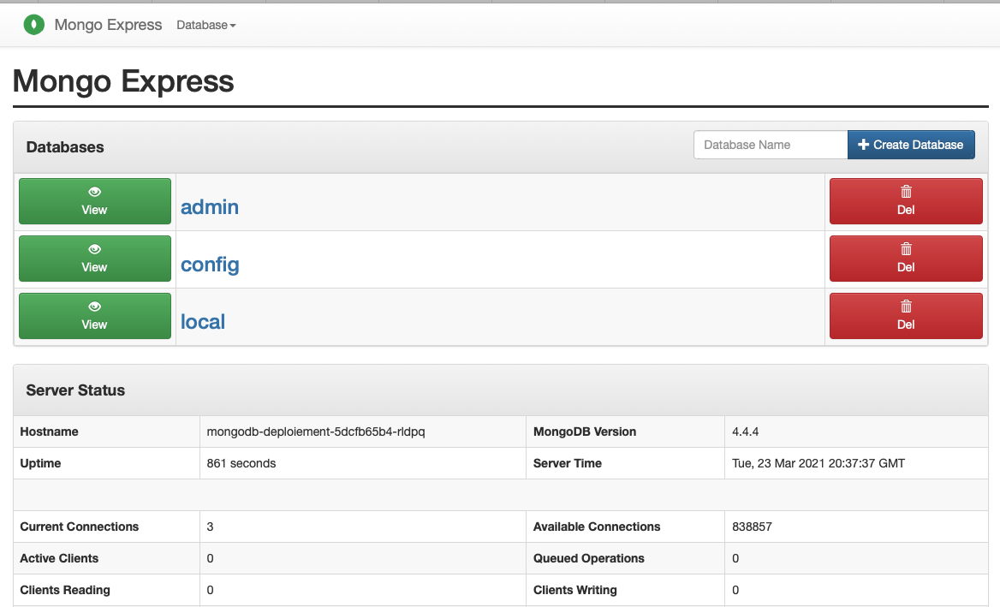
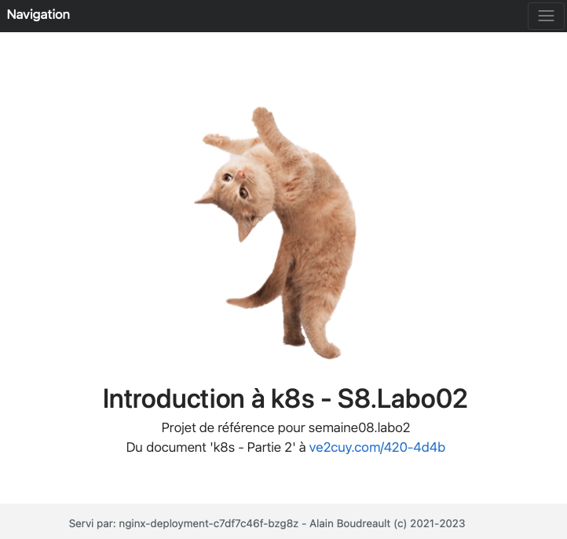
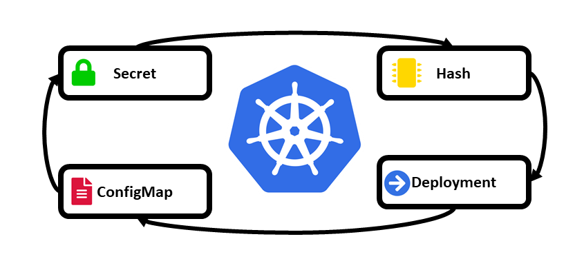

# Kubernetes – Partie 2

4 avril 2023
# TODO: Document incomplet à partir de 6.2.1


## K8s, déployer une application de complexité moyenne

Contenu:

1.  **[Démonstration d’une app MongoDB + MongoExpress](https://www.google.com/search?q=%23item1)**
2.  **[Laboratoire](https://www.google.com/search?q=%23item2)**
    1.  **Déployer une application WordPress**
    2.  **Déployer super Minou en 25 duplicatas**
    3.  **Déployer PostgreSQL et pgadmin4**
3.  **[Les ‘configmaps’](https://www.google.com/search?q=%23item3)**
4.  **[Monter un volume à partir d’un configmap](https://www.google.com/search?q=%23item4)**
5.  **Laboratoire**
    1.  **Déployer une application utilisant un configmap comme source d’un dossier**
6.  **[Les ‘secrets’](https://www.google.com/search?q=%23item6)**
7.  **[Exemple complet, mosquitto+Node-RED+volume+configMap+secret](https://www.google.com/search?q=%23item7)** (**TP02**)

-----

## 0 – Une petite révision d’un manifeste K8s

```yaml
apiVersion: apps/v1
kind: Deployment
metadata:
  name: deploy-superminou
  labels:
    app: superminou
spec:
  replicas: 2
  selector:
    matchLabels:
      super: minou # Doit matcher le label du template
  template:
    metadata:
      labels:
        super: minou # Doit matcher le selector du service
        petit: chat
    spec:
      containers:
      - name: nginx-de-ve2cuy
        image: alainboudreault/superminou:latest
        imagePullPolicy: Always
        ports:
        - containerPort: 80
---
apiVersion: v1
kind: Service
metadata:
  name: svc-superminou
spec:
  selector:
    super: minou
  type: LoadBalancer    
  ports:
    - protocol: TCP
      port: 80
      targetPort: 80
```

```bash
kubectl apply -f https://raw.githubusercontent.com/ve2cuy/4204d4/refs/heads/main/module01/superminou.yml
```

-----

## 1 – Déploiement de MongoDB + MongoExpress

**Étape 1.1 –** Dans l’exemple suivant, nous allons déployer un système proposant un SGBD **MongoDB** et deux instances de – pour des raisons de fiabilité – **Mongo-Express**.


**Action 1.1.1 –** Voici le manifeste de MongoDB:

```yaml
# Fichier mongo.yml
apiVersion: apps/v1
kind: Deployment
metadata:
  name: mongodb-deploiement
  # Section facultative
  labels:
    app: mongodb
# 1 - Niveau du déploiement
spec:
  replicas: 1
  # Section obligatoire
  selector:
    matchLabels:
      app: mongodb
  # Section obligatoire
  template:
    metadata:
      labels:
        app: mongodb
    # 2 - Niveau du Pod
    spec:
      containers:
      # 3 - niveau des conteneurs
      - name: mongodb
        image: mongo
        ports:
        - containerPort: 27017
        env:
        - name: MONGO_INITDB_ROOT_USERNAME
          value: 4204d4
        - name: MONGO_INITDB_ROOT_PASSWORD
          value: secret

---

apiVersion: v1
kind: Service
metadata:
  name: mongodb-service
spec:
  selector:
    app: mongodb
  ports:
    - protocol: TCP
      port: 27017
      targetPort: 27017
```

**Action 1.2 –** Voici le manifeste de Mongo-Express:

```yaml
apiVersion: apps/v1
kind: Deployment
metadata:
  name: mongo-express
  labels:
    app: mongo-express
spec:
  replicas: 2
  selector:
    matchLabels:
      app: mongo-express
  template:
    metadata:
      labels:
        app: mongo-express
    spec:
      containers:
      - name: mongo-express
        image: mongo-express
        ports:
        - containerPort: 8081
        env:
        - name: ME_CONFIG_MONGODB_ADMINUSERNAME
          value: 4204d4
        - name: ME_CONFIG_MONGODB_ADMINPASSWORD
          value: secret
        - name: ME_CONFIG_MONGODB_SERVER
          # ATTENTION, il faut utiliser le service pour l'accès à la BD
          value: mongodb-service
---
apiVersion: v1
kind: Service
metadata:
  name: mongo-express-service
spec:
  selector:
    app: mongo-express

  # *** type = LoadBalancer pour un accès externe au réseau K8S
  type: LoadBalancer  

  ports:
    - protocol: TCP
      port: 8081
      targetPort: 8081
      nodePort: 30000
```

**Action 1.3 –** Déployer les systèmes:

```bash
$ kubectl apply -f mongo.yml
$ kubectl apply -f mongo-express.yml
```

**Action 1.4 –** Vérifier les status:

```bash
$ kubectl get deployments.apps 

NAME                  READY   UP-TO-DATE   AVAILABLE   AGE
mongo-express         2/2     2            2           22m
mongodb-deploiement   1/1     1            1           26m
```

```bash
$ kubectl get pods

NAME                                  READY   STATUS      RESTARTS   AGE
mongo-express-5f96bb564d-997kr        1/1     Running     0          12m
mongo-express-5f96bb564d-9xlr2        1/1     Running     0          3m34s
mongodb-deploiement-5dcfb65b4-rldpq   1/1     Running     0          26m
```

**Action 1.5 –** Au besoin, afficher les logs – dans l’exemple suivant, le nom du service pointant vers la BD est erroné.

```bash
k logs mongo-express-6d9b4f9cb6-sdhsm
Waiting for mongodb:27017...
/docker-entrypoint.sh: line 14: mongodb: Name does not resolve
/docker-entrypoint.sh: line 14: /dev/tcp/mongodb/27017: Invalid argument
Tue Mar 23 20:29:32 UTC 2021 retrying to connect to mongodb:27017 (2/5)
/docker-entrypoint.sh: line 14: mongodb: Name does not resolve
/docker-entrypoint.sh: line 14: /dev/tcp/mongodb/27017: Invalid argument
Tue Mar 23 20:29:33 UTC 2021 retrying to connect to mongodb:27017 (3/5)
/docker-entrypoint.sh: line 14: mongodb: Name does not resolve
/docker-entrypoint.sh: line 14: /dev/tcp/mongodb/27017: Invalid argument
Tue Mar 23 20:29:34 UTC 2021 retrying to connect to mongodb:27017 (4/5)
/docker-entrypoint.sh: line 14: mongodb: Name does not resolve
/docker-entrypoint.sh: line 14: /dev/tcp/mongodb/27017: Invalid argument
Tue Mar 23 20:29:35 UTC 2021 retrying to connect to mongodb:27017 (5/5)
/docker-entrypoint.sh: line 14: mongodb: Name does not resolve
/docker-entrypoint.sh: line 14: /dev/tcp/mongodb/27017: Invalid argument
Welcome to mongo-express
------------------------


Mongo Express server listening at http://0.0.0.0:8081
Server is open to allow connections from anyone (0.0.0.0)
basicAuth credentials are "admin:pass", it is recommended you change this in your config.js!

/node_modules/mongodb/lib/server.js:265
        process.nextTick(function() { throw err; })
                                      ^
Error [MongoError]: failed to connect to server [mongodb:27017] on first connect
    at Pool.<anonymous> (/node_modules/mongodb-core/lib/topologies/server.js:326:35)
    at Pool.emit (events.js:314:20)
    at Connection.<anonymous> (/node_modules/mongodb-core/lib/connection/pool.js:270:12)
    at Object.onceWrapper (events.js:421:26)
    at Connection.emit (events.js:314:20)
    at Socket.<anonymous> (/node_modules/mongodb-core/lib/connection/connection.js:175:49)
    at Object.onceWrapper (events.js:421:26)
    at Socket.emit (events.js:314:20)
    at emitErrorNT (internal/streams/destroy.js:92:8)
    at emitErrorAndCloseNT (internal/streams/destroy.js:60:3)
```

**Action 1.6 –** Afficher les informations d’un Déploiement

```bash
$ kubectl describe deployment mongo-express
Name:                   mongo-express
Namespace:              default
CreationTimestamp:      Tue, 23 Mar 2021 16:25:52 -0400
Labels:                 app=mongo-express
Annotations:            deployment.kubernetes.io/revision: 3
Selector:               app=mongo-express
Replicas:               2 desired | 2 updated | 2 total | 2 available | 0 unavailable
StrategyType:           RollingUpdate
MinReadySeconds:        0
RollingUpdateStrategy:  25% max unavailable, 25% max surge
Pod Template:
  Labels:  app=mongo-express
  Containers:
   mongo-express:
    Image:      mongo-express
    Port:       8081/TCP
    Host Port:  0/TCP
    Environment:
      ME_CONFIG_MONGODB_ADMINUSERNAME:  4204d4
      ME_CONFIG_MONGODB_ADMINPASSWORD:  secret
      ME_CONFIG_MONGODB_SERVER:         mongodb-service
    Mounts:                             <none>
  Volumes:                              <none>
Conditions:
  Type           Status  Reason
  ----           ------  ------
  Progressing    True    NewReplicaSetAvailable
  Available      True    MinimumReplicasAvailable
OldReplicaSets:  <none>
NewReplicaSet:   mongo-express-5f96bb564d (2/2 replicas created)
Events:
  Type    Reason             Age    From                   Message
  ----    ------             ----   ----                   -------
  Normal  ScalingReplicaSet  24m    deployment-controller  Scaled up replica set mongo-express-6d9b4f9cb6 to 1
  Normal  ScalingReplicaSet  16m    deployment-controller  Scaled up replica set mongo-express-7577cdb9c7 to 1
  Normal  ScalingReplicaSet  16m    deployment-controller  Scaled down replica set mongo-express-6d9b4f9cb6 to 0
  Normal  ScalingReplicaSet  13m    deployment-controller  Scaled up replica set mongo-express-5f96bb564d to 1
  Normal  ScalingReplicaSet  13m    deployment-controller  Scaled down replica set mongo-express-7577cdb9c7 to 0
  Normal  ScalingReplicaSet  4m43s  deployment-controller  Scaled up replica set mongo-express-5f96bb564d to 2
```

**Action 1.7 –** Exposer le service ‘mongo-express’ au monde extérieur:

```bash
$ minikube service mongo-express-service
```

Ce qui va donner:



-----

## 2 – Laboratoires

### Laboratoire 1 – Déployer une application WordPress

**Durée:** 40 minutes

Il faut mettre en place, grace à deux manifestes, un déploiement **WordPress** avec un SGBD ‘**mariadb**‘ et un ‘Pod’ **wordpress**.

  * nom de la BD WP = `wordpress`
  * utilisateur de la BD WP = `labo01`
  * mot de passe de l’utilisateur de la BD WP = `yodouloudou`
  * Port TCP externe: `88`

Appliquer le manifeste et vérifier que l’application fonctionne.

**Action Labo01.1**

  * Consolider les 2 manifestes en un seule fichier
  * Appliquer le manifeste et vérifier que l’application fonctionne.

**Action Labo01.2**

  * Modifier le manifeste pour remplacer mariadb par **MySQL**
  * Appliquer le manifeste et vérifier que l’application fonctionne.

**Action Labo01.3**

  * Modifier le manifeste pour indiquer que nous désirons **3 duplicatas de WP**
  * Appliquer le manifeste et vérifier que l’application fonctionne.

-----

### Laboratoire 2 – Déployer super Minou avec 25 duplicatas

**Durée:** 30 minutes

  * Publier sur votre compte docker hub, une image ‘`semaine08-labo2:latest`’, construite à partir de ‘`php:8.0.3-apache-buster`’, proposant le site web ‘Super Minou’, dont le pied de page affiche le **‘hostname’** du serveur:


  * Utiliser un fichier **.dockerignore** pour exclure le fichier Dockerfile de l’image

  * Utiliser la commande **‘WORKDIR’**

  * Appliquer le manifeste et vérifier que l’application fonctionne.

  * Voici le code php pour obtenir le hostname:

    ```php
    echo gethostname();
    ```

  * Grace à un manifeste Kubernetes, déployer **25 duplicatas** du serveur Web ‘superminou’.

  * Rafraichir la page plusieurs fois pour confirmer que le site est publié par plusieurs ‘hosts’.

Résultat:



-----

### Laboratoire 3 – Déployer PostgreSQL et pgadmin4

**Durée:** 30 minutes

  * Grace à un manifeste Kubernetes, déployer **1 duplicata de Postgres** et **2 de dpage/pgadmin4**
  * Appliquer le manifeste et vérifier que l’application fonctionne.

-----

-----

## 3 – Les ‘configMaps’



**configMap – définition:**

Les **‘configMaps‘** offrent un moyen d’implémenter une couche d’abstraction sur les informations, des fichiers manifestes, qui peuvent varier dans le temps. Habituellement utilisés pour les fichiers de configurations des applications.

Par exemple,

  * Un nom d’utilisateur, (voir secrets)
  * un mot de passe, (voir secrets)
  * un lien vers un volume,
  * le contenu d’un fichier.
  * `php.ini`, `apache.conf`, …

Au lieu de coder, en dur, ces informations dans les fichiers manifestes, il est possible de les enregistrer dans une BD locale.

Voici un exemple:

**Action 3.1 –** Renseigner le fichier **‘unConfigMap.yml’**

```yaml
# ------------------------------------------------------------------------------
# Fichier: unConfigMap.yml
# Auteur: Alain Boudreault
# Projet: 420-4D4-Semaine 09
# Date: 2021.03.31-2023.04.04
# ------------------------------------------------------------------------------
# Description:  Exemple d'un configMap K8s
# ------------------------------------------------------------------------------
kind: ConfigMap
apiVersion: v1
metadata:
  name: kekun
data:
  # Voici des variables définies à la pièce:
  nom: Bob
  prenom: Binette

  # Voici des variables définies en bloc:
  unBlocDeClef: |

    age.bloc=33
    email.bloc=binette@brrr.poff
    cell.bloc=123.456.7890
```

Voici comment utiliser ce configMap:

**Action 3.2 –** Renseigner le fichier manisfeste **‘busybox.yml’**

```yaml
# ------------------------------------------------------------
# Fichier: busybox.yml
# Auteur: Alain Boudreault
# Projet: 420-4D4-Semaine 09
# Date: 2021.03.31-2023.04.04
# ------------------------------------------------------------
# Exemple d'un manifeste pour un Pod avec des variables d'env,
# renseignées par un configMap
# https://cloud.google.com/kubernetes-engine/docs/concepts/configmap?hl=fr
# ------------------------------------------------------------
apiVersion: v1
kind: Pod
metadata:
  name: meta-busybox
spec:
  containers:
  - name: ma-busybox
    image: busybox
    command: ["/bin/sh", "-c",  "env"]

# Lors des exemples précédents, nous avons renseigné la Var ENV comme suit:
#   env:
#   - name: ENV01
#     value: YoDouloudou
# Remarquez qu'avec un configMap, la syntaxe est un peu différente!
    env:
    # Voici des exemples d'utilisation de variables définies à la pièce:
    - name: NOM
      valueFrom: 
        configMapKeyRef:
          name: kekun  # kekun est le nom de la configMap
```

-----

### 4.4 – configMap + volume

Dans l’exemple suivant, nous allons renseigner le contenu d’un fichier lié à un pod à partir d’un configMap.

**Action 4.4.1 –** Renseigner le manifeste suivant:

```yaml
# ------------------------------------------------------------------------------
# Fichier: configMapNginx.yml
# Auteur: Alain Boudreault
# Projet: 420-4D4-Semaine 09
# Date: 2021.04.03-2023.04.04
# ------------------------------------------------------------------------------
# Description:  Exemple d'un volume (fichier) à partir d'un configMap
# ------------------------------------------------------------------------------
kind: ConfigMap
apiVersion: v1
metadata:
  name: nginx-config-map
data:
 # Voici le contenu, défini en bloc:
  contenu: |
    <head>
      <meta charset="UTF-8">
    </head>
    Il fît de la sorte,<br/>
    un assez long chemin.<br/>
    <b>;-)</b>
```

**Action 4.4.2 –** Renseigner le manifeste suivant:

```yaml
# -------------------------------------------------------------
# Fichier: nginx+volumeVer2.yml
# Auteur: Alain Boudreault
# Projet: 420-4D4-Semaine 09
# Date: 2021.04.03-2023.04.04
# -------------------------------------------------------------
# Exemple d'un manifeste pour un Pod nginx avec un volume local
#   défini via un configMap.
# -------------------------------------------------------------
apiVersion: apps/v1
kind: Deployment
# Section 1 - Les Méta-données
metadata:
  name: nginx-deployment
  labels:
    app: nginx
# Section 2 - Les spécifications
spec:
  replicas: 2
  selector:
    matchLabels:
      app: nginx
  template:
    metadata:
      labels:
        app: nginx
    spec:
      containers:
      - name: nginx
        image: nginx:1.16
        ports:
        - containerPort: 80
        volumeMounts:
        - mountPath: /usr/share/nginx/html
          name: volume-web
    # Définition des volumes
      volumes:
      - name: volume-web
        configMap:
          name: nginx-config-map # tel que nommé dans le configMap
          items:
            - key: contenu       # tel que nommé dans le configMap
              path: index.html
---
apiVersion: v1
kind: Service
metadata:
  name: nginx-service
spec:
  selector:
    app: nginx
  type: LoadBalancer
  ports:
    - protocol: TCP
      # Port à exposer au reseau local K8s
      port: 80
      # Port du conteneur - containerPort
      targetPort: 80
      nodePort: 30003
```

**Action 4.4.3 –** Appliquer les manifestes et tester l’application

```bash
kubectl apply -f configMapNginx.yml
kubectl apply -f nginx+volumeVer2.yml
minikube service nginx-service
```

**Note:** Le manifeste pour nginx est identique à celui que nous avons vu [ici à l’action 3.10](https://www.google.com/search?q=http://ve2cuy.com/420-4d4b/index.php/kubernetes-introduction/).

**Action 4.5.3 –** **À vous de tester, dans un fureteur, les deux documents du serveur Web.**

-----

## 6 – Les ‘secrets’


> ***« Ce que tu veux tenir secret ne le dis à personne »***

-----

Kubernetes offre la possibilité d’insérer des informations encryptées grace à l’utilisation de l’objet **‘secret’**.

Voyons comment cela fonctionne.

Pré-requis – Savoir créer le contenu d’un objet à partir d’un littéral. Par exemple,

**Action 6.0 –** Créer, avec le cli, un configmap à partir d’un littéral:

```bash
kubectl create configmap nom-projet --from-literal=NOM_PROJET="Intro aux secrets K8s"

kubectl describe configmaps nom-projet 
Name:         nom-projet
Namespace:    default
Labels:       <none>
Annotations:  <none>

Data
====
NOM_PROJET:
----
Intro aux secrets K8s
Events:  <none>
```

**Action 6.0.1 –** Éditer le configmap, ajouter la ligne 6 (VERSION: V1.0):

```bash
$ kubectl edit configmaps nom-projet

apiVersion: v1
data:
  NOM_PROJET: Intro aux secrets K8s
  VERSION: V1.0
kind: ConfigMap
metadata:
  creationTimestamp: "2021-04-03T17:42:12Z"
  name: nom-projet
  namespace: default
  resourceVersion: "845860"
  uid: 2943be07-a21d-4f1e-a000-b8a89f39df6e
```

**Action 6.0.2 –** Afficher le contenu du configmap édité:

```bash
$ kubectl describe configmaps nom-projet

Name:         nom-projet
Namespace:    default

Data
====
NOM_PROJET:
----
Intro aux secrets K8s
VERSION:
----
V1.0
Events:  <none>
```

**Voila, nous sommes prêt à passer à l’action.**

**Action 6.1 –** Créer, avec le cli, un **‘secret‘** à partir d’un littéral:

```bash
kubectl create secret generic mysql-password --from-literal=MYSQL_ROOT_PASSWORD=JTELEDISPAS

secret/mysql-password created

# ATTENTION au nom du secret, seulement [a-z,-,.]
```

**Action 6.1.1 –** Afficher l’objet **‘secret:mysql-password‘**:

```bash
$ kubectl get secrets

NAME               TYPE                                  DATA   AGE
mysql-password     Opaque                                1      29m

$ kubectl describe secrets mysql-password

Name:         mysql-password
Namespace:    default
Labels:       <none>
Annotations:  <none>

Type:  Opaque

Data
====
MYSQL_ROOT_PASSWORD:  11 bytes

# ---------

$ kubectl edit secrets mysql-password

# Note: Remarquez l'encodage du mot de passe, base64.
```

**Action 6.2 –** Renseigner le manifeste suivant:

```yaml
# ------------------------------------------------------------
# Fichier: mysql+secret.yml
# Auteur: Alain Boudreault
# Projet: 420-4D4-Semaine 09
# Date: 2021.04.03-2023.04.04
# -------------------------------------------------------------------------
# Exemple d'un manifeste pour un Pod mysql avec le mot de passe 'root'
#   dans un 'secret'.
# -------------------------------------------------------------------------
apiVersion: v1
kind: Pod
metadata:
  name: mysql-secret
spec:
```

**Action 6.2.1 –** Appliquer le manifeste

```bash
kubectl apply -f mysql+secret.yml
kubectl get pods
```

-----

# TODO: Document incomplet!