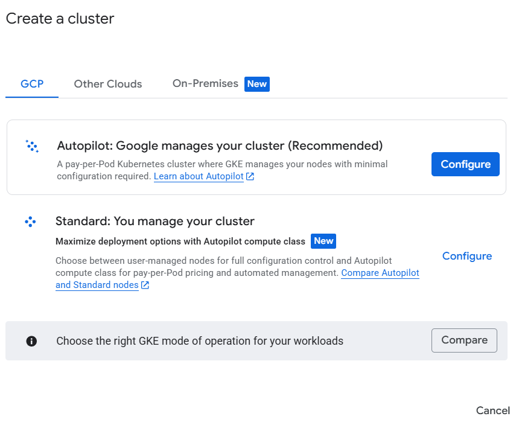
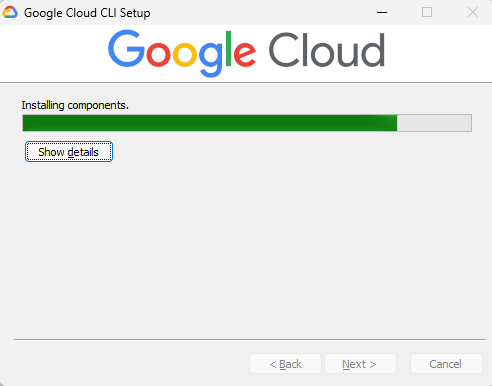
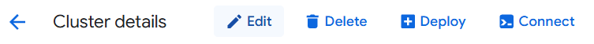
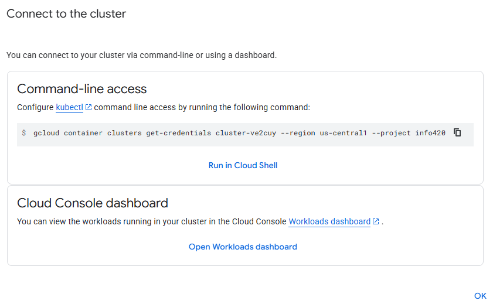
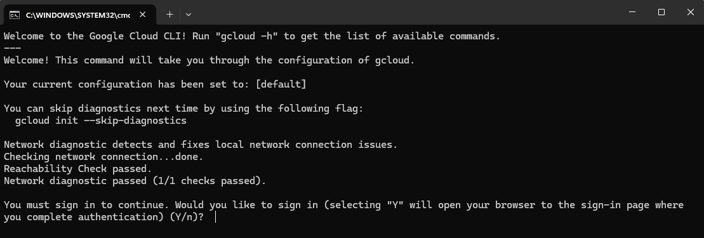
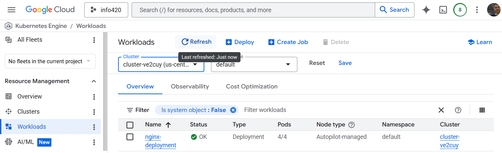
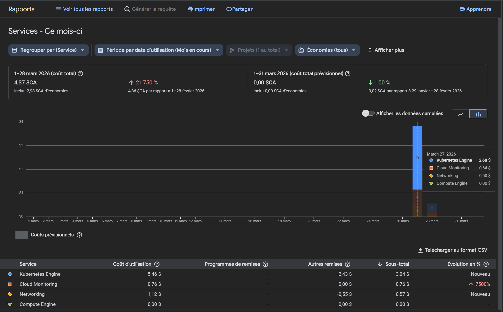

À partir de la console Google-Cloud, créer un cluster Kubernetes



---

## Gérer le cluster en mode local, via un terminal

### Installation de gcloud

**gcloud** est l'outil en ligne de commande (CLI) officiel de Google Cloud Platform (GCP).

Il permet de gérer et d'interagir avec les services Google Cloud directement depuis un terminal : créer et configurer des ressources (machines virtuelles, bases de données, clusters Kubernetes, etc.), déployer des applications, gérer les accès et authentifications, et automatiser des tâches via des scripts.

Voir --> [ici pour l'application](https://docs.cloud.google.com/sdk/docs/install-sdk?hl=fr)

* Téléchager et installer l'application gcloud



---

### Connexion au contexte du cluster sur Google

Voici comment ajouter les informations de connexion du cluster Google au fichier local `.kube/config`:

* 1 - Obtenir la commande de connexion via le console GCloud






```
C:\Users\Etudiant\AppData\Local\Google\Cloud SDK>gcloud container clusters get-credentials cluster-ve2cuy --region us-central1 --project info420

Fetching cluster endpoint and auth data.
CRITICAL: ACTION REQUIRED: gke-gcloud-auth-plugin, which is needed for continued use of kubectl, was not found or is not executable. Install gke-gcloud-auth-plugin for use with kubectl by following https://cloud.google.com/kubernetes-engine/docs/how-to/cluster-access-for-kubectl#install_plugin
kubeconfig entry generated for cluster-ve2cuy.
```

* Au besoin, installer le plugin `gke-gcloud-auth-plugin`





```
gke-gcloud-auth-plugin --version
gcloud components install gke-gcloud-auth-plugin
```

* Au besoin, relancer la commande de connexion

```
$ gcloud container clusters get-credentials cluster-ve2cuy --region us-central1 --project info420
```

* Vérifier les contextes disponibles (via le fichier .kube/config):

```
C:\Users\Etudiant\AppData\Local\Google\Cloud SDK>kubectl config get-contexts
CURRENT   NAME                                     CLUSTER                                  AUTHINFO                                 NAMESPACE
          docker-desktop                           docker-desktop                           docker-desktop
*         gke_info420_us-central1_cluster-ve2cuy   gke_info420_us-central1_cluster-ve2cuy   gke_info420_us-central1_cluster-ve2cuy
```

---

## Tester le cluster

```
kubectl create deployment nginx-deployment \
  --image=nginx:latest \
  --replicas=4 \
  --port=80

kubectl expose deployment nginx-deployment \
  --name=nginx-service \
  --type=LoadBalancer \
  --port=80 \
  --target-port=80
```

## Résultat

```
Etudiantn@DESKTOP-ATGBVNN MINGW64 ~
$ kga
NAME                                    READY   STATUS    RESTARTS   AGE
pod/nginx-deployment-6c4bc789b6-9rh8j   1/1     Running   0          3m53s
pod/nginx-deployment-6c4bc789b6-lpkm6   1/1     Running   0          3m53s
pod/nginx-deployment-6c4bc789b6-pns6d   1/1     Running   0          3m53s
pod/nginx-deployment-6c4bc789b6-wcf6x   1/1     Running   0          3m53s

NAME                    TYPE           CLUSTER-IP       EXTERNAL-IP      PORT(S)        AGE
service/kubernetes      ClusterIP      34.118.224.1     <none>           443/TCP        25d
service/nginx-service   LoadBalancer   34.118.228.244   34.135.217.192   80:31104/TCP   98s

NAME                               READY   UP-TO-DATE   AVAILABLE   AGE
deployment.apps/nginx-deployment   4/4     4            4           3m53s

NAME                                          DESIRED   CURRENT   READY   AGE
replicaset.apps/nginx-deployment-6c4bc789b6   4         4         4       3m53s
```

---

## Consulter l'état du déploiment via la console GCloud



---

## Exemple de facturation d'un cluster K8s sur Google.cloud

* Cluster de type auto-pilote (Le moins dispendieux)
* nginx avec 4 réplicas (Un petit déploiement)
* Un load-Balancer externe (Adresse IP publique)

Pour un total d'environ 4$ pour 24 heures



---

## Crédits

*Document rédigé par Alain Boudreault © 2021-2026*  
*Version 2026.04.22.1*  
*Site par [ve2cuy](https://ve2cuy.com)*