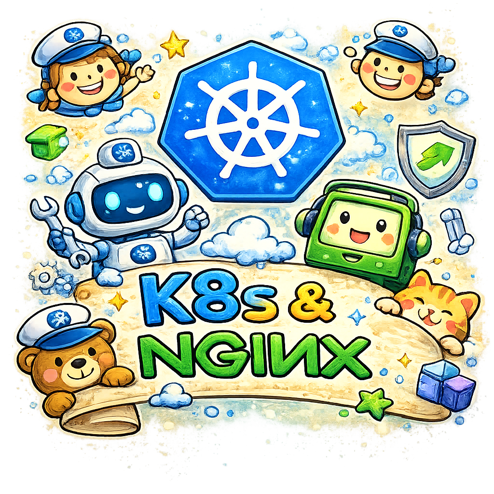

# Introduction aux commandes de base de `kubectl`
<p align="center">
    
</p>

## 1 - Créer un pod (run)

```
kubectl run nginx-pod --image=nginx:latest --port=80

# 1.1 - État du pod
kubectl get pod nginx-pod

# 1.2 - Détails complets
kubectl describe pod nginx-pod

#1.3 - Port-forward pour tester localement
kubectl port-forward pod/nginx-pod 8080:80

# ATTENTION -> Dans un autre terminal
curl http://localhost:8080

# 1.4 - Effacer le pod
kubectl delete pod/nginx-pod

# 1.5 - Créer un pod interactif

kubectl run test -it --image=busybox
kubectl attach test -c test -i -t
```

---

## 2 - Déployer 4 nginx (create deployment)
```
kubectl create deployment nginx-deployment \
  --image=nginx:latest \
  --replicas=4 \
  --port=80

kubectl get pod -o wide
# Tester avec curl
```

Note: 💡 `kubectl create` est pour les ressources de haut niveau (Deployment, Service, etc.). `kubectl run` est la commande dédiée à la création de pods.

## 3 - Exposer via une adresse locale commune (expose)

```
kubectl expose deployment nginx-deployment \
  --name=nginx-service \
  --port=80 \
  --target-port=80  
  # Défaut: --type=ClusterIP

kubectl get svc -o wide
kubectl describe service/nginx-service
# IP:                       10.98.105.164
# Endpoints:                10.244.0.7:80,10.244.2.5:80,10.244.1.7:80 + 1 more...
# Tester IP avec curl
```

## 4 - Effacer une ressource (delete)
```
# Effacer le svc nginx-service:
kubectl delete service/nginx-service
```

## 5 - Exposer via une adresse publique (expose) 

* Note: Sous Docker-Desktop = localhost

```
kubectl expose deployment nginx-deployment \
  --name=nginx-service \
  --type=LoadBalancer \
  --port=80 \
  --target-port=80
```

---

## 6 - M-A-J du nombre de replicas (scale)

```
kubectl scale deployment nginx-deployment --replicas=12

# Voir les pods se créer en temps réel
# NOTE: Faire la démo avec deux terminaux
kubectl get pods -l app=nginx-deployment --watch

# Via patch JSON
kubectl patch deployment nginx-deployment \
  -p '{"spec": {"replicas": 6}}'

# Éditer directement le manifest en live
kubectl edit deployment nginx-deployment
# Change replicas: 4 → 12, sauvegarde et ferme
```

---

## 7 - Exécuter une commande dans un pod

```
kubectl exec -it nginx-deployment-6d95bc85cf-8qsc7 -- bash
cd /usr/share/nginx/html 
echo "Mon site web" > index.html
curl nginx-service # Il est possible d'utiliser le nom d'un service grace au DNS de K8s
exit

# 7.1 - Tester avec curl sur le POD puis sur le service
curl 10.244.1.14 # Mon site web
curl 10.97.12.45 # Plusieurs fois ...
```

---

## 8 - Obtenir le log d'un pod

```
kubectl logs nginx-deployment-6d95bc85cf-8qsc7 
kubectl logs nginx-deployment-6d95bc85cf-8qsc7 -f  // En continu
```

---
## 9 - Utilisation d'un manifeste

Tout comme pour Docker, il est possible de créer des ressources K8s en utilisant YAML.  Ces fichiers de directives sont nommés `Manifestes`.

* Astuce, laisser à K8s le soins de créer la structure de départ du manifeste.  Par exemple, 

### 9.1 - Création de Pods avec un manifeste de déploiement

* Générer le manifeste du déploiement
```
kubectl create deployment nginx-deployment \
  --image=nginx:latest \
  --replicas=4 \
  --port=80 \
  --dry-run=client -o yaml > nginx-deployment.yml
```

* Générer le manifeste du servcice
```
kubectl expose deployment nginx-deployment \
  --name=nginx-service \
  --type=LoadBalancer \
  --port=80 \
  --target-port=80 \
  --dry-run=client -o yaml > nginx-svc.yml    

#  NOTE - ports:
#  - port: 8080        # le client appelle http://service:8080
#    targetPort: 80    # Kubernetes redirige vers le port 80 du conteneur
```

* Voici le résultat:

```
apiVersion: apps/v1
kind: Deployment
metadata:
  labels:
    app: nginx-deployment
  name: nginx-deployment
spec:
  replicas: 4
  selector:
    matchLabels:
      app: nginx-deployment
  strategy: {}
  template:
    metadata:
      labels:
        app: nginx-deployment
    spec:
      containers:
      - image: nginx:latest
        name: nginx
        ports:
        - containerPort: 80
        resources: {}
status: {} # Non requis!

---
apiVersion: v1
kind: Service
metadata:
  labels:
    app: nginx-deployment
  name: nginx-service
spec:
  ports:
  - port: 80
    protocol: TCP
    targetPort: 80
  selector:
    app: nginx-deployment
  type: LoadBalancer
status:             # Non requis!
  loadBalancer: {}  # Non requis!
```

* Appliquer les manifestes:
```
kubectl apply -f nginx-deployment.yml
kubectl apply -f nginx-svc.yml

kubectl get all -o wide

# ---------------------------------------------------------------
# Remarquez les sélecteurs, ils servent de lien entre les objets.
# ---------------------------------------------------------------

NAME                    TYPE           CLUSTER-IP      EXTERNAL-IP   PORT(S)        AGE   SELECTOR
service/nginx-service   LoadBalancer   10.109.34.172   <pending>     80:31404/TCP   5s    app=nginx-deployment

NAME                               READY   UP-TO-DATE   AVAILABLE   AGE   CONTAINERS   IMAGES         SELECTOR
deployment.apps/nginx-deployment   4/4     4            4           5s    nginx        nginx:latest   app=nginx-deployment

NAME                                          DESIRED   CURRENT   READY   AGE   CONTAINERS   IMAGES         SELECTOR
replicaset.apps/nginx-deployment-6d95bc85cf   4         4         4       5s    nginx        nginx:latest   app=nginx-deployment,pod-template-hash=6d95bc85cf

```

💡Il est possible de combiner les deux manifestes dans un seul fichier.  Il suffit de séparer les sections par `---`.

---

## 10 - Utilisation d'un conteneur d'initialisation

* nginx avec une page personnalisée

```
# Fichier: nginx-avec-init.yml
apiVersion: v1
kind: Pod
metadata:
  name: nginx-pod
spec:
  initContainers:
    - name: init-html
      image: alpine:latest
      command:
        - sh
        - -c
        - "apk add --no-cache git && git clone https://github.com/ve2cuy/superminou-depart /test"
      volumeMounts:
        - name: html
          mountPath: /test

  containers:
    - name: nginx
      image: nginx:latest
      ports:
        - containerPort: 80
      volumeMounts:
        - name: html
          mountPath: /usr/share/nginx/html

  volumes:
    - name: html
      emptyDir: {}
```

Note: {} signifie un objet vide — c'est la syntaxe YAML pour dire "utilise les valeurs par défaut". C'est équivalent à :

```
volumes:
  - name: html
    emptyDir:
      medium: ""        # stockage sur disque (défaut)
      sizeLimit: null   # pas de limite de taille
```

Le volume est créé **sur le nœud (node) qui héberge le pod**, dans un dossier temporaire géré par Kubernetes :
```
/var/lib/kubelet/pods/<pod-uid>/volumes/kubernetes.io~empty-dir/html/
```

---


### 10.1 - Dépendance entre le conteneur `init` et les autres

La dépendance est native dans Kubernetes — c'est le comportement par défaut des init containers :

Comportement garanti par Kubernetes
initContainers → s'exécutent en séquence, un par un
                ↓ seulement si exitCode = 0
containers     → démarrent uniquement quand TOUS les init containers sont terminés avec succès

Donc :

Nginx ne démarrera jamais si init-html échoue ou plante.

Si `init-html` plante, Kubernetes le redémarre jusqu'à ce qu'il réussisse
Nginx attend obligatoirement que le fichier soit écrit avant de démarrer.

* Vérifier la séquence en temps réel
  
```bash
kubectl apply -f 
kubectl get pod nginx-pod --watch

NAME        READY   STATUS           RESTARTS
nginx-pod   0/1     Init:0/1         0          # init container en cours
nginx-pod   0/1     PodInitializing  0          # init terminé, nginx démarre
nginx-pod   1/1     Running          0          # nginx prêt
```

---


