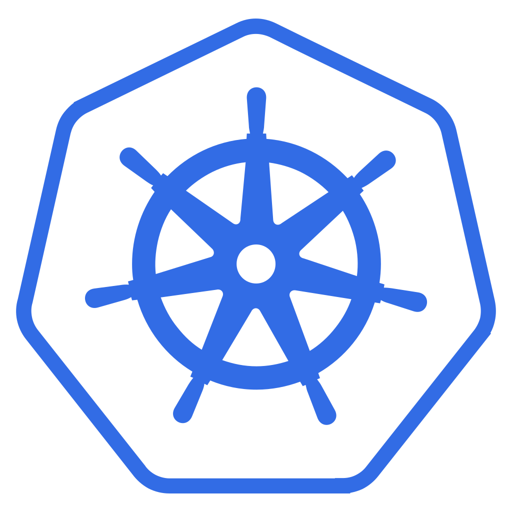
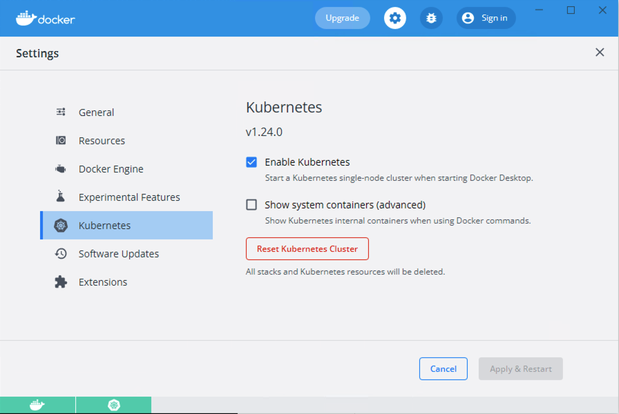
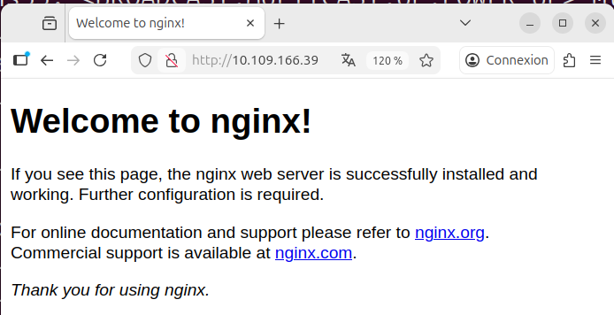

# Kubernetes – Introduction

*Date: 14 février 2021 - Révision du 2025.12.05*
TODO: Valider le document
---

<p align="center">
    
</p>


## 1 – Qu'est-ce que Kubernetes (grec pour « timonier ») ?

À l'origine développé par Google, [Kubernetes](https://kubernetes.io/fr/) est un projet 'open-source' d'[orchestration](https://fr.wikipedia.org/wiki/Orchestration_informatique) de conteneurs conçu pour automatiser le déploiement, la mise à l'échelle ainsi que la gestion d'applications conteneurisées. La version 1.0 de Kubernetes a été publiée en 2015.

Kubernetes s'est imposé comme le standard de facto pour l'orchestration de conteneurs et est le projet phare de la [Cloud Native Computing Foundation (CNCF)](https://www.cncf.io/), soutenu par des acteurs clés tels que Google, AWS, Microsoft, IBM, Intel, Cisco et Red Hat.

### En bref

* Développé à l'origine par Google (projet **Borg** – comme dans **Star Trek**)
* Kubernetes, aussi nommé **K8s**, est un projet source ouvert (open source) d'orchestration de conteneurs
  + ***Fun fact**: Le nom original de Kubernetes en interne fut 'Project Seven', en référence au personnage de Star Trek, 7 of 9. Les sept rayons de la barre du logo de Kubernetes sont une référence au nom original.*
* Permet de gérer et de déployer, en utilisant une approche descriptive via un manifeste YAML – *par exemple, j'aimerais avoir 50 instances nginx* – des applications conteneurisées proposant, parfois, des centaines de micro-services

### 1.1 – Les avantages des outils d'orchestration de K8s

* Forte disponibilité des services (peu de moments de panne)
* Évolution du système en fonction de la demande, haute performance
* Récupération simplifiée en cas de catastrophe – sauvegarde et restauration

### 1.2 – Les particularités

1. Kubernetes permet un déploiement rapide des applications
2. Kubernetes propose une utilisation efficace des ressources (moins coûteux en ressources que des VM)
3. Kubernetes est fortement intégré aux services des fournisseurs de solutions en nuage: *Amazon AWS*, *Linode*, *Microsoft Azure*, *Google Cloud Platform*
4. Les fournisseurs de solutions en nuage proposent des solutions Kubernetes clé en main: serveurs maîtres, nœuds et répartiteurs de charges déjà installés

### 1.3 – [Les composantes de Kubernetes](https://kubernetes.io/fr/docs/concepts/overview/components/)

1. **Le(s) serveur(s) maître(s) (master node)**
   * L'API du serveur (API Server)
   * L'ordonnanceur (Scheduler)
   * Le gestionnaire de contrôle (Controller Manager)
   * etcd (informations, paires clé/valeur, sur l'état du système)

2. **Les nœuds (ou nœuds ouvriers – worker node)**
   * Processus `kube-proxy`
     - Gestion du réseau IP
     - Équilibreur de tâches
   * Processus `kubelet`
     - Gestion de l'état du nœud
     - Démarrage, arrêt et maintenance des conteneurs (pods)
     - Optimisation de la performance en concordance avec le plan de déploiement
   * Un conteneur `runtime`. Habituellement, *docker runtime*

3. **Pod**, la plus petite unité sous K8s, une abstraction de conteneur, dans le but de ne pas être lié à une technologie (par exemple, Docker)
   * Règle générale, un service par Pod. Mais il peut y en avoir plus
   * Chaque Pod obtient une adresse IP à l'intérieur d'un réseau K8s
   * Les Pods sont éphémères. Lors de la mise hors service d'un Pod, un autre sera créé et une nouvelle adresse IP lui sera attribuée
   * Dans le but d'assurer un accès IP prévisible, K8s propose l'objet de type 'Service'
     - Les services sont de type (Attention, ne pas confondre service et micro-service):
       * **internes**, par exemple, une base de données interne, ou
       * **externes**, par exemple, l'accès à une application web

4. **Le Déploiement** (objet YAML)
   * À partir d'un manifeste descriptif du système donné:
     - Déploiement d'images
     - Déploiement de services (accès réseaux)

5. **Le ReplicaSet**

6. **Le DaemonSet**

7. **L'espace de nom (NameSpace)**
   * Pour regrouper (isoler) les Pods en sous-systèmes

8. **Les étiquettes (Labels)**

9. **Les StatefulSets**
   * Utilisés pour le déploiement de bases de données

10. **Le CLI de K8s, kubectl**

Voici un schéma présentant l'architecture de base de Kubernetes:


### Helm

[Helm](https://helm.sh/) est un registre de gestion de packages d'applications pour K8s.

[artifacthub.io](https://artifacthub.io)

---

## 👉 **Note**: Si l'apprentissage passe par Docker-Desktop ou bien un cluster local alors il faut sauter à la section [Action 2.2](#action_2_2)

---

## 2 – Minikube et kubectl

### Description

Minikube est un environnement local de tests de la technologie Kubernetes.

C'est un système qui est proposé à l'intérieur d'une VM et qui permet d'apprendre la plupart des aspects de K8s sans avoir à installer un(des) serveur(s) maître(s) et des nœuds (ouvrier/worker). La VM de Minikube est configurée avec un nœud 'maître/ouvrier'.

La commande `cli` standard de gestion de l'environnement K8s, `kubectl`, est disponible pour gérer le système Minikube.

### Pré-requis

* Installation de [minikube](https://minikube.sigs.k8s.io/docs/start/)
* Installation de [kubectl](https://kubernetes.io/fr/docs/tasks/tools/install-kubectl/)

Voir <https://kind.sigs.k8s.io> ou Docker-desktop comme alternative.

### Action 2.1 – Démarrage de minikube

```bash
minikube start

# Résultat attendu:
# minikube v1.16.0 sur Darwin 10.15.4
# minikube 1.17.1 est disponible ! Téléchargez-le ici : https://github.com/kubernetes/minikube/releases/tag/v1.17.1
# To disable this notice, run: 'minikube config set WantUpdateNotification false'
#
# Utilisation du pilote docker basé sur le profil existant
# Démarrage du noeud de plan de contrôle minikube dans le cluster minikube
# Pulling base image ...
# docker "minikube" container est manquant, il va être recréé.
# Creating docker container (CPUs=2, Memory=1988MB) ...
# Préparation de Kubernetes v1.20.0 sur Docker 20.10.0...
#    Generating certificates and keys ...
#    Booting up control plane ...
#    Configuring RBAC rules ...
# Verifying Kubernetes components...
# Enabled addons: storage-provisioner, default-storageclass
# Done! kubectl is now configured to use "minikube" cluster and "default" namespace by default
```

**Note**: Par défaut, le gestionnaire d'amas devrait démarrer en utilisant le pilote de VM de Docker.

### Action 2.1.1 – Afficher l'état du service

```bash
minikube status

# Résultat:
# minikube
# type: Control Plane
# host: Running
# kubelet: Running
# apiserver: Running
# kubeconfig: Configured
# timeToStop: Nonexistent
```

### Alternative de démarrage de minikube

#### 2.1b – Démarrer un amas (cluster) en utilisant le pilote VM de VirtualBox

```bash
minikube start --driver=virtualbox

# NOTE: Suite à un problème de détection de la fonction BIOS VT-x dans les Lab D-139 et D-137,
# il faut ajouter l'option --no-vtx-check au démarrage de minikube sous pilote virtualbox.

# Au besoin, la commande suivante, dans PowerShell admin, pourra aider:
# bcdedit /set hypervisorlaunchtype off

# Démarrage avec Hyper-v
minikube start --driver=hyperv --force
```

#### 2.1c – Renseigner virtualbox comme pilote VM par défaut

```bash
minikube config set driver virtualbox
```

#### 2.1d – Démarrer Minikube avec un contrôle des ressources

```bash
minikube start \
  --driver=docker \
  --container-runtime=docker \
  --cpus 4 \
  --memory 8192

# Driver: virtualbox, parallels, vmwarefusion, hyperkit, vmware, docker, podman (def to auto-detect)
```

#### 2.1e – Démarrer un amas multi-nœud

```bash
minikube start --nodes 2 -p demo-multinode
```

**Référence:** [Démarrage de minikube](https://minikube.sigs.k8s.io/docs/start/)

---

### Action 2.1.2 – Lister les modules (addons) de Minikube

```bash
minikube addons list

# Résultat:
# |-----------------------------|----------|--------------|
# |         ADDON NAME          | PROFILE  |    STATUS    |
# |-----------------------------|----------|--------------|
# | ambassador                  | minikube | disabled     |
# | csi-hostpath-driver         | minikube | disabled     |
# | dashboard                   | minikube | enabled ✅   |
# | default-storageclass        | minikube | enabled ✅   |
# | efk                         | minikube | disabled     |
# | freshpod                    | minikube | disabled     |
# | gcp-auth                    | minikube | disabled     |
# | gvisor                      | minikube | disabled     |
# | helm-tiller                 | minikube | disabled     |
# | ingress                     | minikube | enabled ✅   |
# | ingress-dns                 | minikube | disabled     |
# | istio                       | minikube | disabled     |
# | istio-provisioner           | minikube | disabled     |
# | kubevirt                    | minikube | disabled     |
# | logviewer                   | minikube | disabled     |
# | metallb                     | minikube | disabled     |
# | metrics-server              | minikube | disabled     |
# | nvidia-driver-installer     | minikube | disabled     |
# | nvidia-gpu-device-plugin    | minikube | disabled     |
# | olm                         | minikube | disabled     |
# | pod-security-policy         | minikube | disabled     |
# | registry                    | minikube | disabled     |
# | registry-aliases            | minikube | disabled     |
# | registry-creds              | minikube | disabled     |
# | storage-provisioner         | minikube | enabled ✅   |
# | storage-provisioner-gluster | minikube | disabled     |
# | volumesnapshots             | minikube | disabled     |
# |-----------------------------|----------|--------------|
```

---

### 2.1.3 – Utilisation de minikube avec le pilote 'Docker' (si problème avec le pilote virtualbox)

```bash
# Installer (ou configurer) Docker-Desktop avec wsl2
# - Pas d'Hyper-V

# Ajouter le support 'kubernetes' dans Docker-Desktop (voir l'image suivante)

# Au besoin, effacer ancienne VM Virtualbox
minikube delete

# Démarrer avec pilote Docker
minikube start --driver=docker

# Pas besoin de renseigner la clé 'nodePort: 300xx' dans le service.

# Activer un tunnel avec minikube pour l'accès aux services de type LoadBalancer
minikube tunnel

# Tester dans le fureteur en utilisant l'adresse 'localhost:PortDuService'
# Par exemple, http://localhost:8080
```
TODO: À retirer du document



### 2.1.4 – Exemple d'un manifeste pour un service utilisant le pilote 'Docker' avec minikube

```yaml
# #################################################################
# Service pour NextCloud
# #################################################################
apiVersion: v1
kind: Service
metadata:
  name: service-nextcloud
spec:
  selector:
    app: nextcloud
  type: LoadBalancer
  ports:
    - name: http
      protocol: TCP
      port: 81
      targetPort: 80
      nodePort: 30081  # Pas requis avec le pilote 'Docker'
```


---

## Kubernetes – Introduction (suite)

<a id="action_2_2"></a>
### 👉 Action 2.2 – Interaction avec l'amas (cluster) de nœuds (les serveurs)

La commande `kubectl`

```bash
kubectl get nodes

# Résultat:
# NAME           STATUS   ROLES                  AGE    VERSION
# monCluster     Ready    control-plane,master   106s   v1.20.0
```

**NOTE:** Selon la configuration du cluster, il est possible qu'il n'y ait qu'un seul nœud, le `master/worker` (serveur maître/ouvrier) qui est le gestionnaire de l'orchestration et aussi le nœud ouvrier.

### Action 2.3 – Obtenir la liste des 'pods'

Le pod est une abstraction du conteneur.

```bash
kubectl get pod

# Résultat:
# No resources found in default namespace.
```

**Note**: Vide, nous n'avons pas encore lancé de déploiement.

### Action 2.4 – Obtenir la liste des 'services'

```bash
kubectl get services

# Résultat:
# NAME         TYPE        CLUSTER-IP   EXTERNAL-IP   PORT(S)   AGE
# kubernetes   ClusterIP   10.96.0.1    <none>        443/TCP   7m15s
```

**Note:** Un seul service, par défaut, qui renseigne sur le réseau de l'amas.

**Nous allons maintenant ajouter des pods à notre système.**

### Action 2.5 – Afficher l'aide de la commande create

```bash
kubectl create -h

# Résultat:
# Create a resource from a file or from stdin.
# 
# JSON and YAML formats are accepted.
# 
# Examples:
#   # Create a pod using the data in pod.json.
#   kubectl create -f ./pod.json
#   
#   # Create a pod based on the JSON passed into stdin.
#   cat pod.json | kubectl create -f -
#   
#   # Edit the data in docker-registry.yaml in JSON then create the resource using the edited data.
#   kubectl create -f docker-registry.yaml --edit -o json
# 
# Available Commands:
#   clusterrole         Create a ClusterRole.
#   clusterrolebinding  Create a ClusterRoleBinding for a particular ClusterRole
#   configmap           Create a configmap from a local file, directory or literal value
#   cronjob             Create a cronjob with the specified name.
#   deployment          Create a deployment with the specified name.
#   job                 Create a job with the specified name.
# ...
```

**NOTE:** Avec Kubernetes, le `pod` est la plus petite unité possible d'une application. Ils sont habituellement créés par l'intermédiaire d'un `deployment`. L'objet `deployment` permet d'assurer la présence constante des `pods` constituant une application.

### Action 2.5.1a – Créer un pod

```bash
kubectl run ma-alpine --image=alpine

# Résultat:
# pod/ma-alpine created

kubectl get pod
# NAME        READY   STATUS              RESTARTS   AGE
# ma-alpine   0/1     ContainerCreating   0          5s

kubectl get pod
# NAME        READY   STATUS             RESTARTS   AGE
# ma-alpine   0/1     CrashLoopBackOff   1          9s
```

**Note**: Le Pod de type 'alpine' n'a rien à exécuter alors il est terminé puis, redémarré à l'infini.

Nous allons l'effacer:

```bash
kubectl delete pod ma-alpine

# Résultat:
# pod "ma-alpine" deleted
```

Alternative de création pour prévenir le 'CrashLoopBackOff':

```bash
kubectl run ma-alpine --image=alpine --restart=Never

kubectl get pods
# NAME        READY   STATUS      RESTARTS   AGE
# ma-alpine   0/1     Completed   0          34s
```

### Action 2.5.1b – Générer un manifeste YAML à partir d'une commande en ligne

```bash
kubectl run ma-alpine --image=alpine --restart=Never --dry-run=client -oyaml

# =========================================================================
# Résultat à l'écran:
# apiVersion: v1
# kind: Pod
# metadata:
#   labels:
#     run: ma-alpine
#   name: ma-alpine
# spec:
#   containers:
#   - image: alpine
#     name: ma-alpine
#     resources: {}
#   dnsPolicy: ClusterFirst
#   restartPolicy: Never
# status: {}
# =========================================================================

# Sauvegarder le résultat dans un fichier
kubectl run ma-alpine --image=alpine --restart=Never --dry-run=client -oyaml > creer-pod-alpine.yaml

# NOTE: Nous utiliserons des manifestes un peu plus tard pour créer des ressources K8s
# Par exemple
kubectl delete pod ma-alpine
kubectl apply -f creer-pod-alpine.yaml
```

---

### Action 2.5.2 – Créer un pod 'interactif'

```bash
kubectl run ma-alpine -it --image=alpine
# / # exit

# Pour s'y reconnecter:
kubectl attach ma-alpine -c ma-alpine -i -t
```

**Tester** avec Ctrl+PQ

---

### Action 2.6 – Créer un pod à partir d'un déploiement

```bash
# Syntaxe:
# kubectl create deployment NAME --image=image [--dry-run=client] [options]

kubectl create deployment serveur-web --image=nginx

# Résultat:
# deployment.apps/serveur-web created

# NOTE: voici le regex du nom
# [a-z0-9]([-a-z0-9]*[a-z0-9])?(\.[a-z0-9]([-a-z0-9]*[a-z0-9])?)*')
```

**Note:** Comme pour Docker, les images sont téléchargées à partir de hub.docker.com.

### Action 2.7 – Afficher les déploiements et les pods

```bash
kubectl get deployment
# NAME          READY   UP-TO-DATE   AVAILABLE   AGE
# serveur-web   1/1     1            1           91s

kubectl get pod
# NAME                           READY   STATUS    RESTARTS   AGE
# serveur-web-54bf66d477-4gxtx   1/1     Running   0          3m33s
```

**NOTE:** Entre le déploiement et le pod, il y a une autre couche d'abstraction nommée `replicaset`.

```bash
kubectl get replicaset

# NAME                     DESIRED   CURRENT   READY   AGE
# serveur-web-54bf66d477   1         1         1       8m40s
```

Le `replicaset` permet de gérer les répliques – le nombre d'instances – d'un `pod`.

**NOTE:** Nous n'avons pas à interagir avec les `replicaset`. Nous le ferons avec les déploiements et les pods.

### Action 2.7.2 – Interagir avec un pod

```bash
kubectl exec -it serveur-web-54bf66d477-8ctwr -- bash
```

### Action 2.7.3 – Exposer le port du serveur Web via le(s) pod(s)

```bash
kubectl expose deployment serveur-web --port=80

kubectl get svc -owide
# NAME             TYPE           CLUSTER-IP       EXTERNAL-IP   PORT(S)        AGE    SELECTOR
# kubernetes       ClusterIP      10.96.0.1        <none>        443/TCP        156m   <none>
# serveur-web      ClusterIP   -->10.111.198.207   <none>        80/TCP         21m    app=serveur-web

curl 10.111.198.207

# Résultat:
# <!DOCTYPE html>
# <html>
# <head>
# <title>Welcome to nginx!</title>
# ...
# <p><em>Thank you for using nginx.</em></p>
# </body>
# </html>

# Changer le nombre de réplicats:
kubectl scale deploy serveur-web --replicas=5

kubectl get pods -owide
```

---

### Résumé

Prenons une pause ici pour mettre le tout en contexte. Qu'avons-nous fait? Nous avons démarré un service Web. Au départ il se peut que le service soit peu sollicité.

Avec le temps, si nous sommes chanceux, il sera de plus en plus sollicité. Puis à un certain moment, l'unique instance de notre service ne sera plus en mesure de répondre à la demande, nous devenons de plus en plus populaires.

Avec notre amas Kubernetes, il sera facile de dupliquer le service web sur d'autres serveurs.

En bref:

* Un `Deployment` permet la gestion d'un `ReplicaSet`
* Un `ReplicaSet` permet la gestion de tous les duplicatas d'un `Pod`
* Un `Pod` est une abstraction d'un conteneur

Et tout ce qui est sous le déploiement est géré par Kubernetes.

Voici la suite.

### 2.8 – Le manifeste de déploiement – un fichier YAML

Pour assurer la gestion correcte du déploiement, K8s a généré un manifeste de déploiement. Plus tard, nous verrons comment renseigner nos propres manifestes. Ce schéma contient des informations telles que: le nombre de duplicatas requis, la version des images, les ports exposés, etc.

Le fichier est constitué de trois sections:

1. Les Métadonnées (`metadata:`)
2. Les spécifications (`spec:`)
3. Ainsi que l'état du système (`status:`)

Les informations des manifestes sont stockées sur le nœud maître dans la bibliothèque `etcd`.

### Action 2.8.1 – Édition du manifeste de déploiement

```bash
kubectl edit deployment serveur-web

# ---
# Please edit the object below. Lines beginning with a '#' will be ignored,
# and an empty file will abort the edit. If an error occurs while saving this file will be
# reopened with the relevant failures.
#
# apiVersion: apps/v1
# kind: Deployment
# metadata:
#   annotations:
#     deployment.kubernetes.io/revision: "1"
#   creationTimestamp: "2021-02-14T20:43:58Z"
#   generation: 1
#   labels:
#     app: serveur-web
#   name: serveur-web
#   namespace: default
#   resourceVersion: "1827"
#   uid: 6384e7aa-0e00-4313-b485-cc8d1212e720
# spec:
#   progressDeadlineSeconds: 600
#   replicas: 1
#   revisionHistoryLimit: 10
#   selector:
#     matchLabels:
#       app: serveur-web
#   strategy:
#     rollingUpdate:
#       maxSurge: 25%
#       maxUnavailable: 25%
#     type: RollingUpdate
#   template:
#     metadata:
# ...
```

**NOTE:** Lors de la création du déploiement, `k8s` a généré un fichier de configuration avec des valeurs par défaut.

### Action 2.9 – Apportons une modification au fichier de configuration

Version `nginx:1.18-alpine-perl`

* **Remplacer la ligne: `- image: nginx` par `- image: nginx:1.18-alpine-perl`**

**NOTE:** Nous sommes dans 'vi'. Il faut appuyer sur la touche 'i' pour passer en mode édition.

```bash
kubectl edit deployment serveur-web

# Remplacer: - image: nginx par, - image: nginx:1.18-alpine-perl

#     spec:
#       containers:
#       - image: nginx:1.18-alpine-perl
#         imagePullPolicy: Always
#         name: nginx
```

**NOTE:** Dans l'éditeur 'vi'. Pour enregistrer et quitter: 'ESC:wq'.

Il est possible de renseigner un autre éditeur via la variable d'environnement "KUBE_EDITOR"

```bash
export KUBE_EDITOR="code -w"
export KUBE_EDITOR="nano"

kubectl edit deployment serveur-web
# deployment.apps/serveur-web edited
```

### Action 2.10 – Afficher le résultat

```bash
kubectl get pod
# NAME                           READY   STATUS    RESTARTS   AGE
# serveur-web-6589df7667-vzzq4   1/1     Running   0          101s
```

**NOTE:** Remarquez la modification du nom du 'pod'. De plus, suite à la modification, le déploiement a été automatique.

### Action 2.11 – Afficher l'historique des duplicatas

```bash
kubectl get replicaset
# NAME                     DESIRED   CURRENT   READY   AGE
# serveur-web-54bf66d477   0         0         0       54m
# serveur-web-6589df7667   1         1         1       4m56s
```

**NOTE:** Pas de 'pods' dans la version précédente: `serveur-web-54bf66d477 0 0 0 54m`

### Action 2.11.2 – Afficher le log d'un pod

```bash
kubectl logs serveur-web-54bf66d477-8ctwr

# Résultat:
# /docker-entrypoint.sh: /docker-entrypoint.d/ is not empty, will attempt to perform configuration
# /docker-entrypoint.sh: Looking for shell scripts in /docker-entrypoint.d/
# /docker-entrypoint.sh: Launching /docker-entrypoint.d/10-listen-on-ipv6-by-default.sh
# 10-listen-on-ipv6-by-default.sh: info: Getting the checksum of /etc/nginx/conf.d/default.conf
# 10-listen-on-ipv6-by-default.sh: info: Enabled listen on IPv6 in /etc/nginx/conf.d/default.conf
# /docker-entrypoint.sh: Launching /docker-entrypoint.d/20-envsubst-on-templates.sh
# /docker-entrypoint.sh: Launching /docker-entrypoint.d/30-tune-worker-processes.sh
# /docker-entrypoint.sh: Configuration complete; ready for start up
```

### Action 2.11.3 – Obtenir une liste exhaustive d'informations sur un pod

```bash
kubectl describe pod serveur-web-54bf66d477-8ctwr

# Résultat:
# Name:         serveur-web-54bf66d477-8ctwr
# Namespace:    default
# Priority:     0
# Node:         minikube/192.168.99.100
# Start Time:   Sat, 20 Mar 2021 17:47:22 -0400
# Labels:       app=serveur-web
#               pod-template-hash=54bf66d477
# Annotations:  <none>
# Status:       Running
# IP:           172.17.0.2
# IPs:
#   IP:           172.17.0.2
# Controlled By:  ReplicaSet/serveur-web-54bf66d477
# Containers:
#   nginx:
# ...
```

**Note:** Il est possible d'appliquer la commande précédente sur d'autres objets. Par exemple, `kubectl describe deployments`.

### Labo 2.12 – Exercice

Renseigner 3 duplicatas dans le schéma puis, afficher la liste des pods.

### Action 2.13 – Effacer un déploiement

```bash
kubectl delete deployment serveur-web

kubectl get deployment
kubectl get replicaset
kubectl get pod
```

---

## 3 – Renseigner un manifeste de déploiement

### 3.0 – Manifeste d'un Pod

#### Action 3.0.1 – Manifeste d'un Pod, renseigner le fichier uneAlpine.yml

```yaml
# ------------------------------------------------------------
# Fichier: uneAlpine.yml
# Exemple d'un manifeste pour un Pod avec des variables d'env.
# k apply -f uneAlpine.yml
# k logs meta-une-alpine
# ------------------------------------------------------------
apiVersion: v1
kind: Pod
# Section 1 - Les Méta-données
metadata:
  name: meta-une-alpine
# Section 2 - Les spécifications
spec:
  containers:
  - name: ma-alpine
    image: alpine
    command: ["/bin/sh", "-c",  "env"]
    env:
    - name: ENV01
      value: YoDouloudou
    - name: ENV02
      value: Coucou  
  restartPolicy: Never
```

**Note:** Remarquer le type du manifeste – `kind: Pod`.

#### Action 3.0.2 – Déployer le système

```bash
kubectl apply -f uneAlpine.yml
# pod/meta-une-alpine created

kubectl get pod
# NAME                           READY   STATUS      RESTARTS   AGE
# meta-une-alpine                0/1     Completed   0          92s
```

**Note:** Remarquer le 'STATUS: Completed'

#### Action 3.0.3 – Afficher les logs du déploiement précédent

```bash
kubectl logs meta-une-alpine

# Résultat:
# KUBERNETES_PORT=tcp://10.96.0.1:443
# NGINX_SERVICE_SERVICE_PORT=80
# ENV01=YoDouloudou
# ENV02=Coucou
```

#### Action 3.0.3.1 – Faire un test

```yaml
kind: Pod
# Section 1 - Les Méta-données
metadata:
  # Placer 'name' en commentaire et appliquer le manifeste
  #name: meta-une-alpine
```

Résultat?

#### Action 3.0.3.2 – Effacer le résultat d'un manifeste

```bash
kubectl delete -f nomDuManifeste.yml
```

#### Action 3.0.4 – Manifeste d'un Pod avec deux conteneurs

Fichier `alpine-v2.yml`:

```yaml
# ---------------------------------------------------------
# Fichier: alpine-v2.yml
# Auteur:  Alain Boudreault
# Exemple d'un manifeste avec deux conteneurs dans un Pod
# ---------------------------------------------------------
# Lister les conteneurs d'un Pod
# $ k get pods alpine-v2 -o json > resultat.json
# $ k describe po alpine-v2
 
apiVersion: v1
kind: Pod
metadata:
  name: alpine-v2
  # namespace: default
spec:
  containers:
  - image: alpine
    name: conteneur-alpine01
    stdin: true
    tty: true
#  restartPolicy: Always
  - image: alpine
    # Fournir une tâche à exécuter pour le conteneur
    # Sinon, il va s'arrêter.
    command: [ "/bin/sh", "-c", "while true; do sleep 5; done;" ]
    imagePullPolicy: IfNotPresent
    name: conteneur-alpine02
  restartPolicy: Always
```

Afficher le résultat:

```bash
kubectl get pod
# NAME                           READY   STATUS      RESTARTS   AGE
# alpine-v2                      2/2     Running     0          7m30s
```

#### Action 3.0.5 – Obtenir les détails du pod précédent

```bash
kubectl get pods alpine-v2 -o json > resultat.json
```

Voici un extrait du fichier `resultat.json`:

```json
"spec": {
    "containers": [
        {
            "image": "alpine",
            "imagePullPolicy": "Always",
            "name": "conteneur-alpine01",
            "resources": {},
            "stdin": true,
            "terminationMessagePath": "/dev/termination-log",
            "terminationMessagePolicy": "File",
            "tty": true,
            "volumeMounts": [
                {
                    "mountPath": "/var/run/secrets/kubernetes.io/serviceaccount",
                    "name": "default-token-z4rpp",
                    "readOnly": true
                }
            ]
        },
        {
            "command": [
                "/bin/sh",
                "-c",
                "while true; do sleep 5; done;"
            ],
            "image": "alpine",
            "imagePullPolicy": "IfNotPresent",
            "name": "conteneur-alpine02",
            "resources": {},
            "terminationMessagePath": "/dev/termination-log",
            "terminationMessagePolicy": "File",
            "volumeMounts": [
                {
                    "mountPath": "/var/run/secrets/kubernetes.io/serviceaccount",
                    "name": "default-token-z4rpp",
                    "readOnly": true
                }
            ]
        }
    ],
```

#### Action 3.0.5.1 – Extraire des informations du résultat JSON

Par exemple, la liste des conteneurs:

```bash
# 1 - Liste des conteneurs pour un Pod:
kubectl get pods pod-name -o jsonpath='{.spec.containers[*].name}'

# 2 - Liste des conteneurs de tous les Pods:
kubectl get pods -o jsonpath="{.items[*].spec.containers[*].name}"

# 3 - Liste des conteneurs par Pod de l'espace de nom par défaut - pretty:
kubectl get pods -o=jsonpath='{range .items[*]}{"\n"}{.metadata.name}{":\t"}{range .spec.containers[*]}{.name}{", "}{end}{end}' | sort

# 4 - Liste des conteneurs par Pod de tous les espaces de nom:
kubectl get pods --all-namespaces -o=jsonpath='{range .items[*]}{"\n"}{.metadata.name}{":\t"}{range .spec.containers[*]}{.name}{", "}{end}{end}' | sort
```

Référence: [kubernetes](https://kubernetes.io/docs/tasks/access-application-cluster/list-all-running-container-images/)

#### Action 3.0.6 – Exécuter une commande dans un conteneur

Lorsque le Pod en possède plusieurs:

```bash
kubectl exec -it alpine-v2 --container conteneur-alpine01 -- /bin/sh
```

**Note:** Les deux conteneurs utilisent l'adresse IP du Pod.

---

#### 3.0.7a – Utilisation d'un conteneur d'initialisation

```yaml
# ---------------------------------------------------------
# Fichier: demo-pod-init.yml
# Auteur:  Alain Boudreault
# Exemple d'un 'initContainer' qui copie un contenu externe
# vers le dossier racine du serveur nginx.
# ---------------------------------------------------------
apiVersion: v1
kind: Pod
metadata:
  name: pod-demo
spec:
  volumes:
  - name: shared-data
    emptyDir: {}
  initContainers:
  - name: demo-init
    image: busybox
    command: ['sh', '-c', 'wget -O /usr/share/data/index.html http://google.com']
    volumeMounts:
    - name: shared-data
      mountPath: /usr/share/data
  containers:
  - name: nginx
    image: nginx
    volumeMounts:
    - name: shared-data
      mountPath: /usr/share/nginx/html
```

```bash
kubectl apply -f demo-pod-init.yml
kubectl get pods
# NAME        READY   STATUS            RESTARTS   AGE
# pod-demo    0/1     PodInitializing   0          5s

kubectl get pods -owide
# NAME        READY   STATUS    RESTARTS   AGE    IP            NODE        NOMINATED NODE
# pod-demo    1/1     Running   0          2m7s   10.244.0.12   k8smaster   <none>

curl 10.244.0.12
```

**Action:** Tester dans un fureteur sur le serveur


---

#### 3.0.7b – Utilisation d'un autre conteneur d'initialisation

```yaml
# ---------------------------------------------------------
# Fichier: mem-info.yml
# Auteur:  Alain Boudreault
# Exemple d'un 'initContainer' qui envoie le contenu 
# de /proc/meminfo vers le dossier racine du serveur nginx
# ---------------------------------------------------------
apiVersion: v1
kind: Pod
metadata:
  name: plusieurs-pods
spec:
  volumes:
  - name: dossier-de-partage
    emptyDir: {}
  initContainers:
  - name: meminfo
    image: alpine
    restartPolicy: Always
    command: ['sh', '-c', 'sleep 5; while true; do cat /proc/meminfo > /usr/share/data/index.html; sleep 10; done;']
    volumeMounts:
    - name: dossier-de-partage
      mountPath: /usr/share/data
  containers:
  - name: nginx
    image: nginx
    volumeMounts:
    - name: dossier-de-partage
      mountPath: /usr/share/nginx/html
```

#### 3.0.7c – Utilisation d'un autre conteneur d'initialisation

```yaml
# ---------------------------------------------------------
# Fichier: init-via-git.yml
# Auteur:  Alain Boudreault
# Exemple d'un 'initContainer' qui clone le contenu 
# d'un dépôt vers le dossier racine du serveur nginx
# ---------------------------------------------------------
apiVersion: v1
kind: Pod
metadata:
  name: nginx-super-init
spec:
  volumes:
  - name: www
  containers:
  - name: nginx-superminou
    image: nginx
    volumeMounts:
    - name: www
      mountPath: /usr/share/nginx/html/
  initContainers:
  - name: git
    image: alpine
    # Installation de git dans le conteneur, suivi d'un git clone vers le dossier de partage
    command: [ "sh", "-c", "apk add --no-cache git && git clone https://github.com/ve2cuy/superMinou /www" ]
    volumeMounts:
    - name: www
      mountPath: /www/
```

---

### 3.1 – Manifeste d'un déploiement

#### Action 3.1 – Manifeste d'un déploiement

Renseigner le fichier `3.1-deploiement-nginx.yml` suivant:

```yaml
# ---------------------------------------------------------
# Fichier: 3.1-deploiement-nginx.yml
# Auteur:  Alain Boudreault
# Déploiement de deux pods nginx version 1.16
# ---------------------------------------------------------
apiVersion: apps/v1
kind: Deployment
# Section 1 - Les Méta-données
metadata:
  name: nginx-deployment
  labels:
    app: nginx
# Section 2 - Les spécifications
spec:
  replicas: 2
  selector:
    matchLabels:
      app: nginx
  template:
    metadata:
      labels:
        app: nginx
    spec:
      containers:
      - name: nginx
        image: nginx:1.16
        ports:
        - containerPort: 80
# Section 3 - État du déploiement - sera complétée par K8s
```

**Note:** Remarquer – `kind: Deployment`

#### Action 3.2 – Renseigner le fichier service

Fichier `3.2-service-nginx.yml`:

```yaml
# -------------------------------------------------------------------------------------
# Fichier: 3.2-service-nginx.yml
# Auteur:  Alain Boudreault
# Voici comment exposer un service de type Cluster-IP -via un port- au réseau local K8s 
# pour accéder aux pods nginx déployés dans le manifeste 3.1-deploiement-nginx.yml
# Le lien entre le service et les pods est fait via les labels:
#   selector:
#    app: nginx
# fait référence au label app: nginx dans le manifeste 3.1-deploiement-nginx.yml
# -------------------------------------------------------------------------------------
apiVersion: v1
kind: Service
metadata:
  name: nginx-service
spec:
  # fait référence au label app: nginx dans le manifeste 3.1-deploiement-nginx.yml
  selector:
    app: nginx 
  ports:
    - protocol: TCP
      # Port à exposer au reseau local K8s
      port: 80
      # Port du conteneur - containerPort
      targetPort: 80
```

**Note:** Remarquer – `kind: Service`

#### Action 3.3 – Appliquer les schémas

Nous allons maintenant appliquer nos deux schémas: le déploiement et le service.

```bash
kubectl apply -f 3.1-deploiement-nginx.yml
# deployment.apps/nginx-deployment created

kubectl apply -f 3.2-service-nginx.yml
# service/nginx-service created

kubectl get deployment
# NAME               READY   UP-TO-DATE   AVAILABLE   AGE
# nginx-deployment   2/2     2            2           62s

kubectl get service
# NAME            TYPE        CLUSTER-IP      EXTERNAL-IP   PORT(S)   AGE
# kubernetes      ClusterIP   10.96.0.1       <none>        443/TCP   26d
# nginx-service   ClusterIP   10.108.129.91   <none>        80/TCP    82s
```

#### Action 3.4 – Vérifier que le service achemine bien les requêtes

```bash
kubectl describe service nginx-service

# Name:              nginx-service
# Namespace:         default
# Labels:            <none>
# Annotations:       <none>
# Selector:          app=nginx
# Type:              ClusterIP
# IP:                10.108.129.91
# Port:              <unset>  80/TCP
# TargetPort:        80/TCP
# Endpoints:         172.17.0.2:80,172.17.0.5:80
# Session Affinity:  None
# Events:            <none>
```

**Note:** Remarquer la ligne `Endpoints: 172.17.0.2:80,172.17.0.5:80`. Les requêtes seront envoyées vers deux pods sur leur port 80.

#### Action 3.5 – Vérifier l'adresse IP des deux pods

```bash
kubectl get pod -o wide

# NAME                               READY   STATUS    RESTARTS   AGE   IP           NODE
# nginx-deployment-f4b7bbcbc-qt8kd   1/1     Running   0          12m   172.17.0.5   minikube
# nginx-deployment-f4b7bbcbc-tcr7l   1/1     Running   0          12m   172.17.0.2   minikube
```

**Action:** Tester dans le fureteur disponible sur le serveur:




---

#### Action 3.6 – Obtenir le schéma complet du déploiement

Il est disponible dans le `etcd`:

```bash
kubectl get deployment nginx-deployment -o yaml > nginx-dep-info.yml
```

#### Action 3.7 – Exposer nginx au monde extérieur

Service type: `LoadBalancer`

En rappel, voici la configuration de service-nginx:

```
nginx-service   ClusterIP   10.108.129.91   <none>        80/TCP    26m
```

Voici une version modifiée du fichier `3.2-service-nginx.yml` de l'action 3.2:

```yaml
# --------------------------------------------------------------------------------------
# Fichier: 3.7-service-nginx-LB.yml
# Auteur:  Alain Boudreault
# Voici comment exposer un service de type LoadBalancer -via un port- au reseau local K8s 
# pour accéder aux pods nginx déployés dans le manifeste 3.1-deploiement-nginx.yml
# Le lien entre le service et les pods est fait via les labels:
#   selector:
#    app: nginx
# fait référence au label app: nginx dans le manifeste 3.1-deploiement-nginx.yml
# --------------------------------------------------------------------------------------
apiVersion: v1
kind: Service
metadata:
  name: nginx-service
spec:
  selector:
    app: nginx
  # Ajout 1  
  type: LoadBalancer
  ports:
    - protocol: TCP
      # Port à exposer au reseau local K8s
      port: 80
      # Port du conteneur
      targetPort: 80
      # ajout 2 - port externe.  Doit être entre 30000 et 32767
      nodePort: 30000
```

#### Action 3.8 – Appliquer le schéma modifié

```bash
kubectl apply -f 3.7-service-nginx-LB.yml
# service/nginx-service configured

kubectl get service
# NAME            TYPE           CLUSTER-IP      EXTERNAL-IP   PORT(S)        AGE
# kubernetes      ClusterIP      10.96.0.1       <none>        443/TCP        26d
# nginx-service   LoadBalancer   10.108.129.91   <pending>     80:30000/TCP   60m
```

**Note:** Remarquer que `nginx-service` est maintenant de type `LoadBalancer`. Remarquer aussi que 'EXTERNAL-IP' est `<pending>` car sous Minikube, la gestion des adresses externes est légèrement différente. Nous aurons une étape de plus à réaliser avant que le serveur Web soit disponible via notre poste de travail.

~~**Action 3.9 – Attribuer une adresse IP externe à nginx-service**~~

```bash
minikube service nginx-service

minikube service list

# Note: Sous Docker_Desktop+Kubernetes, le tunnel vers votre machine sera automatique 
# et le service accessible via 'localhost'

# |-------------|---------------|--------------|-----------------------------|
# |  NAMESPACE  |     NAME      | TARGET PORT  |             URL             |
# |-------------|---------------|--------------|-----------------------------|
# | default     | kubernetes    | No node port |
# | default     | nginx-service |           80 | http://192.168.59.100:30000 |
# | kube-system | kube-dns      | No node port |
# |-------------|---------------|--------------|-----------------------------|

# Note: Selon la version de minikube et/ou du pilote de VM, il est possible
# que le fureteur soit lancé automatiquement.
```

**NOTE:** En classe, (D139) nous avons remarqué que le 'tunneling' de services ne fonctionnait pas avec le driver 'docker'. Voir:

* https://minikube.sigs.k8s.io/docs/handbook/accessing/
* https://stackoverflow.com/questions/40767164/expose-port-in-minikube
* https://serverfault.com/questions/1052349/unable-to-connect-to-minikube-ingress-via-minikube-ip

#### Action 3.10 – Consolidation des deux schémas

Renseigner le fichier `3.10-nginx-dep+service.yml`:

```yaml
# -----------------------------------------------------------
# Fichier: 3.10-nginx-dep+service.yml
# Auteur:  Alain Boudreault
# -----------------------------------------------------------
# Voici la version consolidée de:
#    3.1-deploiement-nginx.yml et
#    3.7-service-nginx-LB.yml
# -----------------------------------------------------------
apiVersion: apps/v1
kind: Deployment
# Section 1 - Les Méta-données
metadata:
  name: nginx-deployment
  # Les 'labels' ici, sont facultatifs.
  labels:
    app: nginx-app
# Section 2 - Les spécifications
spec:
  replicas: 4
  selector:
    matchLabels:
      # Le label app doit correspondre à celui de la ligne 21 
      app: nginx-app-label
  template:
    metadata:
      labels:
      # Le label app doit correspondre à celui de la ligne 16 
        app: nginx-app-label
    spec:
      containers:
      - name: conteneur-nginx
        image: nginx
        ports:
        - containerPort: 80
---
apiVersion: v1
kind: Service
metadata:
  name: nginx-service
spec:
  selector:
      # Le selector app doit correspondre au matchLabel de la ligne 16
      # Note: Il est aussi possible d'utiliser le nom d'un Pod.   
    app: nginx-app-label
  # Ajout 1  
  type: LoadBalancer
  ports:
    - protocol: TCP
      # Port à exposer au réseau local K8s
      port: 80
      # Port du conteneur
      targetPort: 80
      # ajout 2 - port externe.  Doit être entre 30000 et 32767
      nodePort: 30080
```

#### Labo 3.11 – Exercice

Effacer les déploiements précédents, redéployer à partir du fichier 3.10 et tester le service Web.

#### Labo 3.12 – Exercice

Remplacer l'image nginx utilisée dans le fichier de labo 3.11 par `alainboudreault/phpweb` et augmenter le nombre de duplicatas à 20.

* Tester dans deux fureteurs différents
* Actualiser la page des fureteurs plusieurs fois
* Tester dans un terminal: `curl http://192.168.99.100:30080/info.php`

---

## Référence 01 – K8S: Type de ressources

| NOM | NOM COURT | VERSION API | NAMESPACED | KIND |
|-----|-----------|-------------|------------|------|
| `bindings` | | v1 | true | Binding |
| `componentstatuses` | `cs` | v1 | false | ComponentStatus |
| `configmaps` | `cm` | v1 | true | ConfigMap |
| `endpoints` | `ep` | v1 | true | Endpoints |
| `events` | `ev` | v1 | true | Event |
| `limitranges` | `limits` | v1 | true | LimitRange |
| `namespaces` | `ns` | v1 | false | Namespace |
| `nodes` | `no` | v1 | false | Node |
| `persistentvolumeclaims` | `pvc` | v1 | true | PersistentVolumeClaim |
| `persistentvolumes` | `pv` | v1 | false | PersistentVolume |
| `pods` | `po` | v1 | true | Pod |
| `podtemplates` | | v1 | true | PodTemplate |
| `replicationcontrollers` | `rc` | v1 | true | ReplicationController |
| `resourcequotas` | `quota` | v1 | true | ResourceQuota |
| `secrets` | | v1 | true | Secret |
| `serviceaccounts` | `sa` | v1 | true | ServiceAccount |
| `services` | `svc` | v1 | true | Service |
| `daemonsets` | `ds` | apps/v1 | true | DaemonSet |
| `deployments` | `deploy` | apps/v1 | true | Deployment |
| `replicasets` | `rs` | apps/v1 | true | ReplicaSet |
| `statefulsets` | `sts` | apps/v1 | true | StatefulSet |
| `horizontalpodautoscalers` | `hpa` | autoscaling/v2 | true | HorizontalPodAutoscaler |
| `cronjobs` | `cj` | batch/v1 | true | CronJob |
| `jobs` | | batch/v1 | true | Job |
| `ingresses` | `ing` | networking.k8s.io/v1 | true | Ingress |
| `networkpolicies` | `netpol` | networking.k8s.io/v1 | true | NetworkPolicy |
| `storageclasses` | `sc` | storage.k8s.io/v1 | false | StorageClass |

```bash
# NOTE: Il est possible d'obtenir cette liste à partir du CLI de K8S:
kubectl api-resources
```

---

## Ressources

* [Killercoda Interactive Environments](https://killercoda.com/)
* [Rancher](https://www.rancher.com/)
* [K9s](https://k9scli.io/)
* [Documentation officielle](https://kubernetes.io/fr/docs/home/)

---

Prochain document: [K8s-partie2](http://ve2cuy.com/420-4d4b/index.php/kubernetes-partie-2/)

---

## Crédits

*Document rédigé par Alain Boudreault © 2021-2025*  
*Version 2025.12.03.1*  
*Site par ve2cuy*