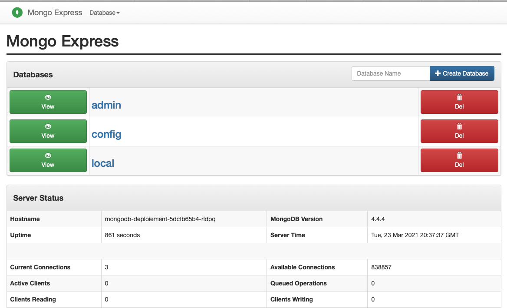
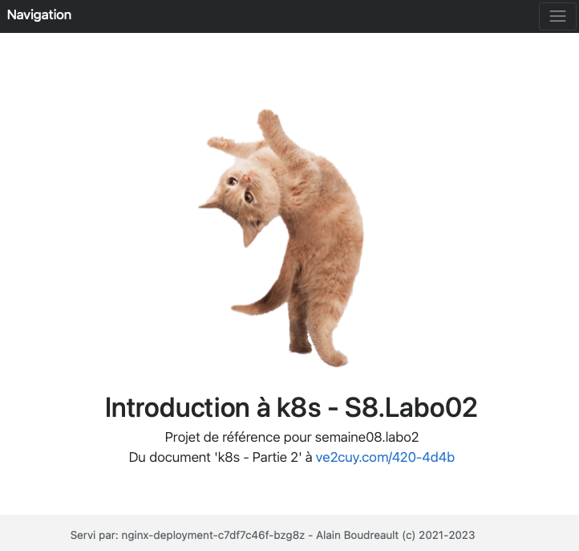

# Kubernetes – Partie 2


## K8s, déployer une application de complexité moyenne

Contenu:

1. **[Démonstration d'une app MongoDB + MongoExpress](#item1)**
2. **[Laboratoire](#item2)**
   1. **Déployer une application WordPress**
   2. **Déployer super Minou en 25 duplicatas**
   3. **Déployer PostgreSQL et pgadmin4**

---

## 💡- Une petite révision d'un manifeste K8s

```
apiVersion: apps/v1
kind: Deployment
metadata:
  name: deploy-superminou
  labels:
    app: superminou
spec:
  replicas: 2
  selector:
    matchLabels:
      super: minou # Doit matcher le label du template
  template:
    metadata:
      labels:
        super: minou # Doit matcher le selector du service
        petit: chat
    spec:
      containers:
      - name: nginx-de-ve2cuy
        image: alainboudreault/superminou:latest
        imagePullPolicy: Always
        ports:
        - containerPort: 80
        resources:
          requests:
            memory: "64Mi"
            cpu: "250m"
          limits:
            memory: "128Mi"
            cpu: "500m"
---
apiVersion: v1
kind: Service
metadata:
  name: svc-superminou
spec:
  selector:
    super: minou
  type: LoadBalancer    
  ports:
    - protocol: TCP
      port: 80
      targetPort: 80
```

```
$ kubectl apply -f filename.yaml

$ kubectl port-forward --address 192.168.2.49,localhost svc/svc-superminou 8088:80


$ kubectl apply -f https://raw.githubusercontent.com/ve2cuy/4204d4/refs/heads/main/module01/superminou.yml
```

---

## 1 – Déploiement de MongoDB + MongoExpress

**Étape 1.1 –** Dans l'exemple suivant, nous allons déployer un système proposant un SGBD *MongoDB* et deux instances de – pour des raisons de fiabilité – *Mongo-Express*.

<p align="center">
  
</p>

**Action 1.1.1 –** Voici le manifeste de MongoDB:

```
# Fichier mongo.yml
apiVersion: apps/v1
kind: Deployment
metadata:
  name: mongodb-deploiement
  # Section facultative
  labels:
    app: mongodb
# 1 - Niveau du déploiement
spec:
  replicas: 1
  # Section obligatoire
  selector:
    matchLabels:
      app: mongodb
  # Section obligatoire
  template:
    metadata:
      labels:
        app: mongodb
    # 2 - Niveau du Pod
    spec:
      containers:
      # 3 - niveau des conteneurs
      - name: mongodb
        image: mongo
        ports:
        - containerPort: 27017
        env:
        - name: MONGO_INITDB_ROOT_USERNAME
          value: 4204d4
        - name: MONGO_INITDB_ROOT_PASSWORD
          value: secret
        # Attention aux ressources ici, l'app ne fonctionnera pas avec 128Mi  
        resources: {}

---

apiVersion: v1
kind: Service
metadata:
  name: mongodb-service
spec:
  selector:
    app: mongodb
  ports:
    - protocol: TCP
      port: 27017
      targetPort: 27017
```

**Action 1.2 –** Voici le manifeste de Mongo-Express:

```
apiVersion: apps/v1
kind: Deployment
metadata:
  name: mongo-express
  labels:
    app: mongo-express
spec:
  replicas: 2
  selector:
    matchLabels:
      app: mongo-express
  template:
    metadata:
      labels:
        app: mongo-express
    spec:
      containers:
      - name: mongo-express
        image: mongo-express
        ports:
        - containerPort: 8081
        env:
        - name: ME_CONFIG_MONGODB_ADMINUSERNAME
          value: 4204d4
        - name: ME_CONFIG_MONGODB_ADMINPASSWORD
          value: secret
        - name: ME_CONFIG_MONGODB_SERVER
          # ATTENTION, il faut utiliser le service pour l'accès à la BD
          value: mongodb-service
        # Variables pour l'authentification de mongo-express GUI
        - name: ME_CONFIG_BASICAUTH_USERNAME
          value: admin
        - name: ME_CONFIG_BASICAUTH_PASSWORD
          value: password          

        resources: {}
#          requests:
#            memory: "64Mi"
#            cpu: "250m"
#          limits:
#            memory: "128Mi"
#            cpu: "500m"          
---
apiVersion: v1
kind: Service
metadata:
  name: mongo-express-service
spec:
  selector:
    app: mongo-express

  # *** type = LoadBalancer pour un accès externe au réseau K8S
  type: LoadBalancer  

  ports:
    - protocol: TCP
      port: 8081
      targetPort: 8081
      nodePort: 30000
```

**Action 1.3 –** Déployer les systèmes:

```
$ kubectl apply -f mongo.yml
$ kubectl apply -f mongo-express.yml
```

**Action 1.4 –** Vérifier les status:

```
$ kubectl get deployments.apps 

NAME                  READY   UP-TO-DATE   AVAILABLE   AGE
mongo-express         2/2     2            2           22m
mongodb-deploiement   1/1     1            1           26m
```

```
$ kubectl get pods

NAME                                  READY   STATUS      RESTARTS   AGE
mongo-express-5f96bb564d-997kr        1/1     Running     0          12m
mongo-express-5f96bb564d-9xlr2        1/1     Running     0          3m34s
mongodb-deploiement-5dcfb65b4-rldpq   1/1     Running     0          26m
```

**Action 1.5 –** Au besoin, afficher les logs – dans l'exemple suivant, le nom du service pointant vers la BD est erroné.

```
k logs mongo-express-6d9b4f9cb6-sdhsm
Waiting for mongodb:27017...
/docker-entrypoint.sh: line 14: mongodb: Name does not resolve
/docker-entrypoint.sh: line 14: /dev/tcp/mongodb/27017: Invalid argument
Tue Mar 23 20:29:32 UTC 2021 retrying to connect to mongodb:27017 (2/5)
/docker-entrypoint.sh: line 14: mongodb: Name does not resolve
/docker-entrypoint.sh: line 14: /dev/tcp/mongodb/27017: Invalid argument
Tue Mar 23 20:29:33 UTC 2021 retrying to connect to mongodb:27017 (3/5)
/docker-entrypoint.sh: line 14: mongodb: Name does not resolve
/docker-entrypoint.sh: line 14: /dev/tcp/mongodb/27017: Invalid argument
Tue Mar 23 20:29:34 UTC 2021 retrying to connect to mongodb:27017 (4/5)
/docker-entrypoint.sh: line 14: mongodb: Name does not resolve
/docker-entrypoint.sh: line 14: /dev/tcp/mongodb/27017: Invalid argument
Tue Mar 23 20:29:35 UTC 2021 retrying to connect to mongodb:27017 (5/5)
/docker-entrypoint.sh: line 14: mongodb: Name does not resolve
/docker-entrypoint.sh: line 14: /dev/tcp/mongodb/27017: Invalid argument
Welcome to mongo-express
------------------------


Mongo Express server listening at http://0.0.0.0:8081
Server is open to allow connections from anyone (0.0.0.0)
basicAuth credentials are "admin:pass", it is recommended you change this in your config.js!

/node_modules/mongodb/lib/server.js:265
        process.nextTick(function() { throw err; })
                                      ^
Error [MongoError]: failed to connect to server [mongodb:27017] on first connect
    at Pool.<anonymous> (/node_modules/mongodb-core/lib/topologies/server.js:326:35)
    at Pool.emit (events.js:314:20)
    at Connection.<anonymous> (/node_modules/mongodb-core/lib/connection/pool.js:270:12)
    at Object.onceWrapper (events.js:421:26)
    at Connection.emit (events.js:314:20)
    at Socket.<anonymous> (/node_modules/mongodb-core/lib/connection/connection.js:175:49)
    at Object.onceWrapper (events.js:421:26)
    at Socket.emit (events.js:314:20)
    at emitErrorNT (internal/streams/destroy.js:92:8)
    at emitErrorAndCloseNT (internal/streams/destroy.js:60:3)
```

**Action 1.6 –** Afficher les informations d'un Déploiement

```
$ kubectl describe deployment mongo-express
Name:                   mongo-express
Namespace:              default
CreationTimestamp:      Tue, 23 Mar 2021 16:25:52 -0400
Labels:                 app=mongo-express
Annotations:            deployment.kubernetes.io/revision: 3
Selector:               app=mongo-express
Replicas:               2 desired | 2 updated | 2 total | 2 available | 0 unavailable
StrategyType:           RollingUpdate
MinReadySeconds:        0
RollingUpdateStrategy:  25% max unavailable, 25% max surge
Pod Template:
  Labels:  app=mongo-express
  Containers:
   mongo-express:
    Image:      mongo-express
    Port:       8081/TCP
    Host Port:  0/TCP
    Environment:
      ME_CONFIG_MONGODB_ADMINUSERNAME:  4204d4
      ME_CONFIG_MONGODB_ADMINPASSWORD:  secret
      ME_CONFIG_MONGODB_SERVER:         mongodb-service
    Mounts:                             <none>
  Volumes:                              <none>
Conditions:
  Type           Status  Reason
  ----           ------  ------
  Progressing    True    NewReplicaSetAvailable
  Available      True    MinimumReplicasAvailable
OldReplicaSets:  <none>
NewReplicaSet:   mongo-express-5f96bb564d (2/2 replicas created)
Events:
  Type    Reason             Age    From                   Message
  ----    ------             ----   ----                   -------
  Normal  ScalingReplicaSet  24m    deployment-controller  Scaled up replica set mongo-express-6d9b4f9cb6 to 1
  Normal  ScalingReplicaSet  16m    deployment-controller  Scaled up replica set mongo-express-7577cdb9c7 to 1
  Normal  ScalingReplicaSet  16m    deployment-controller  Scaled down replica set mongo-express-6d9b4f9cb6 to 0
  Normal  ScalingReplicaSet  13m    deployment-controller  Scaled up replica set mongo-express-5f96bb564d to 1
  Normal  ScalingReplicaSet  13m    deployment-controller  Scaled down replica set mongo-express-7577cdb9c7 to 0
  Normal  ScalingReplicaSet  4m43s  deployment-controller  Scaled up replica set mongo-express-5f96bb564d to 2
```

**Action 1.7 –** Exposer le service 'mongo-express' au monde extérieur:

```
# Sur un cluster local:
$ kubectl port-forward --address 192.168.2.49,localhost svc/mongo-express-service 9000:8081


# Sur minikube:
$ minikube service mongo-express-service
```

Ce qui va donner:



---


## Section 2 

### Laboratoire 1 – Déployer une application WordPress

**Durée:** 40 minutes

Il faut mettre en place, grace à deux manifestes, un déploiement **WordPress** avec un SGBD '***mariadb***' et un 'Pod' ***wordpress***.

* nom de la BD WP = wordpress
* utilisateur de la BD WP = labo01
* mot de passe de l'utilisateur de la BD WP = yodouloudou
* Port TCP externe: 88  
* Appliquer le manifeste et vérifier que l'application fonctionne:
  * `kubectl port-forward` ...

**Action Labo01.1**

* Consolider les 2 manifestes en un seule fichier
* Appliquer le manifeste et vérifier que l'application fonctionne.

**Action Labo01.2**

* Modifier le manifeste pour remplacer mariadb par MySQL
* Appliquer le manifeste et vérifier que l'application fonctionne.

**Action Labo01.3**

* Modifier le manifeste pour indiquer que nous désirons 3 duplicatas de WP
* Appliquer le manifeste et vérifier que l'application fonctionne.

---

### Laboratoire 2 – Déployer super Minou avec 25 duplicatas

**Durée:** 30 minutes

* Publier sur votre compte docker hub, une image 'semaine08-labo2:latest, construite à partir de 'php:8.0.3-apache-buster',  proposant le site web 'Super Minou', dont le pied de page affiche le 'hostname' du serveur:


* Utiliser un fichier .dockerignore pour exclure le fichier Dockerfile de l'image
* Utiliser la commande 'WORKDIR'
* Appliquer le manifeste et vérifier que l'application fonctionne.

* Voici le code php pour obtenir le hostname:
  + echo gethostname();
* Grace à un manifeste Kubernetes, déployer 25 duplicatas du serveur Web 'superminou'.
* Rafraichir la page plusieurs fois pour confirmer que le site est publié par plusieurs 'hosts'.

Résultat:



---

### Laboratoire 3 – Déployer PostgreSQL et pgadmin4

**Durée:** 30 minutes

* Grace à un manifeste Kubernetes, déployer 1 duplicata de Postgres et 2 de dpage/pgadmin4
* Appliquer le manifeste et vérifier que l'application fonctionne.


---

Prochain document: [K8s-Configmap et Secrets](Kubernetes-Config-map-et-secret.md)

---

###### Document rédigé par Alain Boudreault (c) 2021-2026 – version 2026.04.06.01

site par ve2cuy