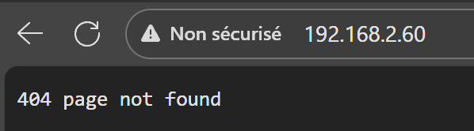
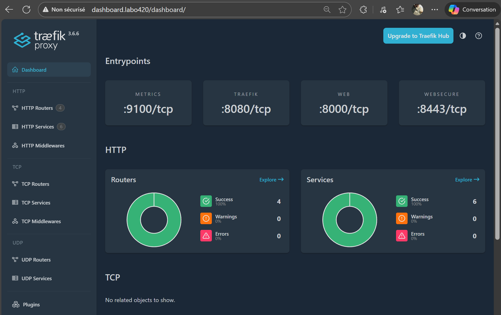
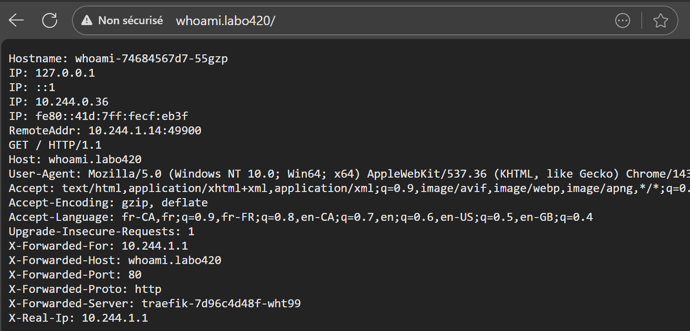
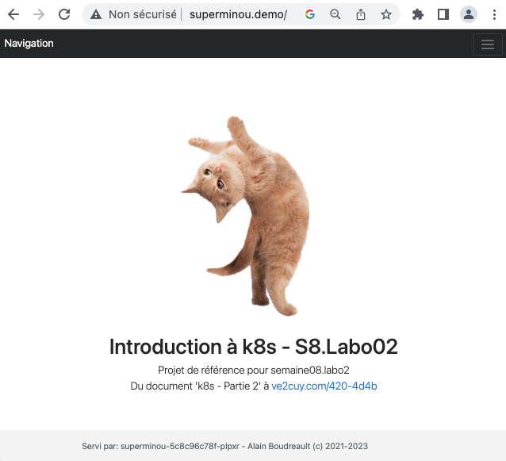
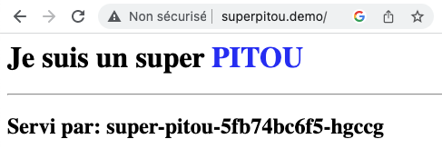

# K8S – LoadBalancer externe + Traefik

<p align="center">
    
</p>

## 1 – Mise en situation

Kubernetes ne m'offre pas de service de balance de charge (load balancer externe au réseau K8s) pour plusieurs applications qui partagent le même point d'entrée (une seule adresse IP/même port).

La raison étant que ces services sont habituellement intégrés aux systèmes des fournisseurs Infonuagique: Google Cloud, Azure, AWS, etc.

En labo, nous avons utilisé le tunnel 'kubectl port-forward service/...' ou bien celui de Docker Desktop/K8s comme solution externe.

Pour le déploiement natif d'un amas K8S, il faut se rabattre sur des solutions tierces.

Par exemple: [metallb](https://metallb.universe.tf/concepts/), etc.

---

## 2 – Installation de MetalLB

### 2.1 – Installation

```bash
# Sur le cluster K8S suivant:
kubectl get nodes

# Résultat:
# NAME    STATUS   ROLES           AGE    VERSION   INTERNAL-IP    EXTERNAL-IP
# k8s01   Ready    control-plane   155d   v1.25.3   192.168.2.51   <none>
# k8s02   Ready    worker          155d   v1.25.3   192.168.2.52   <none>
# k8s03   Ready    worker          155d   v1.25.3   192.168.2.53   <none>
# k8s04   Ready    worker          155d   v1.25.3   192.168.2.54   <none>
# k8s05   Ready    worker          155d   v1.25.3   192.168.2.55   <none>

# ---------------------------------------------------------
# Installer metallb (LoadBalancer externe)
# NOTE: Ajuster le numéro de version. Référence: https://metallb.io/installation/
kubectl apply -f https://raw.githubusercontent.com/metallb/metallb/v0.13.9/config/manifests/metallb-native.yaml

# Résultat:
# namespace/metallb-system created
# customresourcedefinition.apiextensions.k8s.io/addresspools.metallb.io created
# customresourcedefinition.apiextensions.k8s.io/bfdprofiles.metallb.io created
...
metallb-webhook-configuration created

# ---------------------------------------------------------
# Afficher les ressources de l'espace de nom du LB
kubectl get all -n metallb-system -o wide

# Résultat:
# NAME                              READY   STATUS    RESTARTS   AGE     IP             NODE 
# pod/controller-844979dcdc-64nms   1/1     Running   0          5m46s   10.244.77.5    k8s04
# pod/speaker-7r8bw                 1/1     Running   0          5m46s   192.168.2.55   k8s05
# pod/speaker-8n5x5                 1/1     Running   0          5m46s   192.168.2.52   k8s02
# pod/speaker-md92s                 1/1     Running   0          5m45s   192.168.2.53   k8s03
# pod/speaker-rb4wh                 1/1     Running   0          5m45s   192.168.2.54   k8s04
# pod/speaker-sth9t                 1/1     Running   0          5m46s   192.168.2.51   k8s01
# 
# NAME                      TYPE        CLUSTER-IP      EXTERNAL-IP   PORT(S)   AGE     SELECTOR
# service/webhook-service   ClusterIP   10.103.93.242   <none>        443/TCP   6m10s   component=controller
# 
# NAME                     DESIRED   CURRENT   READY   UP-TO-DATE   AVAILABLE   NODE SELECTOR            AGE     CONTAINERS   IMAGES                            SELECTOR
# daemonset.apps/speaker   5         5         5       5            5           kubernetes.io/os=linux   6m10s   speaker      quay.io/metallb/speaker:v0.13.9   app=metallb,component=speaker
# 
# NAME                         READY   UP-TO-DATE   AVAILABLE   AGE     CONTAINERS   IMAGES                               SELECTOR
# deployment.apps/controller   1/1     1            1           6m10s   controller   quay.io/metallb/controller:v0.13.9   app=metallb,component=controller
# 
# NAME                                    DESIRED   CURRENT   READY   AGE     CONTAINERS   IMAGES                               SELECTOR
# replicaset.apps/controller-844979dcdc   1         1         1       5m46s   controller   quay.io/metallb/controller:v0.13.9   app=metallb,component=controller,pod-template-hash=844979dcdc
```

---

### 2.2 – Renseigner la plage IP

Il faut maintenant renseigner la plage d'adresse IP que MetalLB pourra utiliser comme points d'entrées.  Ce sont des adresses valides et disponibles dans votre réseau local.

```bash
nano metallb-config.yaml
```

### 2.2.1 – Coller le manifeste suivant et sauvegarder

**NOTE**: Pour la plage d'adresses, il faut utiliser les IP disponibles dans le laboratoire.

```yaml
apiVersion: metallb.io/v1beta1
kind: IPAddressPool
metadata:
  name: first-pool
  namespace: metallb-system
spec:
  addresses:
  - 192.168.2.60-192.168.2.69

---
apiVersion: metallb.io/v1beta1
kind: L2Advertisement
metadata:
  name: example
  namespace: metallb-system
```

### 2.2.2 – Appliquer le manifeste

```bash
kubectl apply -f Metallb-config.yaml
```

---


## 3 – Installation d'un Ingress (reverse proxy) Traefik sur K8S

[Documentation officielle](https://doc.traefik.io/traefik/getting-started/quick-start-with-kubernetes/)


### 3.1 – Déploiement d'un service ingress de type Traefik via Helm

* Ajouter le dépot Helm de Traefik

```bash
helm repo add traefik https://traefik.github.io/charts
helm repo update
```

* Renseigner le manifeste values.yaml suivant:
```yaml
# values.yaml
# Sans autres directives, les rêgles suivantes seront en fonction:
# Les ports 80 et 443 en points d'entrée
# Le Dashboard sera disponible via 'matchrule'
# Les routes seront disponibles dans tous le namespace.
# Activera le 'Kubernetes Gateway API provider'
ingressRoute:
  dashboard:
    enabled: true
    matchRule: Host(`dashboard.labo420`)
    entryPoints:
      - web
providers:
  kubernetesGateway:
    enabled: true
gateway:
  listeners:
    web:
      namespacePolicy:
        from: All
```

* Installer traefik

```bash
helm install traefik traefik/traefik -f values.yaml --wait --namespace traefik

# Suite à des modifications au fichier values.yaml:
helm upgrade traefik traefik/traefik -n traefik -f values.yaml
```

NOTE: Le 'namespace' est facultatif, sinon sera installé dans 'default'


Il y a maintenant un service de type LoadBalancer qui roule et qui a obtenu une adresse IP (192.168.2.60) de MetalLB:

```
$ kgs -n traefik
NAME      TYPE           CLUSTER-IP     EXTERNAL-IP    PORT(S)                      AGE
traefik   LoadBalancer   10.106.10.59   192.168.2.60   80:32343/TCP,443:32229/TCP   31m
```

Il est maintenant possible d'avoir accès au réseau k8s via cette adresse IP:



**Note**: Nous obtenons une erreur 404 car il n'y a pas encore de routes de définies. Par contre, cette réponse nous indique qu'il y a un service HTTP à l'entrée, sauf pour le 'Dashboard' via le nom de DNS dashboard.labo420.

* Ajouter l'entrée suivante au fichier hosts du poste de travail:
```
# Remplacer par l'adresse IP externe de votre 'load balancer'
192.168.2.60    dashboard.labo420 whoami.labo420
```

**NOTE**: Dans le cas d'un déploiement sans load balancer, utiliser un port-forward:

kubectl port-forward -n traefik svc/traefik 80

* Tester l'accès au Dashboard de Traefik



---

### 3.1.5 - Déployer un whoami standard (voir docum de Traefik)

```yaml
# whoami.yaml
apiVersion: apps/v1
kind: Deployment
metadata:
  name: whoami
spec:
  replicas: 2
  selector:
    matchLabels:
      app: whoami
  template:
    metadata:
      labels:
        app: whoami
    spec:
      containers:
        - name: whoami
          image: traefik/whoami
          ports:
            - containerPort: 80
---

# whoami-service.yaml
apiVersion: v1
kind: Service
metadata:
  name: whoami
spec:
  ports:
    - port: 80
  selector:
    app: whoami

---
# whoami-ingressroute.yaml
apiVersion: traefik.io/v1alpha1
kind: IngressRoute
metadata:
  name: whoami
spec:
  entryPoints:
    - web
  routes:
    - match: Host(`whoami.labo420`)
      kind: Rule
      services:
        - name: whoami
          port: 80    
```

* Appliquer le manifeste, renseigner le fichier hosts et tester le service



---


### 3.2 – Déployer un service Web (superMinou)

#### Manifeste SuperMinou

```yaml
# Modifié pour la demo ingress
apiVersion: apps/v1
kind: Deployment
metadata:
  name: superminou
  labels:
    app: un-superminou
spec:
  replicas: 5
  selector:
    matchLabels:
      mon-app: un-superminou
  template:
    metadata:
      labels:
        mon-app: un-superminou
    spec:
      containers:
      - name: nginx
        image: alainboudreault/superminou:latest
        imagePullPolicy: Always
        ports:
        - containerPort: 80
---
apiVersion: v1
kind: Service
metadata:
  name: superminou-service
spec:
  selector:
    mon-app: un-superminou
  # type: par defaut = ClusterIP, ce qui est requis pour le service ingress
  ports:
    - protocol: TCP
      port: 80
      targetPort: 80
```

#### Manifeste SuperPitou

```yaml
apiVersion: apps/v1
kind: Deployment
metadata:
  labels:
    mon-app: un-superpitou
  name: super-pitou
spec:
  replicas: 3
  selector:
    matchLabels:
      mon-app: un-superpitou
  template:
    metadata:
      labels:
        mon-app: un-superpitou
    spec:
      volumes:
      - name: webdata
        emptyDir: {}
      initContainers:
      - name: web-content
        image: busybox
        volumeMounts:
        - name: webdata
          mountPath: "/webdata"
        command: ["/bin/sh", "-c", 'echo "<h1>Je suis un super <font color=blue>PITOU</font></h1><hr/><h2>Servi par: <?php echo gethostname(); ?></h2>" > /webdata/index.php']
      containers:
      - image: php:8.0.3-apache-buster
        name: php-apache
        volumeMounts:
        - name: webdata
          mountPath: "/var/www/html"

---
apiVersion: v1
kind: Service
metadata:
  name: superpitou-service
spec:
  selector:
    mon-app: un-superpitou
  # type: par defaut = ClusterIP, ce qui est requis pour le service ingress
  ports:
    - protocol: TCP
      port: 80
      targetPort: 80
```

### 3.3 – Fichier: ingress-demo.yml

```yaml
# whoami-ingressroute.yaml
apiVersion: traefik.io/v1alpha1
kind: IngressRoute
metadata:
  name: super
spec:
  entryPoints:
    - web
  routes:
    - match: Host(`superminou.labo420`)
      kind: Rule
      services:
        - name: superminou-service
          port: 80
    - match: Host(`superpitou.labo420`)
      kind: Rule
      services:
        - name: superpitou-service
          port: 80
```

```yaml
kubectl apply -f ingress-demo.yml

# -----------------------------------------------------------
$ kubectl get ingressRoute
NAME     AGE
super    4m4s
whoami   65m


# -----------------------------------------------------------
alain@k8smaster:~/Documents$ kubectl describe ingressRoute super
Name:         super
Namespace:    default
Labels:       <none>
Annotations:  <none>
API Version:  traefik.io/v1alpha1
Kind:         IngressRoute
Metadata:
  Creation Timestamp:  2026-01-13T21:32:57Z
  Generation:          1
  Resource Version:    100098
  UID:                 ebecfc4b-98f9-4aa2-bc82-4dcd3226793b
Spec:
  Entry Points:
    web
  Routes:
    Kind:   Rule
    Match:  Host(`superminou.labo420`)
    Services:
      Name:  superminou-service
      Port:  80
    Kind:    Rule
    Match:   Host(`superpitou.labo420`)
    Services:
      Name:  superpitou-service
      Port:  80
Events:      <none>
```

### 3.4 – Fichier /etc/hosts

```bash
192.168.2.60  superminou.labo420 superpitou.labo420
```

### 3.5 – Tester l'ingress (reverse proxy)





---

Certificats TLS - À compléter

---

## Crédits

*Document rédigé par Alain Boudreault © 2021-2026*  
*Version 2025.12.03.1*  
*Site par ve2cuy*