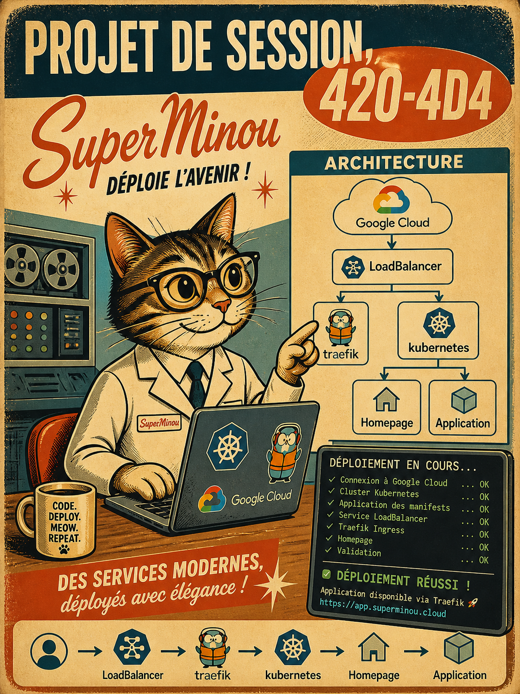

# ESH26 - Énoncé du projet de session

### 💡 Acte d'énoncer, d'exprimer en termes nets.
---

    

---

Ce projet comporte deux étapes de réalisation.

* 1 - Déploiyer, avec K8s, des applications en mode local et les exposer via HomePage
  * Toutes les images sont sur un dépot via Harbor
  * Certains contenus sont de type NFS -> via un serveur NFS sur cloud.google
  * Le DNS local = esh26.4204d4
  * Le DNS, pour l'accès aux images = depot.matricule.duckdns.org
  * REMISE: à déterminer
* 2 - Déploiyer, avec K8s, des applications en mode `cloud` et les ajouter à HomePage
  * Le DNS = esh26.matricule.duckdns.org
  * REMISE: à déterminer

---

## Étape 1 - Déploiyer des applications en mode local

---

## Étape 2 - Déploiyer des applications via Google.cloud
