# ESH26 - Énoncé du projet de session

## 💡 Acte d'énoncer, d'exprimer en termes nets.

## 🛑 Version 0.2b - Il y aura des modifications au courant de la semaine!

---

<p align="center">
    
</p>

---

## Ce projet comporte deux étapes de réalisation.

* 1️⃣ - Déployer, avec `K8s`, des applications en mode local et les présenter via `HomePage`
  * Toutes les images sont sur un (votre) dépot `Harbor`
  * Certains contenus sont de type `NFS` -> via un service `NFS` sur `cloud.google`
  * Le DNS local est `esh26`
  * Le DNS, pour l'accès aux images est `harbor-matricule.duckdns.org`
  * **REMISE**: `16 mai, 👉 fin de journée`

* 2️⃣ - Déployer, avec `K8s`, des applications en mode `cloud` et les ajouter à `HomePage`
  * Le DNS est `esh26.matricule.duckdns.org`
  * REMISE: `25 mai, 👉 fin de journée`

* 💡 Détails pour la remise:
  * Un dépot github privé ( 💡inviter `ve2cuy`)
    * 👉 Avec un README.md comme journal de bord pour y documenter, 
      * Les étapes d'installation (VM, harbor, certificats, nfs, ftp, metallb sur k8s, ...)
      * Les commandes à exécuter pour lancer les pré-requis (metallb, traefik, ...)
      * Les commandes à éxécuter pour lancer les applications; locales et cloud, ...

---

## Étape 1 - Déployer des applications en mode local - `👉 remise le 16 mai`

* À partir d'une VM `cloud.google`
    * Nommée `es-4204d4-h26`
        * e2-small (2 vCPUs, 2 GB Memory) Us-central-1f
        * --->>>> Disque de 22 GO  <<<---
        * Sous ubuntu-minimal-2604-resolute-amd64
        * NOTE: 😉 Il est recommandé d'utiliser des [clés ssh](https://ve2cuy.com/420-3c3/?page_id=1492) pour la connexion à la VM.
          * 💡 Si la commande `sudo` ne reconnait plus le mot de passe, redémarrer la session ssh.
    * Installer `Harbor` avec certificats `TLS`
        * 👉 Attention au mot de passe
        * 🛑 Ne pas activer le port 80
        * 💡 Harbor ne doit pas rouler lors de la génération des certificats.
    * Renseigner un `DNS` sur `DuckDNS` -> `harbor-matricule.duckdns.org`
    * Sous `Harbor`, créer un dépot (projet) nommé `esh26`
        * Placer les images suivantes dans le dépot
            * `homepage:esh26` (à partir de ghcr.io/gethomepage/homepage:latest)
                * **Exemple**: `docker tag ghcr.io/gethomepage/homepage:latest 4204d4.duckdns.org/esh26/homepage:esh26`
                * `docker push 4204d4.duckdns.org/esh26/homepage:esh26`
            * `wordpress:esh26` (à partir de wordpress:latest)
            * `mariadb:esh26` (à partir de mariadb:latest)
            * `jenkins:esh26` (à partir de jenkins/jenkins:lts)    
            * `node-red:esh26` (à partir de nodered/node-red:latest)
            * `mattermost:esh26` (à partir de mattermost/mattermost-preview)
    * Mettre en place un volume `NFS` sur le dossier `/esh26`
        * créer les dossiers `/esh26`, `/esh26/themes`, `/esh26/plugins` et `/esh26/node-red`

* À partir d'un déploiment `k8s` local (soit via VMs ou Docker-Desktop)
    * Installer `metallb`
    * Installer  `traefik` (http://dashbord.esh26)
        * Note: Sous `docker-desktop` il faut utiliser `127.0.0.1 dashboard.esh26 wordpress.esh26 ...` dans `hosts`, sinon, il faut utiliser l'adress IP publique du service `traefik`.
    * Déployer `homepage` 
        * Utiliser l'image du dépot harbor
            * Exemple: `image: 4204d4.duckdns.org/esh26/homepage:esh26`
        * Utiliser des `configMap`, [voir les notes de cours](https://ve2cuy.github.io/4204d4/Documentation/Kubernetes/Kubernetes-Config-map-et-secret.html), pour les fichiers:
            * `config.yaml`
            * `services.yaml`
            * `widgets.yaml`
            * `bookmarks.yaml`
            * `settings.yaml`
        * Renseigner les liens suivants sous homepage:
            * http://node-red.esh26/
            * http://jenkins.esh26/
            * http://wordpress.esh26/
            * http://mattermost.esh26/
            * https://harbor.matricule.duckdns.org  👉 Accès seulement en `https`!
        * 👉 Le lien pour la page `homepage` est http://tp02.esh26  

---

## Captures d'écrans et détails sur les applications

<p align="center">
    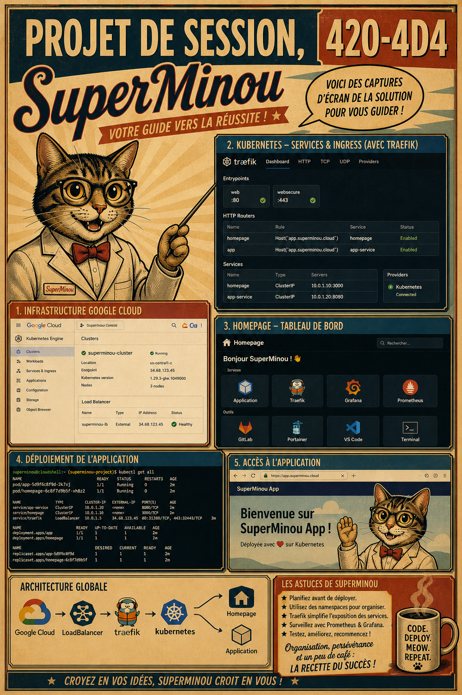
</p>

---

## Harbor

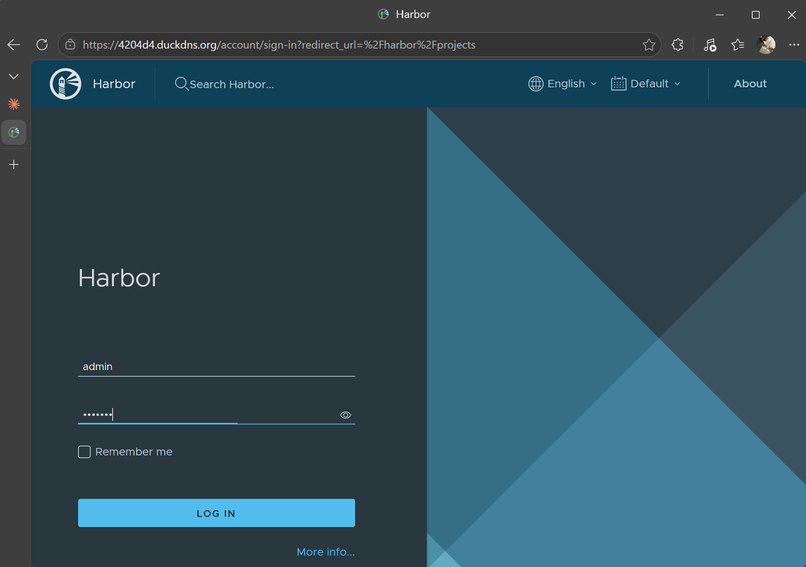

* 👉 La connexion est sécurisée (service disponible sur 443 en https)

---

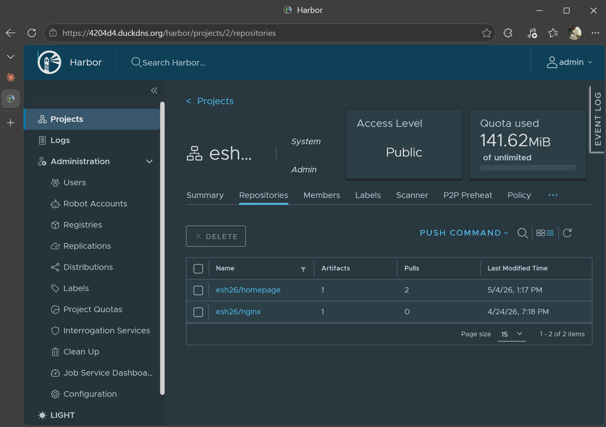

* 👉 Les images sont disponibles dans le projet esh26

---

## Homepage

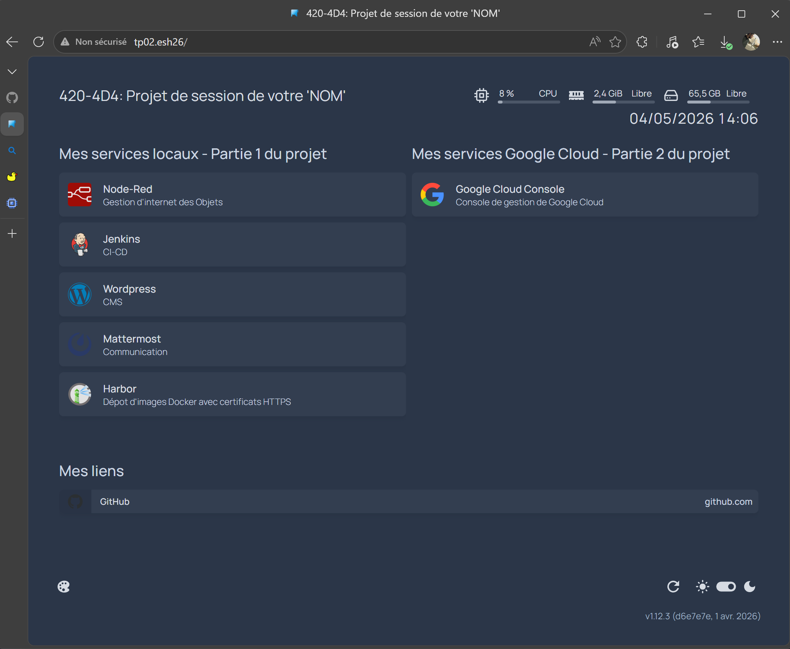

### Détails

* Les fichiers de configuaration sont disponibles via des `configmap` voir [ici](https://ve2cuy.github.io/4204d4/Documentation/Kubernetes/Kubernetes-Config-map-et-secret.html)
* L'image provient du dépôt `harbor` via `harbor.matricule.duckdns.org/esh26/harbor:esh26` 

NOTE: 🛑 Si `harbor` a été démarré avec le mot de passe par défaut, il faudra effacer la base de données et recommencer la configuration:

```
sudo docker-compose down -v
rm -r /data/database
rm -r /data/registry
sudo ./prepare
sudo docker-compose up -d
```

---

## Wordpress

* Des thèmes supplémentaires proviennent du volune `NFS`  `/esh26/wordpress/themes` voir [ici](https://ve2cuy.github.io/4204d4/Documentation/Kubernetes/Kubernetes-Les-volumes.html)
* Ils doivent-être copiés localement par un conteneur d'initialisation.
  * Ou bien le dossier NFS peut-être monté localement, à vous de choisir.
* Les thèmes sont disponibles -->  [ici](https://github.com/ve2cuy/4204d4/tree/main/Documentation/Projet-Session/themes-wp) 
* Mariadb
  * Le volume de `Mariadb` est de type `local-path` voir [ici](https://ve2cuy.github.io/4204d4/Documentation/Kubernetes/Kubernetes-Config-map-et-secret.html)
  * Les informations de connexions doivent-être dans un `secret` voir [ici](https://ve2cuy.github.io/4204d4/Documentation/Kubernetes/Kubernetes-Config-map-et-secret.html)
  
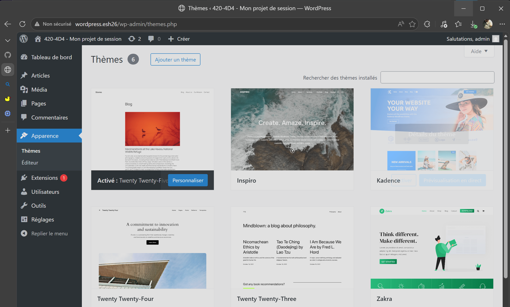

## Contenu NFS des thèmes Wordpress

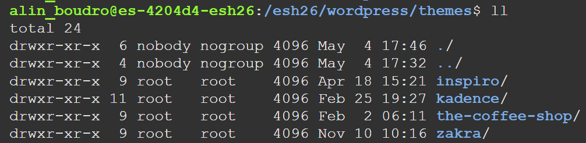

---

## Node-red

* Le dossier /data de node-red est monté sur le volume `NFS` `/esh26/node-red`

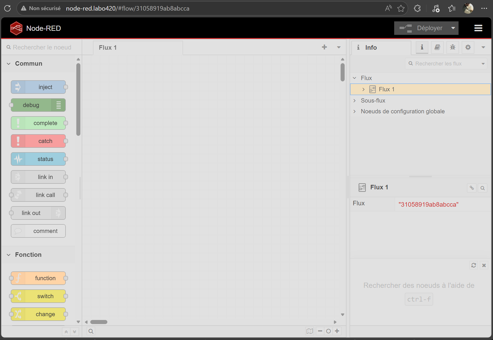

---

## Contenu NFS de Node-red

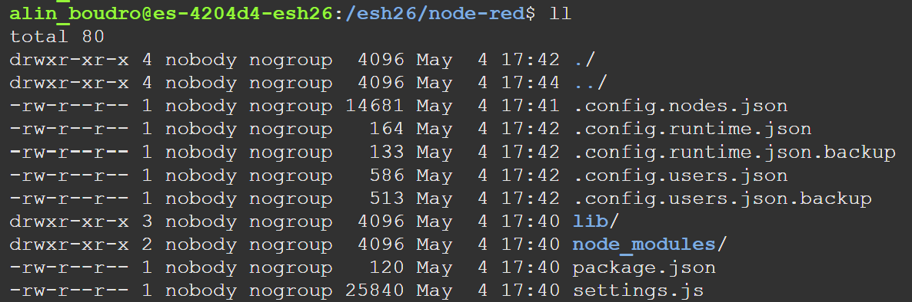

---

## Mattermost

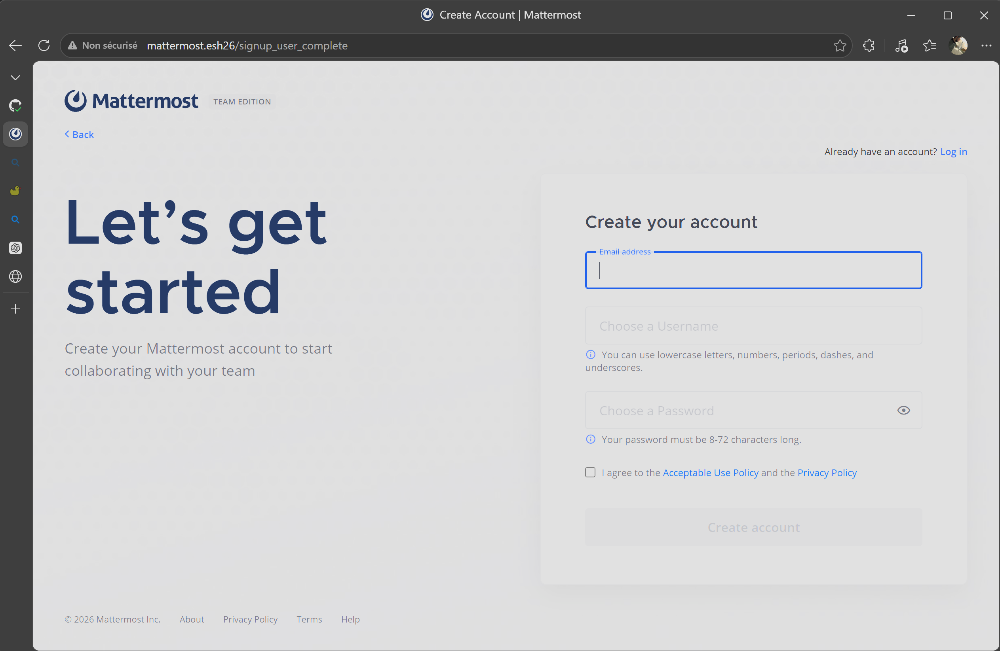

---

## Jenkins

* Le volume PVC de jenkins est de type `local-path`

```yaml
apiVersion: v1
kind: PersistentVolumeClaim
metadata:
  name: jenkins-pvc
spec:
  accessModes:
    - ReadWriteOnce
  storageClassName: local-path
  resources:
    requests:
      storage: 5Gi
```

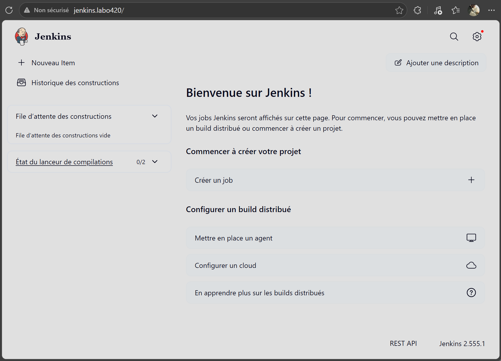

---

## 💡 Voici des astuces d'aide à la réalisation du projet

<p align="center">
    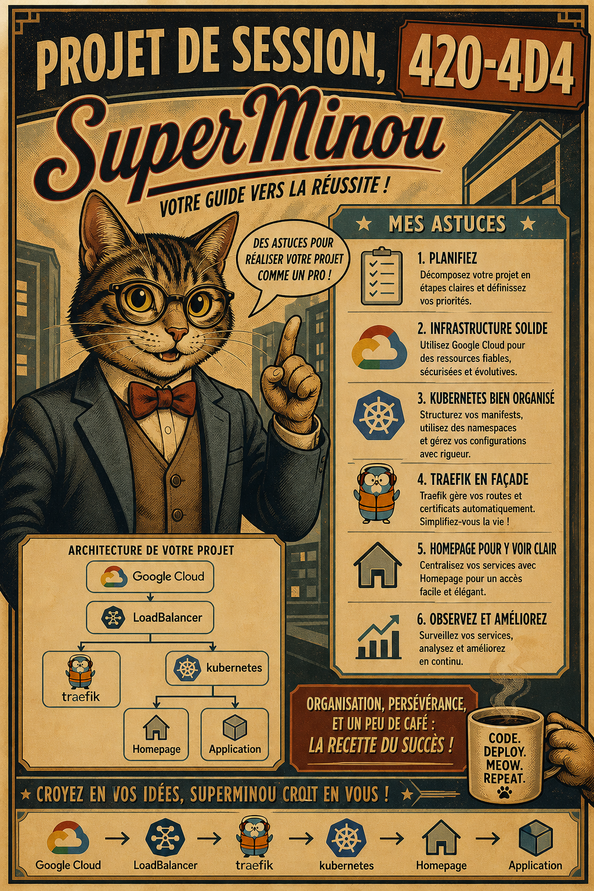
</p>


### Certificats pour Harbor

```
# Générer le certificat
sudo certbot certonly --standalone -d 4204d4.duckdns.org

# Renseigner le fichier `harbor.yml`
nano harbor.yml
https:
  # https port for harbor, default is 443
  port: 443
  # The path of cert and key files for nginx
  certificate: /etc/letsencrypt/live/4204d4.duckdns.org/fullchain.pem
  private_key: /etc/letsencrypt/live/4204d4.duckdns.org/privkey.pem

```

---

###  Exemples de PV, PVC à partir d'un volume NFS

Voir [ici](https://ve2cuy.github.io/4204d4/Documentation/Kubernetes/Kubernetes-Les-volumes.html)

```yaml
apiVersion: v1
kind: PersistentVolume
metadata:
  name: pv-nfs-node-red
spec:
  ...
  storageClassName: nfs-node-red
  nfs:
    server: esh26-mon-matricule.duckdns.org
    path: /esh26/node-red

---
apiVersion: v1
kind: PersistentVolumeClaim
metadata:
  name: pvc-nfs-node-red
spec:
  storageClassName: nfs-node-red
  ...

```

---

### Renseigner un fichier à partir d'un configMap

```yaml
# ============================================================
# ConfigMap — config.yaml de Homepage
# ============================================================
apiVersion: v1
kind: ConfigMap
metadata:
  name: homepage-config
data:
  config.yaml: |
    title: Homepage
    theme: dark
    color: slate
  
    allowedHosts: homepage.esh26
```

---

### Exemple d'utilisation du dépôt harbor

```
apiVersion: apps/v1
kind: Deployment
metadata:
  name: homepage
spec:
  replicas: 1
  selector:
    matchLabels:
      app: homepage
  template:
    metadata:
      labels:
        app: homepage
    spec:
      containers:
      - name: homepage
        image: harbor.matricule.duckdns.org/esh26/homepage:esh26
```

---

```YAML
### Lancer une application multi-fichiers YAML

# kustomization.yaml
# kubectl apply -k ./
resources:
  - esh26.yaml
  - traefik-ns.yaml
  - jenkins.yaml
  - node-red.yaml
  - wordpress.yaml
```

---

### PV et PVC

Dans les notes de cours, il est indiqué qu'un `PVC` est toujours dépendant d'un `PV`.

Par contre, pour un volume local il est possible d'utiliser la classe `storageClassName: local-path` si le service `local-path` à été installé.

```bash
# Installation d'un `local-path-storage`
kubectl apply -f https://raw.githubusercontent.com/rancher/local-path-provisioner/v0.0.32/deploy/local-path-storage.yaml
```

---

### Liste des ressources du projet - partie 01

```bash
$ kga
NAME                              READY   STATUS    RESTARTS   AGE
pod/homepage-76fb784c47-gqspg     1/1     Running   0          24h
pod/jenkins-55b96dfc79-t9h4n      1/1     Running   0          23h
pod/mariadb-8544495789-4s4sv      1/1     Running   0          24h
pod/mattermost-69f568bcf9-rtk76   1/1     Running   0          24h
pod/node-red-68b55c5bfb-xhz65     1/1     Running   0          24h
pod/wordpress-5d9548759d-v7dh5    1/1     Running   0          24h

NAME                         TYPE        CLUSTER-IP       EXTERNAL-IP   PORT(S)            AGE
service/homepage             ClusterIP   10.109.226.194   <none>        80/TCP             24h
service/kubernetes           ClusterIP   10.96.0.1        <none>        443/TCP            24h
service/mariadb-service      ClusterIP   10.100.209.86    <none>        3306/TCP           24h
service/service-jenkins      ClusterIP   10.103.139.150   <none>        80/TCP,50000/TCP   23h
service/service-mattermost   ClusterIP   10.107.102.101   <none>        8065/TCP           24h
service/service-node-red     ClusterIP   10.100.73.1      <none>        80/TCP             24h
service/wordpress-service    ClusterIP   10.104.185.125   <none>        80/TCP             24h

NAME                         READY   UP-TO-DATE   AVAILABLE   AGE
deployment.apps/homepage     1/1     1            1           24h
deployment.apps/jenkins      1/1     1            1           23h
deployment.apps/mariadb      1/1     1            1           24h
deployment.apps/mattermost   1/1     1            1           24h
deployment.apps/node-red     1/1     1            1           24h
deployment.apps/wordpress    1/1     1            1           24h

NAME                                    DESIRED   CURRENT   READY   AGE
replicaset.apps/homepage-76fb784c47     1         1         1       24h
replicaset.apps/jenkins-55b96dfc79      1         1         1       23h
replicaset.apps/mariadb-8544495789      1         1         1       24h
replicaset.apps/mattermost-69f568bcf9   1         1         1       24h
replicaset.apps/node-red-68b55c5bfb     1         1         1       24h
replicaset.apps/wordpress-5d9548759d    1         1         1       24h
```

---

## Étape 2 - Déployer des applications en nuage - `remise le 25 mai`

<p align="center">
    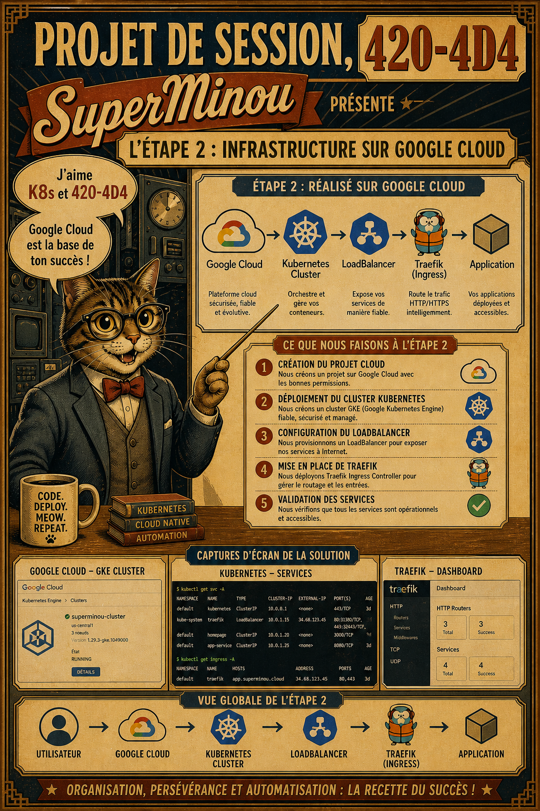
</p>

### Dans un cluster `k8s` de type `auto-pilote`, sur google, nommé `tu-parles-dun-projet` 

* Déploiyer `traefik`
  * Renseigner des routes vers
    * Toutes les applications de la partie 02 - 😉 À suivre bientôt ...
      * app01
      * app02
      * app3


---

## Liste des dépots harbor et des applications dans le nuage


| Matricule | Nom | Prénom | Liens |
|-----------|-----|--------|-------|
| 1146373 | Charbonneau | Félix | [harbor](https://harbor-1146373.duckdns.org)<br>[app-cloud](http://esh26-1146373.duckdns.org) |
| 1929205 | Moussette | David | [harbor](https://harbor-1929205.duckdns.org)<br>[app-cloud](http://esh26-1929205.duckdns.org) |
| 2133738 | Boudreault | Charles | [harbor](https://harbor-2133738.duckdns.org)<br>[app-cloud](http://esh26-2133738.duckdns.org) |
| 2135251 | Latreille | Léa | [harbor](https://harbor-2135251.duckdns.org)<br>[app-cloud](http://esh26-2135251.duckdns.org) |
| 2176750 | Lamonde | Louis | [harbor](https://harbor-2176750.duckdns.org)<br>[app-cloud](http://esh26-2176750.duckdns.org) |
| 2236171 | Papineau | Émy | [👍 harbor](https://harbor-2236171.duckdns.org)<br>[app-cloud](http://esh26-2236171.duckdns.org) |
| 2248071 | Bilodeau | Lilianne | [harbor](https://harbor-2248071.duckdns.org)<br>[app-cloud](http://esh26-2248071.duckdns.org) |
| 2251141 | Bouchareb | Saad | [harbor](https://harbor-2251141.duckdns.org)<br>[app-cloud](http://esh26-2251141.duckdns.org) |
| 2464026 | Ezzahiri | Adam | [harbor](https://harbor-2464026.duckdns.org)<br>[app-cloud](http://esh26-2464026.duckdns.org) |
| 2467525 | Guertin | Ubert | [harbor](https://harbor-2467525.duckdns.org)<br>[app-cloud](http://esh26-2467525.duckdns.org) |
| 2482651 | Korotkov | Maxim | [harbor](https://harbor-2482651.duckdns.org)<br>[app-cloud](http://esh26-2482651.duckdns.org) |
| 2487266 | Goudreau | Gabriel | [👍 harbor](https://harbor-2487266.duckdns.org)<br>[app-cloud](http://esh26-2487266.duckdns.org) |
| 6226374 | Gosselin-Beaudoin | Xavier | [harbor](https://harbor-6226374.duckdns.org)<br>[app-cloud](http://esh26-6226374.duckdns.org) |
| 6294775 | Paradis | Laury-Ann | [harbor](https://harbor-6294775.duckdns.org)<br>[app-cloud](http://esh26-6294775.duckdns.org) |
| 6313976 | Lamirande | Xavier | [harbor](https://harbor-6313976.duckdns.org)<br>[app-cloud](http://esh26-6313976.duckdns.org) |
| 1191869 | Bebnowski-Lavoie | Guillaume | [harbor](https://harbor-1191869.duckdns.org)<br>[app-cloud](http://esh26-1191869.duckdns.org) |
| 1970541 | Asfaw | Marcus | [harbor](https://harbor-1970541.duckdns.org)<br>[app-cloud](http://esh26-1970541.duckdns.org) |
| 2156548 | Mechmachi | Achraf | [harbor](https://harbor-2156548.duckdns.org)<br>[app-cloud](http://esh26-2156548.duckdns.org) |
| 2241079 | Légaré | Christopher | [harbor](https://harbor-2241079.duckdns.org)<br>[app-cloud](http://esh26-2241079.duckdns.org) |
| 2257181 | Rivet | Olivier | [harbor](https://harbor-2257181.duckdns.org)<br>[app-cloud](http://esh26-2257181.duckdns.org) |
| 2357057 | Rimpel Morel | Chelsey | [harbor](https://harbor-2357057.duckdns.org)<br>[app-cloud](http://esh26-2357057.duckdns.org) |
| 2383950 | Lalonde | Félix | [harbor](https://harbor-2383950.duckdns.org)<br>[app-cloud](http://esh26-2383950.duckdns.org) |
| 2384502 | Guay | Raphaël | [harbor](https://harbor-2384502.duckdns.org)<br>[app-cloud](http://esh26-2384502.duckdns.org) |
| 2482798 | Archambault | Derek | [harbor](https://harbor-2482798.duckdns.org)<br>[app-cloud](http://esh26-2482798.duckdns.org) |
| 6220854 | Paradis | Louam | [harbor](https://harbor-6220854.duckdns.org)<br>[app-cloud](http://esh26-6220854.duckdns.org) |
| 6235015 | Diallo | Abdoulaye | [harbor](https://harbor-6235015.duckdns.org)<br>[app-cloud](http://esh26-6235015.duckdns.org) |
| 6289173 | Dubois | Zachary | [harbor](https://harbor-6289173.duckdns.org)<br>[app-cloud](http://esh26-6289173.duckdns.org) |
| 6297476 | Forget | Antoine | [harbor](https://harbor-6297476.duckdns.org)<br>[app-cloud](http://esh26-6297476.duckdns.org) |
| 6313680 | Nibimenya | Maëlys | [harbor](https://harbor-6313680.duckdns.org)<br>[app-cloud](http://esh26-6313680.duckdns.org) |