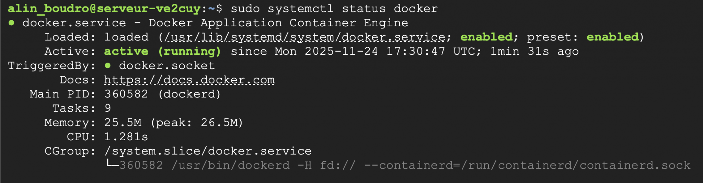
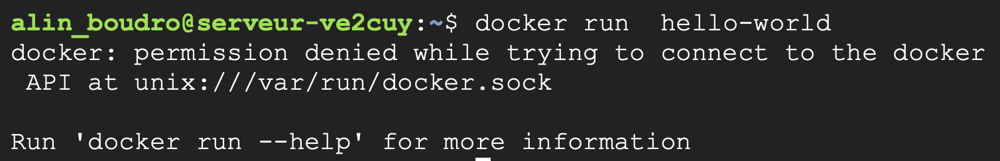

# Installation de Docker

*Mis à jour le 23 Décembre 2020 - Révision du 2025.12.05*

<p align="center">
    
</p>

---

## 1 – Docker-Desktop

La façon la plus simple d'installer Docker sur un poste de travail est d'utiliser l'application d'installation de **Docker-Desktop**. Cette application est disponible pour Windows, Linux et MacOS.

La page de téléchargement est disponible à cette adresse:

[Docker Desktop](https://www.docker.com/products/docker-desktop/)

Bien que cette application soit intéressante et simple à installer, parfois une version sans GUI est requise, par exemple, sur un serveur.

Ce document explique comment installer Docker à partir d'une **CLI**.

---

## 2 – Installation manuelle sous Ubuntu (Server ou Desktop)

*Mise à jour le 2025.10.24*

```bash
# Au besoin, retirer le mot de passe sur sudo
sudo visudo
    # Ajouter la ligne suivante:
    leNomUtilisateur ALL=(ALL) NOPASSWD: ALL

# 1 - Effacer toutes installations précédentes
sudo apt remove $(dpkg --get-selections docker.io docker-compose docker-compose-v2 docker-doc podman-docker containerd runc | cut -f1)

# Faire la configuration de apt-get pour permettre l'ajout d'une nouvelle source via HTTPs
# Ajout du dépôt d'installation de Docker

# 2 - Ajouter la clé PGP officielle de Docker:
sudo apt update
sudo apt install ca-certificates curl
sudo install -m 0755 -d /etc/apt/keyrings
sudo curl -fsSL https://download.docker.com/linux/ubuntu/gpg -o /etc/apt/keyrings/docker.asc
sudo chmod a+r /etc/apt/keyrings/docker.asc

# 3 - Ajouter le nouveau dépôt aux sources de 'apt':
sudo tee /etc/apt/sources.list.d/docker.sources <<EOF
Types: deb
URIs: https://download.docker.com/linux/ubuntu
Suites: $(. /etc/os-release && echo "${UBUNTU_CODENAME:-$VERSION_CODENAME}")
Components: stable
Signed-By: /etc/apt/keyrings/docker.asc
EOF

sudo apt update

# 4 - Procéder à l'installation de Docker:
sudo apt install docker-ce docker-ce-cli containerd.io 

# 5 - Vérifier l'état du service:
sudo systemctl status docker
```



```bash
# 6 - Tester Docker
docker --version
```

### 2.1 – Configuration de Docker sans sudo

```bash
# 1 - Tester la commande suivante:
docker run hello-world

# Ça devrait produire l'erreur suivante (permission denied):
```




```bash
# Si le groupe docker n'est pas présent, il faut le créer
grep docker /etc/group
sudo groupadd docker

# Ajouter l'utilisateur courant au groupe
sudo usermod -aG docker $USER

# Actualiser le changement au groupe docker
newgrp docker

# La commande suivante devrait maintenant fonctionner au niveau de l'utilisateur courant:
docker run hello-world
```

---

## 3 – Installation sous Ubuntu avec Vagrant

Voir [ici](https://4204d4.ve2cuy.com/420-4d4b/index.php/mise-en-route-dune-vm-docker-avec-vagrant/)

---

## 4 – Installation sous Windows

[Instructions officielles](https://docs.docker.com/docker-for-windows/install/)

**Note:** Si Docker-Desktop démarre de façon infinie, il faudra peut-être installer (ou mettre à jour) **wsl:**

```powershell
wsl --update
```

---

## 5 – Installation sous MacOS

[Instructions officielles](https://docs.docker.com/docker-for-mac/install/)

---

## Crédits

*Document préparé par Alain Boudreault © 2022-2025*  
*Version 2025.12.05.01*  
*Site par ve2cuy*