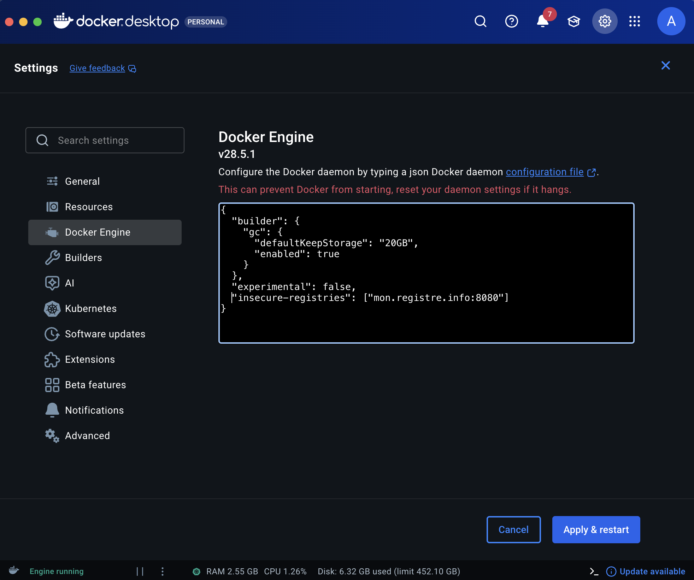
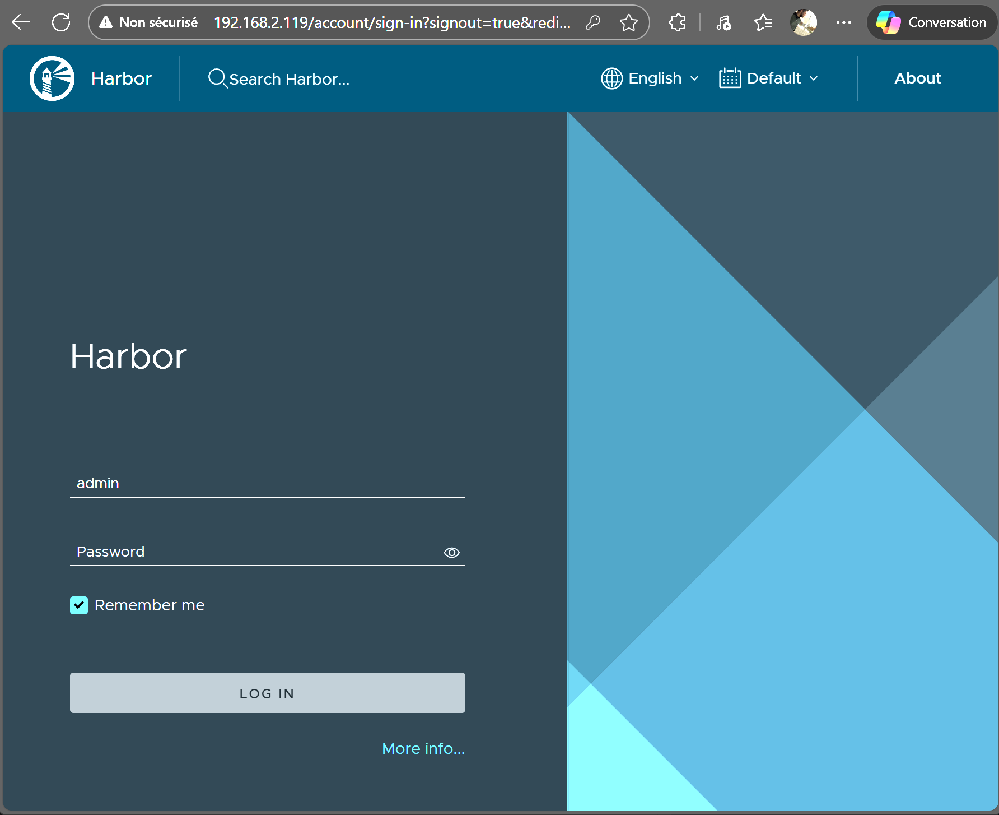
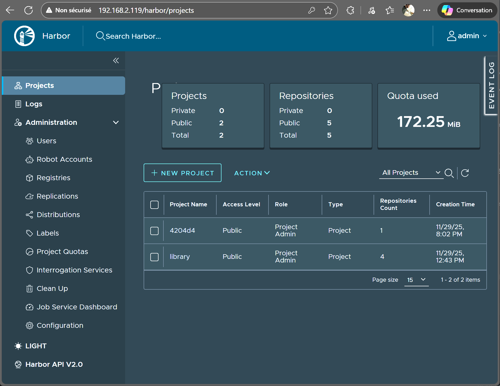

# Registre (Dépôt) privé d’images – Harbor

 29 novembre 2025 - Révision 2025.12.05

<p align="center">
    
</p>


Pré-requis: docker, // docker-compose et python3-setuptools doivent-être installés

---

## 1 – Télécharger les scripts d’installation

 [https://github.com/goharbor/harbor/releases](https://github.com/goharbor/harbor/releases)


```bash
wget https://github.com/goharbor/harbor/releases/download/v2.14.2/harbor-offline-installer-v2.14.2.tgz 
```

## 2 – Décompresser l’archive

```bash
tar -xvzf harbor-offline-installer-v2.14.2.tgz
```

## 3- Copier harbor.yml.tmpl dans harbor.yml et éditer


```yaml
cd harbor
cp harbor.yml.tmpl harbor.yml
nano harbor.yml
# -------------------------------------------------------------------
# The IP address or hostname to access admin UI and registry service.
# DO NOT use localhost or 127.0.0.1, because Harbor needs to be accessed by external clients.
hostname: mon.registre.info

# http related config
http:
  # port for http, default is 80. If https enabled, this port will redirect to https port
  port: 8080

# https related config
# Placer en commentaire le bloc suivant
#https:
# https port for harbor, default is 443
  #  port: 443
# The path of cert and key files for nginx
  #  certificate: /data/mon.registre.info.crt
  #  private_key: /data/mon.registre.info.key
````

-----

## 4 – Renseigner le fichier hosts du serveur:

```
# ajuster à l'adresse IP de votre serveur
192.168.139.55  mon.registre.info
```

## 4 – Exécuter le script ./prepare

En cas d'erreur de permission:

```
sudo chmod a+rw /home/user/harbor/ -R
```

## 5 – Exécuter docker compose up

-----

## Du poste client

## 6 – Docker:Settings – Registres non sécurisés

```
# Par défaut, docker utilise un connexion sécurisée pour les requêtes vers les registres.
# Le registre installé à l'étape précédente l'a été en mode non sécurisé.
# Par exemple:

docker pull mon.registre.info:8080/library/hello-world:v1

# Produit l'erreur suivante:
# Error response from daemon: failed to resolve reference "mon.registre.info:8080/library/hello-world:v1": failed to do request: Head 
# "[https://mon.registre.info:8080/v2/library/hello-world/manifests/v1](https://mon.registre.info:8080/v2/library/hello-world/manifests/v1)": http: server gave HTTP response to HTTPS client

# Remarquer que l'URL utilise https comme préfix: "[https://mon.registre.info:8080/v2/library](https://mon.registre.info:8080/v2/library)"

# Pour corriger cela, il faudra donc enregistrer une exception au niveau de Docker 
# en ajoutant la paire suivante:  "insecure-registries": ["mon.registre.info:8080"]
```

Soit, via le UI de docker.desktop:



Soit, via le fichier de configuration de docker:

```
# Ou bien ceci, si docker-desktop n'est pas installée:

$ sudo nano /etc/docker/daemon.json

{
  "insecure-registries": ["mon.registre.info:8080"]
}

$ sudo systemctl restart docker

$ docker info

#--------------------------
 Insecure Registries:
  mon.registre.info:8080
  ::1/128
  127.0.0.0/8
```

-----

## 7 – Tester le registre:

#### 7.1 - Accès à la console de Harbor

**admin:Harbor12345**




---
#### 7.2 - Utilisation du registre

```bash
# Renseigner le fichier hosts du poste de travail pour y ajouter mon.registre.info
docker login -u admin mon.registre.info:8080

# NOTE: Si l'API du registre répond sur un autre port que 443 alors il faut inscrire le port dans le 'tag'
docker tag hello-world:latest mon.registre.info:8080/library/hello-world:v1
docker tag hello-world:latest mon.registre.info:80/library/hello-world:v1

docker push mon.registre.info:8080/library/hello-world:v1
docker pull mon.registre.info:8080/library/hello-world:v1

docker tag alainboudreault/superminou mon.registre.info:8080/library/superminou:latest
docker push mon.registre.info:8080/library/superminou:latest

# Images utiles pour le TP01.H26
# Note: mon.registre.info pointe sur 192.168.139.55 (valide au D139, D140)
docker tag alainboudreault/superminou:latest      mon.registre.info:8080/4204d4/alainboudreault/superminou:latest                   
docker tag alpine:latest                          mon.registre.info:8080/4204d4/alpine:latest                                       
docker tag busybox:latest                         mon.registre.info:8080/4204d4/busybox:latest                                      
docker tag darthnorse/dockmon:latest              mon.registre.info:8080/4204d4/darthnorse/dockmon:latest                           
docker tag ghcr.io/getarcaneapp/arcane:latest     mon.registre.info:8080/4204d4/ghcr.io/getarcaneapp/arcane:latest                  
docker tag ghcr.io/gethomepage/homepage:latest    mon.registre.info:8080/4204d4/ghcr.io/gethomepage/homepage:latest                 
docker tag ghcr.io/hotio/radarr:latest            mon.registre.info:8080/4204d4/ghcr.io/hotio/radarr:latest                         
docker tag louislam/uptime-kuma:latest            mon.registre.info:8080/4204d4/louislam/uptime-kuma:latest                         
docker tag lscr.io/linuxserver/qbittorrent:latest mon.registre.info:8080/4204d4/lscr.io/linuxserver/qbittorrent:latest              
docker tag mariadb:latest                         mon.registre.info:8080/4204d4/mariadb:latest                                      
docker tag nginx:latest                           mon.registre.info:8080/4204d4/nginx:latest                                        
docker tag phpmyadmin:latest                      mon.registre.info:8080/4204d4/phpmyadmin:latest                                   
docker tag pihole/pihole:latest                   mon.registre.info:8080/4204d4/pihole/pihole:latest                                
docker tag portainer/portainer-ce:latest          mon.registre.info:8080/4204d4/portainer/portainer-ce:latest    

docker push mon.registre.info:8080/4204d4/alainboudreault/superminou:latest          
docker push mon.registre.info:8080/4204d4/alpine:latest                              
docker push mon.registre.info:8080/4204d4/busybox:latest                             
docker push mon.registre.info:8080/4204d4/darthnorse/dockmon:latest                  
docker push mon.registre.info:8080/4204d4/ghcr.io/getarcaneapp/arcane:latest         
docker push mon.registre.info:8080/4204d4/ghcr.io/gethomepage/homepage:latest        
docker push mon.registre.info:8080/4204d4/ghcr.io/hotio/radarr:latest                
docker push mon.registre.info:8080/4204d4/louislam/uptime-kuma:latest                
docker push mon.registre.info:8080/4204d4/lscr.io/linuxserver/qbittorrent:latest     
docker push mon.registre.info:8080/4204d4/mariadb:latest                             
docker push mon.registre.info:8080/4204d4/nginx:latest                               
docker push mon.registre.info:8080/4204d4/phpmyadmin:latest                          
docker push mon.registre.info:8080/4204d4/pihole/pihole:latest                       
docker push mon.registre.info:8080/4204d4/portainer/portainer-ce:latest              

```

-----

## 8 – Installation avec un certificat TLS (à valider)

```bash
# 1 - 

openssl genrsa -out ca.key 4096

# 2 - 

openssl req -x509 -new -nodes -sha512 -days 3650 \
 -subj "/C=CN/ST=Quebec/L=Quebec/O=example/OU=Personal/CN=mon.registre.info" \
 -key ca.key \
 -out ca.crt

openssl genrsa -out mon.registre.info.key 4096

# 3 -
openssl req -sha512 -new \
    -subj "/C=CN/ST=Quebec/L=Quebec/O=example/OU=Personal/CN=mon.registre.info" \
    -key mon.registre.info.key \
    -out mon.registre.info.csr


# 4 -
cat > v3.ext <<EOF
authorityKeyIdentifier=keyid,issuer
basicConstraints=CA:FALSE
keyUsage = digitalSignature, nonRepudiation, keyEncipherment, dataEncipherment
extendedKeyUsage = serverAuth
subjectAltName = @alt_names

[alt_names]
DNS.1=mon.registre.info
DNS.2=mon.registre.info
DNS.3=mon.registre.info
EOF

# 5 - 

openssl x509 -req -sha512 -days 3650 \
    -extfile v3.ext \
    -CA ca.crt -CAkey ca.key -CAcreateserial \
    -in mon.registre.info.csr \
    -out mon.registre.info.crt

# 6 - 
sudo cp mon.registre.info.crt /data/cert/
sudo cp mon.registre.info.key /data/cert/    

# 7 -
openssl x509 -inform PEM -in mon.registre.info.crt -out mon.registre.info.cert

# 8 -
mkdir /etc/docker/certs.d/mon.registre.info/
sudo cp mon.registre.info.cert /etc/docker/certs.d/mon.registre.info/
sudo cp mon.registre.info.key /etc/docker/certs.d/mon.registre.info/
sudo cp ca.crt /etc/docker/certs.d/mon.registre.info/

sudo cp ca.crt /usr/local/share/ca-certificates/
# Note: Pour windows, copier le fichier C:\ProgramData\docker\certs.d\mon.registre.info\ca.crt
sudo update-ca-certificates
sudo systemctl restart docker

// ==============================================================
alain@U2:~/harbor$ docker login mon.registre.info
Username: admin
Password: Harbor12345

WARNING! Your credentials are stored unencrypted in '/home/alain/.docker/config.json'.
Configure a credential helper to remove this warning. See
[https://docs.docker.com/go/credential-store/](https://docs.docker.com/go/credential-store/)

Login Succeeded

docker tag hello-world:latest  mon.registre.info/library/hello-world:v1
docker push mon.registre.info/library/hello-world:v1
```

-----

## 9 – Signature des images - À compléter

```bash
# Sous Windows, installer cosign avec go
go install [github.com/sigstore/cosign/cmd/cosign@latest](https://github.com/sigstore/cosign/cmd/cosign@latest)

# Vérifier l'installation
cosign version
cosign generate-key-pair

# Signer une image
$ cosign sign --key cosign.key $IMAGE
```

Référence: [Signing Containers – Sigstore](https://docs.sigstore.dev/cosign/signing/signing_with_containers/)

```
```